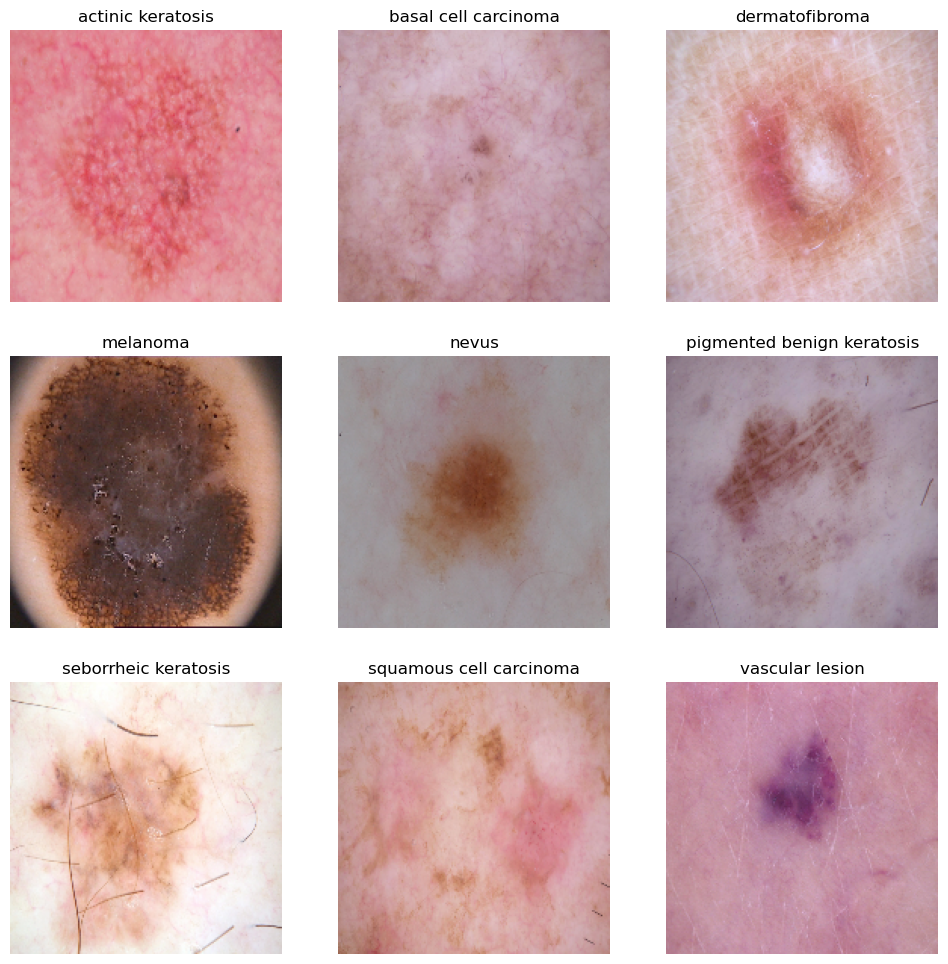
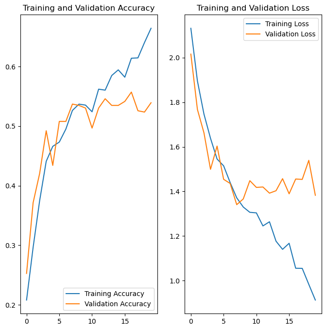
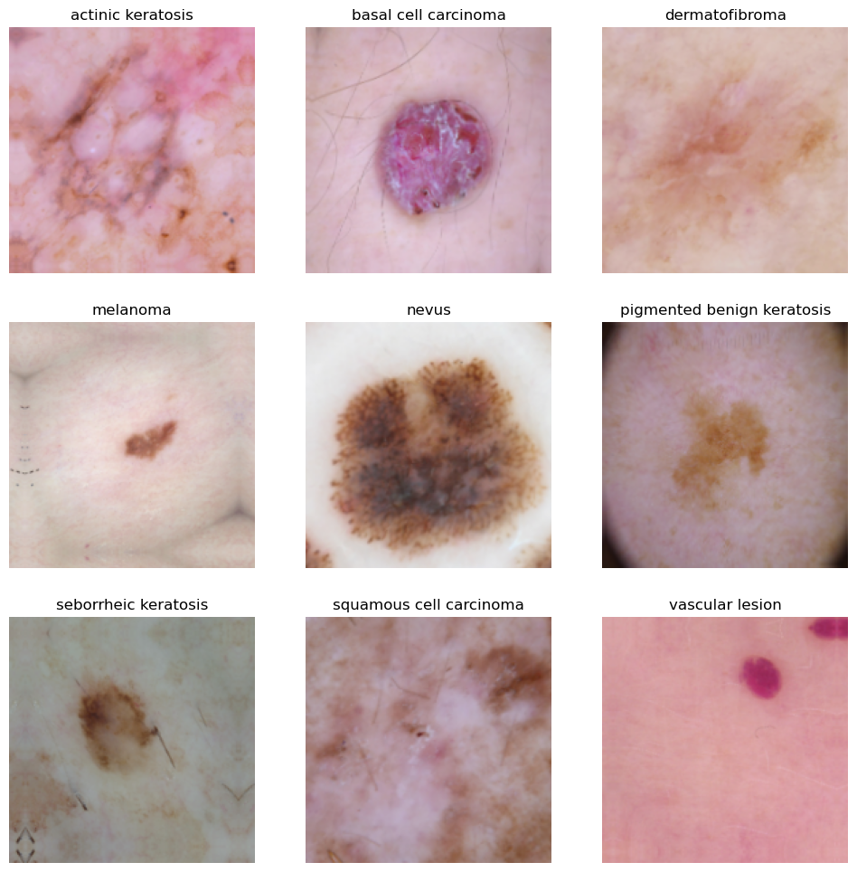
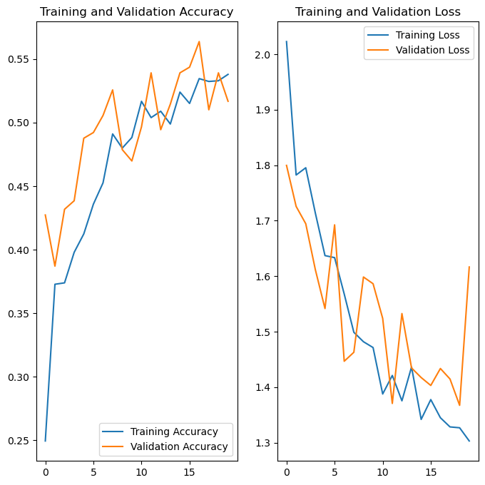
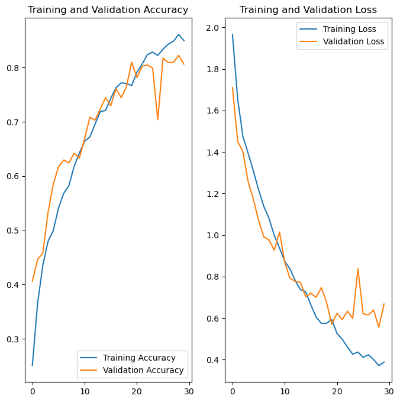
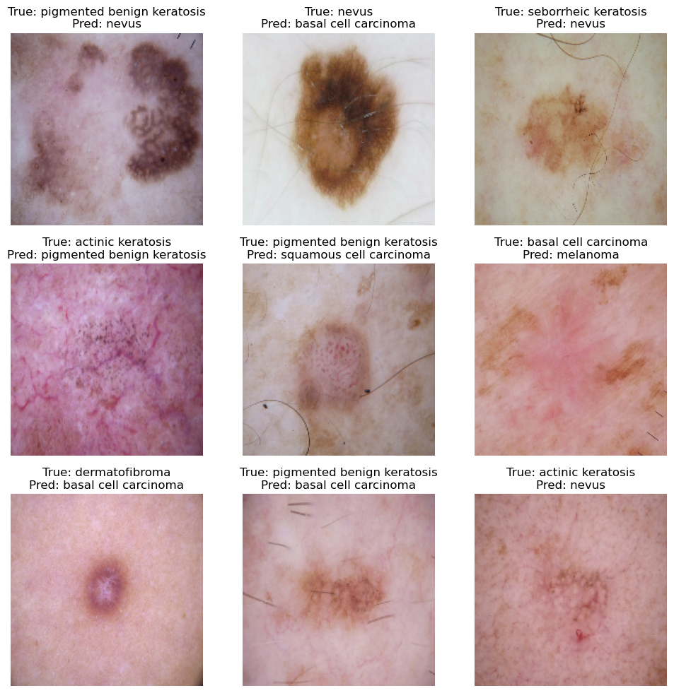
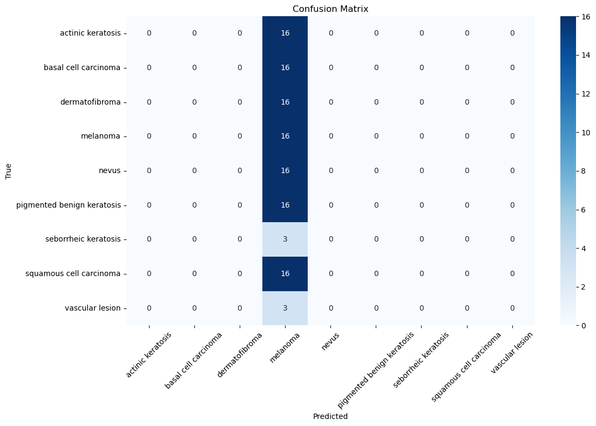

Problem statement: To build a CNN based model which can accurately detect melanoma. Melanoma is a type of cancer that can be deadly if not detected early. It accounts for 75% of skin cancer deaths. A solution which can evaluate images and alert the dermatologists about the presence of melanoma has the potential to reduce a lot of manual effort needed in diagnosis.

### Importing Skin Cancer Data
#### To do: Take necessary actions to read the data

### Importing all the important libraries


```python
from collections import Counter
import pathlib
import tensorflow as tf
import matplotlib.pyplot as plt
import numpy as np
import pandas as pd
import os
import PIL
from tensorflow import keras
from tensorflow.keras import layers, models
from tensorflow.keras.models import Sequential
from tensorflow.keras.preprocessing.image import ImageDataGenerator
```


```python
## If you are using the data by mounting the google drive, use the following :
## from google.colab import drive
## drive.mount('/content/gdrive')

##Ref:https://towardsdatascience.com/downloading-datasets-into-google-drive-via-google-colab-bcb1b30b0166
```

This assignment uses a dataset of about 2357 images of skin cancer types. The dataset contains 9 sub-directories in each train and test subdirectories. The 9 sub-directories contains the images of 9 skin cancer types respectively.


```python
# Defining the path for train and test images
## Todo: Update the paths of the train and test dataset
data_dir_train = pathlib.Path("Skin cancer ISIC The International Skin Imaging Collaboration/Train")
data_dir_test = pathlib.Path("Skin cancer ISIC The International Skin Imaging Collaboration/Test")
```


```python
image_count_train = len(list(data_dir_train.glob('*/*.jpg')))
print(image_count_train)
image_count_test = len(list(data_dir_test.glob('*/*.jpg')))
print(image_count_test)
```

    2239
    118


### Load using keras.preprocessing

Let's load these images off disk using the helpful image_dataset_from_directory utility.

### Create a dataset

Define some parameters for the loader:


```python
batch_size = 32
img_height = 180
img_width = 180
img_size = (img_height, img_width)
```

Use 80% of the images for training, and 20% for validation.


```python
## Write your train dataset here
## Note use seed=123 while creating your dataset using tf.keras.preprocessing.image_dataset_from_directory
## Note, make sure your resize your images to the size img_height*img_width, while writting the dataset
train_ds = tf.keras.preprocessing.image_dataset_from_directory(
    data_dir_train,
    image_size=img_size,
    batch_size=batch_size,
    subset="training",
    validation_split=0.2,
    seed=123
)
```

    Found 2239 files belonging to 9 classes.
    Using 1792 files for training.


```python
## Write your validation dataset here
## Note use seed=123 while creating your dataset using tf.keras.preprocessing.image_dataset_from_directory
## Note, make sure your resize your images to the size img_height*img_width, while writting the dataset
val_ds = tf.keras.preprocessing.image_dataset_from_directory(
    data_dir_train,
    image_size=img_size,
    batch_size=batch_size,
    subset="validation",
    validation_split=0.2,
    seed=123
)
```

    Found 2239 files belonging to 9 classes.
    Using 447 files for validation.


```python
# List out all the classes of skin cancer and store them in a list. 
# You can find the class names in the class_names attribute on these datasets. 
# These correspond to the directory names in alphabetical order.
class_names = train_ds.class_names
print(class_names)
```

    ['actinic keratosis', 'basal cell carcinoma', 'dermatofibroma', 'melanoma', 'nevus', 'pigmented benign keratosis', 'seborrheic keratosis', 'squamous cell carcinoma', 'vascular lesion']


### Visualize the data
#### Todo, create a code to visualize one instance of all the nine classes present in the dataset


```python
import matplotlib.pyplot as plt

### your code goes here, you can use training or validation data to visualize
plt.figure(figsize=(12, 12))
for images, labels in train_ds.take(2):
    for i in range(len(class_names)):
        ax = plt.subplot(3, 3, i + 1)
        class_images = images[labels == i]
        if tf.reduce_sum(tf.cast(labels == i, tf.int32)) > 0:
            plt.imshow(class_images[0].numpy().astype("uint8"))
            plt.title(class_names[i])
            plt.axis("off")
plt.show()
```

    2025-01-14 21:59:45.379780: I tensorflow/core/framework/local_rendezvous.cc:405] Local rendezvous is aborting with status: OUT_OF_RANGE: End of sequence


    

    


The `image_batch` is a tensor of the shape `(32, 180, 180, 3)`. This is a batch of 32 images of shape `180x180x3` (the last dimension refers to color channels RGB). The `label_batch` is a tensor of the shape `(32,)`, these are corresponding labels to the 32 images.

`Dataset.cache()` keeps the images in memory after they're loaded off disk during the first epoch.

`Dataset.prefetch()` overlaps data preprocessing and model execution while training.


```python
AUTOTUNE = tf.data.experimental.AUTOTUNE
train_ds = train_ds.cache().shuffle(1000).prefetch(buffer_size=AUTOTUNE)
val_ds = val_ds.cache().prefetch(buffer_size=AUTOTUNE)
```

### Create the model
#### Todo: Create a CNN model, which can accurately detect 9 classes present in the dataset. Use ```layers.experimental.preprocessing.Rescaling``` to normalize pixel values between (0,1). The RGB channel values are in the `[0, 255]` range. This is not ideal for a neural network. Here, it is good to standardize values to be in the `[0, 1]`


```python
### Your code goes here
model = models.Sequential([
    layers.Rescaling(1./255, input_shape=(180, 180, 3)),
    layers.Conv2D(32, (3, 3), activation='relu'),
    layers.MaxPooling2D((2, 2)),
    layers.Conv2D(64, (3, 3), activation='relu'),
    layers.MaxPooling2D((2, 2)),
    layers.Conv2D(128, (3, 3), activation='relu'),
    layers.MaxPooling2D((2, 2)),
    layers.Flatten(),
    layers.Dense(128, activation='relu'),
    layers.Dropout(0.5),
    layers.Dense(len(class_names), activation='softmax')
])
```

    /opt/anaconda3/lib/python3.12/site-packages/keras/src/layers/preprocessing/tf_data_layer.py:19: UserWarning: Do not pass an `input_shape`/`input_dim` argument to a layer. When using Sequential models, prefer using an `Input(shape)` object as the first layer in the model instead.
      super().__init__(**kwargs)


### Compile the model
Choose an appropirate optimiser and loss function for model training 


```python
### Todo, choose an appropirate optimiser and loss function
model.compile(optimizer='adam',
              loss='sparse_categorical_crossentropy',
              metrics=['accuracy'])
```


```python
# View the summary of all layers
model.summary()
```


<pre style="white-space:pre;overflow-x:auto;line-height:normal;font-family:Menlo,'DejaVu Sans Mono',consolas,'Courier New',monospace"><span style="font-weight: bold">Model: "sequential"</span>
</pre>


<pre style="white-space:pre;overflow-x:auto;line-height:normal;font-family:Menlo,'DejaVu Sans Mono',consolas,'Courier New',monospace">┏━━━━━━━━━━━━━━━━━━━━━━━━━━━━━━━━━┳━━━━━━━━━━━━━━━━━━━━━━━━┳━━━━━━━━━━━━━━━┓
┃<span style="font-weight: bold"> Layer (type)                    </span>┃<span style="font-weight: bold"> Output Shape           </span>┃<span style="font-weight: bold">       Param # </span>┃
┡━━━━━━━━━━━━━━━━━━━━━━━━━━━━━━━━━╇━━━━━━━━━━━━━━━━━━━━━━━━╇━━━━━━━━━━━━━━━┩
│ rescaling (<span style="color: #0087ff; text-decoration-color: #0087ff">Rescaling</span>)           │ (<span style="color: #00d7ff; text-decoration-color: #00d7ff">None</span>, <span style="color: #00af00; text-decoration-color: #00af00">180</span>, <span style="color: #00af00; text-decoration-color: #00af00">180</span>, <span style="color: #00af00; text-decoration-color: #00af00">3</span>)    │             <span style="color: #00af00; text-decoration-color: #00af00">0</span> │
├─────────────────────────────────┼────────────────────────┼───────────────┤
│ conv2d (<span style="color: #0087ff; text-decoration-color: #0087ff">Conv2D</span>)                 │ (<span style="color: #00d7ff; text-decoration-color: #00d7ff">None</span>, <span style="color: #00af00; text-decoration-color: #00af00">178</span>, <span style="color: #00af00; text-decoration-color: #00af00">178</span>, <span style="color: #00af00; text-decoration-color: #00af00">32</span>)   │           <span style="color: #00af00; text-decoration-color: #00af00">896</span> │
├─────────────────────────────────┼────────────────────────┼───────────────┤
│ max_pooling2d (<span style="color: #0087ff; text-decoration-color: #0087ff">MaxPooling2D</span>)    │ (<span style="color: #00d7ff; text-decoration-color: #00d7ff">None</span>, <span style="color: #00af00; text-decoration-color: #00af00">89</span>, <span style="color: #00af00; text-decoration-color: #00af00">89</span>, <span style="color: #00af00; text-decoration-color: #00af00">32</span>)     │             <span style="color: #00af00; text-decoration-color: #00af00">0</span> │
├─────────────────────────────────┼────────────────────────┼───────────────┤
│ conv2d_1 (<span style="color: #0087ff; text-decoration-color: #0087ff">Conv2D</span>)               │ (<span style="color: #00d7ff; text-decoration-color: #00d7ff">None</span>, <span style="color: #00af00; text-decoration-color: #00af00">87</span>, <span style="color: #00af00; text-decoration-color: #00af00">87</span>, <span style="color: #00af00; text-decoration-color: #00af00">64</span>)     │        <span style="color: #00af00; text-decoration-color: #00af00">18,496</span> │
├─────────────────────────────────┼────────────────────────┼───────────────┤
│ max_pooling2d_1 (<span style="color: #0087ff; text-decoration-color: #0087ff">MaxPooling2D</span>)  │ (<span style="color: #00d7ff; text-decoration-color: #00d7ff">None</span>, <span style="color: #00af00; text-decoration-color: #00af00">43</span>, <span style="color: #00af00; text-decoration-color: #00af00">43</span>, <span style="color: #00af00; text-decoration-color: #00af00">64</span>)     │             <span style="color: #00af00; text-decoration-color: #00af00">0</span> │
├─────────────────────────────────┼────────────────────────┼───────────────┤
│ conv2d_2 (<span style="color: #0087ff; text-decoration-color: #0087ff">Conv2D</span>)               │ (<span style="color: #00d7ff; text-decoration-color: #00d7ff">None</span>, <span style="color: #00af00; text-decoration-color: #00af00">41</span>, <span style="color: #00af00; text-decoration-color: #00af00">41</span>, <span style="color: #00af00; text-decoration-color: #00af00">128</span>)    │        <span style="color: #00af00; text-decoration-color: #00af00">73,856</span> │
├─────────────────────────────────┼────────────────────────┼───────────────┤
│ max_pooling2d_2 (<span style="color: #0087ff; text-decoration-color: #0087ff">MaxPooling2D</span>)  │ (<span style="color: #00d7ff; text-decoration-color: #00d7ff">None</span>, <span style="color: #00af00; text-decoration-color: #00af00">20</span>, <span style="color: #00af00; text-decoration-color: #00af00">20</span>, <span style="color: #00af00; text-decoration-color: #00af00">128</span>)    │             <span style="color: #00af00; text-decoration-color: #00af00">0</span> │
├─────────────────────────────────┼────────────────────────┼───────────────┤
│ flatten (<span style="color: #0087ff; text-decoration-color: #0087ff">Flatten</span>)               │ (<span style="color: #00d7ff; text-decoration-color: #00d7ff">None</span>, <span style="color: #00af00; text-decoration-color: #00af00">51200</span>)          │             <span style="color: #00af00; text-decoration-color: #00af00">0</span> │
├─────────────────────────────────┼────────────────────────┼───────────────┤
│ dense (<span style="color: #0087ff; text-decoration-color: #0087ff">Dense</span>)                   │ (<span style="color: #00d7ff; text-decoration-color: #00d7ff">None</span>, <span style="color: #00af00; text-decoration-color: #00af00">128</span>)            │     <span style="color: #00af00; text-decoration-color: #00af00">6,553,728</span> │
├─────────────────────────────────┼────────────────────────┼───────────────┤
│ dropout (<span style="color: #0087ff; text-decoration-color: #0087ff">Dropout</span>)               │ (<span style="color: #00d7ff; text-decoration-color: #00d7ff">None</span>, <span style="color: #00af00; text-decoration-color: #00af00">128</span>)            │             <span style="color: #00af00; text-decoration-color: #00af00">0</span> │
├─────────────────────────────────┼────────────────────────┼───────────────┤
│ dense_1 (<span style="color: #0087ff; text-decoration-color: #0087ff">Dense</span>)                 │ (<span style="color: #00d7ff; text-decoration-color: #00d7ff">None</span>, <span style="color: #00af00; text-decoration-color: #00af00">9</span>)              │         <span style="color: #00af00; text-decoration-color: #00af00">1,161</span> │
└─────────────────────────────────┴────────────────────────┴───────────────┘
</pre>


<pre style="white-space:pre;overflow-x:auto;line-height:normal;font-family:Menlo,'DejaVu Sans Mono',consolas,'Courier New',monospace"><span style="font-weight: bold"> Total params: </span><span style="color: #00af00; text-decoration-color: #00af00">6,648,137</span> (25.36 MB)
</pre>


<pre style="white-space:pre;overflow-x:auto;line-height:normal;font-family:Menlo,'DejaVu Sans Mono',consolas,'Courier New',monospace"><span style="font-weight: bold"> Trainable params: </span><span style="color: #00af00; text-decoration-color: #00af00">6,648,137</span> (25.36 MB)
</pre>


<pre style="white-space:pre;overflow-x:auto;line-height:normal;font-family:Menlo,'DejaVu Sans Mono',consolas,'Courier New',monospace"><span style="font-weight: bold"> Non-trainable params: </span><span style="color: #00af00; text-decoration-color: #00af00">0</span> (0.00 B)
</pre>


### Train the model


```python
epochs = 20
history = model.fit(
  train_ds,
  validation_data=val_ds,
  epochs=epochs
)
```

    Epoch 1/20
    56/56 ━━━━━━━━━━━━━━━━━━━━ 13s 203ms/step - accuracy: 0.1763 - loss: 2.3361 - val_accuracy: 0.2528 - val_loss: 2.0155
    Epoch 2/20
    56/56 ━━━━━━━━━━━━━━━━━━━━ 11s 188ms/step - accuracy: 0.2800 - loss: 1.9476 - val_accuracy: 0.3714 - val_loss: 1.7675
    Epoch 3/20
    56/56 ━━━━━━━━━━━━━━━━━━━━ 11s 190ms/step - accuracy: 0.3672 - loss: 1.7944 - val_accuracy: 0.4206 - val_loss: 1.6626
    Epoch 4/20
    56/56 ━━━━━━━━━━━━━━━━━━━━ 11s 195ms/step - accuracy: 0.4561 - loss: 1.6384 - val_accuracy: 0.4922 - val_loss: 1.4991
    Epoch 5/20
    56/56 ━━━━━━━━━━━━━━━━━━━━ 11s 197ms/step - accuracy: 0.4642 - loss: 1.5593 - val_accuracy: 0.4340 - val_loss: 1.6034
    Epoch 6/20
    56/56 ━━━━━━━━━━━━━━━━━━━━ 11s 198ms/step - accuracy: 0.4552 - loss: 1.5682 - val_accuracy: 0.5078 - val_loss: 1.4543
    Epoch 7/20
    56/56 ━━━━━━━━━━━━━━━━━━━━ 11s 197ms/step - accuracy: 0.4838 - loss: 1.4766 - val_accuracy: 0.5078 - val_loss: 1.4356
    Epoch 8/20
    56/56 ━━━━━━━━━━━━━━━━━━━━ 11s 197ms/step - accuracy: 0.5046 - loss: 1.4205 - val_accuracy: 0.5369 - val_loss: 1.3407
    Epoch 9/20
    56/56 ━━━━━━━━━━━━━━━━━━━━ 11s 194ms/step - accuracy: 0.5488 - loss: 1.3114 - val_accuracy: 0.5347 - val_loss: 1.3663
    Epoch 10/20
    56/56 ━━━━━━━━━━━━━━━━━━━━ 11s 192ms/step - accuracy: 0.5302 - loss: 1.3092 - val_accuracy: 0.5302 - val_loss: 1.4482
    Epoch 11/20
    56/56 ━━━━━━━━━━━━━━━━━━━━ 11s 193ms/step - accuracy: 0.5319 - loss: 1.2878 - val_accuracy: 0.4966 - val_loss: 1.4181
    Epoch 12/20
    56/56 ━━━━━━━━━━━━━━━━━━━━ 11s 192ms/step - accuracy: 0.5745 - loss: 1.2201 - val_accuracy: 0.5302 - val_loss: 1.4199
    Epoch 13/20
    56/56 ━━━━━━━━━━━━━━━━━━━━ 11s 194ms/step - accuracy: 0.5631 - loss: 1.2720 - val_accuracy: 0.5459 - val_loss: 1.3923
    Epoch 14/20
    56/56 ━━━━━━━━━━━━━━━━━━━━ 11s 193ms/step - accuracy: 0.5717 - loss: 1.1871 - val_accuracy: 0.5347 - val_loss: 1.4031
    Epoch 15/20
    56/56 ━━━━━━━━━━━━━━━━━━━━ 11s 192ms/step - accuracy: 0.5984 - loss: 1.1512 - val_accuracy: 0.5347 - val_loss: 1.4572
    Epoch 16/20
    56/56 ━━━━━━━━━━━━━━━━━━━━ 11s 194ms/step - accuracy: 0.5756 - loss: 1.1911 - val_accuracy: 0.5414 - val_loss: 1.3893
    Epoch 17/20
    56/56 ━━━━━━━━━━━━━━━━━━━━ 11s 193ms/step - accuracy: 0.6078 - loss: 1.0474 - val_accuracy: 0.5570 - val_loss: 1.4556
    Epoch 18/20
    56/56 ━━━━━━━━━━━━━━━━━━━━ 11s 191ms/step - accuracy: 0.6245 - loss: 1.0413 - val_accuracy: 0.5257 - val_loss: 1.4539
    Epoch 19/20
    56/56 ━━━━━━━━━━━━━━━━━━━━ 11s 194ms/step - accuracy: 0.6432 - loss: 0.9805 - val_accuracy: 0.5235 - val_loss: 1.5394
    Epoch 20/20
    56/56 ━━━━━━━━━━━━━━━━━━━━ 11s 193ms/step - accuracy: 0.6755 - loss: 0.8863 - val_accuracy: 0.5391 - val_loss: 1.3826


### Visualizing training results


```python
acc = history.history['accuracy']
val_acc = history.history['val_accuracy']

loss = history.history['loss']
val_loss = history.history['val_loss']

epochs_range = range(epochs)

plt.figure(figsize=(8, 8))
plt.subplot(1, 2, 1)
plt.plot(epochs_range, acc, label='Training Accuracy')
plt.plot(epochs_range, val_acc, label='Validation Accuracy')
plt.legend(loc='lower right')
plt.title('Training and Validation Accuracy')

plt.subplot(1, 2, 2)
plt.plot(epochs_range, loss, label='Training Loss')
plt.plot(epochs_range, val_loss, label='Validation Loss')
plt.legend(loc='upper right')
plt.title('Training and Validation Loss')
plt.show()
```


    

    


#### Todo: Write your findings after the model fit, see if there is an evidence of model overfit or underfit

### Write your findings here

1. #### Training vs Validation Accuracy:


- The training accuracy (blue line) continues to increase steadily, reaching about 65%
- The validation accuracy (orange line) plateaus around 50-55% and shows fluctuations
- The growing gap between training and validation accuracy is a classic sign of overfitting


2. #### Training vs Validation Loss:


- The training loss (blue line) continues to decrease steadily
- The validation loss (orange line) initially decreases but then plateaus and slightly increases
- The divergence between training and validation loss curves further confirms overfitting


3. #### Specific Indicators of Overfitting:


- The model performs increasingly better on the training data while not improving on validation data
- Around epoch 10, the curves begin to diverge significantly
- The model is learning patterns specific to the training data that don't generalize well to new data


```python
# Todo, after you have analysed the model fit history for presence of underfit or overfit, choose an appropriate data augumentation strategy. 
# Your code goes herea

data_augmentation = tf.keras.Sequential([
    layers.RandomFlip("horizontal_and_vertical"),
    layers.RandomRotation(0.2),
    layers.RandomZoom(0.2)
])
```


```python
augmented_train_dataset = train_ds.map(
    lambda x, y: (data_augmentation(x, training=True), y))
```


```python
# Todo, visualize how your augmentation strategy works for one instance of training image.
# Your code goes here

plt.figure(figsize=(12, 12))
for images, labels in augmented_train_dataset.take(2):
    for i in range(len(class_names)):
        ax = plt.subplot(3, 3, i + 1)
        class_images = images[labels == i]
        if tf.reduce_sum(tf.cast(labels == i, tf.int32)) > 0:
            plt.imshow(class_images[0].numpy().astype("uint8"))
            plt.title(class_names[i])
            plt.axis("off")
plt.show()
```


    

    


### Todo:
### Create the model, compile and train the model


```python
## You can use Dropout layer if there is an evidence of overfitting in your findings

## Your code goes rehe
model = models.Sequential([
    layers.Rescaling(1./255, input_shape=(180, 180, 3)),
    layers.Conv2D(32, (3, 3), activation='relu'),
    layers.MaxPooling2D((2, 2)),
    layers.Conv2D(64, (3, 3), activation='relu'),
    layers.MaxPooling2D((2, 2)),
    layers.Conv2D(128, (3, 3), activation='relu'),
    layers.MaxPooling2D((2, 2)),
    layers.Flatten(),
    layers.Dense(128, activation='relu'),
    layers.Dropout(0.5),
    layers.Dense(len(class_names), activation='softmax')
])


```

### Compiling the model


```python
## Your code goes here

model.compile(optimizer='adam',
              loss='sparse_categorical_crossentropy',
              metrics=['accuracy'])
```


```python
model.summary()
```


<pre style="white-space:pre;overflow-x:auto;line-height:normal;font-family:Menlo,'DejaVu Sans Mono',consolas,'Courier New',monospace"><span style="font-weight: bold">Model: "sequential_2"</span>
</pre>


<pre style="white-space:pre;overflow-x:auto;line-height:normal;font-family:Menlo,'DejaVu Sans Mono',consolas,'Courier New',monospace">┏━━━━━━━━━━━━━━━━━━━━━━━━━━━━━━━━━┳━━━━━━━━━━━━━━━━━━━━━━━━┳━━━━━━━━━━━━━━━┓
┃<span style="font-weight: bold"> Layer (type)                    </span>┃<span style="font-weight: bold"> Output Shape           </span>┃<span style="font-weight: bold">       Param # </span>┃
┡━━━━━━━━━━━━━━━━━━━━━━━━━━━━━━━━━╇━━━━━━━━━━━━━━━━━━━━━━━━╇━━━━━━━━━━━━━━━┩
│ rescaling_1 (<span style="color: #0087ff; text-decoration-color: #0087ff">Rescaling</span>)         │ (<span style="color: #00d7ff; text-decoration-color: #00d7ff">None</span>, <span style="color: #00af00; text-decoration-color: #00af00">180</span>, <span style="color: #00af00; text-decoration-color: #00af00">180</span>, <span style="color: #00af00; text-decoration-color: #00af00">3</span>)    │             <span style="color: #00af00; text-decoration-color: #00af00">0</span> │
├─────────────────────────────────┼────────────────────────┼───────────────┤
│ conv2d_3 (<span style="color: #0087ff; text-decoration-color: #0087ff">Conv2D</span>)               │ (<span style="color: #00d7ff; text-decoration-color: #00d7ff">None</span>, <span style="color: #00af00; text-decoration-color: #00af00">178</span>, <span style="color: #00af00; text-decoration-color: #00af00">178</span>, <span style="color: #00af00; text-decoration-color: #00af00">32</span>)   │           <span style="color: #00af00; text-decoration-color: #00af00">896</span> │
├─────────────────────────────────┼────────────────────────┼───────────────┤
│ max_pooling2d_3 (<span style="color: #0087ff; text-decoration-color: #0087ff">MaxPooling2D</span>)  │ (<span style="color: #00d7ff; text-decoration-color: #00d7ff">None</span>, <span style="color: #00af00; text-decoration-color: #00af00">89</span>, <span style="color: #00af00; text-decoration-color: #00af00">89</span>, <span style="color: #00af00; text-decoration-color: #00af00">32</span>)     │             <span style="color: #00af00; text-decoration-color: #00af00">0</span> │
├─────────────────────────────────┼────────────────────────┼───────────────┤
│ conv2d_4 (<span style="color: #0087ff; text-decoration-color: #0087ff">Conv2D</span>)               │ (<span style="color: #00d7ff; text-decoration-color: #00d7ff">None</span>, <span style="color: #00af00; text-decoration-color: #00af00">87</span>, <span style="color: #00af00; text-decoration-color: #00af00">87</span>, <span style="color: #00af00; text-decoration-color: #00af00">64</span>)     │        <span style="color: #00af00; text-decoration-color: #00af00">18,496</span> │
├─────────────────────────────────┼────────────────────────┼───────────────┤
│ max_pooling2d_4 (<span style="color: #0087ff; text-decoration-color: #0087ff">MaxPooling2D</span>)  │ (<span style="color: #00d7ff; text-decoration-color: #00d7ff">None</span>, <span style="color: #00af00; text-decoration-color: #00af00">43</span>, <span style="color: #00af00; text-decoration-color: #00af00">43</span>, <span style="color: #00af00; text-decoration-color: #00af00">64</span>)     │             <span style="color: #00af00; text-decoration-color: #00af00">0</span> │
├─────────────────────────────────┼────────────────────────┼───────────────┤
│ conv2d_5 (<span style="color: #0087ff; text-decoration-color: #0087ff">Conv2D</span>)               │ (<span style="color: #00d7ff; text-decoration-color: #00d7ff">None</span>, <span style="color: #00af00; text-decoration-color: #00af00">41</span>, <span style="color: #00af00; text-decoration-color: #00af00">41</span>, <span style="color: #00af00; text-decoration-color: #00af00">128</span>)    │        <span style="color: #00af00; text-decoration-color: #00af00">73,856</span> │
├─────────────────────────────────┼────────────────────────┼───────────────┤
│ max_pooling2d_5 (<span style="color: #0087ff; text-decoration-color: #0087ff">MaxPooling2D</span>)  │ (<span style="color: #00d7ff; text-decoration-color: #00d7ff">None</span>, <span style="color: #00af00; text-decoration-color: #00af00">20</span>, <span style="color: #00af00; text-decoration-color: #00af00">20</span>, <span style="color: #00af00; text-decoration-color: #00af00">128</span>)    │             <span style="color: #00af00; text-decoration-color: #00af00">0</span> │
├─────────────────────────────────┼────────────────────────┼───────────────┤
│ flatten_1 (<span style="color: #0087ff; text-decoration-color: #0087ff">Flatten</span>)             │ (<span style="color: #00d7ff; text-decoration-color: #00d7ff">None</span>, <span style="color: #00af00; text-decoration-color: #00af00">51200</span>)          │             <span style="color: #00af00; text-decoration-color: #00af00">0</span> │
├─────────────────────────────────┼────────────────────────┼───────────────┤
│ dense_2 (<span style="color: #0087ff; text-decoration-color: #0087ff">Dense</span>)                 │ (<span style="color: #00d7ff; text-decoration-color: #00d7ff">None</span>, <span style="color: #00af00; text-decoration-color: #00af00">128</span>)            │     <span style="color: #00af00; text-decoration-color: #00af00">6,553,728</span> │
├─────────────────────────────────┼────────────────────────┼───────────────┤
│ dropout_1 (<span style="color: #0087ff; text-decoration-color: #0087ff">Dropout</span>)             │ (<span style="color: #00d7ff; text-decoration-color: #00d7ff">None</span>, <span style="color: #00af00; text-decoration-color: #00af00">128</span>)            │             <span style="color: #00af00; text-decoration-color: #00af00">0</span> │
├─────────────────────────────────┼────────────────────────┼───────────────┤
│ dense_3 (<span style="color: #0087ff; text-decoration-color: #0087ff">Dense</span>)                 │ (<span style="color: #00d7ff; text-decoration-color: #00d7ff">None</span>, <span style="color: #00af00; text-decoration-color: #00af00">9</span>)              │         <span style="color: #00af00; text-decoration-color: #00af00">1,161</span> │
└─────────────────────────────────┴────────────────────────┴───────────────┘
</pre>


<pre style="white-space:pre;overflow-x:auto;line-height:normal;font-family:Menlo,'DejaVu Sans Mono',consolas,'Courier New',monospace"><span style="font-weight: bold"> Total params: </span><span style="color: #00af00; text-decoration-color: #00af00">6,648,137</span> (25.36 MB)
</pre>


<pre style="white-space:pre;overflow-x:auto;line-height:normal;font-family:Menlo,'DejaVu Sans Mono',consolas,'Courier New',monospace"><span style="font-weight: bold"> Trainable params: </span><span style="color: #00af00; text-decoration-color: #00af00">6,648,137</span> (25.36 MB)
</pre>


<pre style="white-space:pre;overflow-x:auto;line-height:normal;font-family:Menlo,'DejaVu Sans Mono',consolas,'Courier New',monospace"><span style="font-weight: bold"> Non-trainable params: </span><span style="color: #00af00; text-decoration-color: #00af00">0</span> (0.00 B)
</pre>


### Training the model


```python
## Your code goes here, note: train your model for 20 epochs
epochs = 20

history = model.fit(
  augmented_train_dataset,
  validation_data=val_ds,
  epochs=epochs
)
```

    Epoch 1/20
    56/56 ━━━━━━━━━━━━━━━━━━━━ 12s 205ms/step - accuracy: 0.1933 - loss: 2.1915 - val_accuracy: 0.4273 - val_loss: 1.7997
    Epoch 2/20
    56/56 ━━━━━━━━━━━━━━━━━━━━ 11s 201ms/step - accuracy: 0.3702 - loss: 1.8069 - val_accuracy: 0.3870 - val_loss: 1.7258
    Epoch 3/20
    56/56 ━━━━━━━━━━━━━━━━━━━━ 11s 201ms/step - accuracy: 0.3557 - loss: 1.8665 - val_accuracy: 0.4318 - val_loss: 1.6946
    Epoch 4/20
    56/56 ━━━━━━━━━━━━━━━━━━━━ 11s 198ms/step - accuracy: 0.3983 - loss: 1.7090 - val_accuracy: 0.4385 - val_loss: 1.6116
    Epoch 5/20
    56/56 ━━━━━━━━━━━━━━━━━━━━ 11s 199ms/step - accuracy: 0.4151 - loss: 1.6278 - val_accuracy: 0.4877 - val_loss: 1.5416
    Epoch 6/20
    56/56 ━━━━━━━━━━━━━━━━━━━━ 11s 198ms/step - accuracy: 0.4328 - loss: 1.6316 - val_accuracy: 0.4922 - val_loss: 1.6925
    Epoch 7/20
    56/56 ━━━━━━━━━━━━━━━━━━━━ 11s 198ms/step - accuracy: 0.4366 - loss: 1.6004 - val_accuracy: 0.5056 - val_loss: 1.4466
    Epoch 8/20
    56/56 ━━━━━━━━━━━━━━━━━━━━ 11s 198ms/step - accuracy: 0.4752 - loss: 1.5225 - val_accuracy: 0.5257 - val_loss: 1.4628
    Epoch 9/20
    56/56 ━━━━━━━━━━━━━━━━━━━━ 11s 199ms/step - accuracy: 0.4619 - loss: 1.4965 - val_accuracy: 0.4787 - val_loss: 1.5985
    Epoch 10/20
    56/56 ━━━━━━━━━━━━━━━━━━━━ 11s 199ms/step - accuracy: 0.4872 - loss: 1.5065 - val_accuracy: 0.4698 - val_loss: 1.5864
    Epoch 11/20
    56/56 ━━━━━━━━━━━━━━━━━━━━ 11s 198ms/step - accuracy: 0.5246 - loss: 1.4024 - val_accuracy: 0.4966 - val_loss: 1.5239
    Epoch 12/20
    56/56 ━━━━━━━━━━━━━━━━━━━━ 11s 198ms/step - accuracy: 0.5014 - loss: 1.4050 - val_accuracy: 0.5391 - val_loss: 1.3706
    Epoch 13/20
    56/56 ━━━━━━━━━━━━━━━━━━━━ 11s 198ms/step - accuracy: 0.5119 - loss: 1.3682 - val_accuracy: 0.4944 - val_loss: 1.5326
    Epoch 14/20
    56/56 ━━━━━━━━━━━━━━━━━━━━ 11s 198ms/step - accuracy: 0.5139 - loss: 1.4225 - val_accuracy: 0.5145 - val_loss: 1.4346
    Epoch 15/20
    56/56 ━━━━━━━━━━━━━━━━━━━━ 11s 198ms/step - accuracy: 0.5113 - loss: 1.3596 - val_accuracy: 0.5391 - val_loss: 1.4173
    Epoch 16/20
    56/56 ━━━━━━━━━━━━━━━━━━━━ 11s 199ms/step - accuracy: 0.4915 - loss: 1.3831 - val_accuracy: 0.5436 - val_loss: 1.4030
    Epoch 17/20
    56/56 ━━━━━━━━━━━━━━━━━━━━ 11s 198ms/step - accuracy: 0.5358 - loss: 1.3481 - val_accuracy: 0.5638 - val_loss: 1.4335
    Epoch 18/20
    56/56 ━━━━━━━━━━━━━━━━━━━━ 11s 198ms/step - accuracy: 0.5554 - loss: 1.2741 - val_accuracy: 0.5101 - val_loss: 1.4146
    Epoch 19/20
    56/56 ━━━━━━━━━━━━━━━━━━━━ 11s 198ms/step - accuracy: 0.5288 - loss: 1.3345 - val_accuracy: 0.5391 - val_loss: 1.3672
    Epoch 20/20
    56/56 ━━━━━━━━━━━━━━━━━━━━ 11s 199ms/step - accuracy: 0.5537 - loss: 1.2715 - val_accuracy: 0.5168 - val_loss: 1.6166


### Visualizing the results


```python
acc = history.history['accuracy']
val_acc = history.history['val_accuracy']

loss = history.history['loss']
val_loss = history.history['val_loss']

epochs_range = range(epochs)

plt.figure(figsize=(8, 8))
plt.subplot(1, 2, 1)
plt.plot(epochs_range, acc, label='Training Accuracy')
plt.plot(epochs_range, val_acc, label='Validation Accuracy')
plt.legend(loc='lower right')
plt.title('Training and Validation Accuracy')

plt.subplot(1, 2, 2)
plt.plot(epochs_range, loss, label='Training Loss')
plt.plot(epochs_range, val_loss, label='Validation Loss')
plt.legend(loc='upper right')
plt.title('Training and Validation Loss')
plt.show()
```


    

    


#### Todo: Write your findings after the model fit, see if there is an evidence of model overfit or underfit. Do you think there is some improvement now as compared to the previous model run?

### Observations for the Current Model Run:

1. #### Training vs Validation Accuracy:


- Both training (blue) and validation (orange) accuracy curves follow similar trajectories
- They increase gradually and stay close to each other, reaching around 52-55%
- The curves show healthy fluctuations but maintain similar overall trends


2. #### Training vs Validation Loss:


- Both loss curves decrease consistently
- The training and validation losses remain relatively close to each other
- Some natural fluctuations exist but no concerning divergence


3. #### Improvements over Previous Model:


- Much better generalization: Unlike Model 1, there's no significant gap between training and validation metrics
- More stable learning: The curves are smoother and show less erratic behavior
- No clear signs of overfitting: The training accuracy isn't climbing far above validation accuracy
- Both accuracy curves end around 53%, compared to Model 1 where training accuracy reached 65% while validation stayed at 55%

This model appears to be neither overfitting nor underfitting, showing a balanced learning pattern. However, there might be room for improvement since:

> The final accuracy (~53%) is relatively low, suggesting the model might benefit from Additional training time

> Overall, this is a significant improvement over Model 1 in terms of learning stability and generalization, even though the absolute performance might still need enhancement.

#### **Todo:** Find the distribution of classes in the training dataset.
#### **Context:** Many times real life datasets can have class imbalance, one class can have proportionately higher number of samples compared to the others. Class imbalance can have a detrimental effect on the final model quality. Hence as a sanity check it becomes important to check what is the distribution of classes in the data.


```python
## Your code goes here.
# Path to training dataset
train_path = "Skin cancer ISIC The International Skin Imaging Collaboration/Train"

# ImageDataGenerator instance
datagen = ImageDataGenerator()
train_data = datagen.flow_from_directory(train_path)

class_labels = train_data.classes

# Count occurrences of each class
class_distribution = Counter(class_labels)

# Map the counts to the class names
class_names_ref = {v: k for k, v in train_data.class_indices.items()}
class_distribution_named = {class_names_ref[k]: v for k, v in class_distribution.items()}

print("Class Distribution:", class_distribution_named)
```

    Found 6739 images belonging to 9 classes.
    Class Distribution: {'actinic keratosis': 614, 'basal cell carcinoma': 876, 'dermatofibroma': 595, 'melanoma': 938, 'nevus': 857, 'pigmented benign keratosis': 962, 'seborrheic keratosis': 577, 'squamous cell carcinoma': 681, 'vascular lesion': 639}


#### **Todo:** Write your findings here: 
#### - Which class has the least number of samples?
> #### seborrheic keratosis
#### - Which classes dominate the data in terms proportionate number of samples?
> #### pigmented benign keratosis


#### **Todo:** Rectify the class imbalance
#### **Context:** You can use a python package known as `Augmentor` (https://augmentor.readthedocs.io/en/master/) to add more samples across all classes so that none of the classes have very few samples.


```python
pip install Augmentor
```

    Requirement already satisfied: Augmentor in /opt/anaconda3/lib/python3.12/site-packages (0.2.12)
    Requirement already satisfied: Pillow>=5.2.0 in /opt/anaconda3/lib/python3.12/site-packages (from Augmentor) (10.3.0)
    Requirement already satisfied: tqdm>=4.9.0 in /opt/anaconda3/lib/python3.12/site-packages (from Augmentor) (4.66.4)
    Requirement already satisfied: numpy>=1.11.0 in /opt/anaconda3/lib/python3.12/site-packages (from Augmentor) (1.26.4)
    Note: you may need to restart the kernel to use updated packages.


To use `Augmentor`, the following general procedure is followed:

1. Instantiate a `Pipeline` object pointing to a directory containing your initial image data set.<br>
2. Define a number of operations to perform on this data set using your `Pipeline` object.<br>
3. Execute these operations by calling the `Pipeline’s` `sample()` method.


```python
path_to_training_dataset="Skin cancer ISIC The International Skin Imaging Collaboration/Train"
import Augmentor
for i in class_names:
    p = Augmentor.Pipeline(path_to_training_dataset + "/" + i)
    p.rotate(probability=0.7, max_left_rotation=10, max_right_rotation=10)
    p.sample(500) ## We are adding 500 samples per class to make sure that none of the classes are sparse.
```

    Initialised with 114 image(s) found.
    Output directory set to /Users/ankitsalian/Developer/Machine_Learning_Notes/CNN/Skin_cancer_ISIC_The_International_Skin_Imaging Collaboration/Train/actinic keratosis/output.

    Processing <PIL.Image.Image image mode=RGB size=600x450 at 0x31FEF7D40>: 100%|█|


    Initialised with 376 image(s) found.
    Output directory set to /Users/ankitsalian/Developer/Machine_Learning_Notes/CNN/Skin_cancer_ISIC_The_International_Skin_Imaging Collaboration/Train/basal cell carcinoma/output.

    Processing <PIL.JpegImagePlugin.JpegImageFile image mode=RGB size=600x450 at 0x3


    Initialised with 95 image(s) found.
    Output directory set to /Users/ankitsalian/Developer/Machine_Learning_Notes/CNN/Skin_cancer_ISIC_The_International_Skin_Imaging Collaboration/Train/dermatofibroma/output.

    Processing <PIL.Image.Image image mode=RGB size=600x450 at 0x31CF0D2B0>: 100%|█|


    Initialised with 438 image(s) found.
    Output directory set to /Users/ankitsalian/Developer/Machine_Learning_Notes/CNN/Skin_cancer_ISIC_The_International_Skin_Imaging Collaboration/Train/melanoma/output.

    Processing <PIL.JpegImagePlugin.JpegImageFile image mode=RGB size=3872x2592 at 0


    Initialised with 357 image(s) found.
    Output directory set to /Users/ankitsalian/Developer/Machine_Learning_Notes/CNN/Skin_cancer_ISIC_The_International_Skin_Imaging Collaboration/Train/nevus/output.

    Processing <PIL.Image.Image image mode=RGB size=3072x2304 at 0x359ABB200>: 100%|


    Initialised with 462 image(s) found.
    Output directory set to /Users/ankitsalian/Developer/Machine_Learning_Notes/CNN/Skin_cancer_ISIC_The_International_Skin_Imaging Collaboration/Train/pigmented benign keratosis/output.

    Processing <PIL.Image.Image image mode=RGB size=600x450 at 0x35D0DF2F0>: 100%|█|


    Initialised with 77 image(s) found.
    Output directory set to /Users/ankitsalian/Developer/Machine_Learning_Notes/CNN/Skin_cancer_ISIC_The_International_Skin_Imaging Collaboration/Train/seborrheic keratosis/output.

    Processing <PIL.JpegImagePlugin.JpegImageFile image mode=RGB size=1024x768 at 0x


    Initialised with 181 image(s) found.
    Output directory set to /Users/ankitsalian/Developer/Machine_Learning_Notes/CNN/Skin_cancer_ISIC_The_International_Skin_Imaging Collaboration/Train/squamous cell carcinoma/output.

    Processing <PIL.Image.Image image mode=RGB size=600x450 at 0x31885C2F0>: 100%|█|


    Initialised with 139 image(s) found.
    Output directory set to /Users/ankitsalian/Developer/Machine_Learning_Notes/CNN/Skin_cancer_ISIC_The_International_Skin_Imaging Collaboration/Train/vascular lesion/output.

    Processing <PIL.Image.Image image mode=RGB size=600x450 at 0x31CE50350>: 100%|█|


Augmentor has stored the augmented images in the output sub-directory of each of the sub-directories of skin cancer types.. Lets take a look at total count of augmented images.


```python
image_count_train = len(list(data_dir_train.glob('*/output/*.jpg')))
print(image_count_train)
```

    4500


### Lets see the distribution of augmented data after adding new images to the original training data.


```python
from glob import glob

path_list = [x for x in glob(os.path.join(data_dir_train, '*','output', '*.jpg'))]
path_list
```


    ['/Users/ankitsalian/Developer/Machine_Learning_Notes/CNN/Skin_cancer_ISIC_The_International_Skin_Imaging Collaboration/Train/melanoma/output/melanoma_original_ISIC_0000549.jpg_6a1a8339-601b-4a5c-8a57-c5da59d93a0f.jpg',
     '/Users/ankitsalian/Developer/Machine_Learning_Notes/CNN/Skin_cancer_ISIC_The_International_Skin_Imaging Collaboration/Train/melanoma/output/melanoma_original_ISIC_0010194.jpg_a2e2f200-2440-4c4d-9ffe-74cbe1dba7b0.jpg',
     '/Users/ankitsalian/Developer/Machine_Learning_Notes/CNN/Skin_cancer_ISIC_The_International_Skin_Imaging Collaboration/Train/melanoma/output/melanoma_original_ISIC_0010080.jpg_75aa8c89-48bd-4816-9665-58155343c2f1.jpg',
     '/Users/ankitsalian/Developer/Machine_Learning_Notes/CNN/Skin_cancer_ISIC_The_International_Skin_Imaging Collaboration/Train/melanoma/output/melanoma_original_ISIC_0001102.jpg_f42b873b-6a0a-4f62-8f78-6f7e45bdd7d9.jpg',
     '/Users/ankitsalian/Developer/Machine_Learning_Notes/CNN/Skin_cancer_ISIC_The_International_Skin_Imaging Collaboration/Train/melanoma/output/melanoma_original_ISIC_0011095.jpg_cbe3da08-1eec-49ff-ac5e-41958d76ae2c.jpg',
     '/Users/ankitsalian/Developer/Machine_Learning_Notes/CNN/Skin_cancer_ISIC_The_International_Skin_Imaging Collaboration/Train/melanoma/output/melanoma_original_ISIC_0010400.jpg_16250141-0e5b-4565-89e8-9720f3074899.jpg',
     '/Users/ankitsalian/Developer/Machine_Learning_Notes/CNN/Skin_cancer_ISIC_The_International_Skin_Imaging Collaboration/Train/melanoma/output/melanoma_original_ISIC_0000308.jpg_cb4f8103-1b03-4aed-a22f-7ab065c0143d.jpg',
     '/Users/ankitsalian/Developer/Machine_Learning_Notes/CNN/Skin_cancer_ISIC_The_International_Skin_Imaging Collaboration/Train/melanoma/output/melanoma_original_ISIC_0011007.jpg_291b2df3-93a2-4d71-9a1b-64fb37947db2.jpg',
     '/Users/ankitsalian/Developer/Machine_Learning_Notes/CNN/Skin_cancer_ISIC_The_International_Skin_Imaging Collaboration/Train/melanoma/output/melanoma_original_ISIC_0010000.jpg_2f53d2d5-0dea-403a-bdbb-0e9c04e0e9c7.jpg',
     '/Users/ankitsalian/Developer/Machine_Learning_Notes/CNN/Skin_cancer_ISIC_The_International_Skin_Imaging Collaboration/Train/melanoma/output/melanoma_original_ISIC_0001148.jpg_466691f8-81e5-46bc-9cb4-c71759d70274.jpg',
     '/Users/ankitsalian/Developer/Machine_Learning_Notes/CNN/Skin_cancer_ISIC_The_International_Skin_Imaging Collaboration/Train/melanoma/output/melanoma_original_ISIC_0001132.jpg_f8d9968e-fcea-4c00-9e0f-4e41c0d1e6bb.jpg',
     '/Users/ankitsalian/Developer/Machine_Learning_Notes/CNN/Skin_cancer_ISIC_The_International_Skin_Imaging Collaboration/Train/melanoma/output/melanoma_original_ISIC_0000301.jpg_c6d58353-55c2-4d77-9e19-416a8628be70.jpg',
     '/Users/ankitsalian/Developer/Machine_Learning_Notes/CNN/Skin_cancer_ISIC_The_International_Skin_Imaging Collaboration/Train/melanoma/output/melanoma_original_ISIC_0010288.jpg_22c61947-c72f-4218-9ea6-7ebab46c1934.jpg',
     '/Users/ankitsalian/Developer/Machine_Learning_Notes/CNN/Skin_cancer_ISIC_The_International_Skin_Imaging Collaboration/Train/melanoma/output/melanoma_original_ISIC_0010609.jpg_b4b0f2a9-ef6f-4698-b3c1-ca022a314cca.jpg',
     '/Users/ankitsalian/Developer/Machine_Learning_Notes/CNN/Skin_cancer_ISIC_The_International_Skin_Imaging Collaboration/Train/melanoma/output/melanoma_original_ISIC_0010358.jpg_13140ee0-2e5c-4cf1-87b5-d8cbdaeff10d.jpg',
     '/Users/ankitsalian/Developer/Machine_Learning_Notes/CNN/Skin_cancer_ISIC_The_International_Skin_Imaging Collaboration/Train/melanoma/output/melanoma_original_ISIC_0000459.jpg_15208b2f-d367-4369-8f41-767de0c3badc.jpg',
     '/Users/ankitsalian/Developer/Machine_Learning_Notes/CNN/Skin_cancer_ISIC_The_International_Skin_Imaging Collaboration/Train/melanoma/output/melanoma_original_ISIC_0010466.jpg_5e131bd9-1d1c-4946-af47-e560d5d1a65d.jpg',
     '/Users/ankitsalian/Developer/Machine_Learning_Notes/CNN/Skin_cancer_ISIC_The_International_Skin_Imaging Collaboration/Train/melanoma/output/melanoma_original_ISIC_0011043.jpg_9d1f92f7-e071-4608-8bff-0172d64445a3.jpg',
     '/Users/ankitsalian/Developer/Machine_Learning_Notes/CNN/Skin_cancer_ISIC_The_International_Skin_Imaging Collaboration/Train/melanoma/output/melanoma_original_ISIC_0000146.jpg_2053266d-5e3a-45a1-b056-c1a1b62c6b54.jpg',
     '/Users/ankitsalian/Developer/Machine_Learning_Notes/CNN/Skin_cancer_ISIC_The_International_Skin_Imaging Collaboration/Train/melanoma/output/melanoma_original_ISIC_0000292.jpg_72e4301d-4eae-4974-92d3-23bb1eb4badd.jpg',
     '/Users/ankitsalian/Developer/Machine_Learning_Notes/CNN/Skin_cancer_ISIC_The_International_Skin_Imaging Collaboration/Train/melanoma/output/melanoma_original_ISIC_0010754.jpg_f6e47205-24ea-4d6c-85d4-724d7df48d43.jpg',
     '/Users/ankitsalian/Developer/Machine_Learning_Notes/CNN/Skin_cancer_ISIC_The_International_Skin_Imaging Collaboration/Train/melanoma/output/melanoma_original_ISIC_0000511.jpg_1b56ec59-a158-4ce9-add5-009468f18844.jpg',
     '/Users/ankitsalian/Developer/Machine_Learning_Notes/CNN/Skin_cancer_ISIC_The_International_Skin_Imaging Collaboration/Train/melanoma/output/melanoma_original_ISIC_0000517.jpg_1d980a0e-4683-4adf-b83e-22729317be43.jpg',
     '/Users/ankitsalian/Developer/Machine_Learning_Notes/CNN/Skin_cancer_ISIC_The_International_Skin_Imaging Collaboration/Train/melanoma/output/melanoma_original_ISIC_0000314.jpg_a8541804-d4c5-4c46-bff0-aaa435413b04.jpg',
     '/Users/ankitsalian/Developer/Machine_Learning_Notes/CNN/Skin_cancer_ISIC_The_International_Skin_Imaging Collaboration/Train/melanoma/output/melanoma_original_ISIC_0010784.jpg_65724b54-3bad-499c-b925-9438c49c6222.jpg',
     '/Users/ankitsalian/Developer/Machine_Learning_Notes/CNN/Skin_cancer_ISIC_The_International_Skin_Imaging Collaboration/Train/melanoma/output/melanoma_original_ISIC_0010119.jpg_e0a8ab46-08a4-4dec-9e8a-9c679eace473.jpg',
     '/Users/ankitsalian/Developer/Machine_Learning_Notes/CNN/Skin_cancer_ISIC_The_International_Skin_Imaging Collaboration/Train/melanoma/output/melanoma_original_ISIC_0000312.jpg_2104cef4-ed6e-4b7c-b96a-643431a22afe.jpg',
     '/Users/ankitsalian/Developer/Machine_Learning_Notes/CNN/Skin_cancer_ISIC_The_International_Skin_Imaging Collaboration/Train/melanoma/output/melanoma_original_ISIC_0000417.jpg_6cd59947-06e2-44db-af7e-bce69eb34a53.jpg',
     '/Users/ankitsalian/Developer/Machine_Learning_Notes/CNN/Skin_cancer_ISIC_The_International_Skin_Imaging Collaboration/Train/melanoma/output/melanoma_original_ISIC_0000390.jpg_767e2d18-45b8-482d-a04f-8401339ae6ad.jpg',
     '/Users/ankitsalian/Developer/Machine_Learning_Notes/CNN/Skin_cancer_ISIC_The_International_Skin_Imaging Collaboration/Train/melanoma/output/melanoma_original_ISIC_0000463.jpg_69a64e4e-3be7-4e98-972b-19365fe21428.jpg',
     '/Users/ankitsalian/Developer/Machine_Learning_Notes/CNN/Skin_cancer_ISIC_The_International_Skin_Imaging Collaboration/Train/melanoma/output/melanoma_original_ISIC_0010106.jpg_df487719-7e51-4dea-b9be-ae80c787ba56.jpg',
     '/Users/ankitsalian/Developer/Machine_Learning_Notes/CNN/Skin_cancer_ISIC_The_International_Skin_Imaging Collaboration/Train/melanoma/output/melanoma_original_ISIC_0001102.jpg_e2ef7c45-a138-453d-8c84-aadb229e1d0a.jpg',
     '/Users/ankitsalian/Developer/Machine_Learning_Notes/CNN/Skin_cancer_ISIC_The_International_Skin_Imaging Collaboration/Train/melanoma/output/melanoma_original_ISIC_0010990.jpg_b3a6e262-6f7c-4557-b888-d4e7cd58f551.jpg',
     '/Users/ankitsalian/Developer/Machine_Learning_Notes/CNN/Skin_cancer_ISIC_The_International_Skin_Imaging Collaboration/Train/melanoma/output/melanoma_original_ISIC_0010350.jpg_cea06d5e-dbfa-48b5-9961-5c5940c435de.jpg',
     '/Users/ankitsalian/Developer/Machine_Learning_Notes/CNN/Skin_cancer_ISIC_The_International_Skin_Imaging Collaboration/Train/melanoma/output/melanoma_original_ISIC_0010416.jpg_924164dc-6509-4d3b-951b-f3e62ce99ddf.jpg',
     '/Users/ankitsalian/Developer/Machine_Learning_Notes/CNN/Skin_cancer_ISIC_The_International_Skin_Imaging Collaboration/Train/melanoma/output/melanoma_original_ISIC_0001125.jpg_2db6185d-5c16-41dc-b345-ab4bd4b5b00c.jpg',
     '/Users/ankitsalian/Developer/Machine_Learning_Notes/CNN/Skin_cancer_ISIC_The_International_Skin_Imaging Collaboration/Train/melanoma/output/melanoma_original_ISIC_0011158.jpg_708de2b9-6227-4f57-a306-63fb70059ff4.jpg',
     '/Users/ankitsalian/Developer/Machine_Learning_Notes/CNN/Skin_cancer_ISIC_The_International_Skin_Imaging Collaboration/Train/melanoma/output/melanoma_original_ISIC_0000444.jpg_e78c4385-e2b3-44e6-9cb3-f613e4c789b3.jpg',
     '/Users/ankitsalian/Developer/Machine_Learning_Notes/CNN/Skin_cancer_ISIC_The_International_Skin_Imaging Collaboration/Train/melanoma/output/melanoma_original_ISIC_0000420.jpg_a06583e4-8137-4447-ae98-cc76f1e08edd.jpg',
     '/Users/ankitsalian/Developer/Machine_Learning_Notes/CNN/Skin_cancer_ISIC_The_International_Skin_Imaging Collaboration/Train/melanoma/output/melanoma_original_ISIC_0011128.jpg_0f8b8e30-5f1d-4a02-bb2f-7ac0396282b5.jpg',
     '/Users/ankitsalian/Developer/Machine_Learning_Notes/CNN/Skin_cancer_ISIC_The_International_Skin_Imaging Collaboration/Train/melanoma/output/melanoma_original_ISIC_0011130.jpg_7bbb7275-3630-4647-a589-a4cd0cacb05d.jpg',
     '/Users/ankitsalian/Developer/Machine_Learning_Notes/CNN/Skin_cancer_ISIC_The_International_Skin_Imaging Collaboration/Train/melanoma/output/melanoma_original_ISIC_0000308.jpg_8c9e3e7d-3486-4eee-8935-a2df70cf4ddc.jpg',
     '/Users/ankitsalian/Developer/Machine_Learning_Notes/CNN/Skin_cancer_ISIC_The_International_Skin_Imaging Collaboration/Train/melanoma/output/melanoma_original_ISIC_0000160.jpg_fddd78ff-cc95-4fef-b915-70f4c69943dc.jpg',
     '/Users/ankitsalian/Developer/Machine_Learning_Notes/CNN/Skin_cancer_ISIC_The_International_Skin_Imaging Collaboration/Train/melanoma/output/melanoma_original_ISIC_0010380.jpg_a405372a-1674-4061-bf98-08f1e9a00328.jpg',
     '/Users/ankitsalian/Developer/Machine_Learning_Notes/CNN/Skin_cancer_ISIC_The_International_Skin_Imaging Collaboration/Train/melanoma/output/melanoma_original_ISIC_0010982.jpg_a281f4c1-1094-4dbd-b9be-db525ffbf687.jpg',
     '/Users/ankitsalian/Developer/Machine_Learning_Notes/CNN/Skin_cancer_ISIC_The_International_Skin_Imaging Collaboration/Train/melanoma/output/melanoma_original_ISIC_0010759.jpg_39cac1fc-d1d7-4d7e-90b9-b6f28c45e3db.jpg',
     '/Users/ankitsalian/Developer/Machine_Learning_Notes/CNN/Skin_cancer_ISIC_The_International_Skin_Imaging Collaboration/Train/melanoma/output/melanoma_original_ISIC_0011077.jpg_8f29d720-d362-41f1-b3e4-d21f8bc767b0.jpg',
     '/Users/ankitsalian/Developer/Machine_Learning_Notes/CNN/Skin_cancer_ISIC_The_International_Skin_Imaging Collaboration/Train/melanoma/output/melanoma_original_ISIC_0010385.jpg_3e8a2c42-2033-4427-9527-dff2887602f8.jpg',
     '/Users/ankitsalian/Developer/Machine_Learning_Notes/CNN/Skin_cancer_ISIC_The_International_Skin_Imaging Collaboration/Train/melanoma/output/melanoma_original_ISIC_0010016.jpg_7951665f-e51a-46a5-ba6a-899cb0842162.jpg',
     '/Users/ankitsalian/Developer/Machine_Learning_Notes/CNN/Skin_cancer_ISIC_The_International_Skin_Imaging Collaboration/Train/melanoma/output/melanoma_original_ISIC_0010240.jpg_3c653454-698e-43e4-a82c-5b2e83a06f64.jpg',
     '/Users/ankitsalian/Developer/Machine_Learning_Notes/CNN/Skin_cancer_ISIC_The_International_Skin_Imaging Collaboration/Train/melanoma/output/melanoma_original_ISIC_0000309.jpg_a5aeb2bc-311a-4778-a948-be286a3854b5.jpg',
     '/Users/ankitsalian/Developer/Machine_Learning_Notes/CNN/Skin_cancer_ISIC_The_International_Skin_Imaging Collaboration/Train/melanoma/output/melanoma_original_ISIC_0010503.jpg_820ea286-c293-4983-877d-4d3de53b770c.jpg',
     '/Users/ankitsalian/Developer/Machine_Learning_Notes/CNN/Skin_cancer_ISIC_The_International_Skin_Imaging Collaboration/Train/melanoma/output/melanoma_original_ISIC_0000165.jpg_3d60ca28-4fab-4d7f-90d8-87831693ddbe.jpg',
     '/Users/ankitsalian/Developer/Machine_Learning_Notes/CNN/Skin_cancer_ISIC_The_International_Skin_Imaging Collaboration/Train/melanoma/output/melanoma_original_ISIC_0000157.jpg_a114e6c7-b3b0-488d-85d4-8b9305ea1948.jpg',
     '/Users/ankitsalian/Developer/Machine_Learning_Notes/CNN/Skin_cancer_ISIC_The_International_Skin_Imaging Collaboration/Train/melanoma/output/melanoma_original_ISIC_0010432.jpg_2a478c6e-cb8d-4d8f-a9d5-3d2de60b6c30.jpg',
     '/Users/ankitsalian/Developer/Machine_Learning_Notes/CNN/Skin_cancer_ISIC_The_International_Skin_Imaging Collaboration/Train/melanoma/output/melanoma_original_ISIC_0000146.jpg_182a29e0-0eea-48c4-a071-b02f7d4f5672.jpg',
     '/Users/ankitsalian/Developer/Machine_Learning_Notes/CNN/Skin_cancer_ISIC_The_International_Skin_Imaging Collaboration/Train/melanoma/output/melanoma_original_ISIC_0000401.jpg_0c61fd5b-24cd-4e58-a86e-002eaab698eb.jpg',
     '/Users/ankitsalian/Developer/Machine_Learning_Notes/CNN/Skin_cancer_ISIC_The_International_Skin_Imaging Collaboration/Train/melanoma/output/melanoma_original_ISIC_0010050.jpg_eaf040fb-ce9f-4ba9-a2b5-6a87e950cf78.jpg',
     '/Users/ankitsalian/Developer/Machine_Learning_Notes/CNN/Skin_cancer_ISIC_The_International_Skin_Imaging Collaboration/Train/melanoma/output/melanoma_original_ISIC_0001106.jpg_128120e9-6835-4048-8cfc-18a9d14d8573.jpg',
     '/Users/ankitsalian/Developer/Machine_Learning_Notes/CNN/Skin_cancer_ISIC_The_International_Skin_Imaging Collaboration/Train/melanoma/output/melanoma_original_ISIC_0011139.jpg_ff0364aa-25f3-42e4-aa3d-835452d674ce.jpg',
     '/Users/ankitsalian/Developer/Machine_Learning_Notes/CNN/Skin_cancer_ISIC_The_International_Skin_Imaging Collaboration/Train/melanoma/output/melanoma_original_ISIC_0000552.jpg_a3a10397-ed9d-4029-b0fd-5c84ce3b46d9.jpg',
     '/Users/ankitsalian/Developer/Machine_Learning_Notes/CNN/Skin_cancer_ISIC_The_International_Skin_Imaging Collaboration/Train/melanoma/output/melanoma_original_ISIC_0010559.jpg_36024da2-d803-4a6c-9618-3f8dcd5b4575.jpg',
     '/Users/ankitsalian/Developer/Machine_Learning_Notes/CNN/Skin_cancer_ISIC_The_International_Skin_Imaging Collaboration/Train/melanoma/output/melanoma_original_ISIC_0000172.jpg_77760d8a-585a-4072-bd92-b04ece7d742f.jpg',
     '/Users/ankitsalian/Developer/Machine_Learning_Notes/CNN/Skin_cancer_ISIC_The_International_Skin_Imaging Collaboration/Train/melanoma/output/melanoma_original_ISIC_0010757.jpg_e7070f0e-1bb1-43cd-8773-c77042b0c407.jpg',
     '/Users/ankitsalian/Developer/Machine_Learning_Notes/CNN/Skin_cancer_ISIC_The_International_Skin_Imaging Collaboration/Train/melanoma/output/melanoma_original_ISIC_0000139.jpg_40185a53-c648-42b7-b806-d74ea8171ce6.jpg',
     '/Users/ankitsalian/Developer/Machine_Learning_Notes/CNN/Skin_cancer_ISIC_The_International_Skin_Imaging Collaboration/Train/melanoma/output/melanoma_original_ISIC_0000312.jpg_0d566242-ef0e-403f-89df-ce5d0eae8160.jpg',
     '/Users/ankitsalian/Developer/Machine_Learning_Notes/CNN/Skin_cancer_ISIC_The_International_Skin_Imaging Collaboration/Train/melanoma/output/melanoma_original_ISIC_0010730.jpg_cced6cd3-ab1b-4b75-b268-aaf2cd0e2fde.jpg',
     '/Users/ankitsalian/Developer/Machine_Learning_Notes/CNN/Skin_cancer_ISIC_The_International_Skin_Imaging Collaboration/Train/melanoma/output/melanoma_original_ISIC_0010267.jpg_216983f0-031c-482a-85bf-04159f80c6c9.jpg',
     '/Users/ankitsalian/Developer/Machine_Learning_Notes/CNN/Skin_cancer_ISIC_The_International_Skin_Imaging Collaboration/Train/melanoma/output/melanoma_original_ISIC_0010648.jpg_d49831ce-9916-49a2-afee-8d0bbfa082cb.jpg',
     '/Users/ankitsalian/Developer/Machine_Learning_Notes/CNN/Skin_cancer_ISIC_The_International_Skin_Imaging Collaboration/Train/melanoma/output/melanoma_original_ISIC_0001118.jpg_f5928736-c5e4-4d5d-bf29-bc0d6a994dab.jpg',
     '/Users/ankitsalian/Developer/Machine_Learning_Notes/CNN/Skin_cancer_ISIC_The_International_Skin_Imaging Collaboration/Train/melanoma/output/melanoma_original_ISIC_0010728.jpg_7041504d-ddc4-4ee2-96ab-9daf2eb18f72.jpg',
     '/Users/ankitsalian/Developer/Machine_Learning_Notes/CNN/Skin_cancer_ISIC_The_International_Skin_Imaging Collaboration/Train/melanoma/output/melanoma_original_ISIC_0010432.jpg_a769c7a1-5cb3-43c7-a057-8bfd65ad1a1f.jpg',
     '/Users/ankitsalian/Developer/Machine_Learning_Notes/CNN/Skin_cancer_ISIC_The_International_Skin_Imaging Collaboration/Train/melanoma/output/melanoma_original_ISIC_0010808.jpg_59f7057d-92ab-4dc5-a43b-47e01c862649.jpg',
     '/Users/ankitsalian/Developer/Machine_Learning_Notes/CNN/Skin_cancer_ISIC_The_International_Skin_Imaging Collaboration/Train/melanoma/output/melanoma_original_ISIC_0010165.jpg_aef3d67b-08fb-4de5-8377-b4558f2e3b36.jpg',
     '/Users/ankitsalian/Developer/Machine_Learning_Notes/CNN/Skin_cancer_ISIC_The_International_Skin_Imaging Collaboration/Train/melanoma/output/melanoma_original_ISIC_0009993.jpg_6dbb87a7-8dac-4dd6-a42c-97f339c15092.jpg',
     '/Users/ankitsalian/Developer/Machine_Learning_Notes/CNN/Skin_cancer_ISIC_The_International_Skin_Imaging Collaboration/Train/melanoma/output/melanoma_original_ISIC_0010610.jpg_46a5fa18-2e7d-4269-bf84-7468ce1f4d2e.jpg',
     '/Users/ankitsalian/Developer/Machine_Learning_Notes/CNN/Skin_cancer_ISIC_The_International_Skin_Imaging Collaboration/Train/melanoma/output/melanoma_original_ISIC_0000434.jpg_d55a00c3-0bdf-4e87-af5e-a3e34aa2df3d.jpg',
     '/Users/ankitsalian/Developer/Machine_Learning_Notes/CNN/Skin_cancer_ISIC_The_International_Skin_Imaging Collaboration/Train/melanoma/output/melanoma_original_ISIC_0010380.jpg_d4df725a-c155-4542-97b0-5099b9eac4a5.jpg',
     '/Users/ankitsalian/Developer/Machine_Learning_Notes/CNN/Skin_cancer_ISIC_The_International_Skin_Imaging Collaboration/Train/melanoma/output/melanoma_original_ISIC_0001140.jpg_3afb45ba-ffce-403b-8569-553af5ed6458.jpg',
     '/Users/ankitsalian/Developer/Machine_Learning_Notes/CNN/Skin_cancer_ISIC_The_International_Skin_Imaging Collaboration/Train/melanoma/output/melanoma_original_ISIC_0000513.jpg_7a2cf075-d85b-48af-b4ff-ac42250a1d64.jpg',
     '/Users/ankitsalian/Developer/Machine_Learning_Notes/CNN/Skin_cancer_ISIC_The_International_Skin_Imaging Collaboration/Train/melanoma/output/melanoma_original_ISIC_0010746.jpg_9b68b9c9-0b25-4a1b-9ae5-4542487c99cb.jpg',
     '/Users/ankitsalian/Developer/Machine_Learning_Notes/CNN/Skin_cancer_ISIC_The_International_Skin_Imaging Collaboration/Train/melanoma/output/melanoma_original_ISIC_0001108.jpg_e4184bbd-dcb6-4c0d-8e8c-f36d1ab12f4b.jpg',
     '/Users/ankitsalian/Developer/Machine_Learning_Notes/CNN/Skin_cancer_ISIC_The_International_Skin_Imaging Collaboration/Train/melanoma/output/melanoma_original_ISIC_0010295.jpg_b96d89da-390b-479b-affb-ec86940be115.jpg',
     '/Users/ankitsalian/Developer/Machine_Learning_Notes/CNN/Skin_cancer_ISIC_The_International_Skin_Imaging Collaboration/Train/melanoma/output/melanoma_original_ISIC_0000145.jpg_bf28de0b-4369-45dd-88b8-28a05785d77b.jpg',
     '/Users/ankitsalian/Developer/Machine_Learning_Notes/CNN/Skin_cancer_ISIC_The_International_Skin_Imaging Collaboration/Train/melanoma/output/melanoma_original_ISIC_0010278.jpg_f569e0f6-b732-40cc-8a91-6e700ef55795.jpg',
     '/Users/ankitsalian/Developer/Machine_Learning_Notes/CNN/Skin_cancer_ISIC_The_International_Skin_Imaging Collaboration/Train/melanoma/output/melanoma_original_ISIC_0000162.jpg_86e2253f-e6e3-4a75-800f-75bbb7d3ce1d.jpg',
     '/Users/ankitsalian/Developer/Machine_Learning_Notes/CNN/Skin_cancer_ISIC_The_International_Skin_Imaging Collaboration/Train/melanoma/output/melanoma_original_ISIC_0010039.jpg_d27f44cc-7c0c-41a0-86fd-37219b65d3c3.jpg',
     '/Users/ankitsalian/Developer/Machine_Learning_Notes/CNN/Skin_cancer_ISIC_The_International_Skin_Imaging Collaboration/Train/melanoma/output/melanoma_original_ISIC_0010979.jpg_30f15ef2-1d9a-4a3a-8f84-7893c0e15e1c.jpg',
     '/Users/ankitsalian/Developer/Machine_Learning_Notes/CNN/Skin_cancer_ISIC_The_International_Skin_Imaging Collaboration/Train/melanoma/output/melanoma_original_ISIC_0011057.jpg_5ff36ff2-1483-4ca1-89b4-f05ade22f406.jpg',
     '/Users/ankitsalian/Developer/Machine_Learning_Notes/CNN/Skin_cancer_ISIC_The_International_Skin_Imaging Collaboration/Train/melanoma/output/melanoma_original_ISIC_0000300.jpg_0f2feb13-3b96-45b9-9997-67ba41b32877.jpg',
     '/Users/ankitsalian/Developer/Machine_Learning_Notes/CNN/Skin_cancer_ISIC_The_International_Skin_Imaging Collaboration/Train/melanoma/output/melanoma_original_ISIC_0000294.jpg_3640d9ff-975b-4f11-9382-a44425c05710.jpg',
     '/Users/ankitsalian/Developer/Machine_Learning_Notes/CNN/Skin_cancer_ISIC_The_International_Skin_Imaging Collaboration/Train/melanoma/output/melanoma_original_ISIC_0010299.jpg_8850c323-87b5-48c2-a621-efe7838e9dca.jpg',
     '/Users/ankitsalian/Developer/Machine_Learning_Notes/CNN/Skin_cancer_ISIC_The_International_Skin_Imaging Collaboration/Train/melanoma/output/melanoma_original_ISIC_0011040.jpg_3d1ddbfa-5649-4598-9e0b-1bdc311ac779.jpg',
     '/Users/ankitsalian/Developer/Machine_Learning_Notes/CNN/Skin_cancer_ISIC_The_International_Skin_Imaging Collaboration/Train/melanoma/output/melanoma_original_ISIC_0000469.jpg_a7b879fd-aeb4-4ee6-918c-51854cdbc801.jpg',
     '/Users/ankitsalian/Developer/Machine_Learning_Notes/CNN/Skin_cancer_ISIC_The_International_Skin_Imaging Collaboration/Train/melanoma/output/melanoma_original_ISIC_0009989.jpg_520f005f-c1f6-4bde-ab3a-0703c2ce5431.jpg',
     '/Users/ankitsalian/Developer/Machine_Learning_Notes/CNN/Skin_cancer_ISIC_The_International_Skin_Imaging Collaboration/Train/melanoma/output/melanoma_original_ISIC_0000459.jpg_d753cecf-627b-445b-a7d2-efd1642987b1.jpg',
     '/Users/ankitsalian/Developer/Machine_Learning_Notes/CNN/Skin_cancer_ISIC_The_International_Skin_Imaging Collaboration/Train/melanoma/output/melanoma_original_ISIC_0010719.jpg_c9cdf0fa-149c-4553-85d5-f514feec283c.jpg',
     '/Users/ankitsalian/Developer/Machine_Learning_Notes/CNN/Skin_cancer_ISIC_The_International_Skin_Imaging Collaboration/Train/melanoma/output/melanoma_original_ISIC_0010283.jpg_47b2c78f-eacb-4172-9b09-a626a50f96e4.jpg',
     '/Users/ankitsalian/Developer/Machine_Learning_Notes/CNN/Skin_cancer_ISIC_The_International_Skin_Imaging Collaboration/Train/melanoma/output/melanoma_original_ISIC_0000459.jpg_5abb8464-437d-43c8-a152-7b9082781505.jpg',
     '/Users/ankitsalian/Developer/Machine_Learning_Notes/CNN/Skin_cancer_ISIC_The_International_Skin_Imaging Collaboration/Train/melanoma/output/melanoma_original_ISIC_0010054.jpg_a934cc7b-4543-4e3c-9b77-b7c92521f5c0.jpg',
     '/Users/ankitsalian/Developer/Machine_Learning_Notes/CNN/Skin_cancer_ISIC_The_International_Skin_Imaging Collaboration/Train/melanoma/output/melanoma_original_ISIC_0010759.jpg_c310c01b-b4ab-482e-a338-960b3a735e87.jpg',
     '/Users/ankitsalian/Developer/Machine_Learning_Notes/CNN/Skin_cancer_ISIC_The_International_Skin_Imaging Collaboration/Train/melanoma/output/melanoma_original_ISIC_0010164.jpg_08cd7745-13bb-4d64-b5ba-73cec1b2fd9d.jpg',
     '/Users/ankitsalian/Developer/Machine_Learning_Notes/CNN/Skin_cancer_ISIC_The_International_Skin_Imaging Collaboration/Train/melanoma/output/melanoma_original_ISIC_0000309.jpg_8bb97dba-88d1-4f06-bb57-2b5dbb1cf0e8.jpg',
     '/Users/ankitsalian/Developer/Machine_Learning_Notes/CNN/Skin_cancer_ISIC_The_International_Skin_Imaging Collaboration/Train/melanoma/output/melanoma_original_ISIC_0000393.jpg_957b9ed8-8087-4068-bc36-a58c8a50161a.jpg',
     '/Users/ankitsalian/Developer/Machine_Learning_Notes/CNN/Skin_cancer_ISIC_The_International_Skin_Imaging Collaboration/Train/melanoma/output/melanoma_original_ISIC_0010514.jpg_3ad5aa82-2fd9-4aa4-b2c5-2852d61648fc.jpg',
     '/Users/ankitsalian/Developer/Machine_Learning_Notes/CNN/Skin_cancer_ISIC_The_International_Skin_Imaging Collaboration/Train/melanoma/output/melanoma_original_ISIC_0010245.jpg_03458fce-0f3a-4d2d-a059-4d16555fcc0a.jpg',
     '/Users/ankitsalian/Developer/Machine_Learning_Notes/CNN/Skin_cancer_ISIC_The_International_Skin_Imaging Collaboration/Train/melanoma/output/melanoma_original_ISIC_0010543.jpg_0fff5e4d-1bef-42ec-9ccf-d0b696a118a1.jpg',
     '/Users/ankitsalian/Developer/Machine_Learning_Notes/CNN/Skin_cancer_ISIC_The_International_Skin_Imaging Collaboration/Train/melanoma/output/melanoma_original_ISIC_0000394.jpg_fff59945-0c8d-4ec8-8e9c-5015b7a30460.jpg',
     '/Users/ankitsalian/Developer/Machine_Learning_Notes/CNN/Skin_cancer_ISIC_The_International_Skin_Imaging Collaboration/Train/melanoma/output/melanoma_original_ISIC_0000139.jpg_09fe1b02-f9f0-4844-917f-c490e1bb5ca4.jpg',
     '/Users/ankitsalian/Developer/Machine_Learning_Notes/CNN/Skin_cancer_ISIC_The_International_Skin_Imaging Collaboration/Train/melanoma/output/melanoma_original_ISIC_0010597.jpg_ed98804e-8d74-4a84-8bf2-81d575a70b9a.jpg',
     '/Users/ankitsalian/Developer/Machine_Learning_Notes/CNN/Skin_cancer_ISIC_The_International_Skin_Imaging Collaboration/Train/melanoma/output/melanoma_original_ISIC_0000299.jpg_a207e113-8eac-4111-a6ca-795279a9d09d.jpg',
     '/Users/ankitsalian/Developer/Machine_Learning_Notes/CNN/Skin_cancer_ISIC_The_International_Skin_Imaging Collaboration/Train/melanoma/output/melanoma_original_ISIC_0010029.jpg_2df59e2f-e0f6-4bd4-8f48-f3c1e4bdb0d0.jpg',
     '/Users/ankitsalian/Developer/Machine_Learning_Notes/CNN/Skin_cancer_ISIC_The_International_Skin_Imaging Collaboration/Train/melanoma/output/melanoma_original_ISIC_0011045.jpg_83055c5f-28c7-48dd-a43e-2c55e33486ef.jpg',
     '/Users/ankitsalian/Developer/Machine_Learning_Notes/CNN/Skin_cancer_ISIC_The_International_Skin_Imaging Collaboration/Train/melanoma/output/melanoma_original_ISIC_0009913.jpg_24944ff3-96f7-4f72-9a4c-539af73f57c2.jpg',
     '/Users/ankitsalian/Developer/Machine_Learning_Notes/CNN/Skin_cancer_ISIC_The_International_Skin_Imaging Collaboration/Train/melanoma/output/melanoma_original_ISIC_0010791.jpg_9b49a34b-b61e-4af2-9d7b-4353d4704fa8.jpg',
     '/Users/ankitsalian/Developer/Machine_Learning_Notes/CNN/Skin_cancer_ISIC_The_International_Skin_Imaging Collaboration/Train/melanoma/output/melanoma_original_ISIC_0010995.jpg_5c482441-a8d1-4b7a-9984-4468d6fa1580.jpg',
     '/Users/ankitsalian/Developer/Machine_Learning_Notes/CNN/Skin_cancer_ISIC_The_International_Skin_Imaging Collaboration/Train/melanoma/output/melanoma_original_ISIC_0000432.jpg_348e83cb-5d28-4fb6-9150-e114b8f69917.jpg',
     '/Users/ankitsalian/Developer/Machine_Learning_Notes/CNN/Skin_cancer_ISIC_The_International_Skin_Imaging Collaboration/Train/melanoma/output/melanoma_original_ISIC_0010302.jpg_81d24277-9663-4fb1-9179-1e98542f01b8.jpg',
     '/Users/ankitsalian/Developer/Machine_Learning_Notes/CNN/Skin_cancer_ISIC_The_International_Skin_Imaging Collaboration/Train/melanoma/output/melanoma_original_ISIC_0010049.jpg_0df71510-9cbd-455b-9e24-8fba0ab16ab2.jpg',
     '/Users/ankitsalian/Developer/Machine_Learning_Notes/CNN/Skin_cancer_ISIC_The_International_Skin_Imaging Collaboration/Train/melanoma/output/melanoma_original_ISIC_0000309.jpg_07635706-1c35-4b7a-a316-5d75744e2626.jpg',
     '/Users/ankitsalian/Developer/Machine_Learning_Notes/CNN/Skin_cancer_ISIC_The_International_Skin_Imaging Collaboration/Train/melanoma/output/melanoma_original_ISIC_0010655.jpg_123c1633-313d-4aac-af61-46cedeaf1e56.jpg',
     '/Users/ankitsalian/Developer/Machine_Learning_Notes/CNN/Skin_cancer_ISIC_The_International_Skin_Imaging Collaboration/Train/melanoma/output/melanoma_original_ISIC_0010965.jpg_b7bde8c4-697c-435b-8079-d61d8d0a7a2d.jpg',
     '/Users/ankitsalian/Developer/Machine_Learning_Notes/CNN/Skin_cancer_ISIC_The_International_Skin_Imaging Collaboration/Train/melanoma/output/melanoma_original_ISIC_0010723.jpg_4f90d63a-7125-4639-a85b-bb22f79f9c43.jpg',
     '/Users/ankitsalian/Developer/Machine_Learning_Notes/CNN/Skin_cancer_ISIC_The_International_Skin_Imaging Collaboration/Train/melanoma/output/melanoma_original_ISIC_0000518.jpg_7d288515-2d55-4c61-8730-d49bf2d6f596.jpg',
     '/Users/ankitsalian/Developer/Machine_Learning_Notes/CNN/Skin_cancer_ISIC_The_International_Skin_Imaging Collaboration/Train/melanoma/output/melanoma_original_ISIC_0011135.jpg_10ca7215-38a1-41e8-949f-12de36ff23a4.jpg',
     '/Users/ankitsalian/Developer/Machine_Learning_Notes/CNN/Skin_cancer_ISIC_The_International_Skin_Imaging Collaboration/Train/melanoma/output/melanoma_original_ISIC_0010468.jpg_258d0eff-6980-40fb-8f46-992f219452da.jpg',
     '/Users/ankitsalian/Developer/Machine_Learning_Notes/CNN/Skin_cancer_ISIC_The_International_Skin_Imaging Collaboration/Train/melanoma/output/melanoma_original_ISIC_0010140.jpg_d4163c64-f9d8-4408-9bbc-2cbf2dd303f2.jpg',
     '/Users/ankitsalian/Developer/Machine_Learning_Notes/CNN/Skin_cancer_ISIC_The_International_Skin_Imaging Collaboration/Train/melanoma/output/melanoma_original_ISIC_0011128.jpg_bd12584d-50c4-4310-8733-e9d91b909495.jpg',
     '/Users/ankitsalian/Developer/Machine_Learning_Notes/CNN/Skin_cancer_ISIC_The_International_Skin_Imaging Collaboration/Train/melanoma/output/melanoma_original_ISIC_0009910.jpg_1efd100e-1cfe-40cc-9597-907463361c21.jpg',
     '/Users/ankitsalian/Developer/Machine_Learning_Notes/CNN/Skin_cancer_ISIC_The_International_Skin_Imaging Collaboration/Train/melanoma/output/melanoma_original_ISIC_0010533.jpg_2275936e-fd66-44a6-918c-b92a97ed2ee6.jpg',
     '/Users/ankitsalian/Developer/Machine_Learning_Notes/CNN/Skin_cancer_ISIC_The_International_Skin_Imaging Collaboration/Train/melanoma/output/melanoma_original_ISIC_0010631.jpg_f2de19c8-bb90-45fe-bf7a-667a2f08f50b.jpg',
     '/Users/ankitsalian/Developer/Machine_Learning_Notes/CNN/Skin_cancer_ISIC_The_International_Skin_Imaging Collaboration/Train/melanoma/output/melanoma_original_ISIC_0001151.jpg_a3c75b20-91d7-406c-bb02-2442d6683ec5.jpg',
     '/Users/ankitsalian/Developer/Machine_Learning_Notes/CNN/Skin_cancer_ISIC_The_International_Skin_Imaging Collaboration/Train/melanoma/output/melanoma_original_ISIC_0010289.jpg_d3daab39-cb08-49df-a0cb-4133a7622eed.jpg',
     '/Users/ankitsalian/Developer/Machine_Learning_Notes/CNN/Skin_cancer_ISIC_The_International_Skin_Imaging Collaboration/Train/melanoma/output/melanoma_original_ISIC_0010810.jpg_0d13d767-dc11-4ea8-bb24-90cc14f59750.jpg',
     '/Users/ankitsalian/Developer/Machine_Learning_Notes/CNN/Skin_cancer_ISIC_The_International_Skin_Imaging Collaboration/Train/melanoma/output/melanoma_original_ISIC_0010380.jpg_96b57185-71d2-4d66-8749-0f026eb2bbe4.jpg',
     '/Users/ankitsalian/Developer/Machine_Learning_Notes/CNN/Skin_cancer_ISIC_The_International_Skin_Imaging Collaboration/Train/melanoma/output/melanoma_original_ISIC_0010469.jpg_5530c5e1-3315-46fe-a767-34eef1c0359a.jpg',
     '/Users/ankitsalian/Developer/Machine_Learning_Notes/CNN/Skin_cancer_ISIC_The_International_Skin_Imaging Collaboration/Train/melanoma/output/melanoma_original_ISIC_0009910.jpg_8de79dcc-b819-4da8-b21a-39dce26482b4.jpg',
     '/Users/ankitsalian/Developer/Machine_Learning_Notes/CNN/Skin_cancer_ISIC_The_International_Skin_Imaging Collaboration/Train/melanoma/output/melanoma_original_ISIC_0010402.jpg_ea5fdac6-67af-4d11-bb7f-ee0bc026356c.jpg',
     '/Users/ankitsalian/Developer/Machine_Learning_Notes/CNN/Skin_cancer_ISIC_The_International_Skin_Imaging Collaboration/Train/melanoma/output/melanoma_original_ISIC_0010469.jpg_a1565237-c2a0-4ae3-b80e-05ae8d647692.jpg',
     '/Users/ankitsalian/Developer/Machine_Learning_Notes/CNN/Skin_cancer_ISIC_The_International_Skin_Imaging Collaboration/Train/melanoma/output/melanoma_original_ISIC_0000305.jpg_14dddb82-57ad-4305-88a2-d34272cbcc2d.jpg',
     '/Users/ankitsalian/Developer/Machine_Learning_Notes/CNN/Skin_cancer_ISIC_The_International_Skin_Imaging Collaboration/Train/melanoma/output/melanoma_original_ISIC_0001151.jpg_1c0d8080-e919-4fae-baf2-5d2114be17dc.jpg',
     '/Users/ankitsalian/Developer/Machine_Learning_Notes/CNN/Skin_cancer_ISIC_The_International_Skin_Imaging Collaboration/Train/melanoma/output/melanoma_original_ISIC_0000519.jpg_010b70b5-7ff8-4241-847d-c13864456f25.jpg',
     '/Users/ankitsalian/Developer/Machine_Learning_Notes/CNN/Skin_cancer_ISIC_The_International_Skin_Imaging Collaboration/Train/melanoma/output/melanoma_original_ISIC_0010407.jpg_e45bf50a-2900-42f6-871d-0df9440c86bd.jpg',
     '/Users/ankitsalian/Developer/Machine_Learning_Notes/CNN/Skin_cancer_ISIC_The_International_Skin_Imaging Collaboration/Train/melanoma/output/melanoma_original_ISIC_0009913.jpg_b616ebaf-9662-44fa-adcb-4f81f0ab149f.jpg',
     '/Users/ankitsalian/Developer/Machine_Learning_Notes/CNN/Skin_cancer_ISIC_The_International_Skin_Imaging Collaboration/Train/melanoma/output/melanoma_original_ISIC_0010792.jpg_c268332c-0bc5-4598-bbd9-7a7505eeabb2.jpg',
     '/Users/ankitsalian/Developer/Machine_Learning_Notes/CNN/Skin_cancer_ISIC_The_International_Skin_Imaging Collaboration/Train/melanoma/output/melanoma_original_ISIC_0000469.jpg_34c64c50-7bd5-43b3-92b0-7c8ce42bfa53.jpg',
     '/Users/ankitsalian/Developer/Machine_Learning_Notes/CNN/Skin_cancer_ISIC_The_International_Skin_Imaging Collaboration/Train/melanoma/output/melanoma_original_ISIC_0000554.jpg_c5a75d7f-dcb5-4022-82b0-27fde27eac03.jpg',
     '/Users/ankitsalian/Developer/Machine_Learning_Notes/CNN/Skin_cancer_ISIC_The_International_Skin_Imaging Collaboration/Train/melanoma/output/melanoma_original_ISIC_0000444.jpg_a3c54277-a31d-4f68-8bee-80c27bc30fe3.jpg',
     '/Users/ankitsalian/Developer/Machine_Learning_Notes/CNN/Skin_cancer_ISIC_The_International_Skin_Imaging Collaboration/Train/melanoma/output/melanoma_original_ISIC_0000145.jpg_d7dc8c8d-45ca-48e5-bde8-453362de504e.jpg',
     '/Users/ankitsalian/Developer/Machine_Learning_Notes/CNN/Skin_cancer_ISIC_The_International_Skin_Imaging Collaboration/Train/melanoma/output/melanoma_original_ISIC_0010629.jpg_68576d7f-57c0-43b8-bb61-e797fd074c3f.jpg',
     '/Users/ankitsalian/Developer/Machine_Learning_Notes/CNN/Skin_cancer_ISIC_The_International_Skin_Imaging Collaboration/Train/melanoma/output/melanoma_original_ISIC_0010054.jpg_1701e29f-8616-45d8-af6f-d49731a0cff1.jpg',
     '/Users/ankitsalian/Developer/Machine_Learning_Notes/CNN/Skin_cancer_ISIC_The_International_Skin_Imaging Collaboration/Train/melanoma/output/melanoma_original_ISIC_0000552.jpg_34b39008-47d2-430d-a2f3-3ca6d5e1857b.jpg',
     '/Users/ankitsalian/Developer/Machine_Learning_Notes/CNN/Skin_cancer_ISIC_The_International_Skin_Imaging Collaboration/Train/melanoma/output/melanoma_original_ISIC_0010809.jpg_4ce8f620-68e9-4983-9705-4da9b008d819.jpg',
     '/Users/ankitsalian/Developer/Machine_Learning_Notes/CNN/Skin_cancer_ISIC_The_International_Skin_Imaging Collaboration/Train/melanoma/output/melanoma_original_ISIC_0010797.jpg_d488045f-d744-4e0d-af16-0196e1ed5b8d.jpg',
     '/Users/ankitsalian/Developer/Machine_Learning_Notes/CNN/Skin_cancer_ISIC_The_International_Skin_Imaging Collaboration/Train/melanoma/output/melanoma_original_ISIC_0000521.jpg_c36e3a6f-bab9-43ae-8652-ef232512c660.jpg',
     '/Users/ankitsalian/Developer/Machine_Learning_Notes/CNN/Skin_cancer_ISIC_The_International_Skin_Imaging Collaboration/Train/melanoma/output/melanoma_original_ISIC_0011176.jpg_6e0c854d-3170-4a96-a9f8-1bf5f66601fc.jpg',
     '/Users/ankitsalian/Developer/Machine_Learning_Notes/CNN/Skin_cancer_ISIC_The_International_Skin_Imaging Collaboration/Train/melanoma/output/melanoma_original_ISIC_0010050.jpg_58eb2dfe-2d8e-4925-a92d-50eefe260a4e.jpg',
     '/Users/ankitsalian/Developer/Machine_Learning_Notes/CNN/Skin_cancer_ISIC_The_International_Skin_Imaging Collaboration/Train/melanoma/output/melanoma_original_ISIC_0000291.jpg_35af3222-5599-41d1-a435-8d59afe5cd0d.jpg',
     '/Users/ankitsalian/Developer/Machine_Learning_Notes/CNN/Skin_cancer_ISIC_The_International_Skin_Imaging Collaboration/Train/melanoma/output/melanoma_original_ISIC_0011161.jpg_d3e83c02-956a-4c07-a2a4-3247142c9285.jpg',
     '/Users/ankitsalian/Developer/Machine_Learning_Notes/CNN/Skin_cancer_ISIC_The_International_Skin_Imaging Collaboration/Train/melanoma/output/melanoma_original_ISIC_0010024.jpg_1a38cd09-14dc-46c2-a704-cb276eadc53e.jpg',
     '/Users/ankitsalian/Developer/Machine_Learning_Notes/CNN/Skin_cancer_ISIC_The_International_Skin_Imaging Collaboration/Train/melanoma/output/melanoma_original_ISIC_0010485.jpg_8ce5ba96-5a07-42b8-899a-a056e7d39d05.jpg',
     '/Users/ankitsalian/Developer/Machine_Learning_Notes/CNN/Skin_cancer_ISIC_The_International_Skin_Imaging Collaboration/Train/melanoma/output/melanoma_original_ISIC_0010754.jpg_f2668cd8-45d0-4537-a9e4-003c5265096e.jpg',
     '/Users/ankitsalian/Developer/Machine_Learning_Notes/CNN/Skin_cancer_ISIC_The_International_Skin_Imaging Collaboration/Train/melanoma/output/melanoma_original_ISIC_0011137.jpg_d20798d1-5614-41bc-8c1a-5dd2c43a658f.jpg',
     '/Users/ankitsalian/Developer/Machine_Learning_Notes/CNN/Skin_cancer_ISIC_The_International_Skin_Imaging Collaboration/Train/melanoma/output/melanoma_original_ISIC_0000533.jpg_87de3a0b-cc30-4058-9908-42190b5f9ce6.jpg',
     '/Users/ankitsalian/Developer/Machine_Learning_Notes/CNN/Skin_cancer_ISIC_The_International_Skin_Imaging Collaboration/Train/melanoma/output/melanoma_original_ISIC_0000412.jpg_ae82460b-e3fd-466c-b24e-15b98e0e12be.jpg',
     '/Users/ankitsalian/Developer/Machine_Learning_Notes/CNN/Skin_cancer_ISIC_The_International_Skin_Imaging Collaboration/Train/melanoma/output/melanoma_original_ISIC_0000297.jpg_5b16e2d7-4c17-4400-a147-b7fff6a33f46.jpg',
     '/Users/ankitsalian/Developer/Machine_Learning_Notes/CNN/Skin_cancer_ISIC_The_International_Skin_Imaging Collaboration/Train/melanoma/output/melanoma_original_ISIC_0009955.jpg_108bafd4-6532-4070-9f2d-90f8efc69857.jpg',
     '/Users/ankitsalian/Developer/Machine_Learning_Notes/CNN/Skin_cancer_ISIC_The_International_Skin_Imaging Collaboration/Train/melanoma/output/melanoma_original_ISIC_0011137.jpg_0ebaf4e3-a19f-4616-96a7-60e637c38d57.jpg',
     '/Users/ankitsalian/Developer/Machine_Learning_Notes/CNN/Skin_cancer_ISIC_The_International_Skin_Imaging Collaboration/Train/melanoma/output/melanoma_original_ISIC_0000156.jpg_f47cfce5-75db-40b6-88e3-a7262e2abff8.jpg',
     '/Users/ankitsalian/Developer/Machine_Learning_Notes/CNN/Skin_cancer_ISIC_The_International_Skin_Imaging Collaboration/Train/melanoma/output/melanoma_original_ISIC_0001142.jpg_bf6847fa-da59-43ce-8b7d-7dd12628a71b.jpg',
     '/Users/ankitsalian/Developer/Machine_Learning_Notes/CNN/Skin_cancer_ISIC_The_International_Skin_Imaging Collaboration/Train/melanoma/output/melanoma_original_ISIC_0010750.jpg_4b115310-724e-4814-b473-70ff7c5b13d8.jpg',
     '/Users/ankitsalian/Developer/Machine_Learning_Notes/CNN/Skin_cancer_ISIC_The_International_Skin_Imaging Collaboration/Train/melanoma/output/melanoma_original_ISIC_0011095.jpg_6be6cd97-e900-492e-82f5-80f52ced4ae7.jpg',
     '/Users/ankitsalian/Developer/Machine_Learning_Notes/CNN/Skin_cancer_ISIC_The_International_Skin_Imaging Collaboration/Train/melanoma/output/melanoma_original_ISIC_0011169.jpg_678c581d-6b5f-40d6-9782-98b7a6ae848e.jpg',
     '/Users/ankitsalian/Developer/Machine_Learning_Notes/CNN/Skin_cancer_ISIC_The_International_Skin_Imaging Collaboration/Train/melanoma/output/melanoma_original_ISIC_0000463.jpg_1c16f3aa-5541-46b0-b20a-eec247892c93.jpg',
     '/Users/ankitsalian/Developer/Machine_Learning_Notes/CNN/Skin_cancer_ISIC_The_International_Skin_Imaging Collaboration/Train/melanoma/output/melanoma_original_ISIC_0000398.jpg_33d23687-07d8-4c94-8dad-941501dd4794.jpg',
     '/Users/ankitsalian/Developer/Machine_Learning_Notes/CNN/Skin_cancer_ISIC_The_International_Skin_Imaging Collaboration/Train/melanoma/output/melanoma_original_ISIC_0010663.jpg_4e21b929-6137-490d-96b8-26bdda6bd6db.jpg',
     '/Users/ankitsalian/Developer/Machine_Learning_Notes/CNN/Skin_cancer_ISIC_The_International_Skin_Imaging Collaboration/Train/melanoma/output/melanoma_original_ISIC_0010468.jpg_5217fd8a-0f1d-4d8b-8861-28de57a08a97.jpg',
     '/Users/ankitsalian/Developer/Machine_Learning_Notes/CNN/Skin_cancer_ISIC_The_International_Skin_Imaging Collaboration/Train/melanoma/output/melanoma_original_ISIC_0000152.jpg_b6030938-384d-495d-a2fa-2c42b0a9cc2a.jpg',
     '/Users/ankitsalian/Developer/Machine_Learning_Notes/CNN/Skin_cancer_ISIC_The_International_Skin_Imaging Collaboration/Train/melanoma/output/melanoma_original_ISIC_0000150.jpg_bb51385c-ed15-4ea8-9c95-26bf497cdeb9.jpg',
     '/Users/ankitsalian/Developer/Machine_Learning_Notes/CNN/Skin_cancer_ISIC_The_International_Skin_Imaging Collaboration/Train/melanoma/output/melanoma_original_ISIC_0010898.jpg_dbc3b5ee-df7a-49ce-8ad8-e1cd3219ec3a.jpg',
     '/Users/ankitsalian/Developer/Machine_Learning_Notes/CNN/Skin_cancer_ISIC_The_International_Skin_Imaging Collaboration/Train/melanoma/output/melanoma_original_ISIC_0010534.jpg_8aa42c20-9a3b-4e28-a646-6e89f5476497.jpg',
     '/Users/ankitsalian/Developer/Machine_Learning_Notes/CNN/Skin_cancer_ISIC_The_International_Skin_Imaging Collaboration/Train/melanoma/output/melanoma_original_ISIC_0000157.jpg_5ed105fa-4f7d-402c-a4c2-799d8dfc3786.jpg',
     '/Users/ankitsalian/Developer/Machine_Learning_Notes/CNN/Skin_cancer_ISIC_The_International_Skin_Imaging Collaboration/Train/melanoma/output/melanoma_original_ISIC_0010789.jpg_5b61d9fb-969b-4b01-b743-5a49b0a02393.jpg',
     '/Users/ankitsalian/Developer/Machine_Learning_Notes/CNN/Skin_cancer_ISIC_The_International_Skin_Imaging Collaboration/Train/melanoma/output/melanoma_original_ISIC_0010231.jpg_51b46dc8-08ac-4260-a236-f7ede009f831.jpg',
     '/Users/ankitsalian/Developer/Machine_Learning_Notes/CNN/Skin_cancer_ISIC_The_International_Skin_Imaging Collaboration/Train/melanoma/output/melanoma_original_ISIC_0011112.jpg_533ad39d-eb9c-4d36-80c2-8397cba8f06e.jpg',
     '/Users/ankitsalian/Developer/Machine_Learning_Notes/CNN/Skin_cancer_ISIC_The_International_Skin_Imaging Collaboration/Train/melanoma/output/melanoma_original_ISIC_0011166.jpg_08731f60-cddc-4e79-a166-2d44ab44b192.jpg',
     '/Users/ankitsalian/Developer/Machine_Learning_Notes/CNN/Skin_cancer_ISIC_The_International_Skin_Imaging Collaboration/Train/melanoma/output/melanoma_original_ISIC_0009913.jpg_72d3a600-415d-4dfc-83df-13bcf53c5517.jpg',
     '/Users/ankitsalian/Developer/Machine_Learning_Notes/CNN/Skin_cancer_ISIC_The_International_Skin_Imaging Collaboration/Train/melanoma/output/melanoma_original_ISIC_0010783.jpg_1a0ed738-bbf6-45b5-aab7-1e78d72e541a.jpg',
     '/Users/ankitsalian/Developer/Machine_Learning_Notes/CNN/Skin_cancer_ISIC_The_International_Skin_Imaging Collaboration/Train/melanoma/output/melanoma_original_ISIC_0000158.jpg_76c691d0-241a-47bc-af05-cae7c143ab32.jpg',
     '/Users/ankitsalian/Developer/Machine_Learning_Notes/CNN/Skin_cancer_ISIC_The_International_Skin_Imaging Collaboration/Train/melanoma/output/melanoma_original_ISIC_0009950.jpg_ec54b7e1-4c21-4430-930a-a808f29dd5f4.jpg',
     '/Users/ankitsalian/Developer/Machine_Learning_Notes/CNN/Skin_cancer_ISIC_The_International_Skin_Imaging Collaboration/Train/melanoma/output/melanoma_original_ISIC_0000487.jpg_035c07a4-268f-4984-9588-c9b9c0df5e24.jpg',
     '/Users/ankitsalian/Developer/Machine_Learning_Notes/CNN/Skin_cancer_ISIC_The_International_Skin_Imaging Collaboration/Train/melanoma/output/melanoma_original_ISIC_0000285.jpg_283d9648-e230-4354-84d4-763e9a16cea0.jpg',
     '/Users/ankitsalian/Developer/Machine_Learning_Notes/CNN/Skin_cancer_ISIC_The_International_Skin_Imaging Collaboration/Train/melanoma/output/melanoma_original_ISIC_0010580.jpg_c372770a-caa7-4bab-9366-a1b5c6e0908e.jpg',
     '/Users/ankitsalian/Developer/Machine_Learning_Notes/CNN/Skin_cancer_ISIC_The_International_Skin_Imaging Collaboration/Train/melanoma/output/melanoma_original_ISIC_0010809.jpg_c5d550a8-983e-4216-b727-dc410321d598.jpg',
     '/Users/ankitsalian/Developer/Machine_Learning_Notes/CNN/Skin_cancer_ISIC_The_International_Skin_Imaging Collaboration/Train/melanoma/output/melanoma_original_ISIC_0000551.jpg_bf544f82-4eb5-4a37-b7b0-794334b59fae.jpg',
     '/Users/ankitsalian/Developer/Machine_Learning_Notes/CNN/Skin_cancer_ISIC_The_International_Skin_Imaging Collaboration/Train/melanoma/output/melanoma_original_ISIC_0010288.jpg_e185eafd-4ebd-4d09-9732-84c31ef9a1ff.jpg',
     '/Users/ankitsalian/Developer/Machine_Learning_Notes/CNN/Skin_cancer_ISIC_The_International_Skin_Imaging Collaboration/Train/melanoma/output/melanoma_original_ISIC_0010979.jpg_35f56dfd-3229-4cfd-8e3a-6b80b8e544d9.jpg',
     '/Users/ankitsalian/Developer/Machine_Learning_Notes/CNN/Skin_cancer_ISIC_The_International_Skin_Imaging Collaboration/Train/melanoma/output/melanoma_original_ISIC_0011007.jpg_36e02676-0cfb-41e6-8739-a61a8e6ce227.jpg',
     '/Users/ankitsalian/Developer/Machine_Learning_Notes/CNN/Skin_cancer_ISIC_The_International_Skin_Imaging Collaboration/Train/melanoma/output/melanoma_original_ISIC_0010550.jpg_8712fd4a-848a-45a3-94ff-eeecdb808898.jpg',
     '/Users/ankitsalian/Developer/Machine_Learning_Notes/CNN/Skin_cancer_ISIC_The_International_Skin_Imaging Collaboration/Train/melanoma/output/melanoma_original_ISIC_0000428.jpg_6d993fdd-476f-4dfe-ba59-7e56b3dab407.jpg',
     '/Users/ankitsalian/Developer/Machine_Learning_Notes/CNN/Skin_cancer_ISIC_The_International_Skin_Imaging Collaboration/Train/melanoma/output/melanoma_original_ISIC_0010131.jpg_e7b0d03a-bdc7-42a3-97c2-a2c939ccd980.jpg',
     '/Users/ankitsalian/Developer/Machine_Learning_Notes/CNN/Skin_cancer_ISIC_The_International_Skin_Imaging Collaboration/Train/melanoma/output/melanoma_original_ISIC_0000303.jpg_41c26fa2-47a0-49ba-8c1d-1b163affdd31.jpg',
     '/Users/ankitsalian/Developer/Machine_Learning_Notes/CNN/Skin_cancer_ISIC_The_International_Skin_Imaging Collaboration/Train/melanoma/output/melanoma_original_ISIC_0010790.jpg_83b12e1f-12cd-4501-ae23-bd15aeec97ef.jpg',
     '/Users/ankitsalian/Developer/Machine_Learning_Notes/CNN/Skin_cancer_ISIC_The_International_Skin_Imaging Collaboration/Train/melanoma/output/melanoma_original_ISIC_0000294.jpg_4d8e1b13-270d-488e-9a41-4a7cfeaa14f5.jpg',
     '/Users/ankitsalian/Developer/Machine_Learning_Notes/CNN/Skin_cancer_ISIC_The_International_Skin_Imaging Collaboration/Train/melanoma/output/melanoma_original_ISIC_0011151.jpg_a2a7322a-992f-4706-b4cf-cf583420c366.jpg',
     '/Users/ankitsalian/Developer/Machine_Learning_Notes/CNN/Skin_cancer_ISIC_The_International_Skin_Imaging Collaboration/Train/melanoma/output/melanoma_original_ISIC_0010145.jpg_6ad9aeb4-982b-4dc8-b5ae-4b662d049420.jpg',
     '/Users/ankitsalian/Developer/Machine_Learning_Notes/CNN/Skin_cancer_ISIC_The_International_Skin_Imaging Collaboration/Train/melanoma/output/melanoma_original_ISIC_0010225.jpg_c7a73868-a49c-4586-95f0-4a86ed013de1.jpg',
     '/Users/ankitsalian/Developer/Machine_Learning_Notes/CNN/Skin_cancer_ISIC_The_International_Skin_Imaging Collaboration/Train/melanoma/output/melanoma_original_ISIC_0010965.jpg_8a549e16-f8fd-4a8e-a592-99f4568c0f0d.jpg',
     '/Users/ankitsalian/Developer/Machine_Learning_Notes/CNN/Skin_cancer_ISIC_The_International_Skin_Imaging Collaboration/Train/melanoma/output/melanoma_original_ISIC_0010225.jpg_7babbeb2-ebd4-40a8-be99-38f7e1e191c7.jpg',
     '/Users/ankitsalian/Developer/Machine_Learning_Notes/CNN/Skin_cancer_ISIC_The_International_Skin_Imaging Collaboration/Train/melanoma/output/melanoma_original_ISIC_0010023.jpg_8df5ae1b-9fcf-400c-a205-d124c1594623.jpg',
     '/Users/ankitsalian/Developer/Machine_Learning_Notes/CNN/Skin_cancer_ISIC_The_International_Skin_Imaging Collaboration/Train/melanoma/output/melanoma_original_ISIC_0010608.jpg_d67705a1-78d7-4eba-8581-12cc7cf04040.jpg',
     '/Users/ankitsalian/Developer/Machine_Learning_Notes/CNN/Skin_cancer_ISIC_The_International_Skin_Imaging Collaboration/Train/melanoma/output/melanoma_original_ISIC_0010979.jpg_ca116a0c-c194-4544-a39a-4be02c0bcc90.jpg',
     '/Users/ankitsalian/Developer/Machine_Learning_Notes/CNN/Skin_cancer_ISIC_The_International_Skin_Imaging Collaboration/Train/melanoma/output/melanoma_original_ISIC_0009993.jpg_43d719b8-e0c2-4c7e-b9ea-0ee96fc1e63a.jpg',
     '/Users/ankitsalian/Developer/Machine_Learning_Notes/CNN/Skin_cancer_ISIC_The_International_Skin_Imaging Collaboration/Train/melanoma/output/melanoma_original_ISIC_0000406.jpg_adb4933b-9a98-4723-871a-5fa5cdcb0b8e.jpg',
     '/Users/ankitsalian/Developer/Machine_Learning_Notes/CNN/Skin_cancer_ISIC_The_International_Skin_Imaging Collaboration/Train/melanoma/output/melanoma_original_ISIC_0010812.jpg_40049753-bf71-4d6e-8e12-5d33703ac61b.jpg',
     '/Users/ankitsalian/Developer/Machine_Learning_Notes/CNN/Skin_cancer_ISIC_The_International_Skin_Imaging Collaboration/Train/melanoma/output/melanoma_original_ISIC_0000143.jpg_603c792f-12d7-4c21-97ac-987889c41d79.jpg',
     '/Users/ankitsalian/Developer/Machine_Learning_Notes/CNN/Skin_cancer_ISIC_The_International_Skin_Imaging Collaboration/Train/melanoma/output/melanoma_original_ISIC_0000139.jpg_530ed512-fe2f-4c62-b55f-ae3104adc645.jpg',
     '/Users/ankitsalian/Developer/Machine_Learning_Notes/CNN/Skin_cancer_ISIC_The_International_Skin_Imaging Collaboration/Train/melanoma/output/melanoma_original_ISIC_0000484.jpg_c192cb89-55b6-436f-b155-02711288cbdd.jpg',
     '/Users/ankitsalian/Developer/Machine_Learning_Notes/CNN/Skin_cancer_ISIC_The_International_Skin_Imaging Collaboration/Train/melanoma/output/melanoma_original_ISIC_0010770.jpg_f6f43439-ebbd-4b4b-88d6-23bf10f457d5.jpg',
     '/Users/ankitsalian/Developer/Machine_Learning_Notes/CNN/Skin_cancer_ISIC_The_International_Skin_Imaging Collaboration/Train/melanoma/output/melanoma_original_ISIC_0000170.jpg_a19f0fc0-1a9f-4090-8530-2cf421968e1d.jpg',
     '/Users/ankitsalian/Developer/Machine_Learning_Notes/CNN/Skin_cancer_ISIC_The_International_Skin_Imaging Collaboration/Train/melanoma/output/melanoma_original_ISIC_0011163.jpg_586816a3-4795-4feb-ba3f-54b92776bb23.jpg',
     '/Users/ankitsalian/Developer/Machine_Learning_Notes/CNN/Skin_cancer_ISIC_The_International_Skin_Imaging Collaboration/Train/melanoma/output/melanoma_original_ISIC_0000173.jpg_058f4a06-a567-4a7f-941e-82b2e9ca743f.jpg',
     '/Users/ankitsalian/Developer/Machine_Learning_Notes/CNN/Skin_cancer_ISIC_The_International_Skin_Imaging Collaboration/Train/melanoma/output/melanoma_original_ISIC_0010189.jpg_a3e49fb0-10e6-47f9-b7c6-5f80bc609ab5.jpg',
     '/Users/ankitsalian/Developer/Machine_Learning_Notes/CNN/Skin_cancer_ISIC_The_International_Skin_Imaging Collaboration/Train/melanoma/output/melanoma_original_ISIC_0010750.jpg_722362a4-0969-43fe-b049-98f058e79a4a.jpg',
     '/Users/ankitsalian/Developer/Machine_Learning_Notes/CNN/Skin_cancer_ISIC_The_International_Skin_Imaging Collaboration/Train/melanoma/output/melanoma_original_ISIC_0001128.jpg_1713b990-13ee-4c3c-a461-5e44db15e756.jpg',
     '/Users/ankitsalian/Developer/Machine_Learning_Notes/CNN/Skin_cancer_ISIC_The_International_Skin_Imaging Collaboration/Train/melanoma/output/melanoma_original_ISIC_0010417.jpg_b94af2f6-f488-45f8-85d1-ac8b45331417.jpg',
     '/Users/ankitsalian/Developer/Machine_Learning_Notes/CNN/Skin_cancer_ISIC_The_International_Skin_Imaging Collaboration/Train/melanoma/output/melanoma_original_ISIC_0010791.jpg_47ee2f2f-91ac-4a4e-a7dc-f362ec860832.jpg',
     '/Users/ankitsalian/Developer/Machine_Learning_Notes/CNN/Skin_cancer_ISIC_The_International_Skin_Imaging Collaboration/Train/melanoma/output/melanoma_original_ISIC_0010054.jpg_ba92071b-3829-4d78-9136-4beb16ed015d.jpg',
     '/Users/ankitsalian/Developer/Machine_Learning_Notes/CNN/Skin_cancer_ISIC_The_International_Skin_Imaging Collaboration/Train/melanoma/output/melanoma_original_ISIC_0010809.jpg_14fa34f1-5fd6-4357-a154-1597c13244ec.jpg',
     '/Users/ankitsalian/Developer/Machine_Learning_Notes/CNN/Skin_cancer_ISIC_The_International_Skin_Imaging Collaboration/Train/melanoma/output/melanoma_original_ISIC_0010912.jpg_35f1a8d8-1cc2-4b63-b4cc-f4ac51696796.jpg',
     '/Users/ankitsalian/Developer/Machine_Learning_Notes/CNN/Skin_cancer_ISIC_The_International_Skin_Imaging Collaboration/Train/melanoma/output/melanoma_original_ISIC_0000445.jpg_8778979d-764e-4a0e-b360-68ee3e5edad5.jpg',
     '/Users/ankitsalian/Developer/Machine_Learning_Notes/CNN/Skin_cancer_ISIC_The_International_Skin_Imaging Collaboration/Train/melanoma/output/melanoma_original_ISIC_0000531.jpg_fb0c61bb-ecc2-4c07-b653-2c344f1e79bf.jpg',
     '/Users/ankitsalian/Developer/Machine_Learning_Notes/CNN/Skin_cancer_ISIC_The_International_Skin_Imaging Collaboration/Train/melanoma/output/melanoma_original_ISIC_0010145.jpg_8783b3bc-ade4-4981-85be-cb3cfcfdd3a7.jpg',
     '/Users/ankitsalian/Developer/Machine_Learning_Notes/CNN/Skin_cancer_ISIC_The_International_Skin_Imaging Collaboration/Train/melanoma/output/melanoma_original_ISIC_0010749.jpg_464f1b0c-a01e-43ff-a35d-0d36c40ec24e.jpg',
     '/Users/ankitsalian/Developer/Machine_Learning_Notes/CNN/Skin_cancer_ISIC_The_International_Skin_Imaging Collaboration/Train/melanoma/output/melanoma_original_ISIC_0000147.jpg_ace1e83c-542c-4494-8a7f-5ea2d393d5dd.jpg',
     '/Users/ankitsalian/Developer/Machine_Learning_Notes/CNN/Skin_cancer_ISIC_The_International_Skin_Imaging Collaboration/Train/melanoma/output/melanoma_original_ISIC_0010982.jpg_028b24eb-9890-4acc-8a47-5e51e6472a97.jpg',
     '/Users/ankitsalian/Developer/Machine_Learning_Notes/CNN/Skin_cancer_ISIC_The_International_Skin_Imaging Collaboration/Train/melanoma/output/melanoma_original_ISIC_0009897.jpg_f83ea026-56a4-427a-ad2d-1ac561267d21.jpg',
     '/Users/ankitsalian/Developer/Machine_Learning_Notes/CNN/Skin_cancer_ISIC_The_International_Skin_Imaging Collaboration/Train/melanoma/output/melanoma_original_ISIC_0001102.jpg_159efc97-84d4-41eb-8616-c37d31b1426d.jpg',
     '/Users/ankitsalian/Developer/Machine_Learning_Notes/CNN/Skin_cancer_ISIC_The_International_Skin_Imaging Collaboration/Train/melanoma/output/melanoma_original_ISIC_0000469.jpg_2276496a-df8b-4083-9a8c-a892ea2243da.jpg',
     '/Users/ankitsalian/Developer/Machine_Learning_Notes/CNN/Skin_cancer_ISIC_The_International_Skin_Imaging Collaboration/Train/melanoma/output/melanoma_original_ISIC_0010067.jpg_d0c7d454-8792-4dad-94dc-de29a0546994.jpg',
     '/Users/ankitsalian/Developer/Machine_Learning_Notes/CNN/Skin_cancer_ISIC_The_International_Skin_Imaging Collaboration/Train/melanoma/output/melanoma_original_ISIC_0010917.jpg_380ec518-c897-42aa-9459-20e207148c15.jpg',
     '/Users/ankitsalian/Developer/Machine_Learning_Notes/CNN/Skin_cancer_ISIC_The_International_Skin_Imaging Collaboration/Train/melanoma/output/melanoma_original_ISIC_0000155.jpg_b35ed7a8-7e21-45a8-a52c-a42f31092355.jpg',
     '/Users/ankitsalian/Developer/Machine_Learning_Notes/CNN/Skin_cancer_ISIC_The_International_Skin_Imaging Collaboration/Train/melanoma/output/melanoma_original_ISIC_0010208.jpg_ff1ee816-77dc-4bbc-b568-0a7234f3ce90.jpg',
     '/Users/ankitsalian/Developer/Machine_Learning_Notes/CNN/Skin_cancer_ISIC_The_International_Skin_Imaging Collaboration/Train/melanoma/output/melanoma_original_ISIC_0010883.jpg_951e08ae-4483-4c1f-894d-f73a5e692128.jpg',
     '/Users/ankitsalian/Developer/Machine_Learning_Notes/CNN/Skin_cancer_ISIC_The_International_Skin_Imaging Collaboration/Train/melanoma/output/melanoma_original_ISIC_0000555.jpg_9abdc6c5-998f-4bf8-acfe-d6e1bd5d183d.jpg',
     '/Users/ankitsalian/Developer/Machine_Learning_Notes/CNN/Skin_cancer_ISIC_The_International_Skin_Imaging Collaboration/Train/melanoma/output/melanoma_original_ISIC_0010235.jpg_f996bc00-dd35-49e0-867c-e6895e34cfae.jpg',
     '/Users/ankitsalian/Developer/Machine_Learning_Notes/CNN/Skin_cancer_ISIC_The_International_Skin_Imaging Collaboration/Train/melanoma/output/melanoma_original_ISIC_0010054.jpg_ee4c4e21-507d-4600-9010-bd78fc5306a7.jpg',
     '/Users/ankitsalian/Developer/Machine_Learning_Notes/CNN/Skin_cancer_ISIC_The_International_Skin_Imaging Collaboration/Train/melanoma/output/melanoma_original_ISIC_0009897.jpg_a59b5a23-3693-432a-bbed-4991d63647bd.jpg',
     '/Users/ankitsalian/Developer/Machine_Learning_Notes/CNN/Skin_cancer_ISIC_The_International_Skin_Imaging Collaboration/Train/melanoma/output/melanoma_original_ISIC_0000440.jpg_cd370395-ec3b-4685-b74a-bad714b0e547.jpg',
     '/Users/ankitsalian/Developer/Machine_Learning_Notes/CNN/Skin_cancer_ISIC_The_International_Skin_Imaging Collaboration/Train/melanoma/output/melanoma_original_ISIC_0010396.jpg_50732b96-03b4-4366-97bb-74bf5defdd16.jpg',
     '/Users/ankitsalian/Developer/Machine_Learning_Notes/CNN/Skin_cancer_ISIC_The_International_Skin_Imaging Collaboration/Train/melanoma/output/melanoma_original_ISIC_0010609.jpg_09cbb411-775e-4d95-8268-7d9a9d3011b2.jpg',
     '/Users/ankitsalian/Developer/Machine_Learning_Notes/CNN/Skin_cancer_ISIC_The_International_Skin_Imaging Collaboration/Train/melanoma/output/melanoma_original_ISIC_0000555.jpg_23243e70-deca-4aeb-b88e-2e6e050685f0.jpg',
     '/Users/ankitsalian/Developer/Machine_Learning_Notes/CNN/Skin_cancer_ISIC_The_International_Skin_Imaging Collaboration/Train/melanoma/output/melanoma_original_ISIC_0010231.jpg_75d1d385-292b-4cbf-b877-9b31ec05d043.jpg',
     '/Users/ankitsalian/Developer/Machine_Learning_Notes/CNN/Skin_cancer_ISIC_The_International_Skin_Imaging Collaboration/Train/melanoma/output/melanoma_original_ISIC_0010995.jpg_b6b5dbe8-7a14-4f47-baac-30f378633802.jpg',
     '/Users/ankitsalian/Developer/Machine_Learning_Notes/CNN/Skin_cancer_ISIC_The_International_Skin_Imaging Collaboration/Train/melanoma/output/melanoma_original_ISIC_0000292.jpg_2e3b333f-2890-421c-ae01-ce90fc1c5eee.jpg',
     '/Users/ankitsalian/Developer/Machine_Learning_Notes/CNN/Skin_cancer_ISIC_The_International_Skin_Imaging Collaboration/Train/melanoma/output/melanoma_original_ISIC_0010209.jpg_30dab172-d5f8-44d8-a3c3-ac5296c88af5.jpg',
     '/Users/ankitsalian/Developer/Machine_Learning_Notes/CNN/Skin_cancer_ISIC_The_International_Skin_Imaging Collaboration/Train/melanoma/output/melanoma_original_ISIC_0000168.jpg_232fbd48-2775-499e-9cf7-bc11a8f89fa7.jpg',
     '/Users/ankitsalian/Developer/Machine_Learning_Notes/CNN/Skin_cancer_ISIC_The_International_Skin_Imaging Collaboration/Train/melanoma/output/melanoma_original_ISIC_0011151.jpg_aa2d8f45-d660-40ff-9eea-4889f947da31.jpg',
     '/Users/ankitsalian/Developer/Machine_Learning_Notes/CNN/Skin_cancer_ISIC_The_International_Skin_Imaging Collaboration/Train/melanoma/output/melanoma_original_ISIC_0000410.jpg_7cf7aa47-dada-45a5-8a7a-823fde2be1b6.jpg',
     '/Users/ankitsalian/Developer/Machine_Learning_Notes/CNN/Skin_cancer_ISIC_The_International_Skin_Imaging Collaboration/Train/melanoma/output/melanoma_original_ISIC_0010289.jpg_1164c715-4e88-4673-a12e-a4ea5201dd77.jpg',
     '/Users/ankitsalian/Developer/Machine_Learning_Notes/CNN/Skin_cancer_ISIC_The_International_Skin_Imaging Collaboration/Train/melanoma/output/melanoma_original_ISIC_0010024.jpg_74434aa3-ae1e-49ec-8341-4910042b7025.jpg',
     '/Users/ankitsalian/Developer/Machine_Learning_Notes/CNN/Skin_cancer_ISIC_The_International_Skin_Imaging Collaboration/Train/melanoma/output/melanoma_original_ISIC_0000406.jpg_8186a470-dd69-4eae-866f-fe880664e5ea.jpg',
     '/Users/ankitsalian/Developer/Machine_Learning_Notes/CNN/Skin_cancer_ISIC_The_International_Skin_Imaging Collaboration/Train/melanoma/output/melanoma_original_ISIC_0010596.jpg_95c58480-ef14-4634-be32-9a91d899e1d0.jpg',
     '/Users/ankitsalian/Developer/Machine_Learning_Notes/CNN/Skin_cancer_ISIC_The_International_Skin_Imaging Collaboration/Train/melanoma/output/melanoma_original_ISIC_0010081.jpg_a0586494-a838-424d-87ae-e221b6959ac8.jpg',
     '/Users/ankitsalian/Developer/Machine_Learning_Notes/CNN/Skin_cancer_ISIC_The_International_Skin_Imaging Collaboration/Train/melanoma/output/melanoma_original_ISIC_0011031.jpg_59817b6a-08f9-4dff-962d-4f43944675c2.jpg',
     '/Users/ankitsalian/Developer/Machine_Learning_Notes/CNN/Skin_cancer_ISIC_The_International_Skin_Imaging Collaboration/Train/melanoma/output/melanoma_original_ISIC_0010644.jpg_514ba786-8f3e-48a1-9a63-95e9c0c44db0.jpg',
     '/Users/ankitsalian/Developer/Machine_Learning_Notes/CNN/Skin_cancer_ISIC_The_International_Skin_Imaging Collaboration/Train/melanoma/output/melanoma_original_ISIC_0000394.jpg_45f1e16f-2e31-4034-8fa4-a91e77130bb2.jpg',
     '/Users/ankitsalian/Developer/Machine_Learning_Notes/CNN/Skin_cancer_ISIC_The_International_Skin_Imaging Collaboration/Train/melanoma/output/melanoma_original_ISIC_0009955.jpg_9307930c-dc78-4343-a28f-8e4521e54773.jpg',
     '/Users/ankitsalian/Developer/Machine_Learning_Notes/CNN/Skin_cancer_ISIC_The_International_Skin_Imaging Collaboration/Train/melanoma/output/melanoma_original_ISIC_0010024.jpg_4eb1fddf-3f90-4260-99b2-6473ef53e6a4.jpg',
     '/Users/ankitsalian/Developer/Machine_Learning_Notes/CNN/Skin_cancer_ISIC_The_International_Skin_Imaging Collaboration/Train/melanoma/output/melanoma_original_ISIC_0000148.jpg_8bf046fa-534e-4ff4-9375-edbdc226548b.jpg',
     '/Users/ankitsalian/Developer/Machine_Learning_Notes/CNN/Skin_cancer_ISIC_The_International_Skin_Imaging Collaboration/Train/melanoma/output/melanoma_original_ISIC_0011121.jpg_009355a7-4c41-4cae-ba1e-499c5b613b98.jpg',
     '/Users/ankitsalian/Developer/Machine_Learning_Notes/CNN/Skin_cancer_ISIC_The_International_Skin_Imaging Collaboration/Train/melanoma/output/melanoma_original_ISIC_0010210.jpg_651bfa81-794d-4a4c-8824-2b38b4d888b8.jpg',
     '/Users/ankitsalian/Developer/Machine_Learning_Notes/CNN/Skin_cancer_ISIC_The_International_Skin_Imaging Collaboration/Train/melanoma/output/melanoma_original_ISIC_0010319.jpg_dd6ab52e-8066-4b72-850f-63b4485f72ba.jpg',
     '/Users/ankitsalian/Developer/Machine_Learning_Notes/CNN/Skin_cancer_ISIC_The_International_Skin_Imaging Collaboration/Train/melanoma/output/melanoma_original_ISIC_0010364.jpg_a91a020e-4456-421a-ac05-69e383a8bd75.jpg',
     '/Users/ankitsalian/Developer/Machine_Learning_Notes/CNN/Skin_cancer_ISIC_The_International_Skin_Imaging Collaboration/Train/melanoma/output/melanoma_original_ISIC_0010609.jpg_0163783f-c620-4ac6-8457-5b911ed16e0b.jpg',
     '/Users/ankitsalian/Developer/Machine_Learning_Notes/CNN/Skin_cancer_ISIC_The_International_Skin_Imaging Collaboration/Train/melanoma/output/melanoma_original_ISIC_0010503.jpg_00b87066-0969-4cde-9260-bf67b00c8f12.jpg',
     '/Users/ankitsalian/Developer/Machine_Learning_Notes/CNN/Skin_cancer_ISIC_The_International_Skin_Imaging Collaboration/Train/melanoma/output/melanoma_original_ISIC_0000169.jpg_72da4c5b-72ef-41e6-a077-b265fde5f088.jpg',
     '/Users/ankitsalian/Developer/Machine_Learning_Notes/CNN/Skin_cancer_ISIC_The_International_Skin_Imaging Collaboration/Train/melanoma/output/melanoma_original_ISIC_0010729.jpg_dd071c8a-ca1e-438f-a4f6-0185e11c0463.jpg',
     '/Users/ankitsalian/Developer/Machine_Learning_Notes/CNN/Skin_cancer_ISIC_The_International_Skin_Imaging Collaboration/Train/melanoma/output/melanoma_original_ISIC_0000167.jpg_28ce30a7-a61c-4dfa-a259-20e66cfd9e3d.jpg',
     '/Users/ankitsalian/Developer/Machine_Learning_Notes/CNN/Skin_cancer_ISIC_The_International_Skin_Imaging Collaboration/Train/melanoma/output/melanoma_original_ISIC_0011057.jpg_22083a81-57ec-4ba4-af75-b04a4031e4f1.jpg',
     '/Users/ankitsalian/Developer/Machine_Learning_Notes/CNN/Skin_cancer_ISIC_The_International_Skin_Imaging Collaboration/Train/melanoma/output/melanoma_original_ISIC_0001140.jpg_3ce1318a-e5b1-4a32-b62c-07552d225150.jpg',
     '/Users/ankitsalian/Developer/Machine_Learning_Notes/CNN/Skin_cancer_ISIC_The_International_Skin_Imaging Collaboration/Train/melanoma/output/melanoma_original_ISIC_0010194.jpg_e8a10f6c-a1cf-423a-be3a-73a355500a38.jpg',
     '/Users/ankitsalian/Developer/Machine_Learning_Notes/CNN/Skin_cancer_ISIC_The_International_Skin_Imaging Collaboration/Train/melanoma/output/melanoma_original_ISIC_0000533.jpg_127d7c9b-7a01-4689-b4eb-f3ad3ed1ad33.jpg',
     '/Users/ankitsalian/Developer/Machine_Learning_Notes/CNN/Skin_cancer_ISIC_The_International_Skin_Imaging Collaboration/Train/melanoma/output/melanoma_original_ISIC_0000168.jpg_505eeeca-4144-48eb-b638-1300941b56c3.jpg',
     '/Users/ankitsalian/Developer/Machine_Learning_Notes/CNN/Skin_cancer_ISIC_The_International_Skin_Imaging Collaboration/Train/melanoma/output/melanoma_original_ISIC_0010240.jpg_267010f4-97a1-43b0-88a0-82364c773e44.jpg',
     '/Users/ankitsalian/Developer/Machine_Learning_Notes/CNN/Skin_cancer_ISIC_The_International_Skin_Imaging Collaboration/Train/melanoma/output/melanoma_original_ISIC_0000462.jpg_b883a54f-5936-4e6f-a207-3fe70d69a133.jpg',
     '/Users/ankitsalian/Developer/Machine_Learning_Notes/CNN/Skin_cancer_ISIC_The_International_Skin_Imaging Collaboration/Train/melanoma/output/melanoma_original_ISIC_0000445.jpg_a4cefdeb-ffc4-415e-a27c-14fc1a5a85b7.jpg',
     '/Users/ankitsalian/Developer/Machine_Learning_Notes/CNN/Skin_cancer_ISIC_The_International_Skin_Imaging Collaboration/Train/melanoma/output/melanoma_original_ISIC_0001105.jpg_8d1af4f5-1b45-448e-8b73-6d3a3bc452c2.jpg',
     '/Users/ankitsalian/Developer/Machine_Learning_Notes/CNN/Skin_cancer_ISIC_The_International_Skin_Imaging Collaboration/Train/melanoma/output/melanoma_original_ISIC_0000161.jpg_81ca66ec-2916-415f-966d-6676e335a25d.jpg',
     '/Users/ankitsalian/Developer/Machine_Learning_Notes/CNN/Skin_cancer_ISIC_The_International_Skin_Imaging Collaboration/Train/melanoma/output/melanoma_original_ISIC_0000167.jpg_53c58436-7bdf-4386-ac1c-65990e7673ae.jpg',
     '/Users/ankitsalian/Developer/Machine_Learning_Notes/CNN/Skin_cancer_ISIC_The_International_Skin_Imaging Collaboration/Train/melanoma/output/melanoma_original_ISIC_0000445.jpg_e41d7726-837d-4075-ba47-26adb14b7a97.jpg',
     '/Users/ankitsalian/Developer/Machine_Learning_Notes/CNN/Skin_cancer_ISIC_The_International_Skin_Imaging Collaboration/Train/melanoma/output/melanoma_original_ISIC_0010533.jpg_c44d936c-e041-4219-b924-2f0ca4cc074b.jpg',
     '/Users/ankitsalian/Developer/Machine_Learning_Notes/CNN/Skin_cancer_ISIC_The_International_Skin_Imaging Collaboration/Train/melanoma/output/melanoma_original_ISIC_0000174.jpg_2d98af9f-8fb1-4c8c-b1f3-ab3675ead751.jpg',
     '/Users/ankitsalian/Developer/Machine_Learning_Notes/CNN/Skin_cancer_ISIC_The_International_Skin_Imaging Collaboration/Train/melanoma/output/melanoma_original_ISIC_0011043.jpg_ebfda642-c9e3-46de-b030-dbaba1fe7a06.jpg',
     '/Users/ankitsalian/Developer/Machine_Learning_Notes/CNN/Skin_cancer_ISIC_The_International_Skin_Imaging Collaboration/Train/melanoma/output/melanoma_original_ISIC_0001140.jpg_ffb45a2c-fa3c-4793-bbff-8c1e57b77dc5.jpg',
     '/Users/ankitsalian/Developer/Machine_Learning_Notes/CNN/Skin_cancer_ISIC_The_International_Skin_Imaging Collaboration/Train/melanoma/output/melanoma_original_ISIC_0010143.jpg_415be646-f48c-44db-a438-abefdfa86051.jpg',
     '/Users/ankitsalian/Developer/Machine_Learning_Notes/CNN/Skin_cancer_ISIC_The_International_Skin_Imaging Collaboration/Train/melanoma/output/melanoma_original_ISIC_0009992.jpg_c980242e-7ec7-4c9c-ba29-8cee02f0ff57.jpg',
     '/Users/ankitsalian/Developer/Machine_Learning_Notes/CNN/Skin_cancer_ISIC_The_International_Skin_Imaging Collaboration/Train/melanoma/output/melanoma_original_ISIC_0010803.jpg_857bca9b-5a0e-44c8-a422-84188dc338bc.jpg',
     '/Users/ankitsalian/Developer/Machine_Learning_Notes/CNN/Skin_cancer_ISIC_The_International_Skin_Imaging Collaboration/Train/melanoma/output/melanoma_original_ISIC_0000434.jpg_05b92bd4-762b-4250-8fc5-167f3cd4ddde.jpg',
     '/Users/ankitsalian/Developer/Machine_Learning_Notes/CNN/Skin_cancer_ISIC_The_International_Skin_Imaging Collaboration/Train/melanoma/output/melanoma_original_ISIC_0000410.jpg_4eb54fe6-f918-4397-9d9d-6147f3d39c42.jpg',
     '/Users/ankitsalian/Developer/Machine_Learning_Notes/CNN/Skin_cancer_ISIC_The_International_Skin_Imaging Collaboration/Train/melanoma/output/melanoma_original_ISIC_0010925.jpg_e539554b-93c8-48ec-9783-caa8081d2d72.jpg',
     '/Users/ankitsalian/Developer/Machine_Learning_Notes/CNN/Skin_cancer_ISIC_The_International_Skin_Imaging Collaboration/Train/melanoma/output/melanoma_original_ISIC_0010034.jpg_7363cd2b-113d-4fa1-a29f-7f80902eb466.jpg',
     '/Users/ankitsalian/Developer/Machine_Learning_Notes/CNN/Skin_cancer_ISIC_The_International_Skin_Imaging Collaboration/Train/melanoma/output/melanoma_original_ISIC_0000440.jpg_5b9b4f6b-f8ca-4910-95a8-925c6829c0ab.jpg',
     '/Users/ankitsalian/Developer/Machine_Learning_Notes/CNN/Skin_cancer_ISIC_The_International_Skin_Imaging Collaboration/Train/melanoma/output/melanoma_original_ISIC_0010426.jpg_91dbca96-b2ba-46eb-a5fd-9a63a8a1dd15.jpg',
     '/Users/ankitsalian/Developer/Machine_Learning_Notes/CNN/Skin_cancer_ISIC_The_International_Skin_Imaging Collaboration/Train/melanoma/output/melanoma_original_ISIC_0000291.jpg_d38dbb92-3e99-434e-888a-afdbb870cb59.jpg',
     '/Users/ankitsalian/Developer/Machine_Learning_Notes/CNN/Skin_cancer_ISIC_The_International_Skin_Imaging Collaboration/Train/melanoma/output/melanoma_original_ISIC_0001128.jpg_523ff813-d4a9-44fd-9761-242893d1e7d7.jpg',
     '/Users/ankitsalian/Developer/Machine_Learning_Notes/CNN/Skin_cancer_ISIC_The_International_Skin_Imaging Collaboration/Train/melanoma/output/melanoma_original_ISIC_0000285.jpg_56960784-8df8-40d1-b5e0-14afeb712872.jpg',
     '/Users/ankitsalian/Developer/Machine_Learning_Notes/CNN/Skin_cancer_ISIC_The_International_Skin_Imaging Collaboration/Train/melanoma/output/melanoma_original_ISIC_0010909.jpg_da5e4d40-aefc-455b-ac77-3bc0af26fe86.jpg',
     '/Users/ankitsalian/Developer/Machine_Learning_Notes/CNN/Skin_cancer_ISIC_The_International_Skin_Imaging Collaboration/Train/melanoma/output/melanoma_original_ISIC_0011169.jpg_cd9599f6-1dbb-4482-a105-05a499709873.jpg',
     '/Users/ankitsalian/Developer/Machine_Learning_Notes/CNN/Skin_cancer_ISIC_The_International_Skin_Imaging Collaboration/Train/melanoma/output/melanoma_original_ISIC_0010171.jpg_3f0baf98-2852-425b-892b-03a211d10759.jpg',
     '/Users/ankitsalian/Developer/Machine_Learning_Notes/CNN/Skin_cancer_ISIC_The_International_Skin_Imaging Collaboration/Train/melanoma/output/melanoma_original_ISIC_0000466.jpg_739dea6d-9b5d-4ba1-b134-03a245e84e31.jpg',
     '/Users/ankitsalian/Developer/Machine_Learning_Notes/CNN/Skin_cancer_ISIC_The_International_Skin_Imaging Collaboration/Train/melanoma/output/melanoma_original_ISIC_0000517.jpg_39e18296-5424-437a-ac00-75aec1ce6744.jpg',
     '/Users/ankitsalian/Developer/Machine_Learning_Notes/CNN/Skin_cancer_ISIC_The_International_Skin_Imaging Collaboration/Train/melanoma/output/melanoma_original_ISIC_0001157.jpg_ed83baa1-aa0b-4588-a949-a5cb35408e54.jpg',
     '/Users/ankitsalian/Developer/Machine_Learning_Notes/CNN/Skin_cancer_ISIC_The_International_Skin_Imaging Collaboration/Train/melanoma/output/melanoma_original_ISIC_0010784.jpg_cfa6989e-ea75-4d95-9284-1309fa31497e.jpg',
     '/Users/ankitsalian/Developer/Machine_Learning_Notes/CNN/Skin_cancer_ISIC_The_International_Skin_Imaging Collaboration/Train/melanoma/output/melanoma_original_ISIC_0000399.jpg_0f01a046-440e-4390-a8da-67e4701d747c.jpg',
     '/Users/ankitsalian/Developer/Machine_Learning_Notes/CNN/Skin_cancer_ISIC_The_International_Skin_Imaging Collaboration/Train/melanoma/output/melanoma_original_ISIC_0010714.jpg_7e5335c4-2457-44bf-8199-98f3a923c725.jpg',
     '/Users/ankitsalian/Developer/Machine_Learning_Notes/CNN/Skin_cancer_ISIC_The_International_Skin_Imaging Collaboration/Train/melanoma/output/melanoma_original_ISIC_0010289.jpg_4c31d143-f3f0-440e-aafc-1d30d7e8d21a.jpg',
     '/Users/ankitsalian/Developer/Machine_Learning_Notes/CNN/Skin_cancer_ISIC_The_International_Skin_Imaging Collaboration/Train/melanoma/output/melanoma_original_ISIC_0011099.jpg_bbd93126-df6f-4bac-a2be-43594a1441a3.jpg',
     '/Users/ankitsalian/Developer/Machine_Learning_Notes/CNN/Skin_cancer_ISIC_The_International_Skin_Imaging Collaboration/Train/melanoma/output/melanoma_original_ISIC_0010866.jpg_5c97f77e-ed1f-411e-86f1-ae48243922ff.jpg',
     '/Users/ankitsalian/Developer/Machine_Learning_Notes/CNN/Skin_cancer_ISIC_The_International_Skin_Imaging Collaboration/Train/melanoma/output/melanoma_original_ISIC_0001106.jpg_52bf9cb2-fd37-4fd7-95c9-02090d70f54d.jpg',
     '/Users/ankitsalian/Developer/Machine_Learning_Notes/CNN/Skin_cancer_ISIC_The_International_Skin_Imaging Collaboration/Train/melanoma/output/melanoma_original_ISIC_0010810.jpg_ff10731e-a07d-4b53-b1ef-9e125a8bd421.jpg',
     '/Users/ankitsalian/Developer/Machine_Learning_Notes/CNN/Skin_cancer_ISIC_The_International_Skin_Imaging Collaboration/Train/melanoma/output/melanoma_original_ISIC_0010265.jpg_42946381-f616-4167-ba08-e7c28f0bdfc5.jpg',
     '/Users/ankitsalian/Developer/Machine_Learning_Notes/CNN/Skin_cancer_ISIC_The_International_Skin_Imaging Collaboration/Train/melanoma/output/melanoma_original_ISIC_0010029.jpg_10f88fca-8bec-4b2c-8c44-40c055937c56.jpg',
     '/Users/ankitsalian/Developer/Machine_Learning_Notes/CNN/Skin_cancer_ISIC_The_International_Skin_Imaging Collaboration/Train/melanoma/output/melanoma_original_ISIC_0010714.jpg_2bce4e3f-a6e5-4c9e-bac7-01e9f0da3e48.jpg',
     '/Users/ankitsalian/Developer/Machine_Learning_Notes/CNN/Skin_cancer_ISIC_The_International_Skin_Imaging Collaboration/Train/melanoma/output/melanoma_original_ISIC_0000516.jpg_2270fa07-36a3-4667-8dee-80e3cdf56c76.jpg',
     '/Users/ankitsalian/Developer/Machine_Learning_Notes/CNN/Skin_cancer_ISIC_The_International_Skin_Imaging Collaboration/Train/melanoma/output/melanoma_original_ISIC_0009890.jpg_20ed5003-5741-4402-910d-07421bbfba7a.jpg',
     '/Users/ankitsalian/Developer/Machine_Learning_Notes/CNN/Skin_cancer_ISIC_The_International_Skin_Imaging Collaboration/Train/melanoma/output/melanoma_original_ISIC_0010783.jpg_8e2733ad-25ac-4b1c-8eff-c9d086ace2e7.jpg',
     '/Users/ankitsalian/Developer/Machine_Learning_Notes/CNN/Skin_cancer_ISIC_The_International_Skin_Imaging Collaboration/Train/melanoma/output/melanoma_original_ISIC_0010548.jpg_a512511d-319a-49ac-8790-cec7b93d8952.jpg',
     '/Users/ankitsalian/Developer/Machine_Learning_Notes/CNN/Skin_cancer_ISIC_The_International_Skin_Imaging Collaboration/Train/melanoma/output/melanoma_original_ISIC_0009908.jpg_fb64e9b5-df8e-42e6-ac41-52471b34c1fc.jpg',
     '/Users/ankitsalian/Developer/Machine_Learning_Notes/CNN/Skin_cancer_ISIC_The_International_Skin_Imaging Collaboration/Train/melanoma/output/melanoma_original_ISIC_0001132.jpg_b441e7cf-ca51-492c-aafa-c667c8bdf9fd.jpg',
     '/Users/ankitsalian/Developer/Machine_Learning_Notes/CNN/Skin_cancer_ISIC_The_International_Skin_Imaging Collaboration/Train/melanoma/output/melanoma_original_ISIC_0000482.jpg_dadfddd2-0ea9-4fe3-bef2-d680aaac66ed.jpg',
     '/Users/ankitsalian/Developer/Machine_Learning_Notes/CNN/Skin_cancer_ISIC_The_International_Skin_Imaging Collaboration/Train/melanoma/output/melanoma_original_ISIC_0010468.jpg_1eb49446-befc-44ab-abc3-ba677c7dafe8.jpg',
     '/Users/ankitsalian/Developer/Machine_Learning_Notes/CNN/Skin_cancer_ISIC_The_International_Skin_Imaging Collaboration/Train/melanoma/output/melanoma_original_ISIC_0009950.jpg_b2769b79-85dd-46b9-8ea5-f552961a8bef.jpg',
     '/Users/ankitsalian/Developer/Machine_Learning_Notes/CNN/Skin_cancer_ISIC_The_International_Skin_Imaging Collaboration/Train/melanoma/output/melanoma_original_ISIC_0010714.jpg_ff4a6c1e-c6db-41c4-9efe-9705d8febf51.jpg',
     '/Users/ankitsalian/Developer/Machine_Learning_Notes/CNN/Skin_cancer_ISIC_The_International_Skin_Imaging Collaboration/Train/melanoma/output/melanoma_original_ISIC_0010767.jpg_19d059c8-80cd-4f0b-a9ad-755b531c0b36.jpg',
     '/Users/ankitsalian/Developer/Machine_Learning_Notes/CNN/Skin_cancer_ISIC_The_International_Skin_Imaging Collaboration/Train/melanoma/output/melanoma_original_ISIC_0001132.jpg_2228a2eb-69a0-4996-8834-d29d7771f863.jpg',
     '/Users/ankitsalian/Developer/Machine_Learning_Notes/CNN/Skin_cancer_ISIC_The_International_Skin_Imaging Collaboration/Train/melanoma/output/melanoma_original_ISIC_0000440.jpg_064a4195-bb0c-47be-bca9-178853a135eb.jpg',
     '/Users/ankitsalian/Developer/Machine_Learning_Notes/CNN/Skin_cancer_ISIC_The_International_Skin_Imaging Collaboration/Train/melanoma/output/melanoma_original_ISIC_0000299.jpg_7f67885b-239a-4200-bb4d-7b1aee849948.jpg',
     '/Users/ankitsalian/Developer/Machine_Learning_Notes/CNN/Skin_cancer_ISIC_The_International_Skin_Imaging Collaboration/Train/melanoma/output/melanoma_original_ISIC_0001152.jpg_dbc02b61-f896-4518-a850-5c1671416ed1.jpg',
     '/Users/ankitsalian/Developer/Machine_Learning_Notes/CNN/Skin_cancer_ISIC_The_International_Skin_Imaging Collaboration/Train/melanoma/output/melanoma_original_ISIC_0010241.jpg_c5c6c5d0-10ec-4b11-9852-c5b1e0935eca.jpg',
     '/Users/ankitsalian/Developer/Machine_Learning_Notes/CNN/Skin_cancer_ISIC_The_International_Skin_Imaging Collaboration/Train/melanoma/output/melanoma_original_ISIC_0010036.jpg_e5b48443-ea9f-4e73-8103-98fa8e5f9583.jpg',
     '/Users/ankitsalian/Developer/Machine_Learning_Notes/CNN/Skin_cancer_ISIC_The_International_Skin_Imaging Collaboration/Train/melanoma/output/melanoma_original_ISIC_0010174.jpg_39898b79-0928-4e60-a4da-90ef5f65f588.jpg',
     '/Users/ankitsalian/Developer/Machine_Learning_Notes/CNN/Skin_cancer_ISIC_The_International_Skin_Imaging Collaboration/Train/melanoma/output/melanoma_original_ISIC_0010379.jpg_f9d33da1-81b8-4f75-83d7-5be6265ec32e.jpg',
     '/Users/ankitsalian/Developer/Machine_Learning_Notes/CNN/Skin_cancer_ISIC_The_International_Skin_Imaging Collaboration/Train/melanoma/output/melanoma_original_ISIC_0010036.jpg_0e8babef-8632-498b-a386-30ab85df406b.jpg',
     '/Users/ankitsalian/Developer/Machine_Learning_Notes/CNN/Skin_cancer_ISIC_The_International_Skin_Imaging Collaboration/Train/melanoma/output/melanoma_original_ISIC_0009882.jpg_bc439b5f-1072-4ec6-849c-aa2744bd0c9a.jpg',
     '/Users/ankitsalian/Developer/Machine_Learning_Notes/CNN/Skin_cancer_ISIC_The_International_Skin_Imaging Collaboration/Train/melanoma/output/melanoma_original_ISIC_0010770.jpg_4a0cedc7-a246-4757-851c-36b4f7f748e4.jpg',
     '/Users/ankitsalian/Developer/Machine_Learning_Notes/CNN/Skin_cancer_ISIC_The_International_Skin_Imaging Collaboration/Train/melanoma/output/melanoma_original_ISIC_0010278.jpg_46fe6fa1-4c6a-4ae5-9d25-9734a32fbb1a.jpg',
     '/Users/ankitsalian/Developer/Machine_Learning_Notes/CNN/Skin_cancer_ISIC_The_International_Skin_Imaging Collaboration/Train/melanoma/output/melanoma_original_ISIC_0010719.jpg_b160c87f-e9fa-4e9f-9afd-fb068a22d2cd.jpg',
     '/Users/ankitsalian/Developer/Machine_Learning_Notes/CNN/Skin_cancer_ISIC_The_International_Skin_Imaging Collaboration/Train/melanoma/output/melanoma_original_ISIC_0009910.jpg_1b0cc0dc-8bbf-4f7f-9e29-bb7972ef208f.jpg',
     '/Users/ankitsalian/Developer/Machine_Learning_Notes/CNN/Skin_cancer_ISIC_The_International_Skin_Imaging Collaboration/Train/melanoma/output/melanoma_original_ISIC_0010299.jpg_5fb3cfea-943c-4af3-8f04-e173d282a4e3.jpg',
     '/Users/ankitsalian/Developer/Machine_Learning_Notes/CNN/Skin_cancer_ISIC_The_International_Skin_Imaging Collaboration/Train/melanoma/output/melanoma_original_ISIC_0001126.jpg_81e95eb6-4a5b-4f22-9323-24a9e2a3ee6e.jpg',
     '/Users/ankitsalian/Developer/Machine_Learning_Notes/CNN/Skin_cancer_ISIC_The_International_Skin_Imaging Collaboration/Train/melanoma/output/melanoma_original_ISIC_0000302.jpg_33b96fc1-d38a-4d40-a71e-cdef270c31b2.jpg',
     '/Users/ankitsalian/Developer/Machine_Learning_Notes/CNN/Skin_cancer_ISIC_The_International_Skin_Imaging Collaboration/Train/melanoma/output/melanoma_original_ISIC_0010283.jpg_076d3604-e6b0-460b-b26c-d92cb7703b6f.jpg',
     '/Users/ankitsalian/Developer/Machine_Learning_Notes/CNN/Skin_cancer_ISIC_The_International_Skin_Imaging Collaboration/Train/melanoma/output/melanoma_original_ISIC_0000441.jpg_7e68c475-222b-431f-97ea-2ae6e4e1fe47.jpg',
     '/Users/ankitsalian/Developer/Machine_Learning_Notes/CNN/Skin_cancer_ISIC_The_International_Skin_Imaging Collaboration/Train/melanoma/output/melanoma_original_ISIC_0010402.jpg_94f2fce1-bd4f-42db-a39f-c593d09cf77b.jpg',
     '/Users/ankitsalian/Developer/Machine_Learning_Notes/CNN/Skin_cancer_ISIC_The_International_Skin_Imaging Collaboration/Train/melanoma/output/melanoma_original_ISIC_0000160.jpg_70e0cafe-5419-402c-be3d-ea8e276f245f.jpg',
     '/Users/ankitsalian/Developer/Machine_Learning_Notes/CNN/Skin_cancer_ISIC_The_International_Skin_Imaging Collaboration/Train/melanoma/output/melanoma_original_ISIC_0001101.jpg_6c885e4a-1d72-4752-84c4-0c0bf5c86bc3.jpg',
     '/Users/ankitsalian/Developer/Machine_Learning_Notes/CNN/Skin_cancer_ISIC_The_International_Skin_Imaging Collaboration/Train/melanoma/output/melanoma_original_ISIC_0010165.jpg_5dd0eec8-4dfb-4f45-ac01-90cfdc77c8f2.jpg',
     '/Users/ankitsalian/Developer/Machine_Learning_Notes/CNN/Skin_cancer_ISIC_The_International_Skin_Imaging Collaboration/Train/melanoma/output/melanoma_original_ISIC_0000292.jpg_e3cfeaa6-3d00-4746-9f4f-14f8fe0ea769.jpg',
     '/Users/ankitsalian/Developer/Machine_Learning_Notes/CNN/Skin_cancer_ISIC_The_International_Skin_Imaging Collaboration/Train/melanoma/output/melanoma_original_ISIC_0000310.jpg_6dbd9733-22f3-44a1-ad18-5b393034b033.jpg',
     '/Users/ankitsalian/Developer/Machine_Learning_Notes/CNN/Skin_cancer_ISIC_The_International_Skin_Imaging Collaboration/Train/melanoma/output/melanoma_original_ISIC_0010532.jpg_c21509f3-f28c-4359-93c5-1645c92f982b.jpg',
     '/Users/ankitsalian/Developer/Machine_Learning_Notes/CNN/Skin_cancer_ISIC_The_International_Skin_Imaging Collaboration/Train/melanoma/output/melanoma_original_ISIC_0010812.jpg_504f2bfc-7984-499c-ba1a-faff142a370b.jpg',
     '/Users/ankitsalian/Developer/Machine_Learning_Notes/CNN/Skin_cancer_ISIC_The_International_Skin_Imaging Collaboration/Train/melanoma/output/melanoma_original_ISIC_0010476.jpg_feaf0fa4-c6b4-4b51-93de-24382373e2d6.jpg',
     '/Users/ankitsalian/Developer/Machine_Learning_Notes/CNN/Skin_cancer_ISIC_The_International_Skin_Imaging Collaboration/Train/melanoma/output/melanoma_original_ISIC_0010349.jpg_29b9473e-7a63-4349-b18f-6c040716d9c8.jpg',
     '/Users/ankitsalian/Developer/Machine_Learning_Notes/CNN/Skin_cancer_ISIC_The_International_Skin_Imaging Collaboration/Train/melanoma/output/melanoma_original_ISIC_0000139.jpg_8b520b9d-a8d3-4e23-b788-12446e7aaeaa.jpg',
     '/Users/ankitsalian/Developer/Machine_Learning_Notes/CNN/Skin_cancer_ISIC_The_International_Skin_Imaging Collaboration/Train/melanoma/output/melanoma_original_ISIC_0000314.jpg_6d505531-4a89-4c31-a19f-fbb86e287b46.jpg',
     '/Users/ankitsalian/Developer/Machine_Learning_Notes/CNN/Skin_cancer_ISIC_The_International_Skin_Imaging Collaboration/Train/melanoma/output/melanoma_original_ISIC_0010863.jpg_f7dcb079-2a0a-4dee-81af-79cd2df24af5.jpg',
     '/Users/ankitsalian/Developer/Machine_Learning_Notes/CNN/Skin_cancer_ISIC_The_International_Skin_Imaging Collaboration/Train/melanoma/output/melanoma_original_ISIC_0010977.jpg_c889f815-08a7-4502-8b3f-cc19ecb28a11.jpg',
     '/Users/ankitsalian/Developer/Machine_Learning_Notes/CNN/Skin_cancer_ISIC_The_International_Skin_Imaging Collaboration/Train/melanoma/output/melanoma_original_ISIC_0000308.jpg_cb8bae5d-1ef3-4359-9f2f-175171313140.jpg',
     '/Users/ankitsalian/Developer/Machine_Learning_Notes/CNN/Skin_cancer_ISIC_The_International_Skin_Imaging Collaboration/Train/melanoma/output/melanoma_original_ISIC_0010358.jpg_417785c6-3789-4bc1-90e1-dafeb0f047a3.jpg',
     '/Users/ankitsalian/Developer/Machine_Learning_Notes/CNN/Skin_cancer_ISIC_The_International_Skin_Imaging Collaboration/Train/melanoma/output/melanoma_original_ISIC_0010388.jpg_d482408a-0895-4f6c-890d-c3a44cbbd538.jpg',
     '/Users/ankitsalian/Developer/Machine_Learning_Notes/CNN/Skin_cancer_ISIC_The_International_Skin_Imaging Collaboration/Train/melanoma/output/melanoma_original_ISIC_0010016.jpg_1e5f491a-9900-46b3-a028-34093745abbd.jpg',
     '/Users/ankitsalian/Developer/Machine_Learning_Notes/CNN/Skin_cancer_ISIC_The_International_Skin_Imaging Collaboration/Train/melanoma/output/melanoma_original_ISIC_0010938.jpg_100f0885-35a8-4db6-97bd-6eef75e6cba5.jpg',
     '/Users/ankitsalian/Developer/Machine_Learning_Notes/CNN/Skin_cancer_ISIC_The_International_Skin_Imaging Collaboration/Train/melanoma/output/melanoma_original_ISIC_0000463.jpg_1bdbcb78-e82a-474c-af8d-39cda187b4dc.jpg',
     '/Users/ankitsalian/Developer/Machine_Learning_Notes/CNN/Skin_cancer_ISIC_The_International_Skin_Imaging Collaboration/Train/melanoma/output/melanoma_original_ISIC_0000294.jpg_672c96a2-99e3-45cc-9fe4-e3856fc69787.jpg',
     '/Users/ankitsalian/Developer/Machine_Learning_Notes/CNN/Skin_cancer_ISIC_The_International_Skin_Imaging Collaboration/Train/melanoma/output/melanoma_original_ISIC_0000450.jpg_ad20ec94-a445-486d-b6c8-4415ee95a598.jpg',
     '/Users/ankitsalian/Developer/Machine_Learning_Notes/CNN/Skin_cancer_ISIC_The_International_Skin_Imaging Collaboration/Train/melanoma/output/melanoma_original_ISIC_0000176.jpg_ff6b393e-eff3-48e2-8a5f-d15a5a754261.jpg',
     '/Users/ankitsalian/Developer/Machine_Learning_Notes/CNN/Skin_cancer_ISIC_The_International_Skin_Imaging Collaboration/Train/melanoma/output/melanoma_original_ISIC_0010995.jpg_40feb415-5973-4c53-b4f2-af06a9289e46.jpg',
     '/Users/ankitsalian/Developer/Machine_Learning_Notes/CNN/Skin_cancer_ISIC_The_International_Skin_Imaging Collaboration/Train/melanoma/output/melanoma_original_ISIC_0011052.jpg_ba19bbe5-35c2-481e-beb5-114289bcdc29.jpg',
     '/Users/ankitsalian/Developer/Machine_Learning_Notes/CNN/Skin_cancer_ISIC_The_International_Skin_Imaging Collaboration/Train/melanoma/output/melanoma_original_ISIC_0000466.jpg_69343eab-acf7-4b3c-a7dc-5a85bbd2c468.jpg',
     '/Users/ankitsalian/Developer/Machine_Learning_Notes/CNN/Skin_cancer_ISIC_The_International_Skin_Imaging Collaboration/Train/melanoma/output/melanoma_original_ISIC_0010866.jpg_442df708-0c4d-4f78-beaa-4789c2d4a846.jpg',
     '/Users/ankitsalian/Developer/Machine_Learning_Notes/CNN/Skin_cancer_ISIC_The_International_Skin_Imaging Collaboration/Train/melanoma/output/melanoma_original_ISIC_0010923.jpg_43b2f672-0b53-40fb-a75d-35fd1ae6a678.jpg',
     '/Users/ankitsalian/Developer/Machine_Learning_Notes/CNN/Skin_cancer_ISIC_The_International_Skin_Imaging Collaboration/Train/melanoma/output/melanoma_original_ISIC_0010209.jpg_8f4f519b-12de-425c-b980-6aed0ccc0f23.jpg',
     '/Users/ankitsalian/Developer/Machine_Learning_Notes/CNN/Skin_cancer_ISIC_The_International_Skin_Imaging Collaboration/Train/melanoma/output/melanoma_original_ISIC_0000482.jpg_6d20f6a7-5ff5-4a69-9095-9e2cb82f4801.jpg',
     '/Users/ankitsalian/Developer/Machine_Learning_Notes/CNN/Skin_cancer_ISIC_The_International_Skin_Imaging Collaboration/Train/melanoma/output/melanoma_original_ISIC_0010587.jpg_e4a9a501-987b-4841-af63-3c45f7e36fff.jpg',
     '/Users/ankitsalian/Developer/Machine_Learning_Notes/CNN/Skin_cancer_ISIC_The_International_Skin_Imaging Collaboration/Train/melanoma/output/melanoma_original_ISIC_0010426.jpg_71851b35-2a16-4d68-a7da-0bd49d3e34c4.jpg',
     '/Users/ankitsalian/Developer/Machine_Learning_Notes/CNN/Skin_cancer_ISIC_The_International_Skin_Imaging Collaboration/Train/melanoma/output/melanoma_original_ISIC_0011169.jpg_2aa31488-073b-42f6-87bd-17c819cfbcb3.jpg',
     '/Users/ankitsalian/Developer/Machine_Learning_Notes/CNN/Skin_cancer_ISIC_The_International_Skin_Imaging Collaboration/Train/melanoma/output/melanoma_original_ISIC_0010799.jpg_07fbbc3f-0221-4cab-a09e-39f391898ccc.jpg',
     '/Users/ankitsalian/Developer/Machine_Learning_Notes/CNN/Skin_cancer_ISIC_The_International_Skin_Imaging Collaboration/Train/melanoma/output/melanoma_original_ISIC_0000169.jpg_4b26b182-fec8-45d4-a140-8c68115514f0.jpg',
     '/Users/ankitsalian/Developer/Machine_Learning_Notes/CNN/Skin_cancer_ISIC_The_International_Skin_Imaging Collaboration/Train/melanoma/output/melanoma_original_ISIC_0010379.jpg_51d8a541-17b9-4697-9afc-d44c9b502b20.jpg',
     '/Users/ankitsalian/Developer/Machine_Learning_Notes/CNN/Skin_cancer_ISIC_The_International_Skin_Imaging Collaboration/Train/melanoma/output/melanoma_original_ISIC_0010119.jpg_b21408c5-e40a-443d-bca9-a28b4ce85af2.jpg',
     '/Users/ankitsalian/Developer/Machine_Learning_Notes/CNN/Skin_cancer_ISIC_The_International_Skin_Imaging Collaboration/Train/melanoma/output/melanoma_original_ISIC_0000434.jpg_fbf6cd12-820a-4e4d-bf98-8ac97139c42d.jpg',
     '/Users/ankitsalian/Developer/Machine_Learning_Notes/CNN/Skin_cancer_ISIC_The_International_Skin_Imaging Collaboration/Train/melanoma/output/melanoma_original_ISIC_0010235.jpg_b5577f7a-291b-46a2-a0df-7b532988192d.jpg',
     '/Users/ankitsalian/Developer/Machine_Learning_Notes/CNN/Skin_cancer_ISIC_The_International_Skin_Imaging Collaboration/Train/melanoma/output/melanoma_original_ISIC_0010413.jpg_c9a82616-7766-42f4-98f8-4127486df79c.jpg',
     '/Users/ankitsalian/Developer/Machine_Learning_Notes/CNN/Skin_cancer_ISIC_The_International_Skin_Imaging Collaboration/Train/melanoma/output/melanoma_original_ISIC_0010532.jpg_6d7e88a4-8dd6-4c45-9b6d-d3988a0d1a76.jpg',
     '/Users/ankitsalian/Developer/Machine_Learning_Notes/CNN/Skin_cancer_ISIC_The_International_Skin_Imaging Collaboration/Train/melanoma/output/melanoma_original_ISIC_0010380.jpg_0d5b1f3c-7ce9-4c43-8b51-e2a74f0b1f70.jpg',
     '/Users/ankitsalian/Developer/Machine_Learning_Notes/CNN/Skin_cancer_ISIC_The_International_Skin_Imaging Collaboration/Train/melanoma/output/melanoma_original_ISIC_0000459.jpg_f80e8ea0-dae1-41ea-b2dd-97e725d7a2f3.jpg',
     '/Users/ankitsalian/Developer/Machine_Learning_Notes/CNN/Skin_cancer_ISIC_The_International_Skin_Imaging Collaboration/Train/melanoma/output/melanoma_original_ISIC_0010516.jpg_1da9f29c-50fc-4702-902a-9fc0a240e21e.jpg',
     '/Users/ankitsalian/Developer/Machine_Learning_Notes/CNN/Skin_cancer_ISIC_The_International_Skin_Imaging Collaboration/Train/melanoma/output/melanoma_original_ISIC_0010977.jpg_87bbf025-875e-4728-b178-b3351f8fc8a7.jpg',
     '/Users/ankitsalian/Developer/Machine_Learning_Notes/CNN/Skin_cancer_ISIC_The_International_Skin_Imaging Collaboration/Train/melanoma/output/melanoma_original_ISIC_0000550.jpg_70805251-30b3-4203-868c-72cad7c8a123.jpg',
     '/Users/ankitsalian/Developer/Machine_Learning_Notes/CNN/Skin_cancer_ISIC_The_International_Skin_Imaging Collaboration/Train/melanoma/output/melanoma_original_ISIC_0011095.jpg_5dcd0c97-b498-48fc-ac9a-f48de40a4f24.jpg',
     '/Users/ankitsalian/Developer/Machine_Learning_Notes/CNN/Skin_cancer_ISIC_The_International_Skin_Imaging Collaboration/Train/melanoma/output/melanoma_original_ISIC_0010036.jpg_23db4e26-6c11-484b-aa91-691e5aaca716.jpg',
     '/Users/ankitsalian/Developer/Machine_Learning_Notes/CNN/Skin_cancer_ISIC_The_International_Skin_Imaging Collaboration/Train/melanoma/output/melanoma_original_ISIC_0011132.jpg_56450d15-8dac-4631-a5d0-75649fdb454b.jpg',
     '/Users/ankitsalian/Developer/Machine_Learning_Notes/CNN/Skin_cancer_ISIC_The_International_Skin_Imaging Collaboration/Train/melanoma/output/melanoma_original_ISIC_0009992.jpg_d698839a-1a8a-45db-8ef1-0799e7cee146.jpg',
     '/Users/ankitsalian/Developer/Machine_Learning_Notes/CNN/Skin_cancer_ISIC_The_International_Skin_Imaging Collaboration/Train/melanoma/output/melanoma_original_ISIC_0010241.jpg_74bf5231-60f1-4c0c-9e53-17235c0dad15.jpg',
     '/Users/ankitsalian/Developer/Machine_Learning_Notes/CNN/Skin_cancer_ISIC_The_International_Skin_Imaging Collaboration/Train/melanoma/output/melanoma_original_ISIC_0011136.jpg_d1a889f0-8939-48bf-b872-8b493bcf17ff.jpg',
     '/Users/ankitsalian/Developer/Machine_Learning_Notes/CNN/Skin_cancer_ISIC_The_International_Skin_Imaging Collaboration/Train/melanoma/output/melanoma_original_ISIC_0001142.jpg_2bb883f9-988f-4ce5-8912-a867b44e0dd3.jpg',
     '/Users/ankitsalian/Developer/Machine_Learning_Notes/CNN/Skin_cancer_ISIC_The_International_Skin_Imaging Collaboration/Train/melanoma/output/melanoma_original_ISIC_0010789.jpg_56c71bb4-f1c3-4a82-8110-b38658844b41.jpg',
     '/Users/ankitsalian/Developer/Machine_Learning_Notes/CNN/Skin_cancer_ISIC_The_International_Skin_Imaging Collaboration/Train/melanoma/output/melanoma_original_ISIC_0000280.jpg_8518adfa-2bfe-48d9-ba35-5581750a23b4.jpg',
     '/Users/ankitsalian/Developer/Machine_Learning_Notes/CNN/Skin_cancer_ISIC_The_International_Skin_Imaging Collaboration/Train/melanoma/output/melanoma_original_ISIC_0011158.jpg_3d14600d-c73a-48a9-b8e0-bbcf359fae8c.jpg',
     '/Users/ankitsalian/Developer/Machine_Learning_Notes/CNN/Skin_cancer_ISIC_The_International_Skin_Imaging Collaboration/Train/melanoma/output/melanoma_original_ISIC_0010797.jpg_a019a912-c7cf-4d3d-91e1-e2b47b519b6e.jpg',
     '/Users/ankitsalian/Developer/Machine_Learning_Notes/CNN/Skin_cancer_ISIC_The_International_Skin_Imaging Collaboration/Train/melanoma/output/melanoma_original_ISIC_0000171.jpg_c2230196-a013-43b1-9c9a-b2624d3aa848.jpg',
     '/Users/ankitsalian/Developer/Machine_Learning_Notes/CNN/Skin_cancer_ISIC_The_International_Skin_Imaging Collaboration/Train/melanoma/output/melanoma_original_ISIC_0000405.jpg_9f103f6f-0c49-4e8b-9e9a-2917b2c05105.jpg',
     '/Users/ankitsalian/Developer/Machine_Learning_Notes/CNN/Skin_cancer_ISIC_The_International_Skin_Imaging Collaboration/Train/melanoma/output/melanoma_original_ISIC_0010039.jpg_eb030f4c-ddb2-4eac-9eee-7dc27c1fa49b.jpg',
     '/Users/ankitsalian/Developer/Machine_Learning_Notes/CNN/Skin_cancer_ISIC_The_International_Skin_Imaging Collaboration/Train/melanoma/output/melanoma_original_ISIC_0009898.jpg_445a63f4-3dac-4b1b-9aa0-45be071157f0.jpg',
     '/Users/ankitsalian/Developer/Machine_Learning_Notes/CNN/Skin_cancer_ISIC_The_International_Skin_Imaging Collaboration/Train/melanoma/output/melanoma_original_ISIC_0010925.jpg_ea9ae7ae-1f8e-4ea0-841c-c607d1cafad0.jpg',
     '/Users/ankitsalian/Developer/Machine_Learning_Notes/CNN/Skin_cancer_ISIC_The_International_Skin_Imaging Collaboration/Train/melanoma/output/melanoma_original_ISIC_0000292.jpg_1000fa08-48ff-4930-8c96-22f12b8337c9.jpg',
     '/Users/ankitsalian/Developer/Machine_Learning_Notes/CNN/Skin_cancer_ISIC_The_International_Skin_Imaging Collaboration/Train/melanoma/output/melanoma_original_ISIC_0000516.jpg_5de69edb-3aaa-4ddb-85e1-cff6d3e4111f.jpg',
     '/Users/ankitsalian/Developer/Machine_Learning_Notes/CNN/Skin_cancer_ISIC_The_International_Skin_Imaging Collaboration/Train/melanoma/output/melanoma_original_ISIC_0010486.jpg_8fdd5cb6-468f-4f0f-904f-c843cf506f64.jpg',
     '/Users/ankitsalian/Developer/Machine_Learning_Notes/CNN/Skin_cancer_ISIC_The_International_Skin_Imaging Collaboration/Train/melanoma/output/melanoma_original_ISIC_0010580.jpg_e8f3e6bf-5aed-4f37-a5c8-3387fae5af79.jpg',
     '/Users/ankitsalian/Developer/Machine_Learning_Notes/CNN/Skin_cancer_ISIC_The_International_Skin_Imaging Collaboration/Train/melanoma/output/melanoma_original_ISIC_0001154.jpg_6534ccf6-6ade-4f63-bf45-32ce236c409d.jpg',
     '/Users/ankitsalian/Developer/Machine_Learning_Notes/CNN/Skin_cancer_ISIC_The_International_Skin_Imaging Collaboration/Train/melanoma/output/melanoma_original_ISIC_0001141.jpg_87eb5a99-229a-4381-b62f-008728831b56.jpg',
     '/Users/ankitsalian/Developer/Machine_Learning_Notes/CNN/Skin_cancer_ISIC_The_International_Skin_Imaging Collaboration/Train/melanoma/output/melanoma_original_ISIC_0009950.jpg_f5e4a501-13dc-49af-8020-8cc1eed74a4a.jpg',
     '/Users/ankitsalian/Developer/Machine_Learning_Notes/CNN/Skin_cancer_ISIC_The_International_Skin_Imaging Collaboration/Train/melanoma/output/melanoma_original_ISIC_0001112.jpg_f3240237-dd47-452b-940c-f31219b9b53d.jpg',
     '/Users/ankitsalian/Developer/Machine_Learning_Notes/CNN/Skin_cancer_ISIC_The_International_Skin_Imaging Collaboration/Train/melanoma/output/melanoma_original_ISIC_0010364.jpg_5b9a49cb-a257-4b38-860e-18c804b68692.jpg',
     '/Users/ankitsalian/Developer/Machine_Learning_Notes/CNN/Skin_cancer_ISIC_The_International_Skin_Imaging Collaboration/Train/melanoma/output/melanoma_original_ISIC_0011135.jpg_975d0460-440c-4479-8ece-deb0b05edc12.jpg',
     '/Users/ankitsalian/Developer/Machine_Learning_Notes/CNN/Skin_cancer_ISIC_The_International_Skin_Imaging Collaboration/Train/melanoma/output/melanoma_original_ISIC_0010789.jpg_10093911-9861-4ab3-ba9e-b69b75db4b02.jpg',
     '/Users/ankitsalian/Developer/Machine_Learning_Notes/CNN/Skin_cancer_ISIC_The_International_Skin_Imaging Collaboration/Train/melanoma/output/melanoma_original_ISIC_0001128.jpg_df294559-e878-433a-be57-69adf3411e4f.jpg',
     '/Users/ankitsalian/Developer/Machine_Learning_Notes/CNN/Skin_cancer_ISIC_The_International_Skin_Imaging Collaboration/Train/melanoma/output/melanoma_original_ISIC_0010397.jpg_07069418-472a-4946-8072-a610c16ccd35.jpg',
     '/Users/ankitsalian/Developer/Machine_Learning_Notes/CNN/Skin_cancer_ISIC_The_International_Skin_Imaging Collaboration/Train/melanoma/output/melanoma_original_ISIC_0010000.jpg_be98278c-0912-44bc-815f-d668635e01ec.jpg',
     '/Users/ankitsalian/Developer/Machine_Learning_Notes/CNN/Skin_cancer_ISIC_The_International_Skin_Imaging Collaboration/Train/melanoma/output/melanoma_original_ISIC_0000168.jpg_ee1c157b-7d4b-47e4-9e6f-e507f4f708cb.jpg',
     '/Users/ankitsalian/Developer/Machine_Learning_Notes/CNN/Skin_cancer_ISIC_The_International_Skin_Imaging Collaboration/Train/melanoma/output/melanoma_original_ISIC_0000393.jpg_91b39832-71dc-4a33-a78d-683b11d06519.jpg',
     '/Users/ankitsalian/Developer/Machine_Learning_Notes/CNN/Skin_cancer_ISIC_The_International_Skin_Imaging Collaboration/Train/melanoma/output/melanoma_original_ISIC_0010630.jpg_51cb8328-319a-463d-83aa-c08d57edfd1b.jpg',
     '/Users/ankitsalian/Developer/Machine_Learning_Notes/CNN/Skin_cancer_ISIC_The_International_Skin_Imaging Collaboration/Train/melanoma/output/melanoma_original_ISIC_0011130.jpg_d361e837-d933-4835-bbfc-b4425bfba26b.jpg',
     '/Users/ankitsalian/Developer/Machine_Learning_Notes/CNN/Skin_cancer_ISIC_The_International_Skin_Imaging Collaboration/Train/melanoma/output/melanoma_original_ISIC_0000410.jpg_5e2053c9-e445-4b3b-b62d-727067664ad0.jpg',
     '/Users/ankitsalian/Developer/Machine_Learning_Notes/CNN/Skin_cancer_ISIC_The_International_Skin_Imaging Collaboration/Train/melanoma/output/melanoma_original_ISIC_0010655.jpg_82370799-6eda-445e-ae82-aa956c01132b.jpg',
     '/Users/ankitsalian/Developer/Machine_Learning_Notes/CNN/Skin_cancer_ISIC_The_International_Skin_Imaging Collaboration/Train/melanoma/output/melanoma_original_ISIC_0010322.jpg_93fd9fc6-3781-4422-8503-d28b23102e3b.jpg',
     '/Users/ankitsalian/Developer/Machine_Learning_Notes/CNN/Skin_cancer_ISIC_The_International_Skin_Imaging Collaboration/Train/melanoma/output/melanoma_original_ISIC_0010396.jpg_f10f7575-1558-418d-8c16-2440f4d2d3f9.jpg',
     '/Users/ankitsalian/Developer/Machine_Learning_Notes/CNN/Skin_cancer_ISIC_The_International_Skin_Imaging Collaboration/Train/melanoma/output/melanoma_original_ISIC_0010576.jpg_c5ca06a7-aaf8-41cf-bda8-b2ad864b90e3.jpg',
     '/Users/ankitsalian/Developer/Machine_Learning_Notes/CNN/Skin_cancer_ISIC_The_International_Skin_Imaging Collaboration/Train/melanoma/output/melanoma_original_ISIC_0000161.jpg_615194d4-80e1-4fde-ac79-49ca17c81203.jpg',
     '/Users/ankitsalian/Developer/Machine_Learning_Notes/CNN/Skin_cancer_ISIC_The_International_Skin_Imaging Collaboration/Train/melanoma/output/melanoma_original_ISIC_0010137.jpg_9c30c710-8842-4b25-a966-763185ee9097.jpg',
     '/Users/ankitsalian/Developer/Machine_Learning_Notes/CNN/Skin_cancer_ISIC_The_International_Skin_Imaging Collaboration/Train/melanoma/output/melanoma_original_ISIC_0010319.jpg_c0df7901-050d-4766-8fa8-f5eaeb15738e.jpg',
     '/Users/ankitsalian/Developer/Machine_Learning_Notes/CNN/Skin_cancer_ISIC_The_International_Skin_Imaging Collaboration/Train/melanoma/output/melanoma_original_ISIC_0001102.jpg_2dbae5ce-ce7c-4f17-b4f0-31802a10c713.jpg',
     '/Users/ankitsalian/Developer/Machine_Learning_Notes/CNN/Skin_cancer_ISIC_The_International_Skin_Imaging Collaboration/Train/melanoma/output/melanoma_original_ISIC_0000552.jpg_84074109-d42b-47b2-8fe1-17834b070756.jpg',
     '/Users/ankitsalian/Developer/Machine_Learning_Notes/CNN/Skin_cancer_ISIC_The_International_Skin_Imaging Collaboration/Train/melanoma/output/melanoma_original_ISIC_0000462.jpg_510e9b5e-5a9f-4b74-8e8e-a817f9332c3b.jpg',
     '/Users/ankitsalian/Developer/Machine_Learning_Notes/CNN/Skin_cancer_ISIC_The_International_Skin_Imaging Collaboration/Train/melanoma/output/melanoma_original_ISIC_0000513.jpg_f98b82d9-8594-48a2-83cf-cd09b9195199.jpg',
     '/Users/ankitsalian/Developer/Machine_Learning_Notes/CNN/Skin_cancer_ISIC_The_International_Skin_Imaging Collaboration/Train/melanoma/output/melanoma_original_ISIC_0010011.jpg_08e2696c-197e-4169-8426-b0da953d78c7.jpg',
     '/Users/ankitsalian/Developer/Machine_Learning_Notes/CNN/Skin_cancer_ISIC_The_International_Skin_Imaging Collaboration/Train/melanoma/output/melanoma_original_ISIC_0000314.jpg_40056c9a-1301-4811-a4be-e412fbda5ada.jpg',
     '/Users/ankitsalian/Developer/Machine_Learning_Notes/CNN/Skin_cancer_ISIC_The_International_Skin_Imaging Collaboration/Train/melanoma/output/melanoma_original_ISIC_0010741.jpg_f151f8e3-df8c-445c-af6c-7c63f3e56cf4.jpg',
     '/Users/ankitsalian/Developer/Machine_Learning_Notes/CNN/Skin_cancer_ISIC_The_International_Skin_Imaging Collaboration/Train/melanoma/output/melanoma_original_ISIC_0000484.jpg_428c5c07-a543-41c1-9f22-5ae4bb092404.jpg',
     '/Users/ankitsalian/Developer/Machine_Learning_Notes/CNN/Skin_cancer_ISIC_The_International_Skin_Imaging Collaboration/Train/melanoma/output/melanoma_original_ISIC_0001121.jpg_1a3443b7-8d1e-4e42-b389-2a8c772150cf.jpg',
     '/Users/ankitsalian/Developer/Machine_Learning_Notes/CNN/Skin_cancer_ISIC_The_International_Skin_Imaging Collaboration/Train/melanoma/output/melanoma_original_ISIC_0000280.jpg_3395ddb7-c60c-4ade-a1bd-625bf6503b8a.jpg',
     '/Users/ankitsalian/Developer/Machine_Learning_Notes/CNN/Skin_cancer_ISIC_The_International_Skin_Imaging Collaboration/Train/melanoma/output/melanoma_original_ISIC_0010596.jpg_a0da56c4-8cd3-415a-95b7-6d9d1fd41353.jpg',
     '/Users/ankitsalian/Developer/Machine_Learning_Notes/CNN/Skin_cancer_ISIC_The_International_Skin_Imaging Collaboration/Train/melanoma/output/melanoma_original_ISIC_0000522.jpg_be9b15f8-9cfa-421b-81c4-5e8b69b524fd.jpg',
     '/Users/ankitsalian/Developer/Machine_Learning_Notes/CNN/Skin_cancer_ISIC_The_International_Skin_Imaging Collaboration/Train/melanoma/output/melanoma_original_ISIC_0010209.jpg_ce0b7e1c-f7dc-4b67-9eaf-9de2253b365c.jpg',
     '/Users/ankitsalian/Developer/Machine_Learning_Notes/CNN/Skin_cancer_ISIC_The_International_Skin_Imaging Collaboration/Train/melanoma/output/melanoma_original_ISIC_0010790.jpg_f70e1eef-e607-4869-aa33-a31e4d317ce8.jpg',
     '/Users/ankitsalian/Developer/Machine_Learning_Notes/CNN/Skin_cancer_ISIC_The_International_Skin_Imaging Collaboration/Train/melanoma/output/melanoma_original_ISIC_0010900.jpg_3c2f9da4-5080-4c97-b08d-263278fa4290.jpg',
     '/Users/ankitsalian/Developer/Machine_Learning_Notes/CNN/Skin_cancer_ISIC_The_International_Skin_Imaging Collaboration/Train/melanoma/output/melanoma_original_ISIC_0010777.jpg_84ebad60-f380-4872-952e-ba1b368f3ee5.jpg',
     '/Users/ankitsalian/Developer/Machine_Learning_Notes/CNN/Skin_cancer_ISIC_The_International_Skin_Imaging Collaboration/Train/melanoma/output/melanoma_original_ISIC_0000302.jpg_df34e766-5650-494d-8474-d79fe50fa8ef.jpg',
     '/Users/ankitsalian/Developer/Machine_Learning_Notes/CNN/Skin_cancer_ISIC_The_International_Skin_Imaging Collaboration/Train/melanoma/output/melanoma_original_ISIC_0010413.jpg_182ee76b-eb8b-4883-8fbf-285d4f8515cd.jpg',
     '/Users/ankitsalian/Developer/Machine_Learning_Notes/CNN/Skin_cancer_ISIC_The_International_Skin_Imaging Collaboration/Train/melanoma/output/melanoma_original_ISIC_0010778.jpg_1d00a950-068f-4296-ba93-50129e4619db.jpg',
     '/Users/ankitsalian/Developer/Machine_Learning_Notes/CNN/Skin_cancer_ISIC_The_International_Skin_Imaging Collaboration/Train/melanoma/output/melanoma_original_ISIC_0010564.jpg_8de4f7ff-da67-4d48-81fa-2915e9904b93.jpg',
     '/Users/ankitsalian/Developer/Machine_Learning_Notes/CNN/Skin_cancer_ISIC_The_International_Skin_Imaging Collaboration/Train/melanoma/output/melanoma_original_ISIC_0001116.jpg_4c17cb38-32e3-4d74-b145-35367fb5c3fa.jpg',
     '/Users/ankitsalian/Developer/Machine_Learning_Notes/CNN/Skin_cancer_ISIC_The_International_Skin_Imaging Collaboration/Train/melanoma/output/melanoma_original_ISIC_0011056.jpg_12d1775d-8b07-4268-b53a-b6e2f0eb26c7.jpg',
     '/Users/ankitsalian/Developer/Machine_Learning_Notes/CNN/Skin_cancer_ISIC_The_International_Skin_Imaging Collaboration/Train/melanoma/output/melanoma_original_ISIC_0011158.jpg_2e5983a8-1752-4512-ada3-969c040de793.jpg',
     '/Users/ankitsalian/Developer/Machine_Learning_Notes/CNN/Skin_cancer_ISIC_The_International_Skin_Imaging Collaboration/Train/melanoma/output/melanoma_original_ISIC_0011125.jpg_8fd457c4-2e11-47fe-8311-20598f040a13.jpg',
     '/Users/ankitsalian/Developer/Machine_Learning_Notes/CNN/Skin_cancer_ISIC_The_International_Skin_Imaging Collaboration/Train/melanoma/output/melanoma_original_ISIC_0000152.jpg_ab961cfa-2fc8-4b2b-9bcc-07fd4100bd79.jpg',
     '/Users/ankitsalian/Developer/Machine_Learning_Notes/CNN/Skin_cancer_ISIC_The_International_Skin_Imaging Collaboration/Train/melanoma/output/melanoma_original_ISIC_0010413.jpg_78f8a493-409c-4378-9046-0cb121c9ebb2.jpg',
     '/Users/ankitsalian/Developer/Machine_Learning_Notes/CNN/Skin_cancer_ISIC_The_International_Skin_Imaging Collaboration/Train/melanoma/output/melanoma_original_ISIC_0011139.jpg_0aa5179d-a5d8-4044-8469-2fe3f09637ae.jpg',
     '/Users/ankitsalian/Developer/Machine_Learning_Notes/CNN/Skin_cancer_ISIC_The_International_Skin_Imaging Collaboration/Train/melanoma/output/melanoma_original_ISIC_0010759.jpg_2da6f99f-5150-4284-b49d-25ad9f248803.jpg',
     '/Users/ankitsalian/Developer/Machine_Learning_Notes/CNN/Skin_cancer_ISIC_The_International_Skin_Imaging Collaboration/Train/melanoma/output/melanoma_original_ISIC_0000169.jpg_fe49ca59-da3a-4163-97e5-25d7dfe814e6.jpg',
     '/Users/ankitsalian/Developer/Machine_Learning_Notes/CNN/Skin_cancer_ISIC_The_International_Skin_Imaging Collaboration/Train/melanoma/output/melanoma_original_ISIC_0000139.jpg_8aef474c-b5cc-4753-99bb-6d26544d2b56.jpg',
     '/Users/ankitsalian/Developer/Machine_Learning_Notes/CNN/Skin_cancer_ISIC_The_International_Skin_Imaging Collaboration/Train/melanoma/output/melanoma_original_ISIC_0000415.jpg_0adf6b7c-f175-480b-af0c-96eb31f6deba.jpg',
     '/Users/ankitsalian/Developer/Machine_Learning_Notes/CNN/Skin_cancer_ISIC_The_International_Skin_Imaging Collaboration/Train/melanoma/output/melanoma_original_ISIC_0010486.jpg_072c0cf0-88a0-4152-aabd-f70f0710ce11.jpg',
     '/Users/ankitsalian/Developer/Machine_Learning_Notes/CNN/Skin_cancer_ISIC_The_International_Skin_Imaging Collaboration/Train/melanoma/output/melanoma_original_ISIC_0010380.jpg_74b563b8-1b12-4fee-a2d3-d2d255892a6a.jpg',
     '/Users/ankitsalian/Developer/Machine_Learning_Notes/CNN/Skin_cancer_ISIC_The_International_Skin_Imaging Collaboration/Train/melanoma/output/melanoma_original_ISIC_0000413.jpg_0721b9d5-4249-4d45-a527-fb94b12af318.jpg',
     '/Users/ankitsalian/Developer/Machine_Learning_Notes/CNN/Skin_cancer_ISIC_The_International_Skin_Imaging Collaboration/Train/melanoma/output/melanoma_original_ISIC_0000158.jpg_ccfd6a7b-9d27-4384-88c0-9ed34142ba25.jpg',
     '/Users/ankitsalian/Developer/Machine_Learning_Notes/CNN/Skin_cancer_ISIC_The_International_Skin_Imaging Collaboration/Train/melanoma/output/melanoma_original_ISIC_0000450.jpg_710d9063-1a6e-49e0-826e-6ced3f9499d9.jpg',
     '/Users/ankitsalian/Developer/Machine_Learning_Notes/CNN/Skin_cancer_ISIC_The_International_Skin_Imaging Collaboration/Train/melanoma/output/melanoma_original_ISIC_0010631.jpg_72e09312-a2fe-4ba5-89d6-332e0009f232.jpg',
     '/Users/ankitsalian/Developer/Machine_Learning_Notes/CNN/Skin_cancer_ISIC_The_International_Skin_Imaging Collaboration/Train/melanoma/output/melanoma_original_ISIC_0000520.jpg_53238c95-6761-4fbe-b2cf-5e38e9bf177e.jpg',
     '/Users/ankitsalian/Developer/Machine_Learning_Notes/CNN/Skin_cancer_ISIC_The_International_Skin_Imaging Collaboration/Train/melanoma/output/melanoma_original_ISIC_0010714.jpg_4f556f54-a210-4469-b415-1b4b02353478.jpg',
     '/Users/ankitsalian/Developer/Machine_Learning_Notes/CNN/Skin_cancer_ISIC_The_International_Skin_Imaging Collaboration/Train/melanoma/output/melanoma_original_ISIC_0011178.jpg_a24713d2-d71f-48b0-9c40-43715516ea8d.jpg',
     '/Users/ankitsalian/Developer/Machine_Learning_Notes/CNN/Skin_cancer_ISIC_The_International_Skin_Imaging Collaboration/Train/melanoma/output/melanoma_original_ISIC_0009971.jpg_658f9df6-8caa-4979-9da5-554adfdf08a3.jpg',
     '/Users/ankitsalian/Developer/Machine_Learning_Notes/CNN/Skin_cancer_ISIC_The_International_Skin_Imaging Collaboration/Train/melanoma/output/melanoma_original_ISIC_0000160.jpg_37f6d2c5-6f5a-465b-af40-4891ac97240c.jpg',
     '/Users/ankitsalian/Developer/Machine_Learning_Notes/CNN/Skin_cancer_ISIC_The_International_Skin_Imaging Collaboration/Train/melanoma/output/melanoma_original_ISIC_0001138.jpg_d02b8387-3396-4301-9eaa-1bf54cf529d9.jpg',
     '/Users/ankitsalian/Developer/Machine_Learning_Notes/CNN/Skin_cancer_ISIC_The_International_Skin_Imaging Collaboration/Train/melanoma/output/melanoma_original_ISIC_0009989.jpg_de134353-f3a9-48d5-9081-03282053f40e.jpg',
     '/Users/ankitsalian/Developer/Machine_Learning_Notes/CNN/Skin_cancer_ISIC_The_International_Skin_Imaging Collaboration/Train/melanoma/output/melanoma_original_ISIC_0010655.jpg_202e5d6f-6f81-44f7-9dd4-a271e9b5db27.jpg',
     '/Users/ankitsalian/Developer/Machine_Learning_Notes/CNN/Skin_cancer_ISIC_The_International_Skin_Imaging Collaboration/Train/melanoma/output/melanoma_original_ISIC_0009882.jpg_ca278842-f2dc-4210-b3bc-aaa5fcbfd42c.jpg',
     '/Users/ankitsalian/Developer/Machine_Learning_Notes/CNN/Skin_cancer_ISIC_The_International_Skin_Imaging Collaboration/Train/melanoma/output/melanoma_original_ISIC_0000299.jpg_54a75b36-8a55-4f05-ae4c-bdc8b8c4de23.jpg',
     '/Users/ankitsalian/Developer/Machine_Learning_Notes/CNN/Skin_cancer_ISIC_The_International_Skin_Imaging Collaboration/Train/melanoma/output/melanoma_original_ISIC_0010313.jpg_48ff2cb5-5fc0-4708-b9eb-64605ade79ba.jpg',
     '/Users/ankitsalian/Developer/Machine_Learning_Notes/CNN/Skin_cancer_ISIC_The_International_Skin_Imaging Collaboration/Train/melanoma/output/melanoma_original_ISIC_0001127.jpg_ed6d5dfe-73ab-4b77-bb23-191b26a3a3bc.jpg',
     '/Users/ankitsalian/Developer/Machine_Learning_Notes/CNN/Skin_cancer_ISIC_The_International_Skin_Imaging Collaboration/Train/melanoma/output/melanoma_original_ISIC_0010407.jpg_dfcebc3b-40dc-4f11-a1e0-0e6ffcd39149.jpg',
     '/Users/ankitsalian/Developer/Machine_Learning_Notes/CNN/Skin_cancer_ISIC_The_International_Skin_Imaging Collaboration/Train/melanoma/output/melanoma_original_ISIC_0010803.jpg_10e53987-d151-4b7b-a023-1bb18713a914.jpg',
     '/Users/ankitsalian/Developer/Machine_Learning_Notes/CNN/Skin_cancer_ISIC_The_International_Skin_Imaging Collaboration/Train/melanoma/output/melanoma_original_ISIC_0010432.jpg_7a231843-d9d2-42e8-b95c-5acaf83444a8.jpg',
     '/Users/ankitsalian/Developer/Machine_Learning_Notes/CNN/Skin_cancer_ISIC_The_International_Skin_Imaging Collaboration/Train/melanoma/output/melanoma_original_ISIC_0000399.jpg_6094c081-a8e5-4d09-a4ee-890365e5af76.jpg',
     '/Users/ankitsalian/Developer/Machine_Learning_Notes/CNN/Skin_cancer_ISIC_The_International_Skin_Imaging Collaboration/Train/melanoma/output/melanoma_original_ISIC_0000300.jpg_18de4dd2-3ced-42ef-8ede-430243032163.jpg',
     '/Users/ankitsalian/Developer/Machine_Learning_Notes/CNN/Skin_cancer_ISIC_The_International_Skin_Imaging Collaboration/Train/melanoma/output/melanoma_original_ISIC_0010978.jpg_ed91c5e9-5520-4ab7-bc10-dd43d0f08fdb.jpg',
     '/Users/ankitsalian/Developer/Machine_Learning_Notes/CNN/Skin_cancer_ISIC_The_International_Skin_Imaging Collaboration/Train/melanoma/output/melanoma_original_ISIC_0000414.jpg_922863cb-5618-4d77-8617-b5f55f3c9261.jpg',
     '/Users/ankitsalian/Developer/Machine_Learning_Notes/CNN/Skin_cancer_ISIC_The_International_Skin_Imaging Collaboration/Train/melanoma/output/melanoma_original_ISIC_0000445.jpg_85bd641e-a4c9-4350-95c6-93a96fbb9e31.jpg',
     '/Users/ankitsalian/Developer/Machine_Learning_Notes/CNN/Skin_cancer_ISIC_The_International_Skin_Imaging Collaboration/Train/melanoma/output/melanoma_original_ISIC_0011112.jpg_47294dd8-b624-42f5-8fff-1728b7745f24.jpg',
     '/Users/ankitsalian/Developer/Machine_Learning_Notes/CNN/Skin_cancer_ISIC_The_International_Skin_Imaging Collaboration/Train/pigmented benign keratosis/output/pigmented benign keratosis_original_ISIC_0027960.jpg_b25c2a95-57d6-4f44-b93f-50a563d4effb.jpg',
     '/Users/ankitsalian/Developer/Machine_Learning_Notes/CNN/Skin_cancer_ISIC_The_International_Skin_Imaging Collaboration/Train/pigmented benign keratosis/output/pigmented benign keratosis_original_ISIC_0027167.jpg_c8811ec2-a93e-4b80-9c2d-1fc1d252d42b.jpg',
     '/Users/ankitsalian/Developer/Machine_Learning_Notes/CNN/Skin_cancer_ISIC_The_International_Skin_Imaging Collaboration/Train/pigmented benign keratosis/output/pigmented benign keratosis_original_ISIC_0025016.jpg_e4f0295b-3038-41d9-a2f1-c7e5af0e6457.jpg',
     '/Users/ankitsalian/Developer/Machine_Learning_Notes/CNN/Skin_cancer_ISIC_The_International_Skin_Imaging Collaboration/Train/pigmented benign keratosis/output/pigmented benign keratosis_original_ISIC_0026590.jpg_fcba193a-0599-4896-b658-abb66a23e515.jpg',
     '/Users/ankitsalian/Developer/Machine_Learning_Notes/CNN/Skin_cancer_ISIC_The_International_Skin_Imaging Collaboration/Train/pigmented benign keratosis/output/pigmented benign keratosis_original_ISIC_0026335.jpg_791144a8-3114-4839-9677-466f4cf9e062.jpg',
     '/Users/ankitsalian/Developer/Machine_Learning_Notes/CNN/Skin_cancer_ISIC_The_International_Skin_Imaging Collaboration/Train/pigmented benign keratosis/output/pigmented benign keratosis_original_ISIC_0026142.jpg_de8d9d26-c844-4cb1-ad31-bd8337a151d5.jpg',
     '/Users/ankitsalian/Developer/Machine_Learning_Notes/CNN/Skin_cancer_ISIC_The_International_Skin_Imaging Collaboration/Train/pigmented benign keratosis/output/pigmented benign keratosis_original_ISIC_0027996.jpg_1b4a8b75-0d4c-4cf8-928e-2185941b331b.jpg',
     '/Users/ankitsalian/Developer/Machine_Learning_Notes/CNN/Skin_cancer_ISIC_The_International_Skin_Imaging Collaboration/Train/pigmented benign keratosis/output/pigmented benign keratosis_original_ISIC_0026291.jpg_c0cf1fd8-96c1-4b0c-a774-a325f3ff2e21.jpg',
     '/Users/ankitsalian/Developer/Machine_Learning_Notes/CNN/Skin_cancer_ISIC_The_International_Skin_Imaging Collaboration/Train/pigmented benign keratosis/output/pigmented benign keratosis_original_ISIC_0026085.jpg_94ce9b47-cb7c-4712-9958-d9ac95957089.jpg',
     '/Users/ankitsalian/Developer/Machine_Learning_Notes/CNN/Skin_cancer_ISIC_The_International_Skin_Imaging Collaboration/Train/pigmented benign keratosis/output/pigmented benign keratosis_original_ISIC_0025753.jpg_d58619af-b918-4716-9e03-927906888478.jpg',
     '/Users/ankitsalian/Developer/Machine_Learning_Notes/CNN/Skin_cancer_ISIC_The_International_Skin_Imaging Collaboration/Train/pigmented benign keratosis/output/pigmented benign keratosis_original_ISIC_0025716.jpg_2d773bc3-8d7f-47fc-a638-76ccd4170e5b.jpg',
     '/Users/ankitsalian/Developer/Machine_Learning_Notes/CNN/Skin_cancer_ISIC_The_International_Skin_Imaging Collaboration/Train/pigmented benign keratosis/output/pigmented benign keratosis_original_ISIC_0027025.jpg_9e12bc2c-8ad0-4f2e-abc1-b6e9db24bfed.jpg',
     '/Users/ankitsalian/Developer/Machine_Learning_Notes/CNN/Skin_cancer_ISIC_The_International_Skin_Imaging Collaboration/Train/pigmented benign keratosis/output/pigmented benign keratosis_original_ISIC_0025376.jpg_5ec72bc2-0c82-4623-b3c4-ca7514c17c6b.jpg',
     '/Users/ankitsalian/Developer/Machine_Learning_Notes/CNN/Skin_cancer_ISIC_The_International_Skin_Imaging Collaboration/Train/pigmented benign keratosis/output/pigmented benign keratosis_original_ISIC_0026263.jpg_7800da9a-5129-4ee6-b49c-e0b073d9eb59.jpg',
     '/Users/ankitsalian/Developer/Machine_Learning_Notes/CNN/Skin_cancer_ISIC_The_International_Skin_Imaging Collaboration/Train/pigmented benign keratosis/output/pigmented benign keratosis_original_ISIC_0025838.jpg_fea26c72-519f-4d55-ab79-bd7756b0d17c.jpg',
     '/Users/ankitsalian/Developer/Machine_Learning_Notes/CNN/Skin_cancer_ISIC_The_International_Skin_Imaging Collaboration/Train/pigmented benign keratosis/output/pigmented benign keratosis_original_ISIC_0026661.jpg_e9ee408c-488d-4f66-84f2-00630e8594d9.jpg',
     '/Users/ankitsalian/Developer/Machine_Learning_Notes/CNN/Skin_cancer_ISIC_The_International_Skin_Imaging Collaboration/Train/pigmented benign keratosis/output/pigmented benign keratosis_original_ISIC_0025199.jpg_08ab37c1-1bf0-4aff-af6d-358a56bc9001.jpg',
     '/Users/ankitsalian/Developer/Machine_Learning_Notes/CNN/Skin_cancer_ISIC_The_International_Skin_Imaging Collaboration/Train/pigmented benign keratosis/output/pigmented benign keratosis_original_ISIC_0025746.jpg_db391ffb-1429-4c55-9322-6b69410921ee.jpg',
     '/Users/ankitsalian/Developer/Machine_Learning_Notes/CNN/Skin_cancer_ISIC_The_International_Skin_Imaging Collaboration/Train/pigmented benign keratosis/output/pigmented benign keratosis_original_ISIC_0025656.jpg_1ea85f98-1d24-4445-b070-e8a5d8412bc4.jpg',
     '/Users/ankitsalian/Developer/Machine_Learning_Notes/CNN/Skin_cancer_ISIC_The_International_Skin_Imaging Collaboration/Train/pigmented benign keratosis/output/pigmented benign keratosis_original_ISIC_0028555.jpg_2a55a04b-d7d6-4289-b45c-56e7df250ef5.jpg',
     '/Users/ankitsalian/Developer/Machine_Learning_Notes/CNN/Skin_cancer_ISIC_The_International_Skin_Imaging Collaboration/Train/pigmented benign keratosis/output/pigmented benign keratosis_original_ISIC_0027027.jpg_674c15dd-b241-4cd2-9feb-8a5bf2307d06.jpg',
     '/Users/ankitsalian/Developer/Machine_Learning_Notes/CNN/Skin_cancer_ISIC_The_International_Skin_Imaging Collaboration/Train/pigmented benign keratosis/output/pigmented benign keratosis_original_ISIC_0025136.jpg_72fd67fa-4c35-41cb-bb99-fb2493010472.jpg',
     '/Users/ankitsalian/Developer/Machine_Learning_Notes/CNN/Skin_cancer_ISIC_The_International_Skin_Imaging Collaboration/Train/pigmented benign keratosis/output/pigmented benign keratosis_original_ISIC_0028200.jpg_d6ab3719-91b4-4f69-ba91-a2b11930b454.jpg',
     '/Users/ankitsalian/Developer/Machine_Learning_Notes/CNN/Skin_cancer_ISIC_The_International_Skin_Imaging Collaboration/Train/pigmented benign keratosis/output/pigmented benign keratosis_original_ISIC_0024909.jpg_ee2ef711-9a1e-4afa-a04f-913883d4cec6.jpg',
     '/Users/ankitsalian/Developer/Machine_Learning_Notes/CNN/Skin_cancer_ISIC_The_International_Skin_Imaging Collaboration/Train/pigmented benign keratosis/output/pigmented benign keratosis_original_ISIC_0026015.jpg_d1921964-b470-4d63-acbd-4342d56a8fc8.jpg',
     '/Users/ankitsalian/Developer/Machine_Learning_Notes/CNN/Skin_cancer_ISIC_The_International_Skin_Imaging Collaboration/Train/pigmented benign keratosis/output/pigmented benign keratosis_original_ISIC_0024970.jpg_b7a808da-d635-4b97-859a-f8ef70e42e23.jpg',
     '/Users/ankitsalian/Developer/Machine_Learning_Notes/CNN/Skin_cancer_ISIC_The_International_Skin_Imaging Collaboration/Train/pigmented benign keratosis/output/pigmented benign keratosis_original_ISIC_0027953.jpg_5bc7f788-1807-44da-9f56-c15233ef5ffd.jpg',
     '/Users/ankitsalian/Developer/Machine_Learning_Notes/CNN/Skin_cancer_ISIC_The_International_Skin_Imaging Collaboration/Train/pigmented benign keratosis/output/pigmented benign keratosis_original_ISIC_0027451.jpg_b8f96525-e61b-4600-838a-5f56a008470b.jpg',
     '/Users/ankitsalian/Developer/Machine_Learning_Notes/CNN/Skin_cancer_ISIC_The_International_Skin_Imaging Collaboration/Train/pigmented benign keratosis/output/pigmented benign keratosis_original_ISIC_0027739.jpg_57a020a9-9901-4fa6-a80a-4fce5ad713ac.jpg',
     '/Users/ankitsalian/Developer/Machine_Learning_Notes/CNN/Skin_cancer_ISIC_The_International_Skin_Imaging Collaboration/Train/pigmented benign keratosis/output/pigmented benign keratosis_original_ISIC_0027713.jpg_05bae755-4ca7-42b2-9730-87935bf184cb.jpg',
     '/Users/ankitsalian/Developer/Machine_Learning_Notes/CNN/Skin_cancer_ISIC_The_International_Skin_Imaging Collaboration/Train/pigmented benign keratosis/output/pigmented benign keratosis_original_ISIC_0026553.jpg_927844e8-462a-44dd-bcc0-8a9bfc87f1d7.jpg',
     '/Users/ankitsalian/Developer/Machine_Learning_Notes/CNN/Skin_cancer_ISIC_The_International_Skin_Imaging Collaboration/Train/pigmented benign keratosis/output/pigmented benign keratosis_original_ISIC_0026265.jpg_4ad1c3b3-e9f5-4461-b19b-e809144ef42d.jpg',
     '/Users/ankitsalian/Developer/Machine_Learning_Notes/CNN/Skin_cancer_ISIC_The_International_Skin_Imaging Collaboration/Train/pigmented benign keratosis/output/pigmented benign keratosis_original_ISIC_0028308.jpg_1f0be57c-bd11-4e6d-8d15-7e6924909660.jpg',
     '/Users/ankitsalian/Developer/Machine_Learning_Notes/CNN/Skin_cancer_ISIC_The_International_Skin_Imaging Collaboration/Train/pigmented benign keratosis/output/pigmented benign keratosis_original_ISIC_0024970.jpg_6548670c-941a-40ca-9183-2e2912c199ea.jpg',
     '/Users/ankitsalian/Developer/Machine_Learning_Notes/CNN/Skin_cancer_ISIC_The_International_Skin_Imaging Collaboration/Train/pigmented benign keratosis/output/pigmented benign keratosis_original_ISIC_0028623.jpg_058835c8-8b9c-4a50-acc8-e69046e00338.jpg',
     '/Users/ankitsalian/Developer/Machine_Learning_Notes/CNN/Skin_cancer_ISIC_The_International_Skin_Imaging Collaboration/Train/pigmented benign keratosis/output/pigmented benign keratosis_original_ISIC_0026959.jpg_073ed794-acef-486e-a762-16331854347d.jpg',
     '/Users/ankitsalian/Developer/Machine_Learning_Notes/CNN/Skin_cancer_ISIC_The_International_Skin_Imaging Collaboration/Train/pigmented benign keratosis/output/pigmented benign keratosis_original_ISIC_0026912.jpg_8086b475-4de2-411a-a1dd-bf93f3b4a60d.jpg',
     '/Users/ankitsalian/Developer/Machine_Learning_Notes/CNN/Skin_cancer_ISIC_The_International_Skin_Imaging Collaboration/Train/pigmented benign keratosis/output/pigmented benign keratosis_original_ISIC_0027026.jpg_05bcc44d-6e07-4fb4-9f9c-68581d4e3f0a.jpg',
     '/Users/ankitsalian/Developer/Machine_Learning_Notes/CNN/Skin_cancer_ISIC_The_International_Skin_Imaging Collaboration/Train/pigmented benign keratosis/output/pigmented benign keratosis_original_ISIC_0026576.jpg_14ff0077-3f30-45d4-ad7f-6c43b029d9e4.jpg',
     '/Users/ankitsalian/Developer/Machine_Learning_Notes/CNN/Skin_cancer_ISIC_The_International_Skin_Imaging Collaboration/Train/pigmented benign keratosis/output/pigmented benign keratosis_original_ISIC_0027335.jpg_5bbb28df-0354-472c-8c4a-a276e0d3f0be.jpg',
     '/Users/ankitsalian/Developer/Machine_Learning_Notes/CNN/Skin_cancer_ISIC_The_International_Skin_Imaging Collaboration/Train/pigmented benign keratosis/output/pigmented benign keratosis_original_ISIC_0026493.jpg_5119f7b0-07ee-416e-ae77-c1c56fd67627.jpg',
     '/Users/ankitsalian/Developer/Machine_Learning_Notes/CNN/Skin_cancer_ISIC_The_International_Skin_Imaging Collaboration/Train/pigmented benign keratosis/output/pigmented benign keratosis_original_ISIC_0027811.jpg_e1abd32a-92c6-444e-8d29-f1f31a70bed5.jpg',
     '/Users/ankitsalian/Developer/Machine_Learning_Notes/CNN/Skin_cancer_ISIC_The_International_Skin_Imaging Collaboration/Train/pigmented benign keratosis/output/pigmented benign keratosis_original_ISIC_0024871.jpg_ec667689-a450-4585-aa20-3ed143370271.jpg',
     '/Users/ankitsalian/Developer/Machine_Learning_Notes/CNN/Skin_cancer_ISIC_The_International_Skin_Imaging Collaboration/Train/pigmented benign keratosis/output/pigmented benign keratosis_original_ISIC_0025867.jpg_68f64790-c506-419b-bec8-b6c8217afe6b.jpg',
     '/Users/ankitsalian/Developer/Machine_Learning_Notes/CNN/Skin_cancer_ISIC_The_International_Skin_Imaging Collaboration/Train/pigmented benign keratosis/output/pigmented benign keratosis_original_ISIC_0028254.jpg_f9b2ad64-7c27-447d-9f57-751881e1e589.jpg',
     '/Users/ankitsalian/Developer/Machine_Learning_Notes/CNN/Skin_cancer_ISIC_The_International_Skin_Imaging Collaboration/Train/pigmented benign keratosis/output/pigmented benign keratosis_original_ISIC_0028043.jpg_509e82e7-479f-4ff8-8ef3-7c71ed737c7a.jpg',
     '/Users/ankitsalian/Developer/Machine_Learning_Notes/CNN/Skin_cancer_ISIC_The_International_Skin_Imaging Collaboration/Train/pigmented benign keratosis/output/pigmented benign keratosis_original_ISIC_0027509.jpg_a98110da-9c1d-4fef-9814-19cedc20ec16.jpg',
     '/Users/ankitsalian/Developer/Machine_Learning_Notes/CNN/Skin_cancer_ISIC_The_International_Skin_Imaging Collaboration/Train/pigmented benign keratosis/output/pigmented benign keratosis_original_ISIC_0028593.jpg_3d25c584-5004-4d18-ba41-93c7b0bc2a44.jpg',
     '/Users/ankitsalian/Developer/Machine_Learning_Notes/CNN/Skin_cancer_ISIC_The_International_Skin_Imaging Collaboration/Train/pigmented benign keratosis/output/pigmented benign keratosis_original_ISIC_0026846.jpg_965898fd-2e20-450c-8c91-be0e2dbfc352.jpg',
     '/Users/ankitsalian/Developer/Machine_Learning_Notes/CNN/Skin_cancer_ISIC_The_International_Skin_Imaging Collaboration/Train/pigmented benign keratosis/output/pigmented benign keratosis_original_ISIC_0028308.jpg_f985e7a2-7d0c-44b0-a3ee-ee8108e03e2c.jpg',
     '/Users/ankitsalian/Developer/Machine_Learning_Notes/CNN/Skin_cancer_ISIC_The_International_Skin_Imaging Collaboration/Train/pigmented benign keratosis/output/pigmented benign keratosis_original_ISIC_0027374.jpg_2129fb08-2d57-4b88-8f38-3d615cc77599.jpg',
     '/Users/ankitsalian/Developer/Machine_Learning_Notes/CNN/Skin_cancer_ISIC_The_International_Skin_Imaging Collaboration/Train/pigmented benign keratosis/output/pigmented benign keratosis_original_ISIC_0024915.jpg_fd98c62a-f9c4-433a-84e1-82a6915a2627.jpg',
     '/Users/ankitsalian/Developer/Machine_Learning_Notes/CNN/Skin_cancer_ISIC_The_International_Skin_Imaging Collaboration/Train/pigmented benign keratosis/output/pigmented benign keratosis_original_ISIC_0026291.jpg_98f59fd7-7b8c-48b1-9007-26742c12880c.jpg',
     '/Users/ankitsalian/Developer/Machine_Learning_Notes/CNN/Skin_cancer_ISIC_The_International_Skin_Imaging Collaboration/Train/pigmented benign keratosis/output/pigmented benign keratosis_original_ISIC_0025086.jpg_e68db682-3142-411e-b9ad-173f2f793537.jpg',
     '/Users/ankitsalian/Developer/Machine_Learning_Notes/CNN/Skin_cancer_ISIC_The_International_Skin_Imaging Collaboration/Train/pigmented benign keratosis/output/pigmented benign keratosis_original_ISIC_0026844.jpg_833020bb-b06e-4370-95fb-dbf6983cb9f4.jpg',
     '/Users/ankitsalian/Developer/Machine_Learning_Notes/CNN/Skin_cancer_ISIC_The_International_Skin_Imaging Collaboration/Train/pigmented benign keratosis/output/pigmented benign keratosis_original_ISIC_0027463.jpg_e653ed4c-9ae9-4be8-8141-1b8e95fe4f35.jpg',
     '/Users/ankitsalian/Developer/Machine_Learning_Notes/CNN/Skin_cancer_ISIC_The_International_Skin_Imaging Collaboration/Train/pigmented benign keratosis/output/pigmented benign keratosis_original_ISIC_0025076.jpg_1a9dbfda-5fac-4ad8-b916-3e1ecbabebd0.jpg',
     '/Users/ankitsalian/Developer/Machine_Learning_Notes/CNN/Skin_cancer_ISIC_The_International_Skin_Imaging Collaboration/Train/pigmented benign keratosis/output/pigmented benign keratosis_original_ISIC_0025529.jpg_690ede4b-daf9-4754-9f33-78d171ebd5ae.jpg',
     '/Users/ankitsalian/Developer/Machine_Learning_Notes/CNN/Skin_cancer_ISIC_The_International_Skin_Imaging Collaboration/Train/pigmented benign keratosis/output/pigmented benign keratosis_original_ISIC_0025434.jpg_2151066f-c303-44c9-be2b-7d6270f45e74.jpg',
     '/Users/ankitsalian/Developer/Machine_Learning_Notes/CNN/Skin_cancer_ISIC_The_International_Skin_Imaging Collaboration/Train/pigmented benign keratosis/output/pigmented benign keratosis_original_ISIC_0025392.jpg_3923ef6e-46f9-4522-bb32-94cd506457f8.jpg',
     '/Users/ankitsalian/Developer/Machine_Learning_Notes/CNN/Skin_cancer_ISIC_The_International_Skin_Imaging Collaboration/Train/pigmented benign keratosis/output/pigmented benign keratosis_original_ISIC_0025554.jpg_f47b2a4e-0db3-4e6f-a7e9-3d4cb9e378e6.jpg',
     '/Users/ankitsalian/Developer/Machine_Learning_Notes/CNN/Skin_cancer_ISIC_The_International_Skin_Imaging Collaboration/Train/pigmented benign keratosis/output/pigmented benign keratosis_original_ISIC_0024814.jpg_4220d79e-ac04-412c-bfaa-8491b63ad7f3.jpg',
     '/Users/ankitsalian/Developer/Machine_Learning_Notes/CNN/Skin_cancer_ISIC_The_International_Skin_Imaging Collaboration/Train/pigmented benign keratosis/output/pigmented benign keratosis_original_ISIC_0028237.jpg_9f42b8fe-cac4-43f3-881b-2a62978adc9c.jpg',
     '/Users/ankitsalian/Developer/Machine_Learning_Notes/CNN/Skin_cancer_ISIC_The_International_Skin_Imaging Collaboration/Train/pigmented benign keratosis/output/pigmented benign keratosis_original_ISIC_0027463.jpg_bd97ad00-f191-471b-b0a2-bb70adaa7bac.jpg',
     '/Users/ankitsalian/Developer/Machine_Learning_Notes/CNN/Skin_cancer_ISIC_The_International_Skin_Imaging Collaboration/Train/pigmented benign keratosis/output/pigmented benign keratosis_original_ISIC_0027451.jpg_7ad7639a-b4a4-4e38-a005-ef4051ad7f65.jpg',
     '/Users/ankitsalian/Developer/Machine_Learning_Notes/CNN/Skin_cancer_ISIC_The_International_Skin_Imaging Collaboration/Train/pigmented benign keratosis/output/pigmented benign keratosis_original_ISIC_0026276.jpg_fb2a70a5-2650-4690-9c02-63b19955e31f.jpg',
     '/Users/ankitsalian/Developer/Machine_Learning_Notes/CNN/Skin_cancer_ISIC_The_International_Skin_Imaging Collaboration/Train/pigmented benign keratosis/output/pigmented benign keratosis_original_ISIC_0028308.jpg_62f8d9e2-9fd8-416a-beb2-f4bd32a545fc.jpg',
     '/Users/ankitsalian/Developer/Machine_Learning_Notes/CNN/Skin_cancer_ISIC_The_International_Skin_Imaging Collaboration/Train/pigmented benign keratosis/output/pigmented benign keratosis_original_ISIC_0025939.jpg_c93b47e6-cb17-4b5b-a2ca-97dde5183dd4.jpg',
     '/Users/ankitsalian/Developer/Machine_Learning_Notes/CNN/Skin_cancer_ISIC_The_International_Skin_Imaging Collaboration/Train/pigmented benign keratosis/output/pigmented benign keratosis_original_ISIC_0028094.jpg_09379a5a-0242-477b-9431-763841caa50b.jpg',
     '/Users/ankitsalian/Developer/Machine_Learning_Notes/CNN/Skin_cancer_ISIC_The_International_Skin_Imaging Collaboration/Train/pigmented benign keratosis/output/pigmented benign keratosis_original_ISIC_0025567.jpg_aac21134-e2f2-4925-95fe-c24b4bead420.jpg',
     '/Users/ankitsalian/Developer/Machine_Learning_Notes/CNN/Skin_cancer_ISIC_The_International_Skin_Imaging Collaboration/Train/pigmented benign keratosis/output/pigmented benign keratosis_original_ISIC_0028254.jpg_18d66864-17d2-479b-8017-aabf521f0b93.jpg',
     '/Users/ankitsalian/Developer/Machine_Learning_Notes/CNN/Skin_cancer_ISIC_The_International_Skin_Imaging Collaboration/Train/pigmented benign keratosis/output/pigmented benign keratosis_original_ISIC_0027509.jpg_8f10b544-438b-4bbe-8a6b-b2597800c2ad.jpg',
     '/Users/ankitsalian/Developer/Machine_Learning_Notes/CNN/Skin_cancer_ISIC_The_International_Skin_Imaging Collaboration/Train/pigmented benign keratosis/output/pigmented benign keratosis_original_ISIC_0028308.jpg_989cb4ed-2f19-4d89-a9bb-6465fa09bcca.jpg',
     '/Users/ankitsalian/Developer/Machine_Learning_Notes/CNN/Skin_cancer_ISIC_The_International_Skin_Imaging Collaboration/Train/pigmented benign keratosis/output/pigmented benign keratosis_original_ISIC_0024851.jpg_cbb6c08b-00ec-4e2b-9520-0733c1a4ee6d.jpg',
     '/Users/ankitsalian/Developer/Machine_Learning_Notes/CNN/Skin_cancer_ISIC_The_International_Skin_Imaging Collaboration/Train/pigmented benign keratosis/output/pigmented benign keratosis_original_ISIC_0027428.jpg_aef7e647-13ea-47f1-8393-8adfb694b2a4.jpg',
     '/Users/ankitsalian/Developer/Machine_Learning_Notes/CNN/Skin_cancer_ISIC_The_International_Skin_Imaging Collaboration/Train/pigmented benign keratosis/output/pigmented benign keratosis_original_ISIC_0028258.jpg_197bf7a3-9604-4930-bb60-124112f0d52a.jpg',
     '/Users/ankitsalian/Developer/Machine_Learning_Notes/CNN/Skin_cancer_ISIC_The_International_Skin_Imaging Collaboration/Train/pigmented benign keratosis/output/pigmented benign keratosis_original_ISIC_0027326.jpg_b03c4a50-c47b-4105-b2df-ea7878999604.jpg',
     '/Users/ankitsalian/Developer/Machine_Learning_Notes/CNN/Skin_cancer_ISIC_The_International_Skin_Imaging Collaboration/Train/pigmented benign keratosis/output/pigmented benign keratosis_original_ISIC_0027893.jpg_9b7804a2-0a5c-48f8-b97f-42fc5fd462c9.jpg',
     '/Users/ankitsalian/Developer/Machine_Learning_Notes/CNN/Skin_cancer_ISIC_The_International_Skin_Imaging Collaboration/Train/pigmented benign keratosis/output/pigmented benign keratosis_original_ISIC_0026422.jpg_a2324177-03b0-464e-aef4-7ffc686ae128.jpg',
     '/Users/ankitsalian/Developer/Machine_Learning_Notes/CNN/Skin_cancer_ISIC_The_International_Skin_Imaging Collaboration/Train/pigmented benign keratosis/output/pigmented benign keratosis_original_ISIC_0025939.jpg_8d131072-d1c3-4fd5-922e-67300efdfdbc.jpg',
     '/Users/ankitsalian/Developer/Machine_Learning_Notes/CNN/Skin_cancer_ISIC_The_International_Skin_Imaging Collaboration/Train/pigmented benign keratosis/output/pigmented benign keratosis_original_ISIC_0028124.jpg_6fd8ad10-0224-4110-882a-0d9e2c10ab54.jpg',
     '/Users/ankitsalian/Developer/Machine_Learning_Notes/CNN/Skin_cancer_ISIC_The_International_Skin_Imaging Collaboration/Train/pigmented benign keratosis/output/pigmented benign keratosis_original_ISIC_0028121.jpg_b0f9968e-54d7-4a85-9cbc-06924602c7c5.jpg',
     '/Users/ankitsalian/Developer/Machine_Learning_Notes/CNN/Skin_cancer_ISIC_The_International_Skin_Imaging Collaboration/Train/pigmented benign keratosis/output/pigmented benign keratosis_original_ISIC_0024877.jpg_ff65dbc2-828d-468f-9d13-2d0e4a6cfb80.jpg',
     '/Users/ankitsalian/Developer/Machine_Learning_Notes/CNN/Skin_cancer_ISIC_The_International_Skin_Imaging Collaboration/Train/pigmented benign keratosis/output/pigmented benign keratosis_original_ISIC_0026016.jpg_194d7289-abec-4e07-b77c-47fad02fe24a.jpg',
     '/Users/ankitsalian/Developer/Machine_Learning_Notes/CNN/Skin_cancer_ISIC_The_International_Skin_Imaging Collaboration/Train/pigmented benign keratosis/output/pigmented benign keratosis_original_ISIC_0026744.jpg_4fde9fb5-47e8-4532-b090-d3e30879fceb.jpg',
     '/Users/ankitsalian/Developer/Machine_Learning_Notes/CNN/Skin_cancer_ISIC_The_International_Skin_Imaging Collaboration/Train/pigmented benign keratosis/output/pigmented benign keratosis_original_ISIC_0028020.jpg_bd3ef0f9-9e40-4b2b-a34f-5932767ef18b.jpg',
     '/Users/ankitsalian/Developer/Machine_Learning_Notes/CNN/Skin_cancer_ISIC_The_International_Skin_Imaging Collaboration/Train/pigmented benign keratosis/output/pigmented benign keratosis_original_ISIC_0026614.jpg_8f611bf0-ab1f-4b99-acb0-8ebbde21f68b.jpg',
     '/Users/ankitsalian/Developer/Machine_Learning_Notes/CNN/Skin_cancer_ISIC_The_International_Skin_Imaging Collaboration/Train/pigmented benign keratosis/output/pigmented benign keratosis_original_ISIC_0027455.jpg_78aecf80-0d07-4a2e-b58d-bc568d8702bf.jpg',
     '/Users/ankitsalian/Developer/Machine_Learning_Notes/CNN/Skin_cancer_ISIC_The_International_Skin_Imaging Collaboration/Train/pigmented benign keratosis/output/pigmented benign keratosis_original_ISIC_0028043.jpg_15ed96fb-b2d3-432a-9ebe-962a06757b6c.jpg',
     '/Users/ankitsalian/Developer/Machine_Learning_Notes/CNN/Skin_cancer_ISIC_The_International_Skin_Imaging Collaboration/Train/pigmented benign keratosis/output/pigmented benign keratosis_original_ISIC_0026844.jpg_f93c18f8-127a-4673-8246-b0741b76191c.jpg',
     '/Users/ankitsalian/Developer/Machine_Learning_Notes/CNN/Skin_cancer_ISIC_The_International_Skin_Imaging Collaboration/Train/pigmented benign keratosis/output/pigmented benign keratosis_original_ISIC_0024970.jpg_5e51c365-7a4f-4508-bf68-93b12afb9779.jpg',
     '/Users/ankitsalian/Developer/Machine_Learning_Notes/CNN/Skin_cancer_ISIC_The_International_Skin_Imaging Collaboration/Train/pigmented benign keratosis/output/pigmented benign keratosis_original_ISIC_0026018.jpg_e9882b9f-80c5-4264-88ad-79a047b8970d.jpg',
     '/Users/ankitsalian/Developer/Machine_Learning_Notes/CNN/Skin_cancer_ISIC_The_International_Skin_Imaging Collaboration/Train/pigmented benign keratosis/output/pigmented benign keratosis_original_ISIC_0026135.jpg_91167bb0-8675-46c1-8f98-79ab3c3f4b1e.jpg',
     '/Users/ankitsalian/Developer/Machine_Learning_Notes/CNN/Skin_cancer_ISIC_The_International_Skin_Imaging Collaboration/Train/pigmented benign keratosis/output/pigmented benign keratosis_original_ISIC_0025906.jpg_cf26cc08-9d73-4a2f-82f7-ec7d9f4c284c.jpg',
     '/Users/ankitsalian/Developer/Machine_Learning_Notes/CNN/Skin_cancer_ISIC_The_International_Skin_Imaging Collaboration/Train/pigmented benign keratosis/output/pigmented benign keratosis_original_ISIC_0026553.jpg_435fe557-1807-4261-9d91-41510f2c655c.jpg',
     '/Users/ankitsalian/Developer/Machine_Learning_Notes/CNN/Skin_cancer_ISIC_The_International_Skin_Imaging Collaboration/Train/pigmented benign keratosis/output/pigmented benign keratosis_original_ISIC_0024643.jpg_d559aa04-48a6-4b69-a8e7-2120f785c95e.jpg',
     '/Users/ankitsalian/Developer/Machine_Learning_Notes/CNN/Skin_cancer_ISIC_The_International_Skin_Imaging Collaboration/Train/pigmented benign keratosis/output/pigmented benign keratosis_original_ISIC_0025389.jpg_c092d07c-0f13-4565-b7af-bc5efbce03c1.jpg',
     '/Users/ankitsalian/Developer/Machine_Learning_Notes/CNN/Skin_cancer_ISIC_The_International_Skin_Imaging Collaboration/Train/pigmented benign keratosis/output/pigmented benign keratosis_original_ISIC_0024676.jpg_08994a94-b538-487a-94fe-c1a3478e2528.jpg',
     '/Users/ankitsalian/Developer/Machine_Learning_Notes/CNN/Skin_cancer_ISIC_The_International_Skin_Imaging Collaboration/Train/pigmented benign keratosis/output/pigmented benign keratosis_original_ISIC_0028479.jpg_63f91155-077d-4242-95eb-d97806854f27.jpg',
     '/Users/ankitsalian/Developer/Machine_Learning_Notes/CNN/Skin_cancer_ISIC_The_International_Skin_Imaging Collaboration/Train/pigmented benign keratosis/output/pigmented benign keratosis_original_ISIC_0027027.jpg_fdb1b02b-75e6-46f0-b786-15d7ae9f021f.jpg',
     '/Users/ankitsalian/Developer/Machine_Learning_Notes/CNN/Skin_cancer_ISIC_The_International_Skin_Imaging Collaboration/Train/pigmented benign keratosis/output/pigmented benign keratosis_original_ISIC_0024877.jpg_38f41439-13b2-4f61-b46c-d7d9ce84c209.jpg',
     '/Users/ankitsalian/Developer/Machine_Learning_Notes/CNN/Skin_cancer_ISIC_The_International_Skin_Imaging Collaboration/Train/pigmented benign keratosis/output/pigmented benign keratosis_original_ISIC_0027982.jpg_5c0831a7-57da-4fa5-a668-830eafc48c8c.jpg',
     '/Users/ankitsalian/Developer/Machine_Learning_Notes/CNN/Skin_cancer_ISIC_The_International_Skin_Imaging Collaboration/Train/pigmented benign keratosis/output/pigmented benign keratosis_original_ISIC_0025374.jpg_5e339135-c4a5-426a-84ed-9f0f3c5f2dfe.jpg',
     '/Users/ankitsalian/Developer/Machine_Learning_Notes/CNN/Skin_cancer_ISIC_The_International_Skin_Imaging Collaboration/Train/pigmented benign keratosis/output/pigmented benign keratosis_original_ISIC_0025554.jpg_424f18b5-fa4b-4c24-abdb-095b59b1d20b.jpg',
     '/Users/ankitsalian/Developer/Machine_Learning_Notes/CNN/Skin_cancer_ISIC_The_International_Skin_Imaging Collaboration/Train/pigmented benign keratosis/output/pigmented benign keratosis_original_ISIC_0028607.jpg_3bb8bc16-0b94-4e39-b259-796989596888.jpg',
     '/Users/ankitsalian/Developer/Machine_Learning_Notes/CNN/Skin_cancer_ISIC_The_International_Skin_Imaging Collaboration/Train/pigmented benign keratosis/output/pigmented benign keratosis_original_ISIC_0027006.jpg_90cabeeb-8cc7-4256-9ee9-18ff0718dc13.jpg',
     '/Users/ankitsalian/Developer/Machine_Learning_Notes/CNN/Skin_cancer_ISIC_The_International_Skin_Imaging Collaboration/Train/pigmented benign keratosis/output/pigmented benign keratosis_original_ISIC_0027990.jpg_36c60077-1e63-4f6b-a1d3-6d5ccd7379de.jpg',
     '/Users/ankitsalian/Developer/Machine_Learning_Notes/CNN/Skin_cancer_ISIC_The_International_Skin_Imaging Collaboration/Train/pigmented benign keratosis/output/pigmented benign keratosis_original_ISIC_0024547.jpg_87fe9fdd-f87f-466d-ac11-19f13738eda5.jpg',
     '/Users/ankitsalian/Developer/Machine_Learning_Notes/CNN/Skin_cancer_ISIC_The_International_Skin_Imaging Collaboration/Train/pigmented benign keratosis/output/pigmented benign keratosis_original_ISIC_0024435.jpg_d34df7ff-88dd-4d36-9adc-5d878d9b9a0b.jpg',
     '/Users/ankitsalian/Developer/Machine_Learning_Notes/CNN/Skin_cancer_ISIC_The_International_Skin_Imaging Collaboration/Train/pigmented benign keratosis/output/pigmented benign keratosis_original_ISIC_0027094.jpg_ec2e2ce4-c3bd-43cb-a129-77d2c0b1648e.jpg',
     '/Users/ankitsalian/Developer/Machine_Learning_Notes/CNN/Skin_cancer_ISIC_The_International_Skin_Imaging Collaboration/Train/pigmented benign keratosis/output/pigmented benign keratosis_original_ISIC_0025982.jpg_f1c43af7-c80b-44de-9c4d-25e45d4acb02.jpg',
     '/Users/ankitsalian/Developer/Machine_Learning_Notes/CNN/Skin_cancer_ISIC_The_International_Skin_Imaging Collaboration/Train/pigmented benign keratosis/output/pigmented benign keratosis_original_ISIC_0027811.jpg_e614cf9f-3a3e-4f8a-ae98-db92c185ce34.jpg',
     '/Users/ankitsalian/Developer/Machine_Learning_Notes/CNN/Skin_cancer_ISIC_The_International_Skin_Imaging Collaboration/Train/pigmented benign keratosis/output/pigmented benign keratosis_original_ISIC_0028615.jpg_9ee26039-4421-40e2-ab35-e18587c7f99b.jpg',
     '/Users/ankitsalian/Developer/Machine_Learning_Notes/CNN/Skin_cancer_ISIC_The_International_Skin_Imaging Collaboration/Train/pigmented benign keratosis/output/pigmented benign keratosis_original_ISIC_0027042.jpg_e714af71-80a2-4caf-8b85-8ef3d63f5874.jpg',
     '/Users/ankitsalian/Developer/Machine_Learning_Notes/CNN/Skin_cancer_ISIC_The_International_Skin_Imaging Collaboration/Train/pigmented benign keratosis/output/pigmented benign keratosis_original_ISIC_0027509.jpg_c4e17af3-017a-41da-bf34-4c7a4f27697d.jpg',
     '/Users/ankitsalian/Developer/Machine_Learning_Notes/CNN/Skin_cancer_ISIC_The_International_Skin_Imaging Collaboration/Train/pigmented benign keratosis/output/pigmented benign keratosis_original_ISIC_0028411.jpg_11a30aef-29f9-4644-af3e-f1b96e4ebf84.jpg',
     '/Users/ankitsalian/Developer/Machine_Learning_Notes/CNN/Skin_cancer_ISIC_The_International_Skin_Imaging Collaboration/Train/pigmented benign keratosis/output/pigmented benign keratosis_original_ISIC_0026607.jpg_b7631c56-0dd3-43cb-9a5e-467013567116.jpg',
     '/Users/ankitsalian/Developer/Machine_Learning_Notes/CNN/Skin_cancer_ISIC_The_International_Skin_Imaging Collaboration/Train/pigmented benign keratosis/output/pigmented benign keratosis_original_ISIC_0026493.jpg_5731d867-faaf-49f5-a67e-58b42a528745.jpg',
     '/Users/ankitsalian/Developer/Machine_Learning_Notes/CNN/Skin_cancer_ISIC_The_International_Skin_Imaging Collaboration/Train/pigmented benign keratosis/output/pigmented benign keratosis_original_ISIC_0027954.jpg_964ed315-3a9b-4ab8-8963-7a4754632a01.jpg',
     '/Users/ankitsalian/Developer/Machine_Learning_Notes/CNN/Skin_cancer_ISIC_The_International_Skin_Imaging Collaboration/Train/pigmented benign keratosis/output/pigmented benign keratosis_original_ISIC_0028448.jpg_fdea7791-cfc1-4073-bd92-ff6215db1e89.jpg',
     '/Users/ankitsalian/Developer/Machine_Learning_Notes/CNN/Skin_cancer_ISIC_The_International_Skin_Imaging Collaboration/Train/pigmented benign keratosis/output/pigmented benign keratosis_original_ISIC_0028264.jpg_b8348439-2ad9-4ded-9171-9fc84dab8a11.jpg',
     '/Users/ankitsalian/Developer/Machine_Learning_Notes/CNN/Skin_cancer_ISIC_The_International_Skin_Imaging Collaboration/Train/pigmented benign keratosis/output/pigmented benign keratosis_original_ISIC_0026070.jpg_341cff11-7ee6-4507-9bfe-0d406fe3a147.jpg',
     '/Users/ankitsalian/Developer/Machine_Learning_Notes/CNN/Skin_cancer_ISIC_The_International_Skin_Imaging Collaboration/Train/pigmented benign keratosis/output/pigmented benign keratosis_original_ISIC_0026069.jpg_ec675bec-3cb1-4ee4-961a-83a8ef17a8f8.jpg',
     '/Users/ankitsalian/Developer/Machine_Learning_Notes/CNN/Skin_cancer_ISIC_The_International_Skin_Imaging Collaboration/Train/pigmented benign keratosis/output/pigmented benign keratosis_original_ISIC_0027828.jpg_56e5217f-cc38-4003-841a-98ce5d6aff87.jpg',
     '/Users/ankitsalian/Developer/Machine_Learning_Notes/CNN/Skin_cancer_ISIC_The_International_Skin_Imaging Collaboration/Train/pigmented benign keratosis/output/pigmented benign keratosis_original_ISIC_0025510.jpg_c4e34d04-8ab1-4cec-b2df-d5b3dab6b710.jpg',
     '/Users/ankitsalian/Developer/Machine_Learning_Notes/CNN/Skin_cancer_ISIC_The_International_Skin_Imaging Collaboration/Train/pigmented benign keratosis/output/pigmented benign keratosis_original_ISIC_0025876.jpg_bd0ae45d-9c83-452f-b290-7e656c79e06e.jpg',
     '/Users/ankitsalian/Developer/Machine_Learning_Notes/CNN/Skin_cancer_ISIC_The_International_Skin_Imaging Collaboration/Train/pigmented benign keratosis/output/pigmented benign keratosis_original_ISIC_0026631.jpg_5e4fdff9-61ef-4750-9422-4747bc082118.jpg',
     '/Users/ankitsalian/Developer/Machine_Learning_Notes/CNN/Skin_cancer_ISIC_The_International_Skin_Imaging Collaboration/Train/pigmented benign keratosis/output/pigmented benign keratosis_original_ISIC_0025856.jpg_ebed1836-a083-45ec-aa78-50ed07c7df63.jpg',
     '/Users/ankitsalian/Developer/Machine_Learning_Notes/CNN/Skin_cancer_ISIC_The_International_Skin_Imaging Collaboration/Train/pigmented benign keratosis/output/pigmented benign keratosis_original_ISIC_0025378.jpg_292467cd-4ecf-449b-b606-42fb8ca49a29.jpg',
     '/Users/ankitsalian/Developer/Machine_Learning_Notes/CNN/Skin_cancer_ISIC_The_International_Skin_Imaging Collaboration/Train/pigmented benign keratosis/output/pigmented benign keratosis_original_ISIC_0026018.jpg_79553d12-148e-4996-88ab-d016887cda2a.jpg',
     '/Users/ankitsalian/Developer/Machine_Learning_Notes/CNN/Skin_cancer_ISIC_The_International_Skin_Imaging Collaboration/Train/pigmented benign keratosis/output/pigmented benign keratosis_original_ISIC_0026316.jpg_2e07d2aa-cf99-4569-a2cc-52d56ff2954d.jpg',
     '/Users/ankitsalian/Developer/Machine_Learning_Notes/CNN/Skin_cancer_ISIC_The_International_Skin_Imaging Collaboration/Train/pigmented benign keratosis/output/pigmented benign keratosis_original_ISIC_0025985.jpg_6b2b0f54-aa83-4bfb-9dbb-324a988de88c.jpg',
     '/Users/ankitsalian/Developer/Machine_Learning_Notes/CNN/Skin_cancer_ISIC_The_International_Skin_Imaging Collaboration/Train/pigmented benign keratosis/output/pigmented benign keratosis_original_ISIC_0026280.jpg_ba032f61-d63d-42e3-b49d-1462fcf7650c.jpg',
     '/Users/ankitsalian/Developer/Machine_Learning_Notes/CNN/Skin_cancer_ISIC_The_International_Skin_Imaging Collaboration/Train/pigmented benign keratosis/output/pigmented benign keratosis_original_ISIC_0025554.jpg_3f485262-6beb-431f-8aa9-a38d4fed3504.jpg',
     '/Users/ankitsalian/Developer/Machine_Learning_Notes/CNN/Skin_cancer_ISIC_The_International_Skin_Imaging Collaboration/Train/pigmented benign keratosis/output/pigmented benign keratosis_original_ISIC_0026139.jpg_308843c4-76c3-457f-bc51-5e8e32afea84.jpg',
     '/Users/ankitsalian/Developer/Machine_Learning_Notes/CNN/Skin_cancer_ISIC_The_International_Skin_Imaging Collaboration/Train/pigmented benign keratosis/output/pigmented benign keratosis_original_ISIC_0025642.jpg_7adc9adf-b042-4568-b354-7c9d4a0b9187.jpg',
     '/Users/ankitsalian/Developer/Machine_Learning_Notes/CNN/Skin_cancer_ISIC_The_International_Skin_Imaging Collaboration/Train/pigmented benign keratosis/output/pigmented benign keratosis_original_ISIC_0026827.jpg_463e640d-ded3-4230-b0a5-f668f278805f.jpg',
     '/Users/ankitsalian/Developer/Machine_Learning_Notes/CNN/Skin_cancer_ISIC_The_International_Skin_Imaging Collaboration/Train/pigmented benign keratosis/output/pigmented benign keratosis_original_ISIC_0025781.jpg_65ad9c4a-30b2-440e-bd77-d2c899052436.jpg',
     '/Users/ankitsalian/Developer/Machine_Learning_Notes/CNN/Skin_cancer_ISIC_The_International_Skin_Imaging Collaboration/Train/pigmented benign keratosis/output/pigmented benign keratosis_original_ISIC_0025583.jpg_a8fbdfd2-c788-47b2-873f-f92d8eac19d7.jpg',
     '/Users/ankitsalian/Developer/Machine_Learning_Notes/CNN/Skin_cancer_ISIC_The_International_Skin_Imaging Collaboration/Train/pigmented benign keratosis/output/pigmented benign keratosis_original_ISIC_0025330.jpg_c0e8477b-4c87-4060-8411-f4f007635317.jpg',
     '/Users/ankitsalian/Developer/Machine_Learning_Notes/CNN/Skin_cancer_ISIC_The_International_Skin_Imaging Collaboration/Train/pigmented benign keratosis/output/pigmented benign keratosis_original_ISIC_0025030.jpg_b6b0c63b-1798-435c-aa37-bcbd7834d4f8.jpg',
     '/Users/ankitsalian/Developer/Machine_Learning_Notes/CNN/Skin_cancer_ISIC_The_International_Skin_Imaging Collaboration/Train/pigmented benign keratosis/output/pigmented benign keratosis_original_ISIC_0027083.jpg_88cb7ab8-5c28-4733-a81e-502be12ce071.jpg',
     '/Users/ankitsalian/Developer/Machine_Learning_Notes/CNN/Skin_cancer_ISIC_The_International_Skin_Imaging Collaboration/Train/pigmented benign keratosis/output/pigmented benign keratosis_original_ISIC_0024773.jpg_faffa24c-fbc4-4a21-9b90-c55d5fb13e98.jpg',
     '/Users/ankitsalian/Developer/Machine_Learning_Notes/CNN/Skin_cancer_ISIC_The_International_Skin_Imaging Collaboration/Train/pigmented benign keratosis/output/pigmented benign keratosis_original_ISIC_0024612.jpg_f5cc1fdc-c20e-4a25-97e2-593993eb732b.jpg',
     '/Users/ankitsalian/Developer/Machine_Learning_Notes/CNN/Skin_cancer_ISIC_The_International_Skin_Imaging Collaboration/Train/pigmented benign keratosis/output/pigmented benign keratosis_original_ISIC_0026893.jpg_a35b68f1-d831-42b0-8f1f-1f70a7766024.jpg',
     '/Users/ankitsalian/Developer/Machine_Learning_Notes/CNN/Skin_cancer_ISIC_The_International_Skin_Imaging Collaboration/Train/pigmented benign keratosis/output/pigmented benign keratosis_original_ISIC_0026514.jpg_c129cf04-6749-4e94-9368-b57628b158f3.jpg',
     '/Users/ankitsalian/Developer/Machine_Learning_Notes/CNN/Skin_cancer_ISIC_The_International_Skin_Imaging Collaboration/Train/pigmented benign keratosis/output/pigmented benign keratosis_original_ISIC_0024741.jpg_391b8b2d-745f-48e4-9276-7204d644d0c8.jpg',
     '/Users/ankitsalian/Developer/Machine_Learning_Notes/CNN/Skin_cancer_ISIC_The_International_Skin_Imaging Collaboration/Train/pigmented benign keratosis/output/pigmented benign keratosis_original_ISIC_0026744.jpg_f30b424c-f754-47a7-94f4-31f78f4cde35.jpg',
     '/Users/ankitsalian/Developer/Machine_Learning_Notes/CNN/Skin_cancer_ISIC_The_International_Skin_Imaging Collaboration/Train/pigmented benign keratosis/output/pigmented benign keratosis_original_ISIC_0026606.jpg_f8c91f13-55e0-4ee5-9607-819177413c81.jpg',
     '/Users/ankitsalian/Developer/Machine_Learning_Notes/CNN/Skin_cancer_ISIC_The_International_Skin_Imaging Collaboration/Train/pigmented benign keratosis/output/pigmented benign keratosis_original_ISIC_0027606.jpg_6717a812-afae-4317-9af3-5485094aa520.jpg',
     '/Users/ankitsalian/Developer/Machine_Learning_Notes/CNN/Skin_cancer_ISIC_The_International_Skin_Imaging Collaboration/Train/pigmented benign keratosis/output/pigmented benign keratosis_original_ISIC_0024547.jpg_a6d0e77f-1500-45b0-be85-4c0ca4f34e27.jpg',
     '/Users/ankitsalian/Developer/Machine_Learning_Notes/CNN/Skin_cancer_ISIC_The_International_Skin_Imaging Collaboration/Train/pigmented benign keratosis/output/pigmented benign keratosis_original_ISIC_0024672.jpg_bb5a19e5-eb6d-4ecc-b648-4270b45afd61.jpg',
     '/Users/ankitsalian/Developer/Machine_Learning_Notes/CNN/Skin_cancer_ISIC_The_International_Skin_Imaging Collaboration/Train/pigmented benign keratosis/output/pigmented benign keratosis_original_ISIC_0028555.jpg_38e683b7-9e1d-4b32-88ae-6619eeea415f.jpg',
     '/Users/ankitsalian/Developer/Machine_Learning_Notes/CNN/Skin_cancer_ISIC_The_International_Skin_Imaging Collaboration/Train/pigmented benign keratosis/output/pigmented benign keratosis_original_ISIC_0025703.jpg_82ee64e0-c779-4ff4-9e62-8fa7bc6dde17.jpg',
     '/Users/ankitsalian/Developer/Machine_Learning_Notes/CNN/Skin_cancer_ISIC_The_International_Skin_Imaging Collaboration/Train/pigmented benign keratosis/output/pigmented benign keratosis_original_ISIC_0025030.jpg_b7262637-89ae-4e54-a388-a4bb5ac26a01.jpg',
     '/Users/ankitsalian/Developer/Machine_Learning_Notes/CNN/Skin_cancer_ISIC_The_International_Skin_Imaging Collaboration/Train/pigmented benign keratosis/output/pigmented benign keratosis_original_ISIC_0028511.jpg_777d2e42-0c29-4043-bf28-0d3a20e2f91d.jpg',
     '/Users/ankitsalian/Developer/Machine_Learning_Notes/CNN/Skin_cancer_ISIC_The_International_Skin_Imaging Collaboration/Train/pigmented benign keratosis/output/pigmented benign keratosis_original_ISIC_0026790.jpg_23854c85-9c08-4d8e-ad73-a592e83a7e8d.jpg',
     '/Users/ankitsalian/Developer/Machine_Learning_Notes/CNN/Skin_cancer_ISIC_The_International_Skin_Imaging Collaboration/Train/pigmented benign keratosis/output/pigmented benign keratosis_original_ISIC_0027996.jpg_f586ed3d-a84c-40f6-833e-9c9622523e5e.jpg',
     '/Users/ankitsalian/Developer/Machine_Learning_Notes/CNN/Skin_cancer_ISIC_The_International_Skin_Imaging Collaboration/Train/pigmented benign keratosis/output/pigmented benign keratosis_original_ISIC_0027463.jpg_1dfcee0b-788e-4041-9458-9d0b9264cd06.jpg',
     '/Users/ankitsalian/Developer/Machine_Learning_Notes/CNN/Skin_cancer_ISIC_The_International_Skin_Imaging Collaboration/Train/pigmented benign keratosis/output/pigmented benign keratosis_original_ISIC_0027533.jpg_de10100b-c05c-482e-85aa-31581fe9a76d.jpg',
     '/Users/ankitsalian/Developer/Machine_Learning_Notes/CNN/Skin_cancer_ISIC_The_International_Skin_Imaging Collaboration/Train/pigmented benign keratosis/output/pigmented benign keratosis_original_ISIC_0027527.jpg_c3db01ae-b837-47e7-b5fc-2d1a45b50fab.jpg',
     '/Users/ankitsalian/Developer/Machine_Learning_Notes/CNN/Skin_cancer_ISIC_The_International_Skin_Imaging Collaboration/Train/pigmented benign keratosis/output/pigmented benign keratosis_original_ISIC_0024612.jpg_edc24cde-5289-41cc-8e41-d2d9124469b8.jpg',
     '/Users/ankitsalian/Developer/Machine_Learning_Notes/CNN/Skin_cancer_ISIC_The_International_Skin_Imaging Collaboration/Train/pigmented benign keratosis/output/pigmented benign keratosis_original_ISIC_0026907.jpg_4b9a425d-c4f1-4f9a-a117-d672c28ab2da.jpg',
     '/Users/ankitsalian/Developer/Machine_Learning_Notes/CNN/Skin_cancer_ISIC_The_International_Skin_Imaging Collaboration/Train/pigmented benign keratosis/output/pigmented benign keratosis_original_ISIC_0026895.jpg_a3e2abff-3bd9-4584-81a6-2f35dded52c3.jpg',
     '/Users/ankitsalian/Developer/Machine_Learning_Notes/CNN/Skin_cancer_ISIC_The_International_Skin_Imaging Collaboration/Train/pigmented benign keratosis/output/pigmented benign keratosis_original_ISIC_0028448.jpg_0e7c1fb9-e230-439a-93ec-d0d6470d60b0.jpg',
     '/Users/ankitsalian/Developer/Machine_Learning_Notes/CNN/Skin_cancer_ISIC_The_International_Skin_Imaging Collaboration/Train/pigmented benign keratosis/output/pigmented benign keratosis_original_ISIC_0025526.jpg_3770144a-429b-414a-82a4-89f4c2f34d3a.jpg',
     '/Users/ankitsalian/Developer/Machine_Learning_Notes/CNN/Skin_cancer_ISIC_The_International_Skin_Imaging Collaboration/Train/pigmented benign keratosis/output/pigmented benign keratosis_original_ISIC_0028094.jpg_079af9c4-b2b6-43d8-985b-86d8ad0e5c22.jpg',
     '/Users/ankitsalian/Developer/Machine_Learning_Notes/CNN/Skin_cancer_ISIC_The_International_Skin_Imaging Collaboration/Train/pigmented benign keratosis/output/pigmented benign keratosis_original_ISIC_0027771.jpg_57a0a231-4649-48d6-9978-2b0ace0e97e2.jpg',
     '/Users/ankitsalian/Developer/Machine_Learning_Notes/CNN/Skin_cancer_ISIC_The_International_Skin_Imaging Collaboration/Train/pigmented benign keratosis/output/pigmented benign keratosis_original_ISIC_0027470.jpg_e05cdc10-76d0-4564-915a-b125b69e5b89.jpg',
     '/Users/ankitsalian/Developer/Machine_Learning_Notes/CNN/Skin_cancer_ISIC_The_International_Skin_Imaging Collaboration/Train/pigmented benign keratosis/output/pigmented benign keratosis_original_ISIC_0025180.jpg_33413e07-fdd9-4630-b1e8-120d9f7f80b6.jpg',
     '/Users/ankitsalian/Developer/Machine_Learning_Notes/CNN/Skin_cancer_ISIC_The_International_Skin_Imaging Collaboration/Train/pigmented benign keratosis/output/pigmented benign keratosis_original_ISIC_0026958.jpg_67dffa7a-9331-4131-8007-2c4100d3ae0d.jpg',
     '/Users/ankitsalian/Developer/Machine_Learning_Notes/CNN/Skin_cancer_ISIC_The_International_Skin_Imaging Collaboration/Train/pigmented benign keratosis/output/pigmented benign keratosis_original_ISIC_0026248.jpg_5ab51703-6a10-4893-a428-57de11b77d9a.jpg',
     '/Users/ankitsalian/Developer/Machine_Learning_Notes/CNN/Skin_cancer_ISIC_The_International_Skin_Imaging Collaboration/Train/pigmented benign keratosis/output/pigmented benign keratosis_original_ISIC_0027559.jpg_8e6c8a58-2b22-47be-bbcb-e89b92536597.jpg',
     '/Users/ankitsalian/Developer/Machine_Learning_Notes/CNN/Skin_cancer_ISIC_The_International_Skin_Imaging Collaboration/Train/pigmented benign keratosis/output/pigmented benign keratosis_original_ISIC_0025431.jpg_b0b8d68f-a38d-45d2-ac2a-7532e37d12fa.jpg',
     '/Users/ankitsalian/Developer/Machine_Learning_Notes/CNN/Skin_cancer_ISIC_The_International_Skin_Imaging Collaboration/Train/pigmented benign keratosis/output/pigmented benign keratosis_original_ISIC_0024772.jpg_628d75f9-cf3d-46e8-b9be-b71bef003d0a.jpg',
     '/Users/ankitsalian/Developer/Machine_Learning_Notes/CNN/Skin_cancer_ISIC_The_International_Skin_Imaging Collaboration/Train/pigmented benign keratosis/output/pigmented benign keratosis_original_ISIC_0027310.jpg_ad839275-074e-45d0-9624-5eed753dd7f5.jpg',
     '/Users/ankitsalian/Developer/Machine_Learning_Notes/CNN/Skin_cancer_ISIC_The_International_Skin_Imaging Collaboration/Train/pigmented benign keratosis/output/pigmented benign keratosis_original_ISIC_0025986.jpg_5741b77e-e116-4a81-a122-b78587da7b06.jpg',
     '/Users/ankitsalian/Developer/Machine_Learning_Notes/CNN/Skin_cancer_ISIC_The_International_Skin_Imaging Collaboration/Train/pigmented benign keratosis/output/pigmented benign keratosis_original_ISIC_0025856.jpg_71797399-0757-44d0-975d-7c357a9c362b.jpg',
     '/Users/ankitsalian/Developer/Machine_Learning_Notes/CNN/Skin_cancer_ISIC_The_International_Skin_Imaging Collaboration/Train/pigmented benign keratosis/output/pigmented benign keratosis_original_ISIC_0027905.jpg_27e369c0-3967-4be2-846f-2e2fb09c649f.jpg',
     '/Users/ankitsalian/Developer/Machine_Learning_Notes/CNN/Skin_cancer_ISIC_The_International_Skin_Imaging Collaboration/Train/pigmented benign keratosis/output/pigmented benign keratosis_original_ISIC_0024489.jpg_41467c28-902a-4656-99db-16c019bc4b9b.jpg',
     '/Users/ankitsalian/Developer/Machine_Learning_Notes/CNN/Skin_cancer_ISIC_The_International_Skin_Imaging Collaboration/Train/pigmented benign keratosis/output/pigmented benign keratosis_original_ISIC_0026444.jpg_d24b00f4-10cd-4c2b-985e-5848ec228944.jpg',
     '/Users/ankitsalian/Developer/Machine_Learning_Notes/CNN/Skin_cancer_ISIC_The_International_Skin_Imaging Collaboration/Train/pigmented benign keratosis/output/pigmented benign keratosis_original_ISIC_0026704.jpg_d748083c-1439-452a-9200-828ddb67e88e.jpg',
     '/Users/ankitsalian/Developer/Machine_Learning_Notes/CNN/Skin_cancer_ISIC_The_International_Skin_Imaging Collaboration/Train/pigmented benign keratosis/output/pigmented benign keratosis_original_ISIC_0025326.jpg_5b3f6bb0-9e82-4c55-8a7e-2d9639c51e72.jpg',
     '/Users/ankitsalian/Developer/Machine_Learning_Notes/CNN/Skin_cancer_ISIC_The_International_Skin_Imaging Collaboration/Train/pigmented benign keratosis/output/pigmented benign keratosis_original_ISIC_0024839.jpg_59fecbae-d455-4261-a646-eccb24d562f3.jpg',
     '/Users/ankitsalian/Developer/Machine_Learning_Notes/CNN/Skin_cancer_ISIC_The_International_Skin_Imaging Collaboration/Train/pigmented benign keratosis/output/pigmented benign keratosis_original_ISIC_0028201.jpg_8909395d-0a3c-4b9a-9cb2-b797be37aade.jpg',
     '/Users/ankitsalian/Developer/Machine_Learning_Notes/CNN/Skin_cancer_ISIC_The_International_Skin_Imaging Collaboration/Train/pigmented benign keratosis/output/pigmented benign keratosis_original_ISIC_0028124.jpg_795a3d19-d792-4222-9d50-5a13dcf7a5fc.jpg',
     '/Users/ankitsalian/Developer/Machine_Learning_Notes/CNN/Skin_cancer_ISIC_The_International_Skin_Imaging Collaboration/Train/pigmented benign keratosis/output/pigmented benign keratosis_original_ISIC_0025805.jpg_e464c898-6ad9-4dcd-9654-6dd86c59a34a.jpg',
     '/Users/ankitsalian/Developer/Machine_Learning_Notes/CNN/Skin_cancer_ISIC_The_International_Skin_Imaging Collaboration/Train/pigmented benign keratosis/output/pigmented benign keratosis_original_ISIC_0028264.jpg_72b37d56-bea2-4628-a235-21a1842684cf.jpg',
     '/Users/ankitsalian/Developer/Machine_Learning_Notes/CNN/Skin_cancer_ISIC_The_International_Skin_Imaging Collaboration/Train/pigmented benign keratosis/output/pigmented benign keratosis_original_ISIC_0027287.jpg_a06a6c8b-a54b-4acb-8ed3-1ba3a52b024c.jpg',
     '/Users/ankitsalian/Developer/Machine_Learning_Notes/CNN/Skin_cancer_ISIC_The_International_Skin_Imaging Collaboration/Train/pigmented benign keratosis/output/pigmented benign keratosis_original_ISIC_0025389.jpg_a2382a85-0906-46ac-a4cd-07b09c720b68.jpg',
     '/Users/ankitsalian/Developer/Machine_Learning_Notes/CNN/Skin_cancer_ISIC_The_International_Skin_Imaging Collaboration/Train/pigmented benign keratosis/output/pigmented benign keratosis_original_ISIC_0026523.jpg_077b466b-b717-4778-93bd-4f1688acd5be.jpg',
     '/Users/ankitsalian/Developer/Machine_Learning_Notes/CNN/Skin_cancer_ISIC_The_International_Skin_Imaging Collaboration/Train/pigmented benign keratosis/output/pigmented benign keratosis_original_ISIC_0026842.jpg_6ce6f34f-76e0-4899-b583-5a96a5190a89.jpg',
     '/Users/ankitsalian/Developer/Machine_Learning_Notes/CNN/Skin_cancer_ISIC_The_International_Skin_Imaging Collaboration/Train/pigmented benign keratosis/output/pigmented benign keratosis_original_ISIC_0026893.jpg_17ba3293-0167-41ee-bf7a-ac2dcc4335d1.jpg',
     '/Users/ankitsalian/Developer/Machine_Learning_Notes/CNN/Skin_cancer_ISIC_The_International_Skin_Imaging Collaboration/Train/pigmented benign keratosis/output/pigmented benign keratosis_original_ISIC_0025292.jpg_aa401dda-261b-44de-8bc2-468ac0c2bf9b.jpg',
     '/Users/ankitsalian/Developer/Machine_Learning_Notes/CNN/Skin_cancer_ISIC_The_International_Skin_Imaging Collaboration/Train/pigmented benign keratosis/output/pigmented benign keratosis_original_ISIC_0026556.jpg_290b22c9-3214-437e-90bd-b74de80c852f.jpg',
     '/Users/ankitsalian/Developer/Machine_Learning_Notes/CNN/Skin_cancer_ISIC_The_International_Skin_Imaging Collaboration/Train/pigmented benign keratosis/output/pigmented benign keratosis_original_ISIC_0024770.jpg_ccde9542-97d8-4558-9fd2-2437383e29f2.jpg',
     '/Users/ankitsalian/Developer/Machine_Learning_Notes/CNN/Skin_cancer_ISIC_The_International_Skin_Imaging Collaboration/Train/pigmented benign keratosis/output/pigmented benign keratosis_original_ISIC_0025374.jpg_529c9eda-1ad9-4c98-a23f-05c81936e836.jpg',
     '/Users/ankitsalian/Developer/Machine_Learning_Notes/CNN/Skin_cancer_ISIC_The_International_Skin_Imaging Collaboration/Train/pigmented benign keratosis/output/pigmented benign keratosis_original_ISIC_0027811.jpg_3484a6f7-060a-4155-85a7-5bea0ac65502.jpg',
     '/Users/ankitsalian/Developer/Machine_Learning_Notes/CNN/Skin_cancer_ISIC_The_International_Skin_Imaging Collaboration/Train/pigmented benign keratosis/output/pigmented benign keratosis_original_ISIC_0024643.jpg_31d3b4ef-bffa-4ce8-b18d-0ba30f3496c6.jpg',
     '/Users/ankitsalian/Developer/Machine_Learning_Notes/CNN/Skin_cancer_ISIC_The_International_Skin_Imaging Collaboration/Train/pigmented benign keratosis/output/pigmented benign keratosis_original_ISIC_0026614.jpg_9abcd89a-a022-4292-b665-4a85ddafbfdd.jpg',
     '/Users/ankitsalian/Developer/Machine_Learning_Notes/CNN/Skin_cancer_ISIC_The_International_Skin_Imaging Collaboration/Train/pigmented benign keratosis/output/pigmented benign keratosis_original_ISIC_0027279.jpg_c6b8dac5-f342-470f-8d75-18e88137db71.jpg',
     '/Users/ankitsalian/Developer/Machine_Learning_Notes/CNN/Skin_cancer_ISIC_The_International_Skin_Imaging Collaboration/Train/pigmented benign keratosis/output/pigmented benign keratosis_original_ISIC_0025746.jpg_6144a12d-2fe7-48af-9f7f-97f780f19d01.jpg',
     '/Users/ankitsalian/Developer/Machine_Learning_Notes/CNN/Skin_cancer_ISIC_The_International_Skin_Imaging Collaboration/Train/pigmented benign keratosis/output/pigmented benign keratosis_original_ISIC_0026794.jpg_bfd1457f-5df5-4baa-844d-081e0e94d090.jpg',
     '/Users/ankitsalian/Developer/Machine_Learning_Notes/CNN/Skin_cancer_ISIC_The_International_Skin_Imaging Collaboration/Train/pigmented benign keratosis/output/pigmented benign keratosis_original_ISIC_0028622.jpg_a08ed18f-d34d-460d-a337-83ee05ebcea9.jpg',
     '/Users/ankitsalian/Developer/Machine_Learning_Notes/CNN/Skin_cancer_ISIC_The_International_Skin_Imaging Collaboration/Train/pigmented benign keratosis/output/pigmented benign keratosis_original_ISIC_0026174.jpg_de3874e8-4853-4d3f-bb06-0e1bfa7bd8b0.jpg',
     '/Users/ankitsalian/Developer/Machine_Learning_Notes/CNN/Skin_cancer_ISIC_The_International_Skin_Imaging Collaboration/Train/pigmented benign keratosis/output/pigmented benign keratosis_original_ISIC_0026787.jpg_e2c0159e-3400-4111-971b-357c4f9f4b14.jpg',
     '/Users/ankitsalian/Developer/Machine_Learning_Notes/CNN/Skin_cancer_ISIC_The_International_Skin_Imaging Collaboration/Train/pigmented benign keratosis/output/pigmented benign keratosis_original_ISIC_0027470.jpg_a3cd269d-f430-4a6a-9240-b4d0d930d096.jpg',
     '/Users/ankitsalian/Developer/Machine_Learning_Notes/CNN/Skin_cancer_ISIC_The_International_Skin_Imaging Collaboration/Train/pigmented benign keratosis/output/pigmented benign keratosis_original_ISIC_0025986.jpg_92162e5e-7c2a-4d00-9655-ab71ffd16f45.jpg',
     '/Users/ankitsalian/Developer/Machine_Learning_Notes/CNN/Skin_cancer_ISIC_The_International_Skin_Imaging Collaboration/Train/pigmented benign keratosis/output/pigmented benign keratosis_original_ISIC_0026262.jpg_26ca4e6e-7892-4898-a31e-a5b8f286273e.jpg',
     '/Users/ankitsalian/Developer/Machine_Learning_Notes/CNN/Skin_cancer_ISIC_The_International_Skin_Imaging Collaboration/Train/pigmented benign keratosis/output/pigmented benign keratosis_original_ISIC_0026301.jpg_bc44ae9f-3db8-48a7-af4c-387ed1bb4eca.jpg',
     '/Users/ankitsalian/Developer/Machine_Learning_Notes/CNN/Skin_cancer_ISIC_The_International_Skin_Imaging Collaboration/Train/pigmented benign keratosis/output/pigmented benign keratosis_original_ISIC_0026311.jpg_0b73de6f-7bc8-40a8-9c33-52f2133a1387.jpg',
     '/Users/ankitsalian/Developer/Machine_Learning_Notes/CNN/Skin_cancer_ISIC_The_International_Skin_Imaging Collaboration/Train/pigmented benign keratosis/output/pigmented benign keratosis_original_ISIC_0027367.jpg_d890f328-18f3-4ead-8ebe-4d9ed8e07f66.jpg',
     '/Users/ankitsalian/Developer/Machine_Learning_Notes/CNN/Skin_cancer_ISIC_The_International_Skin_Imaging Collaboration/Train/pigmented benign keratosis/output/pigmented benign keratosis_original_ISIC_0027982.jpg_e2fbbb1f-8a61-40c6-8b48-3d13add44d17.jpg',
     '/Users/ankitsalian/Developer/Machine_Learning_Notes/CNN/Skin_cancer_ISIC_The_International_Skin_Imaging Collaboration/Train/pigmented benign keratosis/output/pigmented benign keratosis_original_ISIC_0028209.jpg_a8f7a611-7452-40d3-8947-0ac27ac854f2.jpg',
     '/Users/ankitsalian/Developer/Machine_Learning_Notes/CNN/Skin_cancer_ISIC_The_International_Skin_Imaging Collaboration/Train/pigmented benign keratosis/output/pigmented benign keratosis_original_ISIC_0024943.jpg_32c3fb94-e435-4f90-94f7-3246faf57cb5.jpg',
     '/Users/ankitsalian/Developer/Machine_Learning_Notes/CNN/Skin_cancer_ISIC_The_International_Skin_Imaging Collaboration/Train/pigmented benign keratosis/output/pigmented benign keratosis_original_ISIC_0027023.jpg_7c7c8809-1599-4f73-aef5-88db7c3e1a33.jpg',
     '/Users/ankitsalian/Developer/Machine_Learning_Notes/CNN/Skin_cancer_ISIC_The_International_Skin_Imaging Collaboration/Train/pigmented benign keratosis/output/pigmented benign keratosis_original_ISIC_0028094.jpg_9987f44c-2cfd-4a73-b1e8-6a535c69e447.jpg',
     '/Users/ankitsalian/Developer/Machine_Learning_Notes/CNN/Skin_cancer_ISIC_The_International_Skin_Imaging Collaboration/Train/pigmented benign keratosis/output/pigmented benign keratosis_original_ISIC_0026912.jpg_1c9e4732-9fb5-45d3-9e5f-cfae057fd589.jpg',
     '/Users/ankitsalian/Developer/Machine_Learning_Notes/CNN/Skin_cancer_ISIC_The_International_Skin_Imaging Collaboration/Train/pigmented benign keratosis/output/pigmented benign keratosis_original_ISIC_0024741.jpg_cad506c8-de2a-4021-b0fd-c1f316eb7e56.jpg',
     '/Users/ankitsalian/Developer/Machine_Learning_Notes/CNN/Skin_cancer_ISIC_The_International_Skin_Imaging Collaboration/Train/pigmented benign keratosis/output/pigmented benign keratosis_original_ISIC_0026532.jpg_5e38c3ec-589c-45ad-b24e-633c9a47a706.jpg',
     '/Users/ankitsalian/Developer/Machine_Learning_Notes/CNN/Skin_cancer_ISIC_The_International_Skin_Imaging Collaboration/Train/pigmented benign keratosis/output/pigmented benign keratosis_original_ISIC_0027270.jpg_bf09d519-e1c5-447b-8e51-78c656bfbf86.jpg',
     '/Users/ankitsalian/Developer/Machine_Learning_Notes/CNN/Skin_cancer_ISIC_The_International_Skin_Imaging Collaboration/Train/pigmented benign keratosis/output/pigmented benign keratosis_original_ISIC_0028343.jpg_d768bd16-d6d9-4479-9dd9-ee68c58dcd76.jpg',
     '/Users/ankitsalian/Developer/Machine_Learning_Notes/CNN/Skin_cancer_ISIC_The_International_Skin_Imaging Collaboration/Train/pigmented benign keratosis/output/pigmented benign keratosis_original_ISIC_0027957.jpg_e26e4233-629d-4520-be50-8190a7d8bce9.jpg',
     '/Users/ankitsalian/Developer/Machine_Learning_Notes/CNN/Skin_cancer_ISIC_The_International_Skin_Imaging Collaboration/Train/pigmented benign keratosis/output/pigmented benign keratosis_original_ISIC_0027960.jpg_2449329f-1550-47be-97a9-a48685e2df37.jpg',
     '/Users/ankitsalian/Developer/Machine_Learning_Notes/CNN/Skin_cancer_ISIC_The_International_Skin_Imaging Collaboration/Train/pigmented benign keratosis/output/pigmented benign keratosis_original_ISIC_0026514.jpg_03cd629f-f31e-40e5-8444-cb3a08bb0165.jpg',
     '/Users/ankitsalian/Developer/Machine_Learning_Notes/CNN/Skin_cancer_ISIC_The_International_Skin_Imaging Collaboration/Train/pigmented benign keratosis/output/pigmented benign keratosis_original_ISIC_0027649.jpg_bfd58f82-0d01-4418-824a-138846474cc2.jpg',
     '/Users/ankitsalian/Developer/Machine_Learning_Notes/CNN/Skin_cancer_ISIC_The_International_Skin_Imaging Collaboration/Train/pigmented benign keratosis/output/pigmented benign keratosis_original_ISIC_0025743.jpg_3d866296-bfe5-49a2-8f62-8b8214cebe35.jpg',
     '/Users/ankitsalian/Developer/Machine_Learning_Notes/CNN/Skin_cancer_ISIC_The_International_Skin_Imaging Collaboration/Train/pigmented benign keratosis/output/pigmented benign keratosis_original_ISIC_0028490.jpg_99cb68a4-e091-43ee-8ea4-9882a3bf7d96.jpg',
     '/Users/ankitsalian/Developer/Machine_Learning_Notes/CNN/Skin_cancer_ISIC_The_International_Skin_Imaging Collaboration/Train/pigmented benign keratosis/output/pigmented benign keratosis_original_ISIC_0025366.jpg_dddf8a82-5c59-4577-957c-3ea5d17e67dd.jpg',
     '/Users/ankitsalian/Developer/Machine_Learning_Notes/CNN/Skin_cancer_ISIC_The_International_Skin_Imaging Collaboration/Train/pigmented benign keratosis/output/pigmented benign keratosis_original_ISIC_0026280.jpg_1c9fdf2e-7ace-4944-930c-4f72e6f3ffbf.jpg',
     '/Users/ankitsalian/Developer/Machine_Learning_Notes/CNN/Skin_cancer_ISIC_The_International_Skin_Imaging Collaboration/Train/pigmented benign keratosis/output/pigmented benign keratosis_original_ISIC_0027584.jpg_2bd776c4-553b-4c7a-8ecb-aa4ab969e466.jpg',
     '/Users/ankitsalian/Developer/Machine_Learning_Notes/CNN/Skin_cancer_ISIC_The_International_Skin_Imaging Collaboration/Train/pigmented benign keratosis/output/pigmented benign keratosis_original_ISIC_0025388.jpg_93ec70ef-45eb-4585-a270-aa83adbef943.jpg',
     '/Users/ankitsalian/Developer/Machine_Learning_Notes/CNN/Skin_cancer_ISIC_The_International_Skin_Imaging Collaboration/Train/pigmented benign keratosis/output/pigmented benign keratosis_original_ISIC_0028124.jpg_2664c341-2806-4b65-801f-5eb7eeea6fb9.jpg',
     '/Users/ankitsalian/Developer/Machine_Learning_Notes/CNN/Skin_cancer_ISIC_The_International_Skin_Imaging Collaboration/Train/pigmented benign keratosis/output/pigmented benign keratosis_original_ISIC_0025805.jpg_3e858d46-ca67-4720-8946-83797258588f.jpg',
     '/Users/ankitsalian/Developer/Machine_Learning_Notes/CNN/Skin_cancer_ISIC_The_International_Skin_Imaging Collaboration/Train/pigmented benign keratosis/output/pigmented benign keratosis_original_ISIC_0025575.jpg_b86e4591-567e-461a-b22c-fe01f7d055a4.jpg',
     '/Users/ankitsalian/Developer/Machine_Learning_Notes/CNN/Skin_cancer_ISIC_The_International_Skin_Imaging Collaboration/Train/pigmented benign keratosis/output/pigmented benign keratosis_original_ISIC_0026893.jpg_11aa1728-277e-42de-a75f-c98d4e29abd7.jpg',
     '/Users/ankitsalian/Developer/Machine_Learning_Notes/CNN/Skin_cancer_ISIC_The_International_Skin_Imaging Collaboration/Train/pigmented benign keratosis/output/pigmented benign keratosis_original_ISIC_0025038.jpg_ef2c1096-d040-439c-a753-6fbc2b58d508.jpg',
     '/Users/ankitsalian/Developer/Machine_Learning_Notes/CNN/Skin_cancer_ISIC_The_International_Skin_Imaging Collaboration/Train/pigmented benign keratosis/output/pigmented benign keratosis_original_ISIC_0026539.jpg_3d25a86e-13cd-4de0-b73f-af0ac03bf3f3.jpg',
     '/Users/ankitsalian/Developer/Machine_Learning_Notes/CNN/Skin_cancer_ISIC_The_International_Skin_Imaging Collaboration/Train/pigmented benign keratosis/output/pigmented benign keratosis_original_ISIC_0028389.jpg_699f762b-fce9-4da5-9fdb-83b27f14a1ef.jpg',
     '/Users/ankitsalian/Developer/Machine_Learning_Notes/CNN/Skin_cancer_ISIC_The_International_Skin_Imaging Collaboration/Train/pigmented benign keratosis/output/pigmented benign keratosis_original_ISIC_0027455.jpg_ca54eec7-3db5-4a8a-9216-557cd27b022e.jpg',
     '/Users/ankitsalian/Developer/Machine_Learning_Notes/CNN/Skin_cancer_ISIC_The_International_Skin_Imaging Collaboration/Train/pigmented benign keratosis/output/pigmented benign keratosis_original_ISIC_0027801.jpg_358539a2-f77a-4ecc-9da7-fb0266423e0e.jpg',
     '/Users/ankitsalian/Developer/Machine_Learning_Notes/CNN/Skin_cancer_ISIC_The_International_Skin_Imaging Collaboration/Train/pigmented benign keratosis/output/pigmented benign keratosis_original_ISIC_0025777.jpg_f19b2d99-fe16-4ebe-b317-258e3699d6ab.jpg',
     '/Users/ankitsalian/Developer/Machine_Learning_Notes/CNN/Skin_cancer_ISIC_The_International_Skin_Imaging Collaboration/Train/pigmented benign keratosis/output/pigmented benign keratosis_original_ISIC_0024877.jpg_8634b47f-ce10-4ba4-aaca-79c0b92dfadc.jpg',
     '/Users/ankitsalian/Developer/Machine_Learning_Notes/CNN/Skin_cancer_ISIC_The_International_Skin_Imaging Collaboration/Train/pigmented benign keratosis/output/pigmented benign keratosis_original_ISIC_0026072.jpg_e1337e50-4e6b-4823-ad4d-17b8f0c0f621.jpg',
     '/Users/ankitsalian/Developer/Machine_Learning_Notes/CNN/Skin_cancer_ISIC_The_International_Skin_Imaging Collaboration/Train/pigmented benign keratosis/output/pigmented benign keratosis_original_ISIC_0025075.jpg_252b0a63-8a89-403d-a957-7ed66046ed98.jpg',
     '/Users/ankitsalian/Developer/Machine_Learning_Notes/CNN/Skin_cancer_ISIC_The_International_Skin_Imaging Collaboration/Train/pigmented benign keratosis/output/pigmented benign keratosis_original_ISIC_0025387.jpg_0f4a5825-0433-46f3-8ceb-a6ea86245cdb.jpg',
     '/Users/ankitsalian/Developer/Machine_Learning_Notes/CNN/Skin_cancer_ISIC_The_International_Skin_Imaging Collaboration/Train/pigmented benign keratosis/output/pigmented benign keratosis_original_ISIC_0025086.jpg_89181093-2c04-4f7b-8814-e3934c19ee9b.jpg',
     '/Users/ankitsalian/Developer/Machine_Learning_Notes/CNN/Skin_cancer_ISIC_The_International_Skin_Imaging Collaboration/Train/pigmented benign keratosis/output/pigmented benign keratosis_original_ISIC_0025157.jpg_e48b8084-11aa-418e-b715-2bf5e0f657d0.jpg',
     '/Users/ankitsalian/Developer/Machine_Learning_Notes/CNN/Skin_cancer_ISIC_The_International_Skin_Imaging Collaboration/Train/pigmented benign keratosis/output/pigmented benign keratosis_original_ISIC_0026298.jpg_eb99dc85-880b-4080-b3e1-2a2aa248c860.jpg',
     '/Users/ankitsalian/Developer/Machine_Learning_Notes/CNN/Skin_cancer_ISIC_The_International_Skin_Imaging Collaboration/Train/pigmented benign keratosis/output/pigmented benign keratosis_original_ISIC_0026351.jpg_e131fe28-0de6-4755-adcf-11a1d83d3218.jpg',
     '/Users/ankitsalian/Developer/Machine_Learning_Notes/CNN/Skin_cancer_ISIC_The_International_Skin_Imaging Collaboration/Train/pigmented benign keratosis/output/pigmented benign keratosis_original_ISIC_0026135.jpg_88399451-c877-4118-a07e-d3ca313f14b1.jpg',
     '/Users/ankitsalian/Developer/Machine_Learning_Notes/CNN/Skin_cancer_ISIC_The_International_Skin_Imaging Collaboration/Train/pigmented benign keratosis/output/pigmented benign keratosis_original_ISIC_0024494.jpg_a3295433-af8b-4309-b5ab-8e54bb5be3f6.jpg',
     '/Users/ankitsalian/Developer/Machine_Learning_Notes/CNN/Skin_cancer_ISIC_The_International_Skin_Imaging Collaboration/Train/pigmented benign keratosis/output/pigmented benign keratosis_original_ISIC_0026827.jpg_9e481afa-f1af-468a-ba65-8ac891f1f223.jpg',
     '/Users/ankitsalian/Developer/Machine_Learning_Notes/CNN/Skin_cancer_ISIC_The_International_Skin_Imaging Collaboration/Train/pigmented benign keratosis/output/pigmented benign keratosis_original_ISIC_0024772.jpg_466c06d5-c2a2-4461-97dc-ec8355329d87.jpg',
     '/Users/ankitsalian/Developer/Machine_Learning_Notes/CNN/Skin_cancer_ISIC_The_International_Skin_Imaging Collaboration/Train/pigmented benign keratosis/output/pigmented benign keratosis_original_ISIC_0027006.jpg_ea3aa0a0-23d0-4dd4-af30-ba51ec1af2a3.jpg',
     '/Users/ankitsalian/Developer/Machine_Learning_Notes/CNN/Skin_cancer_ISIC_The_International_Skin_Imaging Collaboration/Train/pigmented benign keratosis/output/pigmented benign keratosis_original_ISIC_0026070.jpg_3e4b8a8f-d33e-432b-b471-3a0d5487c4c6.jpg',
     '/Users/ankitsalian/Developer/Machine_Learning_Notes/CNN/Skin_cancer_ISIC_The_International_Skin_Imaging Collaboration/Train/pigmented benign keratosis/output/pigmented benign keratosis_original_ISIC_0028229.jpg_bb08dcca-540d-4207-aac7-8631b2cdffce.jpg',
     '/Users/ankitsalian/Developer/Machine_Learning_Notes/CNN/Skin_cancer_ISIC_The_International_Skin_Imaging Collaboration/Train/pigmented benign keratosis/output/pigmented benign keratosis_original_ISIC_0028404.jpg_095bb4cf-6eea-4ded-a537-d26cfbc18c79.jpg',
     '/Users/ankitsalian/Developer/Machine_Learning_Notes/CNN/Skin_cancer_ISIC_The_International_Skin_Imaging Collaboration/Train/pigmented benign keratosis/output/pigmented benign keratosis_original_ISIC_0027990.jpg_aad4b2ee-ea87-4270-8ccc-00c213ebbcb0.jpg',
     '/Users/ankitsalian/Developer/Machine_Learning_Notes/CNN/Skin_cancer_ISIC_The_International_Skin_Imaging Collaboration/Train/pigmented benign keratosis/output/pigmented benign keratosis_original_ISIC_0027559.jpg_c0bd61b7-8397-48a1-8eb4-832e4d45b966.jpg',
     '/Users/ankitsalian/Developer/Machine_Learning_Notes/CNN/Skin_cancer_ISIC_The_International_Skin_Imaging Collaboration/Train/pigmented benign keratosis/output/pigmented benign keratosis_original_ISIC_0025351.jpg_c0925e44-7fec-4d86-bf0a-7e4872a43cff.jpg',
     '/Users/ankitsalian/Developer/Machine_Learning_Notes/CNN/Skin_cancer_ISIC_The_International_Skin_Imaging Collaboration/Train/pigmented benign keratosis/output/pigmented benign keratosis_original_ISIC_0025567.jpg_3ac59549-9cb4-4923-a6be-b17037e5d394.jpg',
     '/Users/ankitsalian/Developer/Machine_Learning_Notes/CNN/Skin_cancer_ISIC_The_International_Skin_Imaging Collaboration/Train/pigmented benign keratosis/output/pigmented benign keratosis_original_ISIC_0026245.jpg_d505e7c4-6989-4f90-b623-42bc041829fd.jpg',
     '/Users/ankitsalian/Developer/Machine_Learning_Notes/CNN/Skin_cancer_ISIC_The_International_Skin_Imaging Collaboration/Train/pigmented benign keratosis/output/pigmented benign keratosis_original_ISIC_0028448.jpg_2be035c9-f526-4ace-b427-dcd907151e05.jpg',
     '/Users/ankitsalian/Developer/Machine_Learning_Notes/CNN/Skin_cancer_ISIC_The_International_Skin_Imaging Collaboration/Train/pigmented benign keratosis/output/pigmented benign keratosis_original_ISIC_0027435.jpg_a8f1021b-5e5e-4aac-b2ac-6db18a59ae9b.jpg',
     '/Users/ankitsalian/Developer/Machine_Learning_Notes/CNN/Skin_cancer_ISIC_The_International_Skin_Imaging Collaboration/Train/pigmented benign keratosis/output/pigmented benign keratosis_original_ISIC_0025623.jpg_f5625c1d-75a5-4eed-adc3-fbdc121cbb8e.jpg',
     '/Users/ankitsalian/Developer/Machine_Learning_Notes/CNN/Skin_cancer_ISIC_The_International_Skin_Imaging Collaboration/Train/pigmented benign keratosis/output/pigmented benign keratosis_original_ISIC_0028258.jpg_f87d7491-9257-4a99-bafa-41e27d0f17d4.jpg',
     '/Users/ankitsalian/Developer/Machine_Learning_Notes/CNN/Skin_cancer_ISIC_The_International_Skin_Imaging Collaboration/Train/pigmented benign keratosis/output/pigmented benign keratosis_original_ISIC_0027859.jpg_a4a3ff82-42fc-4c6b-8e7e-b50ca5ce19a4.jpg',
     '/Users/ankitsalian/Developer/Machine_Learning_Notes/CNN/Skin_cancer_ISIC_The_International_Skin_Imaging Collaboration/Train/pigmented benign keratosis/output/pigmented benign keratosis_original_ISIC_0024626.jpg_d40878d4-0808-4da9-a016-9e87315258f0.jpg',
     '/Users/ankitsalian/Developer/Machine_Learning_Notes/CNN/Skin_cancer_ISIC_The_International_Skin_Imaging Collaboration/Train/pigmented benign keratosis/output/pigmented benign keratosis_original_ISIC_0024445.jpg_18f20cbc-b714-4877-be94-97a672b766f8.jpg',
     '/Users/ankitsalian/Developer/Machine_Learning_Notes/CNN/Skin_cancer_ISIC_The_International_Skin_Imaging Collaboration/Train/pigmented benign keratosis/output/pigmented benign keratosis_original_ISIC_0026846.jpg_d04cae75-abc6-40f8-b671-d2c6b5f1d509.jpg',
     '/Users/ankitsalian/Developer/Machine_Learning_Notes/CNN/Skin_cancer_ISIC_The_International_Skin_Imaging Collaboration/Train/pigmented benign keratosis/output/pigmented benign keratosis_original_ISIC_0025434.jpg_06136971-f123-4e25-8052-7608a325931a.jpg',
     '/Users/ankitsalian/Developer/Machine_Learning_Notes/CNN/Skin_cancer_ISIC_The_International_Skin_Imaging Collaboration/Train/pigmented benign keratosis/output/pigmented benign keratosis_original_ISIC_0024495.jpg_188ab00d-0c11-4186-a13e-7541eca2c4ef.jpg',
     '/Users/ankitsalian/Developer/Machine_Learning_Notes/CNN/Skin_cancer_ISIC_The_International_Skin_Imaging Collaboration/Train/pigmented benign keratosis/output/pigmented benign keratosis_original_ISIC_0026104.jpg_3134d146-7458-4e6a-a332-12ddd23ce0be.jpg',
     '/Users/ankitsalian/Developer/Machine_Learning_Notes/CNN/Skin_cancer_ISIC_The_International_Skin_Imaging Collaboration/Train/pigmented benign keratosis/output/pigmented benign keratosis_original_ISIC_0027828.jpg_939f04cd-13ac-42c3-a506-eccf72b9d0e8.jpg',
     '/Users/ankitsalian/Developer/Machine_Learning_Notes/CNN/Skin_cancer_ISIC_The_International_Skin_Imaging Collaboration/Train/pigmented benign keratosis/output/pigmented benign keratosis_original_ISIC_0026015.jpg_e2f7875a-a2d7-4601-98b9-cd87ef590f74.jpg',
     '/Users/ankitsalian/Developer/Machine_Learning_Notes/CNN/Skin_cancer_ISIC_The_International_Skin_Imaging Collaboration/Train/pigmented benign keratosis/output/pigmented benign keratosis_original_ISIC_0028662.jpg_114cd1c2-41f4-4dda-b4a5-814c552ed796.jpg',
     '/Users/ankitsalian/Developer/Machine_Learning_Notes/CNN/Skin_cancer_ISIC_The_International_Skin_Imaging Collaboration/Train/pigmented benign keratosis/output/pigmented benign keratosis_original_ISIC_0028479.jpg_0000b6dc-8231-48ed-879b-0ce0f41554a2.jpg',
     '/Users/ankitsalian/Developer/Machine_Learning_Notes/CNN/Skin_cancer_ISIC_The_International_Skin_Imaging Collaboration/Train/pigmented benign keratosis/output/pigmented benign keratosis_original_ISIC_0025986.jpg_f88c7c39-fd21-4233-bfe8-05510f53773a.jpg',
     '/Users/ankitsalian/Developer/Machine_Learning_Notes/CNN/Skin_cancer_ISIC_The_International_Skin_Imaging Collaboration/Train/pigmented benign keratosis/output/pigmented benign keratosis_original_ISIC_0027781.jpg_d0c076aa-8fbb-4204-8697-6ca8d741986b.jpg',
     '/Users/ankitsalian/Developer/Machine_Learning_Notes/CNN/Skin_cancer_ISIC_The_International_Skin_Imaging Collaboration/Train/pigmented benign keratosis/output/pigmented benign keratosis_original_ISIC_0027287.jpg_b29bc4c9-cd23-4ea1-92c2-fd2e3f7bd21d.jpg',
     '/Users/ankitsalian/Developer/Machine_Learning_Notes/CNN/Skin_cancer_ISIC_The_International_Skin_Imaging Collaboration/Train/pigmented benign keratosis/output/pigmented benign keratosis_original_ISIC_0024709.jpg_57f035f1-32c1-4ec6-8929-c95499250a9f.jpg',
     '/Users/ankitsalian/Developer/Machine_Learning_Notes/CNN/Skin_cancer_ISIC_The_International_Skin_Imaging Collaboration/Train/pigmented benign keratosis/output/pigmented benign keratosis_original_ISIC_0025799.jpg_6662b09a-d0ea-48fb-8c62-c78ca96af2cd.jpg',
     '/Users/ankitsalian/Developer/Machine_Learning_Notes/CNN/Skin_cancer_ISIC_The_International_Skin_Imaging Collaboration/Train/pigmented benign keratosis/output/pigmented benign keratosis_original_ISIC_0024825.jpg_ace1fb78-602a-45cc-a57e-a9ba1fd1261d.jpg',
     '/Users/ankitsalian/Developer/Machine_Learning_Notes/CNN/Skin_cancer_ISIC_The_International_Skin_Imaging Collaboration/Train/pigmented benign keratosis/output/pigmented benign keratosis_original_ISIC_0025419.jpg_b141bc31-9bd3-4742-bf4e-50becc93ff83.jpg',
     '/Users/ankitsalian/Developer/Machine_Learning_Notes/CNN/Skin_cancer_ISIC_The_International_Skin_Imaging Collaboration/Train/pigmented benign keratosis/output/pigmented benign keratosis_original_ISIC_0028237.jpg_4e9fcb8b-918f-4d90-a2cc-e41b9c9c3448.jpg',
     '/Users/ankitsalian/Developer/Machine_Learning_Notes/CNN/Skin_cancer_ISIC_The_International_Skin_Imaging Collaboration/Train/pigmented benign keratosis/output/pigmented benign keratosis_original_ISIC_0027320.jpg_d199ead6-405a-41a6-8b38-a52d9c10ebdd.jpg',
     '/Users/ankitsalian/Developer/Machine_Learning_Notes/CNN/Skin_cancer_ISIC_The_International_Skin_Imaging Collaboration/Train/pigmented benign keratosis/output/pigmented benign keratosis_original_ISIC_0028336.jpg_8b8b7070-30f5-4f2e-96a7-daffef521d70.jpg',
     '/Users/ankitsalian/Developer/Machine_Learning_Notes/CNN/Skin_cancer_ISIC_The_International_Skin_Imaging Collaboration/Train/pigmented benign keratosis/output/pigmented benign keratosis_original_ISIC_0024770.jpg_8d060223-ccf0-408a-ab6a-fe50e35f51ca.jpg',
     '/Users/ankitsalian/Developer/Machine_Learning_Notes/CNN/Skin_cancer_ISIC_The_International_Skin_Imaging Collaboration/Train/pigmented benign keratosis/output/pigmented benign keratosis_original_ISIC_0027509.jpg_ad121f5f-2aaa-49d7-ab8c-0ab79430c2b6.jpg',
     '/Users/ankitsalian/Developer/Machine_Learning_Notes/CNN/Skin_cancer_ISIC_The_International_Skin_Imaging Collaboration/Train/pigmented benign keratosis/output/pigmented benign keratosis_original_ISIC_0025389.jpg_26674a29-89aa-41cf-a262-5b687167b878.jpg',
     '/Users/ankitsalian/Developer/Machine_Learning_Notes/CNN/Skin_cancer_ISIC_The_International_Skin_Imaging Collaboration/Train/pigmented benign keratosis/output/pigmented benign keratosis_original_ISIC_0028550.jpg_5930cba4-14fe-40b3-aa27-e8f30bc956ab.jpg',
     '/Users/ankitsalian/Developer/Machine_Learning_Notes/CNN/Skin_cancer_ISIC_The_International_Skin_Imaging Collaboration/Train/pigmented benign keratosis/output/pigmented benign keratosis_original_ISIC_0027151.jpg_c3836dbf-063c-4078-ac4c-cfc1d0e90494.jpg',
     '/Users/ankitsalian/Developer/Machine_Learning_Notes/CNN/Skin_cancer_ISIC_The_International_Skin_Imaging Collaboration/Train/pigmented benign keratosis/output/pigmented benign keratosis_original_ISIC_0025915.jpg_91f42b33-64eb-442f-b438-5ccb1226b7c3.jpg',
     '/Users/ankitsalian/Developer/Machine_Learning_Notes/CNN/Skin_cancer_ISIC_The_International_Skin_Imaging Collaboration/Train/pigmented benign keratosis/output/pigmented benign keratosis_original_ISIC_0025392.jpg_dde13578-a70a-4993-ac28-5acbd0c25d74.jpg',
     '/Users/ankitsalian/Developer/Machine_Learning_Notes/CNN/Skin_cancer_ISIC_The_International_Skin_Imaging Collaboration/Train/pigmented benign keratosis/output/pigmented benign keratosis_original_ISIC_0028623.jpg_bcfd104c-53cd-43e9-b3f7-c82261fe387e.jpg',
     '/Users/ankitsalian/Developer/Machine_Learning_Notes/CNN/Skin_cancer_ISIC_The_International_Skin_Imaging Collaboration/Train/pigmented benign keratosis/output/pigmented benign keratosis_original_ISIC_0027192.jpg_f648a797-3583-4467-8578-3e01ddbe9915.jpg',
     '/Users/ankitsalian/Developer/Machine_Learning_Notes/CNN/Skin_cancer_ISIC_The_International_Skin_Imaging Collaboration/Train/pigmented benign keratosis/output/pigmented benign keratosis_original_ISIC_0026265.jpg_54c63ea9-4d60-4963-b175-b024094396a2.jpg',
     '/Users/ankitsalian/Developer/Machine_Learning_Notes/CNN/Skin_cancer_ISIC_The_International_Skin_Imaging Collaboration/Train/pigmented benign keratosis/output/pigmented benign keratosis_original_ISIC_0025554.jpg_17565fed-bae5-4abd-8403-c37a06796b6a.jpg',
     '/Users/ankitsalian/Developer/Machine_Learning_Notes/CNN/Skin_cancer_ISIC_The_International_Skin_Imaging Collaboration/Train/pigmented benign keratosis/output/pigmented benign keratosis_original_ISIC_0026675.jpg_4e9dfc92-4f9b-4e72-a881-465de7860411.jpg',
     '/Users/ankitsalian/Developer/Machine_Learning_Notes/CNN/Skin_cancer_ISIC_The_International_Skin_Imaging Collaboration/Train/pigmented benign keratosis/output/pigmented benign keratosis_original_ISIC_0027760.jpg_547b6400-5507-483c-8247-03958a822eae.jpg',
     '/Users/ankitsalian/Developer/Machine_Learning_Notes/CNN/Skin_cancer_ISIC_The_International_Skin_Imaging Collaboration/Train/pigmented benign keratosis/output/pigmented benign keratosis_original_ISIC_0024761.jpg_fbb39f64-c25f-4204-ba5a-135741b8449c.jpg',
     '/Users/ankitsalian/Developer/Machine_Learning_Notes/CNN/Skin_cancer_ISIC_The_International_Skin_Imaging Collaboration/Train/pigmented benign keratosis/output/pigmented benign keratosis_original_ISIC_0026365.jpg_39e7f457-586c-4a4f-bb7d-cf7908d24b3e.jpg',
     '/Users/ankitsalian/Developer/Machine_Learning_Notes/CNN/Skin_cancer_ISIC_The_International_Skin_Imaging Collaboration/Train/pigmented benign keratosis/output/pigmented benign keratosis_original_ISIC_0026378.jpg_4dd9eefd-50c6-4f5a-a0c7-2412c52a499f.jpg',
     '/Users/ankitsalian/Developer/Machine_Learning_Notes/CNN/Skin_cancer_ISIC_The_International_Skin_Imaging Collaboration/Train/pigmented benign keratosis/output/pigmented benign keratosis_original_ISIC_0026867.jpg_d9f69a1e-392d-407d-868b-2cc01460d514.jpg',
     '/Users/ankitsalian/Developer/Machine_Learning_Notes/CNN/Skin_cancer_ISIC_The_International_Skin_Imaging Collaboration/Train/pigmented benign keratosis/output/pigmented benign keratosis_original_ISIC_0026290.jpg_05f18637-728a-4f6a-8837-e4e5e1a0a72f.jpg',
     '/Users/ankitsalian/Developer/Machine_Learning_Notes/CNN/Skin_cancer_ISIC_The_International_Skin_Imaging Collaboration/Train/pigmented benign keratosis/output/pigmented benign keratosis_original_ISIC_0028503.jpg_f0056085-8c4e-4c16-8169-321c7feddfc7.jpg',
     '/Users/ankitsalian/Developer/Machine_Learning_Notes/CNN/Skin_cancer_ISIC_The_International_Skin_Imaging Collaboration/Train/pigmented benign keratosis/output/pigmented benign keratosis_original_ISIC_0025982.jpg_d7a9e21c-feca-4637-b8b8-bf104ca49b17.jpg',
     '/Users/ankitsalian/Developer/Machine_Learning_Notes/CNN/Skin_cancer_ISIC_The_International_Skin_Imaging Collaboration/Train/pigmented benign keratosis/output/pigmented benign keratosis_original_ISIC_0025937.jpg_e0d9cb21-b4d4-43f8-a992-8714c5c3a782.jpg',
     '/Users/ankitsalian/Developer/Machine_Learning_Notes/CNN/Skin_cancer_ISIC_The_International_Skin_Imaging Collaboration/Train/pigmented benign keratosis/output/pigmented benign keratosis_original_ISIC_0028525.jpg_22573a83-2b7e-4c03-bef5-c8b6c412a652.jpg',
     '/Users/ankitsalian/Developer/Machine_Learning_Notes/CNN/Skin_cancer_ISIC_The_International_Skin_Imaging Collaboration/Train/pigmented benign keratosis/output/pigmented benign keratosis_original_ISIC_0028388.jpg_b0357978-b245-461a-ae2e-15d7e0f887bf.jpg',
     '/Users/ankitsalian/Developer/Machine_Learning_Notes/CNN/Skin_cancer_ISIC_The_International_Skin_Imaging Collaboration/Train/pigmented benign keratosis/output/pigmented benign keratosis_original_ISIC_0025209.jpg_504cb198-ef50-465c-a40a-29d0031aca02.jpg',
     '/Users/ankitsalian/Developer/Machine_Learning_Notes/CNN/Skin_cancer_ISIC_The_International_Skin_Imaging Collaboration/Train/pigmented benign keratosis/output/pigmented benign keratosis_original_ISIC_0025392.jpg_2978ad3e-a310-4ad2-89d3-e1554daa443a.jpg',
     '/Users/ankitsalian/Developer/Machine_Learning_Notes/CNN/Skin_cancer_ISIC_The_International_Skin_Imaging Collaboration/Train/pigmented benign keratosis/output/pigmented benign keratosis_original_ISIC_0025867.jpg_da0a273f-16d4-446a-a17b-aeb90baaf8b7.jpg',
     '/Users/ankitsalian/Developer/Machine_Learning_Notes/CNN/Skin_cancer_ISIC_The_International_Skin_Imaging Collaboration/Train/pigmented benign keratosis/output/pigmented benign keratosis_original_ISIC_0026967.jpg_e13b1dcb-46d9-442d-b3ad-25e146707774.jpg',
     '/Users/ankitsalian/Developer/Machine_Learning_Notes/CNN/Skin_cancer_ISIC_The_International_Skin_Imaging Collaboration/Train/pigmented benign keratosis/output/pigmented benign keratosis_original_ISIC_0024445.jpg_6684970f-7f9b-4c39-924c-5c223a146736.jpg',
     '/Users/ankitsalian/Developer/Machine_Learning_Notes/CNN/Skin_cancer_ISIC_The_International_Skin_Imaging Collaboration/Train/pigmented benign keratosis/output/pigmented benign keratosis_original_ISIC_0026590.jpg_956befda-4458-4fbd-9c0b-46ebf2f60696.jpg',
     '/Users/ankitsalian/Developer/Machine_Learning_Notes/CNN/Skin_cancer_ISIC_The_International_Skin_Imaging Collaboration/Train/pigmented benign keratosis/output/pigmented benign keratosis_original_ISIC_0028593.jpg_577e342b-af0b-493a-826d-c3fd5cd04a79.jpg',
     '/Users/ankitsalian/Developer/Machine_Learning_Notes/CNN/Skin_cancer_ISIC_The_International_Skin_Imaging Collaboration/Train/pigmented benign keratosis/output/pigmented benign keratosis_original_ISIC_0028656.jpg_7f7f5955-0227-4e9f-8e1d-8704870ec56c.jpg',
     '/Users/ankitsalian/Developer/Machine_Learning_Notes/CNN/Skin_cancer_ISIC_The_International_Skin_Imaging Collaboration/Train/pigmented benign keratosis/output/pigmented benign keratosis_original_ISIC_0028120.jpg_82198003-fa60-48c0-8d9e-4fdfef6a634d.jpg',
     '/Users/ankitsalian/Developer/Machine_Learning_Notes/CNN/Skin_cancer_ISIC_The_International_Skin_Imaging Collaboration/Train/pigmented benign keratosis/output/pigmented benign keratosis_original_ISIC_0025180.jpg_afe364a0-19a7-4378-9dc2-ab0bc3b5f9a5.jpg',
     '/Users/ankitsalian/Developer/Machine_Learning_Notes/CNN/Skin_cancer_ISIC_The_International_Skin_Imaging Collaboration/Train/pigmented benign keratosis/output/pigmented benign keratosis_original_ISIC_0026849.jpg_ced94abd-7f09-446a-906c-b42c1963691e.jpg',
     '/Users/ankitsalian/Developer/Machine_Learning_Notes/CNN/Skin_cancer_ISIC_The_International_Skin_Imaging Collaboration/Train/pigmented benign keratosis/output/pigmented benign keratosis_original_ISIC_0027760.jpg_656d6125-0ad7-4a5a-90d6-b7c9929eb342.jpg',
     '/Users/ankitsalian/Developer/Machine_Learning_Notes/CNN/Skin_cancer_ISIC_The_International_Skin_Imaging Collaboration/Train/pigmented benign keratosis/output/pigmented benign keratosis_original_ISIC_0025016.jpg_8421fc5f-96ec-4ad9-a915-40a91d16af6c.jpg',
     '/Users/ankitsalian/Developer/Machine_Learning_Notes/CNN/Skin_cancer_ISIC_The_International_Skin_Imaging Collaboration/Train/pigmented benign keratosis/output/pigmented benign keratosis_original_ISIC_0026248.jpg_fa7fb6c3-33a3-450c-bad3-ac5b7d0182c6.jpg',
     '/Users/ankitsalian/Developer/Machine_Learning_Notes/CNN/Skin_cancer_ISIC_The_International_Skin_Imaging Collaboration/Train/pigmented benign keratosis/output/pigmented benign keratosis_original_ISIC_0025575.jpg_a79e9e43-d6f2-40b3-a80f-1fbe4aee1488.jpg',
     '/Users/ankitsalian/Developer/Machine_Learning_Notes/CNN/Skin_cancer_ISIC_The_International_Skin_Imaging Collaboration/Train/pigmented benign keratosis/output/pigmented benign keratosis_original_ISIC_0024997.jpg_9704c152-b477-41f2-ab25-d47cca65c2b4.jpg',
     '/Users/ankitsalian/Developer/Machine_Learning_Notes/CNN/Skin_cancer_ISIC_The_International_Skin_Imaging Collaboration/Train/pigmented benign keratosis/output/pigmented benign keratosis_original_ISIC_0025063.jpg_a5ec9410-d444-4d34-92e4-e2a52f38e729.jpg',
     '/Users/ankitsalian/Developer/Machine_Learning_Notes/CNN/Skin_cancer_ISIC_The_International_Skin_Imaging Collaboration/Train/pigmented benign keratosis/output/pigmented benign keratosis_original_ISIC_0027218.jpg_af7da34f-96da-4792-95bb-655e86a14ecc.jpg',
     '/Users/ankitsalian/Developer/Machine_Learning_Notes/CNN/Skin_cancer_ISIC_The_International_Skin_Imaging Collaboration/Train/pigmented benign keratosis/output/pigmented benign keratosis_original_ISIC_0024446.jpg_ee389326-2d70-4806-a3d4-7b8cfec08698.jpg',
     '/Users/ankitsalian/Developer/Machine_Learning_Notes/CNN/Skin_cancer_ISIC_The_International_Skin_Imaging Collaboration/Train/pigmented benign keratosis/output/pigmented benign keratosis_original_ISIC_0026704.jpg_59811196-b755-443a-9448-c7409fff9575.jpg',
     '/Users/ankitsalian/Developer/Machine_Learning_Notes/CNN/Skin_cancer_ISIC_The_International_Skin_Imaging Collaboration/Train/pigmented benign keratosis/output/pigmented benign keratosis_original_ISIC_0025883.jpg_04cdb990-6f41-475b-b938-33a9a39543cb.jpg',
     '/Users/ankitsalian/Developer/Machine_Learning_Notes/CNN/Skin_cancer_ISIC_The_International_Skin_Imaging Collaboration/Train/pigmented benign keratosis/output/pigmented benign keratosis_original_ISIC_0027991.jpg_e511f2e7-d083-4fbd-8be5-c7d61e692501.jpg',
     '/Users/ankitsalian/Developer/Machine_Learning_Notes/CNN/Skin_cancer_ISIC_The_International_Skin_Imaging Collaboration/Train/pigmented benign keratosis/output/pigmented benign keratosis_original_ISIC_0027320.jpg_d44a334b-16cc-43c4-848d-b922bd8b5231.jpg',
     '/Users/ankitsalian/Developer/Machine_Learning_Notes/CNN/Skin_cancer_ISIC_The_International_Skin_Imaging Collaboration/Train/pigmented benign keratosis/output/pigmented benign keratosis_original_ISIC_0028650.jpg_6d1f60dc-6ef1-49e2-98ff-a0c16f9dcfc8.jpg',
     '/Users/ankitsalian/Developer/Machine_Learning_Notes/CNN/Skin_cancer_ISIC_The_International_Skin_Imaging Collaboration/Train/pigmented benign keratosis/output/pigmented benign keratosis_original_ISIC_0028100.jpg_51c88322-ba1a-4421-80ff-f501957bbd7d.jpg',
     '/Users/ankitsalian/Developer/Machine_Learning_Notes/CNN/Skin_cancer_ISIC_The_International_Skin_Imaging Collaboration/Train/pigmented benign keratosis/output/pigmented benign keratosis_original_ISIC_0025454.jpg_9a87b91c-b8fb-4b72-94a4-69b444a09023.jpg',
     '/Users/ankitsalian/Developer/Machine_Learning_Notes/CNN/Skin_cancer_ISIC_The_International_Skin_Imaging Collaboration/Train/pigmented benign keratosis/output/pigmented benign keratosis_original_ISIC_0025699.jpg_a92a3823-e205-455f-a7b4-a2cef9947c5e.jpg',
     '/Users/ankitsalian/Developer/Machine_Learning_Notes/CNN/Skin_cancer_ISIC_The_International_Skin_Imaging Collaboration/Train/pigmented benign keratosis/output/pigmented benign keratosis_original_ISIC_0027083.jpg_442fbb47-48f4-4c81-8129-e4c873a58dda.jpg',
     '/Users/ankitsalian/Developer/Machine_Learning_Notes/CNN/Skin_cancer_ISIC_The_International_Skin_Imaging Collaboration/Train/pigmented benign keratosis/output/pigmented benign keratosis_original_ISIC_0026142.jpg_adc217c6-008b-4177-93a6-d2f673d36db4.jpg',
     '/Users/ankitsalian/Developer/Machine_Learning_Notes/CNN/Skin_cancer_ISIC_The_International_Skin_Imaging Collaboration/Train/pigmented benign keratosis/output/pigmented benign keratosis_original_ISIC_0026947.jpg_af6c2deb-0381-456c-b002-e6fe2f9e2458.jpg',
     '/Users/ankitsalian/Developer/Machine_Learning_Notes/CNN/Skin_cancer_ISIC_The_International_Skin_Imaging Collaboration/Train/pigmented benign keratosis/output/pigmented benign keratosis_original_ISIC_0028180.jpg_eeedea43-7fbc-417e-b371-1621872dbde9.jpg',
     '/Users/ankitsalian/Developer/Machine_Learning_Notes/CNN/Skin_cancer_ISIC_The_International_Skin_Imaging Collaboration/Train/pigmented benign keratosis/output/pigmented benign keratosis_original_ISIC_0027710.jpg_510beb29-8720-4329-a9c1-c58126bd9543.jpg',
     '/Users/ankitsalian/Developer/Machine_Learning_Notes/CNN/Skin_cancer_ISIC_The_International_Skin_Imaging Collaboration/Train/pigmented benign keratosis/output/pigmented benign keratosis_original_ISIC_0024786.jpg_8c7ef3df-c45f-4d03-952a-2ce231a0ac0b.jpg',
     '/Users/ankitsalian/Developer/Machine_Learning_Notes/CNN/Skin_cancer_ISIC_The_International_Skin_Imaging Collaboration/Train/pigmented benign keratosis/output/pigmented benign keratosis_original_ISIC_0026069.jpg_12b6cdff-8384-4947-b2b4-f224228cd759.jpg',
     '/Users/ankitsalian/Developer/Machine_Learning_Notes/CNN/Skin_cancer_ISIC_The_International_Skin_Imaging Collaboration/Train/pigmented benign keratosis/output/pigmented benign keratosis_original_ISIC_0025351.jpg_be910e54-c518-4644-b9aa-e63d39b5b7e1.jpg',
     '/Users/ankitsalian/Developer/Machine_Learning_Notes/CNN/Skin_cancer_ISIC_The_International_Skin_Imaging Collaboration/Train/pigmented benign keratosis/output/pigmented benign keratosis_original_ISIC_0027279.jpg_3ad78404-7a28-430d-aadf-649ec9e8dfdc.jpg',
     '/Users/ankitsalian/Developer/Machine_Learning_Notes/CNN/Skin_cancer_ISIC_The_International_Skin_Imaging Collaboration/Train/pigmented benign keratosis/output/pigmented benign keratosis_original_ISIC_0028043.jpg_0f185930-0a2c-4f37-8bfe-968b6284611c.jpg',
     '/Users/ankitsalian/Developer/Machine_Learning_Notes/CNN/Skin_cancer_ISIC_The_International_Skin_Imaging Collaboration/Train/pigmented benign keratosis/output/pigmented benign keratosis_original_ISIC_0026443.jpg_55e0557f-2e81-4eaa-be23-497ade11d9ce.jpg',
     '/Users/ankitsalian/Developer/Machine_Learning_Notes/CNN/Skin_cancer_ISIC_The_International_Skin_Imaging Collaboration/Train/pigmented benign keratosis/output/pigmented benign keratosis_original_ISIC_0028623.jpg_a86a46db-0bbe-4234-8672-319408ffa433.jpg',
     '/Users/ankitsalian/Developer/Machine_Learning_Notes/CNN/Skin_cancer_ISIC_The_International_Skin_Imaging Collaboration/Train/pigmented benign keratosis/output/pigmented benign keratosis_original_ISIC_0025038.jpg_05891107-f272-48a7-8d06-6485d7c6002e.jpg',
     '/Users/ankitsalian/Developer/Machine_Learning_Notes/CNN/Skin_cancer_ISIC_The_International_Skin_Imaging Collaboration/Train/pigmented benign keratosis/output/pigmented benign keratosis_original_ISIC_0026159.jpg_a203c1a0-f531-4efc-8413-cc2eef914937.jpg',
     '/Users/ankitsalian/Developer/Machine_Learning_Notes/CNN/Skin_cancer_ISIC_The_International_Skin_Imaging Collaboration/Train/pigmented benign keratosis/output/pigmented benign keratosis_original_ISIC_0024741.jpg_34b45654-37ce-4a1f-8d07-55f0f0849d01.jpg',
     '/Users/ankitsalian/Developer/Machine_Learning_Notes/CNN/Skin_cancer_ISIC_The_International_Skin_Imaging Collaboration/Train/pigmented benign keratosis/output/pigmented benign keratosis_original_ISIC_0028503.jpg_55727126-2650-4369-b6bc-3f6c70a91618.jpg',
     '/Users/ankitsalian/Developer/Machine_Learning_Notes/CNN/Skin_cancer_ISIC_The_International_Skin_Imaging Collaboration/Train/pigmented benign keratosis/output/pigmented benign keratosis_original_ISIC_0026967.jpg_e9602a56-4954-4d99-9dcf-e2ad815b24af.jpg',
     '/Users/ankitsalian/Developer/Machine_Learning_Notes/CNN/Skin_cancer_ISIC_The_International_Skin_Imaging Collaboration/Train/pigmented benign keratosis/output/pigmented benign keratosis_original_ISIC_0024505.jpg_b1cbd34d-bc2f-4874-8c28-629f1efe40a7.jpg',
     '/Users/ankitsalian/Developer/Machine_Learning_Notes/CNN/Skin_cancer_ISIC_The_International_Skin_Imaging Collaboration/Train/pigmented benign keratosis/output/pigmented benign keratosis_original_ISIC_0028628.jpg_43594086-8a03-4941-8bc7-ba15832059aa.jpg',
     '/Users/ankitsalian/Developer/Machine_Learning_Notes/CNN/Skin_cancer_ISIC_The_International_Skin_Imaging Collaboration/Train/pigmented benign keratosis/output/pigmented benign keratosis_original_ISIC_0025376.jpg_0c0493b1-5462-4dfd-9aba-c6ec5dc6afbe.jpg',
     '/Users/ankitsalian/Developer/Machine_Learning_Notes/CNN/Skin_cancer_ISIC_The_International_Skin_Imaging Collaboration/Train/pigmented benign keratosis/output/pigmented benign keratosis_original_ISIC_0024943.jpg_b0e17644-26c5-47ed-b1d5-5e584d41f060.jpg',
     '/Users/ankitsalian/Developer/Machine_Learning_Notes/CNN/Skin_cancer_ISIC_The_International_Skin_Imaging Collaboration/Train/pigmented benign keratosis/output/pigmented benign keratosis_original_ISIC_0024643.jpg_fd2cb789-b73f-426f-a4a8-61edc4b060f1.jpg',
     '/Users/ankitsalian/Developer/Machine_Learning_Notes/CNN/Skin_cancer_ISIC_The_International_Skin_Imaging Collaboration/Train/pigmented benign keratosis/output/pigmented benign keratosis_original_ISIC_0026219.jpg_2b3ccf15-6b1b-407f-87de-acf6007200ab.jpg',
     '/Users/ankitsalian/Developer/Machine_Learning_Notes/CNN/Skin_cancer_ISIC_The_International_Skin_Imaging Collaboration/Train/pigmented benign keratosis/output/pigmented benign keratosis_original_ISIC_0024850.jpg_0528431a-5c25-479b-b061-8ce0339cb2d0.jpg',
     '/Users/ankitsalian/Developer/Machine_Learning_Notes/CNN/Skin_cancer_ISIC_The_International_Skin_Imaging Collaboration/Train/pigmented benign keratosis/output/pigmented benign keratosis_original_ISIC_0026849.jpg_54576a5f-731a-4c01-b91a-a311aad60cee.jpg',
     '/Users/ankitsalian/Developer/Machine_Learning_Notes/CNN/Skin_cancer_ISIC_The_International_Skin_Imaging Collaboration/Train/pigmented benign keratosis/output/pigmented benign keratosis_original_ISIC_0024490.jpg_e3ee201a-c7a1-40c3-88fb-86bfff604876.jpg',
     '/Users/ankitsalian/Developer/Machine_Learning_Notes/CNN/Skin_cancer_ISIC_The_International_Skin_Imaging Collaboration/Train/pigmented benign keratosis/output/pigmented benign keratosis_original_ISIC_0027760.jpg_a98e9ba8-1e34-4fa7-847b-4991d30f13b5.jpg',
     '/Users/ankitsalian/Developer/Machine_Learning_Notes/CNN/Skin_cancer_ISIC_The_International_Skin_Imaging Collaboration/Train/pigmented benign keratosis/output/pigmented benign keratosis_original_ISIC_0027139.jpg_0b3e28e3-5680-4b1a-b08d-4686c5109658.jpg',
     '/Users/ankitsalian/Developer/Machine_Learning_Notes/CNN/Skin_cancer_ISIC_The_International_Skin_Imaging Collaboration/Train/pigmented benign keratosis/output/pigmented benign keratosis_original_ISIC_0026277.jpg_b4439a3f-9008-4ffb-b57f-a5c6b90bb427.jpg',
     '/Users/ankitsalian/Developer/Machine_Learning_Notes/CNN/Skin_cancer_ISIC_The_International_Skin_Imaging Collaboration/Train/pigmented benign keratosis/output/pigmented benign keratosis_original_ISIC_0027584.jpg_70537171-1c9a-4f7f-9721-384b71a2faf2.jpg',
     '/Users/ankitsalian/Developer/Machine_Learning_Notes/CNN/Skin_cancer_ISIC_The_International_Skin_Imaging Collaboration/Train/pigmented benign keratosis/output/pigmented benign keratosis_original_ISIC_0025654.jpg_822394e8-a12c-4ca2-87bf-ad613bf9b7bb.jpg',
     '/Users/ankitsalian/Developer/Machine_Learning_Notes/CNN/Skin_cancer_ISIC_The_International_Skin_Imaging Collaboration/Train/pigmented benign keratosis/output/pigmented benign keratosis_original_ISIC_0027504.jpg_bd81e637-ccb6-4104-9cde-a97a8c27ebb4.jpg',
     '/Users/ankitsalian/Developer/Machine_Learning_Notes/CNN/Skin_cancer_ISIC_The_International_Skin_Imaging Collaboration/Train/pigmented benign keratosis/output/pigmented benign keratosis_original_ISIC_0027455.jpg_631784c3-5b7a-4174-81b0-56c69e300076.jpg',
     '/Users/ankitsalian/Developer/Machine_Learning_Notes/CNN/Skin_cancer_ISIC_The_International_Skin_Imaging Collaboration/Train/pigmented benign keratosis/output/pigmented benign keratosis_original_ISIC_0026539.jpg_a8c77904-35dc-4f5c-b772-833f36803046.jpg',
     '/Users/ankitsalian/Developer/Machine_Learning_Notes/CNN/Skin_cancer_ISIC_The_International_Skin_Imaging Collaboration/Train/pigmented benign keratosis/output/pigmented benign keratosis_original_ISIC_0024490.jpg_5a285f16-01c7-4aba-8758-49cb1aaca52d.jpg',
     '/Users/ankitsalian/Developer/Machine_Learning_Notes/CNN/Skin_cancer_ISIC_The_International_Skin_Imaging Collaboration/Train/pigmented benign keratosis/output/pigmented benign keratosis_original_ISIC_0026614.jpg_13d88d21-494a-4065-a3d8-91a5ff22627d.jpg',
     '/Users/ankitsalian/Developer/Machine_Learning_Notes/CNN/Skin_cancer_ISIC_The_International_Skin_Imaging Collaboration/Train/pigmented benign keratosis/output/pigmented benign keratosis_original_ISIC_0028560.jpg_185283da-5d59-4238-bd73-7958886f54c5.jpg',
     '/Users/ankitsalian/Developer/Machine_Learning_Notes/CNN/Skin_cancer_ISIC_The_International_Skin_Imaging Collaboration/Train/pigmented benign keratosis/output/pigmented benign keratosis_original_ISIC_0024602.jpg_b43361cd-3997-4e69-9216-d3b49e4674c8.jpg',
     '/Users/ankitsalian/Developer/Machine_Learning_Notes/CNN/Skin_cancer_ISIC_The_International_Skin_Imaging Collaboration/Train/pigmented benign keratosis/output/pigmented benign keratosis_original_ISIC_0024435.jpg_0a7c4aac-aa61-4de9-b9eb-97ef71ca1864.jpg',
     '/Users/ankitsalian/Developer/Machine_Learning_Notes/CNN/Skin_cancer_ISIC_The_International_Skin_Imaging Collaboration/Train/pigmented benign keratosis/output/pigmented benign keratosis_original_ISIC_0024495.jpg_83133344-10f6-4980-9efe-e0777bcee7ab.jpg',
     '/Users/ankitsalian/Developer/Machine_Learning_Notes/CNN/Skin_cancer_ISIC_The_International_Skin_Imaging Collaboration/Train/pigmented benign keratosis/output/pigmented benign keratosis_original_ISIC_0027509.jpg_217a894a-c4c8-4a57-8308-e26611f7ff66.jpg',
     '/Users/ankitsalian/Developer/Machine_Learning_Notes/CNN/Skin_cancer_ISIC_The_International_Skin_Imaging Collaboration/Train/pigmented benign keratosis/output/pigmented benign keratosis_original_ISIC_0025746.jpg_6912b4ec-8bf8-4179-9648-f5663bf08cf0.jpg',
     '/Users/ankitsalian/Developer/Machine_Learning_Notes/CNN/Skin_cancer_ISIC_The_International_Skin_Imaging Collaboration/Train/pigmented benign keratosis/output/pigmented benign keratosis_original_ISIC_0026787.jpg_73cfed40-f12f-4e4a-818d-03eed007f3a5.jpg',
     '/Users/ankitsalian/Developer/Machine_Learning_Notes/CNN/Skin_cancer_ISIC_The_International_Skin_Imaging Collaboration/Train/pigmented benign keratosis/output/pigmented benign keratosis_original_ISIC_0027990.jpg_de3e583c-ada2-4b68-9ad8-9cd9f1476e15.jpg',
     '/Users/ankitsalian/Developer/Machine_Learning_Notes/CNN/Skin_cancer_ISIC_The_International_Skin_Imaging Collaboration/Train/pigmented benign keratosis/output/pigmented benign keratosis_original_ISIC_0027192.jpg_ccf5c53b-168c-4d5d-b183-803f2310154d.jpg',
     '/Users/ankitsalian/Developer/Machine_Learning_Notes/CNN/Skin_cancer_ISIC_The_International_Skin_Imaging Collaboration/Train/pigmented benign keratosis/output/pigmented benign keratosis_original_ISIC_0028656.jpg_b6a77ec6-da8d-4bc9-b66d-a86aa5ff384d.jpg',
     '/Users/ankitsalian/Developer/Machine_Learning_Notes/CNN/Skin_cancer_ISIC_The_International_Skin_Imaging Collaboration/Train/pigmented benign keratosis/output/pigmented benign keratosis_original_ISIC_0028354.jpg_706189f3-1dce-45e0-a7a5-6487b7895c43.jpg',
     '/Users/ankitsalian/Developer/Machine_Learning_Notes/CNN/Skin_cancer_ISIC_The_International_Skin_Imaging Collaboration/Train/pigmented benign keratosis/output/pigmented benign keratosis_original_ISIC_0027279.jpg_998f7379-13dc-40fc-9d59-db065b714298.jpg',
     '/Users/ankitsalian/Developer/Machine_Learning_Notes/CNN/Skin_cancer_ISIC_The_International_Skin_Imaging Collaboration/Train/pigmented benign keratosis/output/pigmented benign keratosis_original_ISIC_0027969.jpg_0ecce1d1-3b16-4ca6-8e24-f255a687b60b.jpg',
     '/Users/ankitsalian/Developer/Machine_Learning_Notes/CNN/Skin_cancer_ISIC_The_International_Skin_Imaging Collaboration/Train/pigmented benign keratosis/output/pigmented benign keratosis_original_ISIC_0027916.jpg_adf23158-108b-4a14-97b9-ee0145016deb.jpg',
     '/Users/ankitsalian/Developer/Machine_Learning_Notes/CNN/Skin_cancer_ISIC_The_International_Skin_Imaging Collaboration/Train/pigmented benign keratosis/output/pigmented benign keratosis_original_ISIC_0026015.jpg_3cd2e0f8-1055-4c4d-9692-cb1474f0cc5b.jpg',
     '/Users/ankitsalian/Developer/Machine_Learning_Notes/CNN/Skin_cancer_ISIC_The_International_Skin_Imaging Collaboration/Train/pigmented benign keratosis/output/pigmented benign keratosis_original_ISIC_0024910.jpg_5f2af275-838c-449a-9ab1-92ac92ddc31e.jpg',
     '/Users/ankitsalian/Developer/Machine_Learning_Notes/CNN/Skin_cancer_ISIC_The_International_Skin_Imaging Collaboration/Train/pigmented benign keratosis/output/pigmented benign keratosis_original_ISIC_0027335.jpg_0a237655-2885-4fc2-9197-029382f971f3.jpg',
     '/Users/ankitsalian/Developer/Machine_Learning_Notes/CNN/Skin_cancer_ISIC_The_International_Skin_Imaging Collaboration/Train/pigmented benign keratosis/output/pigmented benign keratosis_original_ISIC_0026249.jpg_75aad78e-4269-4206-8d44-3a8801b570b1.jpg',
     '/Users/ankitsalian/Developer/Machine_Learning_Notes/CNN/Skin_cancer_ISIC_The_International_Skin_Imaging Collaboration/Train/pigmented benign keratosis/output/pigmented benign keratosis_original_ISIC_0027332.jpg_c3aacff8-7a80-4d9d-92da-a19712c45892.jpg',
     '/Users/ankitsalian/Developer/Machine_Learning_Notes/CNN/Skin_cancer_ISIC_The_International_Skin_Imaging Collaboration/Train/pigmented benign keratosis/output/pigmented benign keratosis_original_ISIC_0027681.jpg_b3d1092a-3348-4514-a2af-63cedea38181.jpg',
     '/Users/ankitsalian/Developer/Machine_Learning_Notes/CNN/Skin_cancer_ISIC_The_International_Skin_Imaging Collaboration/Train/pigmented benign keratosis/output/pigmented benign keratosis_original_ISIC_0025032.jpg_ec8387b0-46ab-454a-a28a-950c6f7874be.jpg',
     '/Users/ankitsalian/Developer/Machine_Learning_Notes/CNN/Skin_cancer_ISIC_The_International_Skin_Imaging Collaboration/Train/pigmented benign keratosis/output/pigmented benign keratosis_original_ISIC_0027527.jpg_b992a511-bf86-4f5a-aee8-df8861884365.jpg',
     '/Users/ankitsalian/Developer/Machine_Learning_Notes/CNN/Skin_cancer_ISIC_The_International_Skin_Imaging Collaboration/Train/pigmented benign keratosis/output/pigmented benign keratosis_original_ISIC_0027737.jpg_8c2ee84f-2d46-4c4b-bf16-9a913a7b7bd4.jpg',
     '/Users/ankitsalian/Developer/Machine_Learning_Notes/CNN/Skin_cancer_ISIC_The_International_Skin_Imaging Collaboration/Train/pigmented benign keratosis/output/pigmented benign keratosis_original_ISIC_0025075.jpg_caedcee1-d711-461c-9701-0a0d499fe7a9.jpg',
     '/Users/ankitsalian/Developer/Machine_Learning_Notes/CNN/Skin_cancer_ISIC_The_International_Skin_Imaging Collaboration/Train/pigmented benign keratosis/output/pigmented benign keratosis_original_ISIC_0024851.jpg_6aabdb7a-df0b-4b29-a242-bb4cd930303d.jpg',
     '/Users/ankitsalian/Developer/Machine_Learning_Notes/CNN/Skin_cancer_ISIC_The_International_Skin_Imaging Collaboration/Train/pigmented benign keratosis/output/pigmented benign keratosis_original_ISIC_0026958.jpg_45376662-e1af-40ff-aa6e-8a4857d58472.jpg',
     '/Users/ankitsalian/Developer/Machine_Learning_Notes/CNN/Skin_cancer_ISIC_The_International_Skin_Imaging Collaboration/Train/pigmented benign keratosis/output/pigmented benign keratosis_original_ISIC_0025716.jpg_4ec3907f-d07c-4562-a9c4-122a9e554e0c.jpg',
     '/Users/ankitsalian/Developer/Machine_Learning_Notes/CNN/Skin_cancer_ISIC_The_International_Skin_Imaging Collaboration/Train/pigmented benign keratosis/output/pigmented benign keratosis_original_ISIC_0024708.jpg_9ed60c1a-fc7d-4053-84d5-48fa61e0657b.jpg',
     '/Users/ankitsalian/Developer/Machine_Learning_Notes/CNN/Skin_cancer_ISIC_The_International_Skin_Imaging Collaboration/Train/pigmented benign keratosis/output/pigmented benign keratosis_original_ISIC_0024490.jpg_4213310d-7241-4bc1-8fb0-2dcffe1fd159.jpg',
     '/Users/ankitsalian/Developer/Machine_Learning_Notes/CNN/Skin_cancer_ISIC_The_International_Skin_Imaging Collaboration/Train/pigmented benign keratosis/output/pigmented benign keratosis_original_ISIC_0024760.jpg_4a561731-79a8-4523-ba3a-cd75238b7d6a.jpg',
     '/Users/ankitsalian/Developer/Machine_Learning_Notes/CNN/Skin_cancer_ISIC_The_International_Skin_Imaging Collaboration/Train/pigmented benign keratosis/output/pigmented benign keratosis_original_ISIC_0027428.jpg_5f804e68-d22a-4015-83cb-e7a5fc188b6a.jpg',
     '/Users/ankitsalian/Developer/Machine_Learning_Notes/CNN/Skin_cancer_ISIC_The_International_Skin_Imaging Collaboration/Train/pigmented benign keratosis/output/pigmented benign keratosis_original_ISIC_0028376.jpg_fc25c6fa-69ae-4d58-8983-14486f6b6462.jpg',
     '/Users/ankitsalian/Developer/Machine_Learning_Notes/CNN/Skin_cancer_ISIC_The_International_Skin_Imaging Collaboration/Train/pigmented benign keratosis/output/pigmented benign keratosis_original_ISIC_0027780.jpg_3c3c407e-422d-4410-9d37-fdddb38a212a.jpg',
     '/Users/ankitsalian/Developer/Machine_Learning_Notes/CNN/Skin_cancer_ISIC_The_International_Skin_Imaging Collaboration/Train/pigmented benign keratosis/output/pigmented benign keratosis_original_ISIC_0027068.jpg_71f32bdf-6b07-45c5-8d6c-c7c7ce8755bb.jpg',
     '/Users/ankitsalian/Developer/Machine_Learning_Notes/CNN/Skin_cancer_ISIC_The_International_Skin_Imaging Collaboration/Train/pigmented benign keratosis/output/pigmented benign keratosis_original_ISIC_0027470.jpg_870a531d-4e43-47ab-8014-c818e7929314.jpg',
     '/Users/ankitsalian/Developer/Machine_Learning_Notes/CNN/Skin_cancer_ISIC_The_International_Skin_Imaging Collaboration/Train/pigmented benign keratosis/output/pigmented benign keratosis_original_ISIC_0024881.jpg_f459ed1d-b112-4720-8af5-c266f498fdd9.jpg',
     '/Users/ankitsalian/Developer/Machine_Learning_Notes/CNN/Skin_cancer_ISIC_The_International_Skin_Imaging Collaboration/Train/pigmented benign keratosis/output/pigmented benign keratosis_original_ISIC_0025330.jpg_ce3a4590-64aa-4d2e-b3a1-f9cd3e0c8d88.jpg',
     '/Users/ankitsalian/Developer/Machine_Learning_Notes/CNN/Skin_cancer_ISIC_The_International_Skin_Imaging Collaboration/Train/pigmented benign keratosis/output/pigmented benign keratosis_original_ISIC_0025583.jpg_46ecb323-bc5f-424c-84dd-38c27e82a443.jpg',
     '/Users/ankitsalian/Developer/Machine_Learning_Notes/CNN/Skin_cancer_ISIC_The_International_Skin_Imaging Collaboration/Train/pigmented benign keratosis/output/pigmented benign keratosis_original_ISIC_0026446.jpg_a0fb599f-31f3-439a-873a-74ce1e879ba7.jpg',
     '/Users/ankitsalian/Developer/Machine_Learning_Notes/CNN/Skin_cancer_ISIC_The_International_Skin_Imaging Collaboration/Train/pigmented benign keratosis/output/pigmented benign keratosis_original_ISIC_0024982.jpg_51bcbacc-54af-4898-9b11-969f0419f801.jpg',
     '/Users/ankitsalian/Developer/Machine_Learning_Notes/CNN/Skin_cancer_ISIC_The_International_Skin_Imaging Collaboration/Train/pigmented benign keratosis/output/pigmented benign keratosis_original_ISIC_0025842.jpg_a1b7eac6-5a96-452e-a1b9-c24c5c68169c.jpg',
     '/Users/ankitsalian/Developer/Machine_Learning_Notes/CNN/Skin_cancer_ISIC_The_International_Skin_Imaging Collaboration/Train/pigmented benign keratosis/output/pigmented benign keratosis_original_ISIC_0027916.jpg_91aee7af-c52e-42e9-b51c-7c127f1d47f0.jpg',
     '/Users/ankitsalian/Developer/Machine_Learning_Notes/CNN/Skin_cancer_ISIC_The_International_Skin_Imaging Collaboration/Train/pigmented benign keratosis/output/pigmented benign keratosis_original_ISIC_0026378.jpg_ddfddd45-4ea9-4846-9c90-10792b170d6e.jpg',
     '/Users/ankitsalian/Developer/Machine_Learning_Notes/CNN/Skin_cancer_ISIC_The_International_Skin_Imaging Collaboration/Train/pigmented benign keratosis/output/pigmented benign keratosis_original_ISIC_0027612.jpg_104cb270-9bc6-459a-a53e-73eaa5176c35.jpg',
     '/Users/ankitsalian/Developer/Machine_Learning_Notes/CNN/Skin_cancer_ISIC_The_International_Skin_Imaging Collaboration/Train/pigmented benign keratosis/output/pigmented benign keratosis_original_ISIC_0026286.jpg_2f9c2c39-8ca8-47f6-b41a-2100cb954498.jpg',
     '/Users/ankitsalian/Developer/Machine_Learning_Notes/CNN/Skin_cancer_ISIC_The_International_Skin_Imaging Collaboration/Train/pigmented benign keratosis/output/pigmented benign keratosis_original_ISIC_0028388.jpg_1a47c1a4-e80f-49a2-8b82-34c551046121.jpg',
     '/Users/ankitsalian/Developer/Machine_Learning_Notes/CNN/Skin_cancer_ISIC_The_International_Skin_Imaging Collaboration/Train/pigmented benign keratosis/output/pigmented benign keratosis_original_ISIC_0024761.jpg_3beef4a1-0f35-442a-8e8e-704bdd2d3808.jpg',
     '/Users/ankitsalian/Developer/Machine_Learning_Notes/CNN/Skin_cancer_ISIC_The_International_Skin_Imaging Collaboration/Train/pigmented benign keratosis/output/pigmented benign keratosis_original_ISIC_0027811.jpg_149ef360-fa77-4981-82e4-7c5d618007cc.jpg',
     '/Users/ankitsalian/Developer/Machine_Learning_Notes/CNN/Skin_cancer_ISIC_The_International_Skin_Imaging Collaboration/Train/pigmented benign keratosis/output/pigmented benign keratosis_original_ISIC_0026104.jpg_941e72af-034a-455b-b5b1-149ad200480f.jpg',
     '/Users/ankitsalian/Developer/Machine_Learning_Notes/CNN/Skin_cancer_ISIC_The_International_Skin_Imaging Collaboration/Train/pigmented benign keratosis/output/pigmented benign keratosis_original_ISIC_0026044.jpg_d8a1de12-c0fa-41dd-a016-b136c432b5bc.jpg',
     '/Users/ankitsalian/Developer/Machine_Learning_Notes/CNN/Skin_cancer_ISIC_The_International_Skin_Imaging Collaboration/Train/pigmented benign keratosis/output/pigmented benign keratosis_original_ISIC_0027806.jpg_e0e04720-6827-4da4-ad50-3f79e53a838e.jpg',
     '/Users/ankitsalian/Developer/Machine_Learning_Notes/CNN/Skin_cancer_ISIC_The_International_Skin_Imaging Collaboration/Train/pigmented benign keratosis/output/pigmented benign keratosis_original_ISIC_0027875.jpg_db78da63-d915-46f7-9cd4-8c6e9b472332.jpg',
     '/Users/ankitsalian/Developer/Machine_Learning_Notes/CNN/Skin_cancer_ISIC_The_International_Skin_Imaging Collaboration/Train/pigmented benign keratosis/output/pigmented benign keratosis_original_ISIC_0025915.jpg_cd8b4301-0997-49b9-8820-106846ebd243.jpg',
     '/Users/ankitsalian/Developer/Machine_Learning_Notes/CNN/Skin_cancer_ISIC_The_International_Skin_Imaging Collaboration/Train/pigmented benign keratosis/output/pigmented benign keratosis_original_ISIC_0028479.jpg_b223651b-028c-440a-8a8a-4c49e66eb9ff.jpg',
     '/Users/ankitsalian/Developer/Machine_Learning_Notes/CNN/Skin_cancer_ISIC_The_International_Skin_Imaging Collaboration/Train/pigmented benign keratosis/output/pigmented benign keratosis_original_ISIC_0025075.jpg_30ba0ffc-ede9-4334-8bca-8e0533eeaf25.jpg',
     '/Users/ankitsalian/Developer/Machine_Learning_Notes/CNN/Skin_cancer_ISIC_The_International_Skin_Imaging Collaboration/Train/pigmented benign keratosis/output/pigmented benign keratosis_original_ISIC_0026907.jpg_2188a8d7-5b26-4ae1-90d1-02c2997e9bbb.jpg',
     '/Users/ankitsalian/Developer/Machine_Learning_Notes/CNN/Skin_cancer_ISIC_The_International_Skin_Imaging Collaboration/Train/pigmented benign keratosis/output/pigmented benign keratosis_original_ISIC_0027680.jpg_8d1732f2-3eb9-45f6-95f8-0753cb2d9189.jpg',
     '/Users/ankitsalian/Developer/Machine_Learning_Notes/CNN/Skin_cancer_ISIC_The_International_Skin_Imaging Collaboration/Train/pigmented benign keratosis/output/pigmented benign keratosis_original_ISIC_0025575.jpg_cf44deca-00d5-45c1-88f9-8cb72248ea66.jpg',
     '/Users/ankitsalian/Developer/Machine_Learning_Notes/CNN/Skin_cancer_ISIC_The_International_Skin_Imaging Collaboration/Train/pigmented benign keratosis/output/pigmented benign keratosis_original_ISIC_0027202.jpg_43974f19-19c9-4068-b5f8-c9724e159270.jpg',
     '/Users/ankitsalian/Developer/Machine_Learning_Notes/CNN/Skin_cancer_ISIC_The_International_Skin_Imaging Collaboration/Train/pigmented benign keratosis/output/pigmented benign keratosis_original_ISIC_0024547.jpg_87852945-a3be-474d-883f-072c29145b0e.jpg',
     '/Users/ankitsalian/Developer/Machine_Learning_Notes/CNN/Skin_cancer_ISIC_The_International_Skin_Imaging Collaboration/Train/pigmented benign keratosis/output/pigmented benign keratosis_original_ISIC_0028121.jpg_f5f272db-da7c-45b7-8f87-dbbe83c46839.jpg',
     '/Users/ankitsalian/Developer/Machine_Learning_Notes/CNN/Skin_cancer_ISIC_The_International_Skin_Imaging Collaboration/Train/pigmented benign keratosis/output/pigmented benign keratosis_original_ISIC_0027218.jpg_3f15c093-8d7c-4365-921f-402593190973.jpg',
     '/Users/ankitsalian/Developer/Machine_Learning_Notes/CNN/Skin_cancer_ISIC_The_International_Skin_Imaging Collaboration/Train/pigmented benign keratosis/output/pigmented benign keratosis_original_ISIC_0028404.jpg_9382dc66-c339-45ef-a175-139aef1975e2.jpg',
     '/Users/ankitsalian/Developer/Machine_Learning_Notes/CNN/Skin_cancer_ISIC_The_International_Skin_Imaging Collaboration/Train/pigmented benign keratosis/output/pigmented benign keratosis_original_ISIC_0026016.jpg_aab6f61a-d412-4523-a7f0-9c79ade50730.jpg',
     '/Users/ankitsalian/Developer/Machine_Learning_Notes/CNN/Skin_cancer_ISIC_The_International_Skin_Imaging Collaboration/Train/pigmented benign keratosis/output/pigmented benign keratosis_original_ISIC_0026539.jpg_29f9e14f-4662-4ec4-a57d-4e7038c46b19.jpg',
     '/Users/ankitsalian/Developer/Machine_Learning_Notes/CNN/Skin_cancer_ISIC_The_International_Skin_Imaging Collaboration/Train/pigmented benign keratosis/output/pigmented benign keratosis_original_ISIC_0025515.jpg_8bb83a1e-6e82-47df-a2e5-ecc35cea4eb1.jpg',
     '/Users/ankitsalian/Developer/Machine_Learning_Notes/CNN/Skin_cancer_ISIC_The_International_Skin_Imaging Collaboration/Train/pigmented benign keratosis/output/pigmented benign keratosis_original_ISIC_0027584.jpg_9d8ddf7a-ab2a-4af4-a51c-6ebd33d21588.jpg',
     '/Users/ankitsalian/Developer/Machine_Learning_Notes/CNN/Skin_cancer_ISIC_The_International_Skin_Imaging Collaboration/Train/pigmented benign keratosis/output/pigmented benign keratosis_original_ISIC_0024947.jpg_3530e28c-5493-4264-b21b-5e7c3aa8d22f.jpg',
     '/Users/ankitsalian/Developer/Machine_Learning_Notes/CNN/Skin_cancer_ISIC_The_International_Skin_Imaging Collaboration/Train/pigmented benign keratosis/output/pigmented benign keratosis_original_ISIC_0027828.jpg_92ad022c-3081-41eb-9909-82b5a4cc92f6.jpg',
     '/Users/ankitsalian/Developer/Machine_Learning_Notes/CNN/Skin_cancer_ISIC_The_International_Skin_Imaging Collaboration/Train/pigmented benign keratosis/output/pigmented benign keratosis_original_ISIC_0028121.jpg_63124474-cf51-4866-9f93-dd0d534ca165.jpg',
     '/Users/ankitsalian/Developer/Machine_Learning_Notes/CNN/Skin_cancer_ISIC_The_International_Skin_Imaging Collaboration/Train/pigmented benign keratosis/output/pigmented benign keratosis_original_ISIC_0027017.jpg_0329010f-ccb8-4d5e-bb5e-00b7b8beb55b.jpg',
     '/Users/ankitsalian/Developer/Machine_Learning_Notes/CNN/Skin_cancer_ISIC_The_International_Skin_Imaging Collaboration/Train/pigmented benign keratosis/output/pigmented benign keratosis_original_ISIC_0026783.jpg_2d99abcf-d030-44c7-813b-de7aa49577e4.jpg',
     '/Users/ankitsalian/Developer/Machine_Learning_Notes/CNN/Skin_cancer_ISIC_The_International_Skin_Imaging Collaboration/Train/pigmented benign keratosis/output/pigmented benign keratosis_original_ISIC_0026606.jpg_ee03c937-28f1-445d-b3cf-87afc077135b.jpg',
     '/Users/ankitsalian/Developer/Machine_Learning_Notes/CNN/Skin_cancer_ISIC_The_International_Skin_Imaging Collaboration/Train/pigmented benign keratosis/output/pigmented benign keratosis_original_ISIC_0027463.jpg_b57c7d93-b5ca-49df-8b3a-ca818295b73e.jpg',
     '/Users/ankitsalian/Developer/Machine_Learning_Notes/CNN/Skin_cancer_ISIC_The_International_Skin_Imaging Collaboration/Train/pigmented benign keratosis/output/pigmented benign keratosis_original_ISIC_0026607.jpg_cbcb7afe-1bc8-4903-85ea-3e1bd2945fbe.jpg',
     '/Users/ankitsalian/Developer/Machine_Learning_Notes/CNN/Skin_cancer_ISIC_The_International_Skin_Imaging Collaboration/Train/pigmented benign keratosis/output/pigmented benign keratosis_original_ISIC_0028607.jpg_587a84c2-65f2-4679-b157-8f02aa2e32dd.jpg',
     '/Users/ankitsalian/Developer/Machine_Learning_Notes/CNN/Skin_cancer_ISIC_The_International_Skin_Imaging Collaboration/Train/pigmented benign keratosis/output/pigmented benign keratosis_original_ISIC_0025485.jpg_090da65c-e577-4ef9-8552-64d9a35f5a33.jpg',
     '/Users/ankitsalian/Developer/Machine_Learning_Notes/CNN/Skin_cancer_ISIC_The_International_Skin_Imaging Collaboration/Train/pigmented benign keratosis/output/pigmented benign keratosis_original_ISIC_0027326.jpg_1c61d0a1-761e-4fdc-9fe6-b697802d666f.jpg',
     '/Users/ankitsalian/Developer/Machine_Learning_Notes/CNN/Skin_cancer_ISIC_The_International_Skin_Imaging Collaboration/Train/pigmented benign keratosis/output/pigmented benign keratosis_original_ISIC_0025330.jpg_7ac120b1-ca49-44ac-9c76-7ff2f413434d.jpg',
     '/Users/ankitsalian/Developer/Machine_Learning_Notes/CNN/Skin_cancer_ISIC_The_International_Skin_Imaging Collaboration/Train/pigmented benign keratosis/output/pigmented benign keratosis_original_ISIC_0025623.jpg_b4f79778-5124-4ae8-9153-d55dd46b5309.jpg',
     '/Users/ankitsalian/Developer/Machine_Learning_Notes/CNN/Skin_cancer_ISIC_The_International_Skin_Imaging Collaboration/Train/pigmented benign keratosis/output/pigmented benign keratosis_original_ISIC_0027811.jpg_18a0871a-717b-41df-a5ea-be523fd737b0.jpg',
     '/Users/ankitsalian/Developer/Machine_Learning_Notes/CNN/Skin_cancer_ISIC_The_International_Skin_Imaging Collaboration/Train/pigmented benign keratosis/output/pigmented benign keratosis_original_ISIC_0026142.jpg_a1330f11-1189-48d3-ad74-ea02a5a919f8.jpg',
     '/Users/ankitsalian/Developer/Machine_Learning_Notes/CNN/Skin_cancer_ISIC_The_International_Skin_Imaging Collaboration/Train/pigmented benign keratosis/output/pigmented benign keratosis_original_ISIC_0028490.jpg_17ec5aca-1050-4d3d-bfb7-b8ffe857ee64.jpg',
     '/Users/ankitsalian/Developer/Machine_Learning_Notes/CNN/Skin_cancer_ISIC_The_International_Skin_Imaging Collaboration/Train/pigmented benign keratosis/output/pigmented benign keratosis_original_ISIC_0026783.jpg_bb95a1cb-0b56-407d-862b-e88487bf307e.jpg',
     '/Users/ankitsalian/Developer/Machine_Learning_Notes/CNN/Skin_cancer_ISIC_The_International_Skin_Imaging Collaboration/Train/pigmented benign keratosis/output/pigmented benign keratosis_original_ISIC_0025529.jpg_d8b5a33b-9e95-46c1-a17d-0bf9b8e3eb38.jpg',
     '/Users/ankitsalian/Developer/Machine_Learning_Notes/CNN/Skin_cancer_ISIC_The_International_Skin_Imaging Collaboration/Train/pigmented benign keratosis/output/pigmented benign keratosis_original_ISIC_0025339.jpg_f82a8c5f-5ce2-4445-aaf1-dbd2cb331ed2.jpg',
     '/Users/ankitsalian/Developer/Machine_Learning_Notes/CNN/Skin_cancer_ISIC_The_International_Skin_Imaging Collaboration/Train/pigmented benign keratosis/output/pigmented benign keratosis_original_ISIC_0024708.jpg_1aeed835-d790-427c-a5b5-da6eb5491422.jpg',
     '/Users/ankitsalian/Developer/Machine_Learning_Notes/CNN/Skin_cancer_ISIC_The_International_Skin_Imaging Collaboration/Train/pigmented benign keratosis/output/pigmented benign keratosis_original_ISIC_0026941.jpg_e37e8b29-7a64-4147-9967-47ce98aba910.jpg',
     '/Users/ankitsalian/Developer/Machine_Learning_Notes/CNN/Skin_cancer_ISIC_The_International_Skin_Imaging Collaboration/Train/pigmented benign keratosis/output/pigmented benign keratosis_original_ISIC_0026576.jpg_ce07ad41-09fe-4b67-aa3b-5e56290012eb.jpg',
     '/Users/ankitsalian/Developer/Machine_Learning_Notes/CNN/Skin_cancer_ISIC_The_International_Skin_Imaging Collaboration/Train/pigmented benign keratosis/output/pigmented benign keratosis_original_ISIC_0027275.jpg_bf7632fd-e60f-4ad4-939c-2b707a2c9fed.jpg',
     '/Users/ankitsalian/Developer/Machine_Learning_Notes/CNN/Skin_cancer_ISIC_The_International_Skin_Imaging Collaboration/Train/pigmented benign keratosis/output/pigmented benign keratosis_original_ISIC_0026912.jpg_b89e10e0-c74e-4f1f-93ee-b3cc7a249112.jpg',
     '/Users/ankitsalian/Developer/Machine_Learning_Notes/CNN/Skin_cancer_ISIC_The_International_Skin_Imaging Collaboration/Train/pigmented benign keratosis/output/pigmented benign keratosis_original_ISIC_0026159.jpg_280fed83-5a99-4052-971e-b7353b9b7c3a.jpg',
     '/Users/ankitsalian/Developer/Machine_Learning_Notes/CNN/Skin_cancer_ISIC_The_International_Skin_Imaging Collaboration/Train/pigmented benign keratosis/output/pigmented benign keratosis_original_ISIC_0026744.jpg_4e587bc1-2e96-4cb0-8bef-a09261736c25.jpg',
     '/Users/ankitsalian/Developer/Machine_Learning_Notes/CNN/Skin_cancer_ISIC_The_International_Skin_Imaging Collaboration/Train/pigmented benign keratosis/output/pigmented benign keratosis_original_ISIC_0027388.jpg_32c1d45f-3d69-459e-8e7a-3788d3d1d348.jpg',
     '/Users/ankitsalian/Developer/Machine_Learning_Notes/CNN/Skin_cancer_ISIC_The_International_Skin_Imaging Collaboration/Train/pigmented benign keratosis/output/pigmented benign keratosis_original_ISIC_0025485.jpg_68861303-c6ae-4be5-aaa2-89b199c50ad0.jpg',
     '/Users/ankitsalian/Developer/Machine_Learning_Notes/CNN/Skin_cancer_ISIC_The_International_Skin_Imaging Collaboration/Train/pigmented benign keratosis/output/pigmented benign keratosis_original_ISIC_0024696.jpg_8ddfbd01-6eaa-4f07-b2be-95f062c3b6ae.jpg',
     '/Users/ankitsalian/Developer/Machine_Learning_Notes/CNN/Skin_cancer_ISIC_The_International_Skin_Imaging Collaboration/Train/pigmented benign keratosis/output/pigmented benign keratosis_original_ISIC_0025068.jpg_01b15a90-a036-41ef-bb83-223b55d80ee1.jpg',
     '/Users/ankitsalian/Developer/Machine_Learning_Notes/CNN/Skin_cancer_ISIC_The_International_Skin_Imaging Collaboration/Train/pigmented benign keratosis/output/pigmented benign keratosis_original_ISIC_0026679.jpg_138e122e-22ef-438d-b89a-5a5deb7e0996.jpg',
     '/Users/ankitsalian/Developer/Machine_Learning_Notes/CNN/Skin_cancer_ISIC_The_International_Skin_Imaging Collaboration/Train/pigmented benign keratosis/output/pigmented benign keratosis_original_ISIC_0026538.jpg_ac8bf326-99f3-4635-802a-d79fbf539e05.jpg',
     '/Users/ankitsalian/Developer/Machine_Learning_Notes/CNN/Skin_cancer_ISIC_The_International_Skin_Imaging Collaboration/Train/pigmented benign keratosis/output/pigmented benign keratosis_original_ISIC_0027335.jpg_d94ecceb-f289-4c42-a8c6-b67c42a99a69.jpg',
     '/Users/ankitsalian/Developer/Machine_Learning_Notes/CNN/Skin_cancer_ISIC_The_International_Skin_Imaging Collaboration/Train/pigmented benign keratosis/output/pigmented benign keratosis_original_ISIC_0028104.jpg_7959f8e1-54c5-4642-b685-d489027804db.jpg',
     '/Users/ankitsalian/Developer/Machine_Learning_Notes/CNN/Skin_cancer_ISIC_The_International_Skin_Imaging Collaboration/Train/pigmented benign keratosis/output/pigmented benign keratosis_original_ISIC_0028052.jpg_c2122230-98ce-485a-883c-d202d6f93aea.jpg',
     '/Users/ankitsalian/Developer/Machine_Learning_Notes/CNN/Skin_cancer_ISIC_The_International_Skin_Imaging Collaboration/Train/pigmented benign keratosis/output/pigmented benign keratosis_original_ISIC_0027652.jpg_5dc0a9d3-a302-4140-985e-efb7e2184618.jpg',
     '/Users/ankitsalian/Developer/Machine_Learning_Notes/CNN/Skin_cancer_ISIC_The_International_Skin_Imaging Collaboration/Train/pigmented benign keratosis/output/pigmented benign keratosis_original_ISIC_0028414.jpg_11014a3d-31ba-4ee3-a23a-61bcd97156dd.jpg',
     '/Users/ankitsalian/Developer/Machine_Learning_Notes/CNN/Skin_cancer_ISIC_The_International_Skin_Imaging Collaboration/Train/pigmented benign keratosis/output/pigmented benign keratosis_original_ISIC_0026606.jpg_2acb6f9a-1c15-4dfb-9432-780e3eccbbde.jpg',
     '/Users/ankitsalian/Developer/Machine_Learning_Notes/CNN/Skin_cancer_ISIC_The_International_Skin_Imaging Collaboration/Train/pigmented benign keratosis/output/pigmented benign keratosis_original_ISIC_0027419.jpg_e230059b-23bd-4078-944e-bc0928749bb5.jpg',
     '/Users/ankitsalian/Developer/Machine_Learning_Notes/CNN/Skin_cancer_ISIC_The_International_Skin_Imaging Collaboration/Train/pigmented benign keratosis/output/pigmented benign keratosis_original_ISIC_0024445.jpg_d90a485f-15c7-4462-bd7e-18552a5d9d3f.jpg',
     '/Users/ankitsalian/Developer/Machine_Learning_Notes/CNN/Skin_cancer_ISIC_The_International_Skin_Imaging Collaboration/Train/pigmented benign keratosis/output/pigmented benign keratosis_original_ISIC_0027973.jpg_e6a802dc-8a4a-479d-b457-9f253f975aed.jpg',
     '/Users/ankitsalian/Developer/Machine_Learning_Notes/CNN/Skin_cancer_ISIC_The_International_Skin_Imaging Collaboration/Train/pigmented benign keratosis/output/pigmented benign keratosis_original_ISIC_0024741.jpg_11f0326d-688f-44b8-9a7b-a49825cb1d3a.jpg',
     '/Users/ankitsalian/Developer/Machine_Learning_Notes/CNN/Skin_cancer_ISIC_The_International_Skin_Imaging Collaboration/Train/pigmented benign keratosis/output/pigmented benign keratosis_original_ISIC_0026477.jpg_1787dd2e-0aa5-47bf-816c-e75c0aed96d7.jpg',
     '/Users/ankitsalian/Developer/Machine_Learning_Notes/CNN/Skin_cancer_ISIC_The_International_Skin_Imaging Collaboration/Train/pigmented benign keratosis/output/pigmented benign keratosis_original_ISIC_0025642.jpg_1941de57-68a2-4968-ba63-e0707c7cf91d.jpg',
     '/Users/ankitsalian/Developer/Machine_Learning_Notes/CNN/Skin_cancer_ISIC_The_International_Skin_Imaging Collaboration/Train/pigmented benign keratosis/output/pigmented benign keratosis_original_ISIC_0025275.jpg_577143c7-926d-461e-9da4-b93af7a4141e.jpg',
     '/Users/ankitsalian/Developer/Machine_Learning_Notes/CNN/Skin_cancer_ISIC_The_International_Skin_Imaging Collaboration/Train/pigmented benign keratosis/output/pigmented benign keratosis_original_ISIC_0027780.jpg_75982899-a6a7-4757-b317-d7956b6a6505.jpg',
     '/Users/ankitsalian/Developer/Machine_Learning_Notes/CNN/Skin_cancer_ISIC_The_International_Skin_Imaging Collaboration/Train/pigmented benign keratosis/output/pigmented benign keratosis_original_ISIC_0027584.jpg_451b82f4-f76f-49a9-bb15-be5ebb6930c3.jpg',
     '/Users/ankitsalian/Developer/Machine_Learning_Notes/CNN/Skin_cancer_ISIC_The_International_Skin_Imaging Collaboration/Train/pigmented benign keratosis/output/pigmented benign keratosis_original_ISIC_0025867.jpg_d2a56eca-619a-48e9-b093-7c785ef57598.jpg',
     '/Users/ankitsalian/Developer/Machine_Learning_Notes/CNN/Skin_cancer_ISIC_The_International_Skin_Imaging Collaboration/Train/pigmented benign keratosis/output/pigmented benign keratosis_original_ISIC_0027828.jpg_2794e808-cfd6-40b6-b5ee-2c607d292235.jpg',
     '/Users/ankitsalian/Developer/Machine_Learning_Notes/CNN/Skin_cancer_ISIC_The_International_Skin_Imaging Collaboration/Train/pigmented benign keratosis/output/pigmented benign keratosis_original_ISIC_0028201.jpg_795fcdb9-bdaf-43e8-88bd-4aaf0f825bee.jpg',
     '/Users/ankitsalian/Developer/Machine_Learning_Notes/CNN/Skin_cancer_ISIC_The_International_Skin_Imaging Collaboration/Train/pigmented benign keratosis/output/pigmented benign keratosis_original_ISIC_0026567.jpg_bc8c3c17-bedc-4175-a36c-61eb62c922ed.jpg',
     '/Users/ankitsalian/Developer/Machine_Learning_Notes/CNN/Skin_cancer_ISIC_The_International_Skin_Imaging Collaboration/Train/pigmented benign keratosis/output/pigmented benign keratosis_original_ISIC_0028258.jpg_98c5dbb2-1c6c-4b37-a92f-b739eb7aba70.jpg',
     '/Users/ankitsalian/Developer/Machine_Learning_Notes/CNN/Skin_cancer_ISIC_The_International_Skin_Imaging Collaboration/Train/pigmented benign keratosis/output/pigmented benign keratosis_original_ISIC_0027139.jpg_02eac186-3e7c-4985-b38e-bdfc301d933f.jpg',
     '/Users/ankitsalian/Developer/Machine_Learning_Notes/CNN/Skin_cancer_ISIC_The_International_Skin_Imaging Collaboration/Train/pigmented benign keratosis/output/pigmented benign keratosis_original_ISIC_0025075.jpg_ef29b31d-2fef-48e3-b7c6-25f1f02e0e15.jpg',
     '/Users/ankitsalian/Developer/Machine_Learning_Notes/CNN/Skin_cancer_ISIC_The_International_Skin_Imaging Collaboration/Train/pigmented benign keratosis/output/pigmented benign keratosis_original_ISIC_0025434.jpg_f6d9da2c-2c53-4784-8185-ae4282b76b09.jpg',
     '/Users/ankitsalian/Developer/Machine_Learning_Notes/CNN/Skin_cancer_ISIC_The_International_Skin_Imaging Collaboration/Train/pigmented benign keratosis/output/pigmented benign keratosis_original_ISIC_0027451.jpg_e961f7ed-b8c2-4144-bfb1-0debfb1618c4.jpg',
     '/Users/ankitsalian/Developer/Machine_Learning_Notes/CNN/Skin_cancer_ISIC_The_International_Skin_Imaging Collaboration/Train/pigmented benign keratosis/output/pigmented benign keratosis_original_ISIC_0025484.jpg_21309844-c052-4508-a7a0-c02c60baa7bb.jpg',
     '/Users/ankitsalian/Developer/Machine_Learning_Notes/CNN/Skin_cancer_ISIC_The_International_Skin_Imaging Collaboration/Train/pigmented benign keratosis/output/pigmented benign keratosis_original_ISIC_0028123.jpg_3672d7c2-ed60-4cc7-92d0-0af155b366d9.jpg',
     '/Users/ankitsalian/Developer/Machine_Learning_Notes/CNN/Skin_cancer_ISIC_The_International_Skin_Imaging Collaboration/Train/pigmented benign keratosis/output/pigmented benign keratosis_original_ISIC_0025710.jpg_c10db6ef-fb44-4db1-a121-482a5c87d936.jpg',
     ...]


```python
lesion_list_new = [os.path.basename(os.path.dirname(os.path.dirname(y))) for y in glob(os.path.join(data_dir_train, '*','output', '*.jpg'))]
lesion_list_new
```


    ['melanoma',
     'melanoma',
     'melanoma',
     'melanoma',
     'melanoma',
     'melanoma',
     'melanoma',
     'melanoma',
     'melanoma',
     'melanoma',
     'melanoma',
     'melanoma',
     'melanoma',
     'melanoma',
     'melanoma',
     'melanoma',
     'melanoma',
     'melanoma',
     'melanoma',
     'melanoma',
     'melanoma',
     'melanoma',
     'melanoma',
     'melanoma',
     'melanoma',
     'melanoma',
     'melanoma',
     'melanoma',
     'melanoma',
     'melanoma',
     'melanoma',
     'melanoma',
     'melanoma',
     'melanoma',
     'melanoma',
     'melanoma',
     'melanoma',
     'melanoma',
     'melanoma',
     'melanoma',
     'melanoma',
     'melanoma',
     'melanoma',
     'melanoma',
     'melanoma',
     'melanoma',
     'melanoma',
     'melanoma',
     'melanoma',
     'melanoma',
     'melanoma',
     'melanoma',
     'melanoma',
     'melanoma',
     'melanoma',
     'melanoma',
     'melanoma',
     'melanoma',
     'melanoma',
     'melanoma',
     'melanoma',
     'melanoma',
     'melanoma',
     'melanoma',
     'melanoma',
     'melanoma',
     'melanoma',
     'melanoma',
     'melanoma',
     'melanoma',
     'melanoma',
     'melanoma',
     'melanoma',
     'melanoma',
     'melanoma',
     'melanoma',
     'melanoma',
     'melanoma',
     'melanoma',
     'melanoma',
     'melanoma',
     'melanoma',
     'melanoma',
     'melanoma',
     'melanoma',
     'melanoma',
     'melanoma',
     'melanoma',
     'melanoma',
     'melanoma',
     'melanoma',
     'melanoma',
     'melanoma',
     'melanoma',
     'melanoma',
     'melanoma',
     'melanoma',
     'melanoma',
     'melanoma',
     'melanoma',
     'melanoma',
     'melanoma',
     'melanoma',
     'melanoma',
     'melanoma',
     'melanoma',
     'melanoma',
     'melanoma',
     'melanoma',
     'melanoma',
     'melanoma',
     'melanoma',
     'melanoma',
     'melanoma',
     'melanoma',
     'melanoma',
     'melanoma',
     'melanoma',
     'melanoma',
     'melanoma',
     'melanoma',
     'melanoma',
     'melanoma',
     'melanoma',
     'melanoma',
     'melanoma',
     'melanoma',
     'melanoma',
     'melanoma',
     'melanoma',
     'melanoma',
     'melanoma',
     'melanoma',
     'melanoma',
     'melanoma',
     'melanoma',
     'melanoma',
     'melanoma',
     'melanoma',
     'melanoma',
     'melanoma',
     'melanoma',
     'melanoma',
     'melanoma',
     'melanoma',
     'melanoma',
     'melanoma',
     'melanoma',
     'melanoma',
     'melanoma',
     'melanoma',
     'melanoma',
     'melanoma',
     'melanoma',
     'melanoma',
     'melanoma',
     'melanoma',
     'melanoma',
     'melanoma',
     'melanoma',
     'melanoma',
     'melanoma',
     'melanoma',
     'melanoma',
     'melanoma',
     'melanoma',
     'melanoma',
     'melanoma',
     'melanoma',
     'melanoma',
     'melanoma',
     'melanoma',
     'melanoma',
     'melanoma',
     'melanoma',
     'melanoma',
     'melanoma',
     'melanoma',
     'melanoma',
     'melanoma',
     'melanoma',
     'melanoma',
     'melanoma',
     'melanoma',
     'melanoma',
     'melanoma',
     'melanoma',
     'melanoma',
     'melanoma',
     'melanoma',
     'melanoma',
     'melanoma',
     'melanoma',
     'melanoma',
     'melanoma',
     'melanoma',
     'melanoma',
     'melanoma',
     'melanoma',
     'melanoma',
     'melanoma',
     'melanoma',
     'melanoma',
     'melanoma',
     'melanoma',
     'melanoma',
     'melanoma',
     'melanoma',
     'melanoma',
     'melanoma',
     'melanoma',
     'melanoma',
     'melanoma',
     'melanoma',
     'melanoma',
     'melanoma',
     'melanoma',
     'melanoma',
     'melanoma',
     'melanoma',
     'melanoma',
     'melanoma',
     'melanoma',
     'melanoma',
     'melanoma',
     'melanoma',
     'melanoma',
     'melanoma',
     'melanoma',
     'melanoma',
     'melanoma',
     'melanoma',
     'melanoma',
     'melanoma',
     'melanoma',
     'melanoma',
     'melanoma',
     'melanoma',
     'melanoma',
     'melanoma',
     'melanoma',
     'melanoma',
     'melanoma',
     'melanoma',
     'melanoma',
     'melanoma',
     'melanoma',
     'melanoma',
     'melanoma',
     'melanoma',
     'melanoma',
     'melanoma',
     'melanoma',
     'melanoma',
     'melanoma',
     'melanoma',
     'melanoma',
     'melanoma',
     'melanoma',
     'melanoma',
     'melanoma',
     'melanoma',
     'melanoma',
     'melanoma',
     'melanoma',
     'melanoma',
     'melanoma',
     'melanoma',
     'melanoma',
     'melanoma',
     'melanoma',
     'melanoma',
     'melanoma',
     'melanoma',
     'melanoma',
     'melanoma',
     'melanoma',
     'melanoma',
     'melanoma',
     'melanoma',
     'melanoma',
     'melanoma',
     'melanoma',
     'melanoma',
     'melanoma',
     'melanoma',
     'melanoma',
     'melanoma',
     'melanoma',
     'melanoma',
     'melanoma',
     'melanoma',
     'melanoma',
     'melanoma',
     'melanoma',
     'melanoma',
     'melanoma',
     'melanoma',
     'melanoma',
     'melanoma',
     'melanoma',
     'melanoma',
     'melanoma',
     'melanoma',
     'melanoma',
     'melanoma',
     'melanoma',
     'melanoma',
     'melanoma',
     'melanoma',
     'melanoma',
     'melanoma',
     'melanoma',
     'melanoma',
     'melanoma',
     'melanoma',
     'melanoma',
     'melanoma',
     'melanoma',
     'melanoma',
     'melanoma',
     'melanoma',
     'melanoma',
     'melanoma',
     'melanoma',
     'melanoma',
     'melanoma',
     'melanoma',
     'melanoma',
     'melanoma',
     'melanoma',
     'melanoma',
     'melanoma',
     'melanoma',
     'melanoma',
     'melanoma',
     'melanoma',
     'melanoma',
     'melanoma',
     'melanoma',
     'melanoma',
     'melanoma',
     'melanoma',
     'melanoma',
     'melanoma',
     'melanoma',
     'melanoma',
     'melanoma',
     'melanoma',
     'melanoma',
     'melanoma',
     'melanoma',
     'melanoma',
     'melanoma',
     'melanoma',
     'melanoma',
     'melanoma',
     'melanoma',
     'melanoma',
     'melanoma',
     'melanoma',
     'melanoma',
     'melanoma',
     'melanoma',
     'melanoma',
     'melanoma',
     'melanoma',
     'melanoma',
     'melanoma',
     'melanoma',
     'melanoma',
     'melanoma',
     'melanoma',
     'melanoma',
     'melanoma',
     'melanoma',
     'melanoma',
     'melanoma',
     'melanoma',
     'melanoma',
     'melanoma',
     'melanoma',
     'melanoma',
     'melanoma',
     'melanoma',
     'melanoma',
     'melanoma',
     'melanoma',
     'melanoma',
     'melanoma',
     'melanoma',
     'melanoma',
     'melanoma',
     'melanoma',
     'melanoma',
     'melanoma',
     'melanoma',
     'melanoma',
     'melanoma',
     'melanoma',
     'melanoma',
     'melanoma',
     'melanoma',
     'melanoma',
     'melanoma',
     'melanoma',
     'melanoma',
     'melanoma',
     'melanoma',
     'melanoma',
     'melanoma',
     'melanoma',
     'melanoma',
     'melanoma',
     'melanoma',
     'melanoma',
     'melanoma',
     'melanoma',
     'melanoma',
     'melanoma',
     'melanoma',
     'melanoma',
     'melanoma',
     'melanoma',
     'melanoma',
     'melanoma',
     'melanoma',
     'melanoma',
     'melanoma',
     'melanoma',
     'melanoma',
     'melanoma',
     'melanoma',
     'melanoma',
     'melanoma',
     'melanoma',
     'melanoma',
     'melanoma',
     'melanoma',
     'melanoma',
     'melanoma',
     'melanoma',
     'melanoma',
     'melanoma',
     'melanoma',
     'melanoma',
     'melanoma',
     'melanoma',
     'melanoma',
     'melanoma',
     'melanoma',
     'melanoma',
     'melanoma',
     'melanoma',
     'melanoma',
     'melanoma',
     'melanoma',
     'melanoma',
     'melanoma',
     'melanoma',
     'melanoma',
     'melanoma',
     'melanoma',
     'melanoma',
     'melanoma',
     'melanoma',
     'melanoma',
     'melanoma',
     'melanoma',
     'melanoma',
     'melanoma',
     'melanoma',
     'melanoma',
     'melanoma',
     'melanoma',
     'melanoma',
     'melanoma',
     'melanoma',
     'melanoma',
     'melanoma',
     'melanoma',
     'melanoma',
     'melanoma',
     'melanoma',
     'melanoma',
     'melanoma',
     'melanoma',
     'melanoma',
     'melanoma',
     'melanoma',
     'melanoma',
     'melanoma',
     'melanoma',
     'melanoma',
     'melanoma',
     'melanoma',
     'melanoma',
     'melanoma',
     'melanoma',
     'melanoma',
     'pigmented benign keratosis',
     'pigmented benign keratosis',
     'pigmented benign keratosis',
     'pigmented benign keratosis',
     'pigmented benign keratosis',
     'pigmented benign keratosis',
     'pigmented benign keratosis',
     'pigmented benign keratosis',
     'pigmented benign keratosis',
     'pigmented benign keratosis',
     'pigmented benign keratosis',
     'pigmented benign keratosis',
     'pigmented benign keratosis',
     'pigmented benign keratosis',
     'pigmented benign keratosis',
     'pigmented benign keratosis',
     'pigmented benign keratosis',
     'pigmented benign keratosis',
     'pigmented benign keratosis',
     'pigmented benign keratosis',
     'pigmented benign keratosis',
     'pigmented benign keratosis',
     'pigmented benign keratosis',
     'pigmented benign keratosis',
     'pigmented benign keratosis',
     'pigmented benign keratosis',
     'pigmented benign keratosis',
     'pigmented benign keratosis',
     'pigmented benign keratosis',
     'pigmented benign keratosis',
     'pigmented benign keratosis',
     'pigmented benign keratosis',
     'pigmented benign keratosis',
     'pigmented benign keratosis',
     'pigmented benign keratosis',
     'pigmented benign keratosis',
     'pigmented benign keratosis',
     'pigmented benign keratosis',
     'pigmented benign keratosis',
     'pigmented benign keratosis',
     'pigmented benign keratosis',
     'pigmented benign keratosis',
     'pigmented benign keratosis',
     'pigmented benign keratosis',
     'pigmented benign keratosis',
     'pigmented benign keratosis',
     'pigmented benign keratosis',
     'pigmented benign keratosis',
     'pigmented benign keratosis',
     'pigmented benign keratosis',
     'pigmented benign keratosis',
     'pigmented benign keratosis',
     'pigmented benign keratosis',
     'pigmented benign keratosis',
     'pigmented benign keratosis',
     'pigmented benign keratosis',
     'pigmented benign keratosis',
     'pigmented benign keratosis',
     'pigmented benign keratosis',
     'pigmented benign keratosis',
     'pigmented benign keratosis',
     'pigmented benign keratosis',
     'pigmented benign keratosis',
     'pigmented benign keratosis',
     'pigmented benign keratosis',
     'pigmented benign keratosis',
     'pigmented benign keratosis',
     'pigmented benign keratosis',
     'pigmented benign keratosis',
     'pigmented benign keratosis',
     'pigmented benign keratosis',
     'pigmented benign keratosis',
     'pigmented benign keratosis',
     'pigmented benign keratosis',
     'pigmented benign keratosis',
     'pigmented benign keratosis',
     'pigmented benign keratosis',
     'pigmented benign keratosis',
     'pigmented benign keratosis',
     'pigmented benign keratosis',
     'pigmented benign keratosis',
     'pigmented benign keratosis',
     'pigmented benign keratosis',
     'pigmented benign keratosis',
     'pigmented benign keratosis',
     'pigmented benign keratosis',
     'pigmented benign keratosis',
     'pigmented benign keratosis',
     'pigmented benign keratosis',
     'pigmented benign keratosis',
     'pigmented benign keratosis',
     'pigmented benign keratosis',
     'pigmented benign keratosis',
     'pigmented benign keratosis',
     'pigmented benign keratosis',
     'pigmented benign keratosis',
     'pigmented benign keratosis',
     'pigmented benign keratosis',
     'pigmented benign keratosis',
     'pigmented benign keratosis',
     'pigmented benign keratosis',
     'pigmented benign keratosis',
     'pigmented benign keratosis',
     'pigmented benign keratosis',
     'pigmented benign keratosis',
     'pigmented benign keratosis',
     'pigmented benign keratosis',
     'pigmented benign keratosis',
     'pigmented benign keratosis',
     'pigmented benign keratosis',
     'pigmented benign keratosis',
     'pigmented benign keratosis',
     'pigmented benign keratosis',
     'pigmented benign keratosis',
     'pigmented benign keratosis',
     'pigmented benign keratosis',
     'pigmented benign keratosis',
     'pigmented benign keratosis',
     'pigmented benign keratosis',
     'pigmented benign keratosis',
     'pigmented benign keratosis',
     'pigmented benign keratosis',
     'pigmented benign keratosis',
     'pigmented benign keratosis',
     'pigmented benign keratosis',
     'pigmented benign keratosis',
     'pigmented benign keratosis',
     'pigmented benign keratosis',
     'pigmented benign keratosis',
     'pigmented benign keratosis',
     'pigmented benign keratosis',
     'pigmented benign keratosis',
     'pigmented benign keratosis',
     'pigmented benign keratosis',
     'pigmented benign keratosis',
     'pigmented benign keratosis',
     'pigmented benign keratosis',
     'pigmented benign keratosis',
     'pigmented benign keratosis',
     'pigmented benign keratosis',
     'pigmented benign keratosis',
     'pigmented benign keratosis',
     'pigmented benign keratosis',
     'pigmented benign keratosis',
     'pigmented benign keratosis',
     'pigmented benign keratosis',
     'pigmented benign keratosis',
     'pigmented benign keratosis',
     'pigmented benign keratosis',
     'pigmented benign keratosis',
     'pigmented benign keratosis',
     'pigmented benign keratosis',
     'pigmented benign keratosis',
     'pigmented benign keratosis',
     'pigmented benign keratosis',
     'pigmented benign keratosis',
     'pigmented benign keratosis',
     'pigmented benign keratosis',
     'pigmented benign keratosis',
     'pigmented benign keratosis',
     'pigmented benign keratosis',
     'pigmented benign keratosis',
     'pigmented benign keratosis',
     'pigmented benign keratosis',
     'pigmented benign keratosis',
     'pigmented benign keratosis',
     'pigmented benign keratosis',
     'pigmented benign keratosis',
     'pigmented benign keratosis',
     'pigmented benign keratosis',
     'pigmented benign keratosis',
     'pigmented benign keratosis',
     'pigmented benign keratosis',
     'pigmented benign keratosis',
     'pigmented benign keratosis',
     'pigmented benign keratosis',
     'pigmented benign keratosis',
     'pigmented benign keratosis',
     'pigmented benign keratosis',
     'pigmented benign keratosis',
     'pigmented benign keratosis',
     'pigmented benign keratosis',
     'pigmented benign keratosis',
     'pigmented benign keratosis',
     'pigmented benign keratosis',
     'pigmented benign keratosis',
     'pigmented benign keratosis',
     'pigmented benign keratosis',
     'pigmented benign keratosis',
     'pigmented benign keratosis',
     'pigmented benign keratosis',
     'pigmented benign keratosis',
     'pigmented benign keratosis',
     'pigmented benign keratosis',
     'pigmented benign keratosis',
     'pigmented benign keratosis',
     'pigmented benign keratosis',
     'pigmented benign keratosis',
     'pigmented benign keratosis',
     'pigmented benign keratosis',
     'pigmented benign keratosis',
     'pigmented benign keratosis',
     'pigmented benign keratosis',
     'pigmented benign keratosis',
     'pigmented benign keratosis',
     'pigmented benign keratosis',
     'pigmented benign keratosis',
     'pigmented benign keratosis',
     'pigmented benign keratosis',
     'pigmented benign keratosis',
     'pigmented benign keratosis',
     'pigmented benign keratosis',
     'pigmented benign keratosis',
     'pigmented benign keratosis',
     'pigmented benign keratosis',
     'pigmented benign keratosis',
     'pigmented benign keratosis',
     'pigmented benign keratosis',
     'pigmented benign keratosis',
     'pigmented benign keratosis',
     'pigmented benign keratosis',
     'pigmented benign keratosis',
     'pigmented benign keratosis',
     'pigmented benign keratosis',
     'pigmented benign keratosis',
     'pigmented benign keratosis',
     'pigmented benign keratosis',
     'pigmented benign keratosis',
     'pigmented benign keratosis',
     'pigmented benign keratosis',
     'pigmented benign keratosis',
     'pigmented benign keratosis',
     'pigmented benign keratosis',
     'pigmented benign keratosis',
     'pigmented benign keratosis',
     'pigmented benign keratosis',
     'pigmented benign keratosis',
     'pigmented benign keratosis',
     'pigmented benign keratosis',
     'pigmented benign keratosis',
     'pigmented benign keratosis',
     'pigmented benign keratosis',
     'pigmented benign keratosis',
     'pigmented benign keratosis',
     'pigmented benign keratosis',
     'pigmented benign keratosis',
     'pigmented benign keratosis',
     'pigmented benign keratosis',
     'pigmented benign keratosis',
     'pigmented benign keratosis',
     'pigmented benign keratosis',
     'pigmented benign keratosis',
     'pigmented benign keratosis',
     'pigmented benign keratosis',
     'pigmented benign keratosis',
     'pigmented benign keratosis',
     'pigmented benign keratosis',
     'pigmented benign keratosis',
     'pigmented benign keratosis',
     'pigmented benign keratosis',
     'pigmented benign keratosis',
     'pigmented benign keratosis',
     'pigmented benign keratosis',
     'pigmented benign keratosis',
     'pigmented benign keratosis',
     'pigmented benign keratosis',
     'pigmented benign keratosis',
     'pigmented benign keratosis',
     'pigmented benign keratosis',
     'pigmented benign keratosis',
     'pigmented benign keratosis',
     'pigmented benign keratosis',
     'pigmented benign keratosis',
     'pigmented benign keratosis',
     'pigmented benign keratosis',
     'pigmented benign keratosis',
     'pigmented benign keratosis',
     'pigmented benign keratosis',
     'pigmented benign keratosis',
     'pigmented benign keratosis',
     'pigmented benign keratosis',
     'pigmented benign keratosis',
     'pigmented benign keratosis',
     'pigmented benign keratosis',
     'pigmented benign keratosis',
     'pigmented benign keratosis',
     'pigmented benign keratosis',
     'pigmented benign keratosis',
     'pigmented benign keratosis',
     'pigmented benign keratosis',
     'pigmented benign keratosis',
     'pigmented benign keratosis',
     'pigmented benign keratosis',
     'pigmented benign keratosis',
     'pigmented benign keratosis',
     'pigmented benign keratosis',
     'pigmented benign keratosis',
     'pigmented benign keratosis',
     'pigmented benign keratosis',
     'pigmented benign keratosis',
     'pigmented benign keratosis',
     'pigmented benign keratosis',
     'pigmented benign keratosis',
     'pigmented benign keratosis',
     'pigmented benign keratosis',
     'pigmented benign keratosis',
     'pigmented benign keratosis',
     'pigmented benign keratosis',
     'pigmented benign keratosis',
     'pigmented benign keratosis',
     'pigmented benign keratosis',
     'pigmented benign keratosis',
     'pigmented benign keratosis',
     'pigmented benign keratosis',
     'pigmented benign keratosis',
     'pigmented benign keratosis',
     'pigmented benign keratosis',
     'pigmented benign keratosis',
     'pigmented benign keratosis',
     'pigmented benign keratosis',
     'pigmented benign keratosis',
     'pigmented benign keratosis',
     'pigmented benign keratosis',
     'pigmented benign keratosis',
     'pigmented benign keratosis',
     'pigmented benign keratosis',
     'pigmented benign keratosis',
     'pigmented benign keratosis',
     'pigmented benign keratosis',
     'pigmented benign keratosis',
     'pigmented benign keratosis',
     'pigmented benign keratosis',
     'pigmented benign keratosis',
     'pigmented benign keratosis',
     'pigmented benign keratosis',
     'pigmented benign keratosis',
     'pigmented benign keratosis',
     'pigmented benign keratosis',
     'pigmented benign keratosis',
     'pigmented benign keratosis',
     'pigmented benign keratosis',
     'pigmented benign keratosis',
     'pigmented benign keratosis',
     'pigmented benign keratosis',
     'pigmented benign keratosis',
     'pigmented benign keratosis',
     'pigmented benign keratosis',
     'pigmented benign keratosis',
     'pigmented benign keratosis',
     'pigmented benign keratosis',
     'pigmented benign keratosis',
     'pigmented benign keratosis',
     'pigmented benign keratosis',
     'pigmented benign keratosis',
     'pigmented benign keratosis',
     'pigmented benign keratosis',
     'pigmented benign keratosis',
     'pigmented benign keratosis',
     'pigmented benign keratosis',
     'pigmented benign keratosis',
     'pigmented benign keratosis',
     'pigmented benign keratosis',
     'pigmented benign keratosis',
     'pigmented benign keratosis',
     'pigmented benign keratosis',
     'pigmented benign keratosis',
     'pigmented benign keratosis',
     'pigmented benign keratosis',
     'pigmented benign keratosis',
     'pigmented benign keratosis',
     'pigmented benign keratosis',
     'pigmented benign keratosis',
     'pigmented benign keratosis',
     'pigmented benign keratosis',
     'pigmented benign keratosis',
     'pigmented benign keratosis',
     'pigmented benign keratosis',
     'pigmented benign keratosis',
     'pigmented benign keratosis',
     'pigmented benign keratosis',
     'pigmented benign keratosis',
     'pigmented benign keratosis',
     'pigmented benign keratosis',
     'pigmented benign keratosis',
     'pigmented benign keratosis',
     'pigmented benign keratosis',
     'pigmented benign keratosis',
     'pigmented benign keratosis',
     'pigmented benign keratosis',
     'pigmented benign keratosis',
     'pigmented benign keratosis',
     'pigmented benign keratosis',
     'pigmented benign keratosis',
     'pigmented benign keratosis',
     'pigmented benign keratosis',
     'pigmented benign keratosis',
     'pigmented benign keratosis',
     'pigmented benign keratosis',
     'pigmented benign keratosis',
     'pigmented benign keratosis',
     'pigmented benign keratosis',
     'pigmented benign keratosis',
     'pigmented benign keratosis',
     'pigmented benign keratosis',
     'pigmented benign keratosis',
     'pigmented benign keratosis',
     'pigmented benign keratosis',
     'pigmented benign keratosis',
     'pigmented benign keratosis',
     'pigmented benign keratosis',
     'pigmented benign keratosis',
     'pigmented benign keratosis',
     'pigmented benign keratosis',
     'pigmented benign keratosis',
     'pigmented benign keratosis',
     'pigmented benign keratosis',
     'pigmented benign keratosis',
     'pigmented benign keratosis',
     'pigmented benign keratosis',
     'pigmented benign keratosis',
     'pigmented benign keratosis',
     'pigmented benign keratosis',
     'pigmented benign keratosis',
     'pigmented benign keratosis',
     'pigmented benign keratosis',
     'pigmented benign keratosis',
     'pigmented benign keratosis',
     'pigmented benign keratosis',
     'pigmented benign keratosis',
     'pigmented benign keratosis',
     'pigmented benign keratosis',
     'pigmented benign keratosis',
     'pigmented benign keratosis',
     'pigmented benign keratosis',
     'pigmented benign keratosis',
     'pigmented benign keratosis',
     'pigmented benign keratosis',
     'pigmented benign keratosis',
     'pigmented benign keratosis',
     'pigmented benign keratosis',
     'pigmented benign keratosis',
     'pigmented benign keratosis',
     'pigmented benign keratosis',
     'pigmented benign keratosis',
     'pigmented benign keratosis',
     'pigmented benign keratosis',
     'pigmented benign keratosis',
     'pigmented benign keratosis',
     'pigmented benign keratosis',
     'pigmented benign keratosis',
     'pigmented benign keratosis',
     'pigmented benign keratosis',
     'pigmented benign keratosis',
     'pigmented benign keratosis',
     'pigmented benign keratosis',
     'pigmented benign keratosis',
     'pigmented benign keratosis',
     'pigmented benign keratosis',
     'pigmented benign keratosis',
     'pigmented benign keratosis',
     'pigmented benign keratosis',
     'pigmented benign keratosis',
     'pigmented benign keratosis',
     'pigmented benign keratosis',
     'pigmented benign keratosis',
     'pigmented benign keratosis',
     'pigmented benign keratosis',
     'pigmented benign keratosis',
     'pigmented benign keratosis',
     'pigmented benign keratosis',
     'pigmented benign keratosis',
     'pigmented benign keratosis',
     'pigmented benign keratosis',
     'pigmented benign keratosis',
     'pigmented benign keratosis',
     'pigmented benign keratosis',
     'pigmented benign keratosis',
     'pigmented benign keratosis',
     'pigmented benign keratosis',
     'pigmented benign keratosis',
     'pigmented benign keratosis',
     'pigmented benign keratosis',
     'pigmented benign keratosis',
     'pigmented benign keratosis',
     'pigmented benign keratosis',
     'pigmented benign keratosis',
     'pigmented benign keratosis',
     'pigmented benign keratosis',
     'pigmented benign keratosis',
     'pigmented benign keratosis',
     'pigmented benign keratosis',
     'pigmented benign keratosis',
     'pigmented benign keratosis',
     'pigmented benign keratosis',
     'pigmented benign keratosis',
     'pigmented benign keratosis',
     'pigmented benign keratosis',
     'pigmented benign keratosis',
     'pigmented benign keratosis',
     'pigmented benign keratosis',
     ...]


```python
dataframe_dict_new = dict(zip(path_list, lesion_list_new))
```


```python
df2 = pd.DataFrame(list(dataframe_dict_new.items()),columns = ['Path','Label'])
# new_df = original_df.append(df2))
```


```python
df2['Label'].value_counts()
```


    Label
    melanoma                      500
    pigmented benign keratosis    500
    nevus                         500
    basal cell carcinoma          500
    actinic keratosis             500
    squamous cell carcinoma       500
    vascular lesion               500
    seborrheic keratosis          500
    dermatofibroma                500
    Name: count, dtype: int64


So, now we have added 500 images to all the classes to maintain some class balance. We can add more images as we want to improve training process.

#### **Todo**: Train the model on the data created using Augmentor


```python
batch_size = 32
img_height = 180
img_width = 180
img_size = (img_height, img_width)
```

#### **Todo:** Create a training dataset


```python
data_dir_train="Skin cancer ISIC The International Skin Imaging Collaboration/Train"
train_ds = tf.keras.preprocessing.image_dataset_from_directory(
  data_dir_train,
  seed=123,
  validation_split = 0.2,
  subset = "training", ## Todo choose the correct parameter value, so that only training data is refered to,,
  image_size=(img_height, img_width),
  batch_size=batch_size)
```

    Found 6739 files belonging to 9 classes.
    Using 5392 files for training.


#### **Todo:** Create a validation dataset


```python
val_ds = tf.keras.preprocessing.image_dataset_from_directory(
  data_dir_train,
  seed=123,
  validation_split = 0.2,
  subset = "validation", ## Todo choose the correct parameter value, so that only validation data is refered to,
  image_size=(img_height, img_width),
  batch_size=batch_size)
```

    Found 6739 files belonging to 9 classes.
    Using 1347 files for validation.


#### **Todo:** Create your model (make sure to include normalization)


```python
## your code goes here
model = models.Sequential([
    layers.Rescaling(1./255, input_shape=(180, 180, 3)),
    layers.Conv2D(32, (3, 3), activation='relu'),
    layers.MaxPooling2D((2, 2)),
    layers.Conv2D(64, (3, 3), activation='relu'),
    layers.MaxPooling2D((2, 2)),
    layers.Conv2D(128, (3, 3), activation='relu'),
    layers.MaxPooling2D((2, 2)),
    layers.Flatten(),
    layers.Dense(128, activation='relu'),
    layers.Dropout(0.5),
    layers.Dense(len(class_names), activation='softmax')
])
```

    /opt/anaconda3/lib/python3.12/site-packages/keras/src/layers/preprocessing/tf_data_layer.py:19: UserWarning: Do not pass an `input_shape`/`input_dim` argument to a layer. When using Sequential models, prefer using an `Input(shape)` object as the first layer in the model instead.
      super().__init__(**kwargs)


#### **Todo:** Compile your model (Choose optimizer and loss function appropriately)


```python
### Your code goes here
model.compile(optimizer='adam',
              loss='sparse_categorical_crossentropy',
              metrics=['accuracy'])
```

#### **Todo:**  Train your model


```python
epochs = 30
## Your code goes here, use 50 epochs.
history = model.fit(
  train_ds,
  validation_data=val_ds,
  epochs=epochs
)
```

    Epoch 1/30
    169/169 ━━━━━━━━━━━━━━━━━━━━ 36s 209ms/step - accuracy: 0.1887 - loss: 2.1631 - val_accuracy: 0.4061 - val_loss: 1.7105
    Epoch 2/30
    169/169 ━━━━━━━━━━━━━━━━━━━━ 35s 207ms/step - accuracy: 0.3584 - loss: 1.6909 - val_accuracy: 0.4462 - val_loss: 1.4512
    Epoch 3/30
    169/169 ━━━━━━━━━━━━━━━━━━━━ 35s 208ms/step - accuracy: 0.4289 - loss: 1.4957 - val_accuracy: 0.4581 - val_loss: 1.4017
    Epoch 4/30
    169/169 ━━━━━━━━━━━━━━━━━━━━ 35s 207ms/step - accuracy: 0.4828 - loss: 1.3982 - val_accuracy: 0.5330 - val_loss: 1.2576
    Epoch 5/30
    169/169 ━━━━━━━━━━━━━━━━━━━━ 35s 208ms/step - accuracy: 0.5003 - loss: 1.3010 - val_accuracy: 0.5850 - val_loss: 1.1725
    Epoch 6/30
    169/169 ━━━━━━━━━━━━━━━━━━━━ 35s 208ms/step - accuracy: 0.5415 - loss: 1.2234 - val_accuracy: 0.6169 - val_loss: 1.0699
    Epoch 7/30
    169/169 ━━━━━━━━━━━━━━━━━━━━ 35s 207ms/step - accuracy: 0.5650 - loss: 1.1665 - val_accuracy: 0.6295 - val_loss: 0.9913
    Epoch 8/30
    169/169 ━━━━━━━━━━━━━━━━━━━━ 35s 207ms/step - accuracy: 0.5798 - loss: 1.0760 - val_accuracy: 0.6244 - val_loss: 0.9766
    Epoch 9/30
    169/169 ━━━━━━━━━━━━━━━━━━━━ 35s 207ms/step - accuracy: 0.6134 - loss: 1.0200 - val_accuracy: 0.6422 - val_loss: 0.9271
    Epoch 10/30
    169/169 ━━━━━━━━━━━━━━━━━━━━ 35s 207ms/step - accuracy: 0.6406 - loss: 0.9396 - val_accuracy: 0.6333 - val_loss: 1.0148
    Epoch 11/30
    169/169 ━━━━━━━━━━━━━━━━━━━━ 35s 208ms/step - accuracy: 0.6543 - loss: 0.8931 - val_accuracy: 0.6689 - val_loss: 0.8692
    Epoch 12/30
    169/169 ━━━━━━━━━━━━━━━━━━━━ 35s 206ms/step - accuracy: 0.6613 - loss: 0.8437 - val_accuracy: 0.7082 - val_loss: 0.7918
    Epoch 13/30
    169/169 ━━━━━━━━━━━━━━━━━━━━ 35s 207ms/step - accuracy: 0.6924 - loss: 0.7747 - val_accuracy: 0.7030 - val_loss: 0.7776
    Epoch 14/30
    169/169 ━━━━━━━━━━━━━━━━━━━━ 35s 209ms/step - accuracy: 0.7103 - loss: 0.7486 - val_accuracy: 0.7238 - val_loss: 0.7722
    Epoch 15/30
    169/169 ━━━━━━━━━━━━━━━━━━━━ 35s 207ms/step - accuracy: 0.7211 - loss: 0.7315 - val_accuracy: 0.7446 - val_loss: 0.7035
    Epoch 16/30
    169/169 ━━━━━━━━━━━━━━━━━━━━ 35s 208ms/step - accuracy: 0.7488 - loss: 0.6538 - val_accuracy: 0.7298 - val_loss: 0.7203
    Epoch 17/30
    169/169 ━━━━━━━━━━━━━━━━━━━━ 35s 209ms/step - accuracy: 0.7572 - loss: 0.6388 - val_accuracy: 0.7610 - val_loss: 0.7005
    Epoch 18/30
    169/169 ━━━━━━━━━━━━━━━━━━━━ 35s 208ms/step - accuracy: 0.7701 - loss: 0.5835 - val_accuracy: 0.7446 - val_loss: 0.7468
    Epoch 19/30
    169/169 ━━━━━━━━━━━━━━━━━━━━ 35s 208ms/step - accuracy: 0.7685 - loss: 0.5981 - val_accuracy: 0.7647 - val_loss: 0.6774
    Epoch 20/30
    169/169 ━━━━━━━━━━━━━━━━━━━━ 35s 208ms/step - accuracy: 0.7642 - loss: 0.5863 - val_accuracy: 0.8099 - val_loss: 0.5708
    Epoch 21/30
    169/169 ━━━━━━━━━━━━━━━━━━━━ 35s 208ms/step - accuracy: 0.7840 - loss: 0.5289 - val_accuracy: 0.7817 - val_loss: 0.6235
    Epoch 22/30
    169/169 ━━━━━━━━━━━━━━━━━━━━ 35s 208ms/step - accuracy: 0.8041 - loss: 0.5090 - val_accuracy: 0.8025 - val_loss: 0.5931
    Epoch 23/30
    169/169 ━━━━━━━━━━━━━━━━━━━━ 35s 206ms/step - accuracy: 0.8181 - loss: 0.4626 - val_accuracy: 0.8048 - val_loss: 0.6341
    Epoch 24/30
    169/169 ━━━━━━━━━━━━━━━━━━━━ 35s 206ms/step - accuracy: 0.8258 - loss: 0.4307 - val_accuracy: 0.7996 - val_loss: 0.5991
    Epoch 25/30
    169/169 ━━━━━━━━━━━━━━━━━━━━ 35s 207ms/step - accuracy: 0.8130 - loss: 0.4471 - val_accuracy: 0.7038 - val_loss: 0.8376
    Epoch 26/30
    169/169 ━━━━━━━━━━━━━━━━━━━━ 35s 207ms/step - accuracy: 0.8282 - loss: 0.4352 - val_accuracy: 0.8174 - val_loss: 0.6214
    Epoch 27/30
    169/169 ━━━━━━━━━━━━━━━━━━━━ 35s 208ms/step - accuracy: 0.8418 - loss: 0.4239 - val_accuracy: 0.8092 - val_loss: 0.6155
    Epoch 28/30
    169/169 ━━━━━━━━━━━━━━━━━━━━ 35s 208ms/step - accuracy: 0.8462 - loss: 0.3930 - val_accuracy: 0.8099 - val_loss: 0.6391
    Epoch 29/30
    169/169 ━━━━━━━━━━━━━━━━━━━━ 35s 207ms/step - accuracy: 0.8491 - loss: 0.4130 - val_accuracy: 0.8226 - val_loss: 0.5565
    Epoch 30/30
    169/169 ━━━━━━━━━━━━━━━━━━━━ 35s 208ms/step - accuracy: 0.8493 - loss: 0.3820 - val_accuracy: 0.8062 - val_loss: 0.6682


#### **Todo:**  Visualize the model results


```python
acc = history.history['accuracy']
val_acc = history.history['val_accuracy']

loss = history.history['loss']
val_loss = history.history['val_loss']

epochs_range = range(epochs)

plt.figure(figsize=(8, 8))
plt.subplot(1, 2, 1)
plt.plot(epochs_range, acc, label='Training Accuracy')
plt.plot(epochs_range, val_acc, label='Validation Accuracy')
plt.legend(loc='lower right')
plt.title('Training and Validation Accuracy')

plt.subplot(1, 2, 2)
plt.plot(epochs_range, loss, label='Training Loss')
plt.plot(epochs_range, val_loss, label='Validation Loss')
plt.legend(loc='upper right')
plt.title('Training and Validation Loss')
plt.show()
```


    

    


#### **Todo:**  Analyze your results here. Did you get rid of underfitting/overfitting? Did class rebalance help?


### Observations for the Current Model Run:

1. #### Training vs Validation Accuracy:


- Both curves show strong upward trajectories, reaching much higher accuracies (~80-85%)
- The curves track each other closely until around epoch 20
- After epoch 20, there's a slight divergence with training accuracy moving slightly higher than validation accuracy
- There's one notable validation accuracy drop around epoch 25, but it recovers quickly


2. #### Training vs Validation Loss:


- Both loss curves show consistent decrease initially
- After epoch 15, training loss (blue) continues to decrease while validation loss (orange) plateaus and shows more fluctuation
- The growing gap between training and validation loss in later epochs suggests the beginning of overfitting


3. #### Improvements over Previous Models:


- Much higher accuracy achieved (80-85% vs ~53% in Model 2)
- Better learning stability in the first 20 epochs
- Stronger overall performance and learning capacity
- More training epochs allowed (30 vs ~18 in previous models)


4. #### Areas of Concern:


- Mild overfitting appears to begin after epoch 20, as evidenced by:

> - Diverging loss curves
> - Training accuracy continuing to climb while validation accuracy plateaus
> - Increased validation accuracy volatility

This model represents the best performance of the three, with significantly higher accuracy and better learning characteristics, despite the mild overfitting in later epochs. The improvements in model architecture or hyperparameters have clearly yielded better results.


```python
test_dataset = tf.keras.preprocessing.image_dataset_from_directory(
    data_dir_test,
    image_size=img_size,
    batch_size=batch_size
)
```

    Found 118 files belonging to 9 classes.


```python
# Evaluate the model's performance
test_loss, test_accuracy = model.evaluate(test_dataset)
print(f"Test Accuracy: {test_accuracy * 100:.2f}%")
print(f"Test Loss: {test_loss:.4f}")
```

    4/4 ━━━━━━━━━━━━━━━━━━━━ 1s 54ms/step - accuracy: 0.3377 - loss: 5.9605
    Test Accuracy: 33.90%
    Test Loss: 6.0100


```python
# Predict labels for the test dataset
predictions = model.predict(test_dataset)
```

    4/4 ━━━━━━━━━━━━━━━━━━━━ 1s 50ms/step


```python
classes = test_dataset.class_names
classes
```


    ['actinic keratosis',
     'basal cell carcinoma',
     'dermatofibroma',
     'melanoma',
     'nevus',
     'pigmented benign keratosis',
     'seborrheic keratosis',
     'squamous cell carcinoma',
     'vascular lesion']


```python
plt.figure(figsize=(12, 12))
for images, labels in test_dataset.take(1):
    for i in range(9):  # Display first 9 images
        ax = plt.subplot(3, 3, i + 1)
        plt.imshow(images[i].numpy().astype("uint8"))
        predicted_class = classes[np.argmax(predictions[i])]
        true_class = classes[labels[i]]
        plt.title(f"True: {true_class}\nPred: {predicted_class}")
        plt.axis("off")
plt.show()
```

    2025-01-15 00:58:19.373881: I tensorflow/core/framework/local_rendezvous.cc:405] Local rendezvous is aborting with status: OUT_OF_RANGE: End of sequence


    

    


```python
from sklearn.metrics import classification_report, confusion_matrix
import seaborn as sns

# Test Data Generator
test_datagen = ImageDataGenerator(rescale=1./255)

def prepare_test_data(test_path):
    test_dataset = test_datagen.flow_from_directory(
        test_path,
        target_size=img_size,
        batch_size=batch_size,
        class_mode='sparse',  # Generate integer-encoded labels
        shuffle=False  # Keep the order for consistent evaluation
    )
    return test_dataset

def evaluate_model(model, test_dataset):
    # Get the total number of samples
    num_samples = test_dataset.samples
    
    # Calculate steps - convert to integer
    steps = int(np.ceil(num_samples/test_dataset.batch_size))
    
    # Reset the generator to the start
    test_dataset.reset()
    
    # Get predictions for all samples
    predictions = model.predict(test_dataset, steps=steps)
    y_pred = np.argmax(predictions, axis=1)
    
    # Get true labels
    y_true = test_dataset.classes
    
    # Get class names
    class_names = list(test_dataset.class_indices.keys())
    
    # Print classification report
    print("\nClassification Report:")
    print(classification_report(y_true, y_pred, target_names=class_names))
    
    # Create confusion matrix
    cm = confusion_matrix(y_true, y_pred)
    
    # Plot confusion matrix
    plt.figure(figsize=(12, 8))
    sns.heatmap(cm, annot=True, fmt='d', cmap='Blues',
                xticklabels=class_names,
                yticklabels=class_names)
    plt.title('Confusion Matrix')
    plt.xlabel('Predicted')
    plt.ylabel('True')
    plt.xticks(rotation=45)
    plt.tight_layout()
    plt.show()
    
    # Reset the generator again for evaluation
    test_dataset.reset()
    
    # Calculate and print accuracy
    results = model.evaluate(test_dataset, steps=steps)
    print(f"\nTest Accuracy: {results[1]*100:.2f}%")
    print(f"Test Loss: {results[0]:.4f}")


def predict_single_image(model, image_path):
    img = tf.keras.preprocessing.image.load_img(
        image_path, 
        target_size=img_size
    )
    img_array = tf.keras.preprocessing.image.img_to_array(img)
    img_array = img_array / 255.0  # Normalize
    img_array = tf.expand_dims(img_array, 0)
    
    predictions = model.predict(img_array)
    predicted_class = np.argmax(predictions[0])
    confidence = predictions[0][predicted_class]
    
    return predicted_class, confidence

test_path = "Skin cancer ISIC The International Skin Imaging Collaboration/Test"

# Prepare test data
test_dataset = prepare_test_data(test_path)

# Evaluate model on test data
evaluate_model(model, test_dataset)
```

    Found 118 images belonging to 9 classes.


    /opt/anaconda3/lib/python3.12/site-packages/keras/src/trainers/data_adapters/py_dataset_adapter.py:121: UserWarning: Your `PyDataset` class should call `super().__init__(**kwargs)` in its constructor. `**kwargs` can include `workers`, `use_multiprocessing`, `max_queue_size`. Do not pass these arguments to `fit()`, as they will be ignored.
      self._warn_if_super_not_called()


    4/4 ━━━━━━━━━━━━━━━━━━━━ 3s 969ms/step
    
    Classification Report:
                                precision    recall  f1-score   support
    
             actinic keratosis       0.00      0.00      0.00        16
          basal cell carcinoma       0.00      0.00      0.00        16
                dermatofibroma       0.00      0.00      0.00        16
                      melanoma       0.14      1.00      0.24        16
                         nevus       0.00      0.00      0.00        16
    pigmented benign keratosis       0.00      0.00      0.00        16
          seborrheic keratosis       0.00      0.00      0.00         3
       squamous cell carcinoma       0.00      0.00      0.00        16
               vascular lesion       0.00      0.00      0.00         3
    
                      accuracy                           0.14       118
                     macro avg       0.02      0.11      0.03       118
                  weighted avg       0.02      0.14      0.03       118
    


    /opt/anaconda3/lib/python3.12/site-packages/sklearn/metrics/_classification.py:1509: UndefinedMetricWarning: Precision is ill-defined and being set to 0.0 in labels with no predicted samples. Use `zero_division` parameter to control this behavior.
      _warn_prf(average, modifier, f"{metric.capitalize()} is", len(result))
    /opt/anaconda3/lib/python3.12/site-packages/sklearn/metrics/_classification.py:1509: UndefinedMetricWarning: Precision is ill-defined and being set to 0.0 in labels with no predicted samples. Use `zero_division` parameter to control this behavior.
      _warn_prf(average, modifier, f"{metric.capitalize()} is", len(result))
    /opt/anaconda3/lib/python3.12/site-packages/sklearn/metrics/_classification.py:1509: UndefinedMetricWarning: Precision is ill-defined and being set to 0.0 in labels with no predicted samples. Use `zero_division` parameter to control this behavior.
      _warn_prf(average, modifier, f"{metric.capitalize()} is", len(result))


    

    


    4/4 ━━━━━━━━━━━━━━━━━━━━ 3s 937ms/step - accuracy: 0.1376 - loss: 147.7709
    
    Test Accuracy: 13.56%
    Test Loss: 131.2032


```python
def get_file_names(directory_path):
    try:
        # List all files in the directory
        file_names = [f for f in os.listdir(directory_path) if os.path.isfile(os.path.join(directory_path, f))]
        return file_names
    except FileNotFoundError:
        print(f"Error: The directory '{directory_path}' does not exist.")
        return []
```


```python
# Predicting melanoma test image

test_melanoma_file_list = get_file_names("Skin cancer ISIC The International Skin Imaging Collaboration/Test/melanoma")

success_count = 0
for file in test_melanoma_file_list:
    sample_image_path = f"Skin cancer ISIC The International Skin Imaging Collaboration/Test/melanoma/{file}"
    class_names = list(test_dataset.class_indices.keys())
    predicted_class, confidence = predict_single_image(model, sample_image_path)
    print(f"\nPredicted class: {class_names[predicted_class]}")
    print(f"Confidence: {confidence*100:.2f}%")
    if (class_names[predicted_class] == "melanoma" and confidence == 1.0):
        success_count += 1
print(f"Successfully identified melanoma images: {(success_count / len(test_melanoma_file_list))*100:.2f}%")
```

    1/1 ━━━━━━━━━━━━━━━━━━━━ 0s 20ms/step
    
    Predicted class: melanoma
    Confidence: 100.00%
    1/1 ━━━━━━━━━━━━━━━━━━━━ 0s 14ms/step
    
    Predicted class: melanoma
    Confidence: 100.00%
    1/1 ━━━━━━━━━━━━━━━━━━━━ 0s 13ms/step
    
    Predicted class: melanoma
    Confidence: 100.00%
    1/1 ━━━━━━━━━━━━━━━━━━━━ 0s 12ms/step
    
    Predicted class: melanoma
    Confidence: 100.00%
    1/1 ━━━━━━━━━━━━━━━━━━━━ 0s 13ms/step
    
    Predicted class: melanoma
    Confidence: 100.00%
    1/1 ━━━━━━━━━━━━━━━━━━━━ 0s 13ms/step
    
    Predicted class: melanoma
    Confidence: 100.00%
    1/1 ━━━━━━━━━━━━━━━━━━━━ 0s 13ms/step
    
    Predicted class: melanoma
    Confidence: 100.00%
    1/1 ━━━━━━━━━━━━━━━━━━━━ 0s 12ms/step
    
    Predicted class: melanoma
    Confidence: 100.00%
    1/1 ━━━━━━━━━━━━━━━━━━━━ 0s 13ms/step
    
    Predicted class: melanoma
    Confidence: 100.00%
    1/1 ━━━━━━━━━━━━━━━━━━━━ 0s 14ms/step
    
    Predicted class: melanoma
    Confidence: 100.00%
    1/1 ━━━━━━━━━━━━━━━━━━━━ 0s 15ms/step
    
    Predicted class: melanoma
    Confidence: 100.00%
    1/1 ━━━━━━━━━━━━━━━━━━━━ 0s 13ms/step
    
    Predicted class: melanoma
    Confidence: 100.00%
    1/1 ━━━━━━━━━━━━━━━━━━━━ 0s 15ms/step
    
    Predicted class: melanoma
    Confidence: 100.00%
    1/1 ━━━━━━━━━━━━━━━━━━━━ 0s 15ms/step
    
    Predicted class: melanoma
    Confidence: 100.00%
    1/1 ━━━━━━━━━━━━━━━━━━━━ 0s 15ms/step
    
    Predicted class: melanoma
    Confidence: 100.00%
    1/1 ━━━━━━━━━━━━━━━━━━━━ 0s 14ms/step
    
    Predicted class: melanoma
    Confidence: 100.00%
    Successfully identified melanoma images: 100.00%


```python

```
